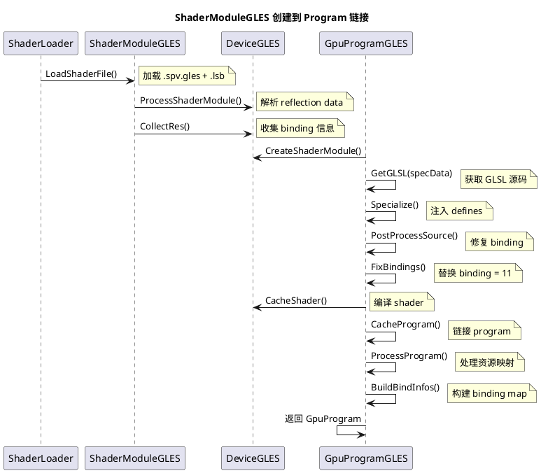

# GL后端Shader编译流程详解

## 概述

本文档详细分析LumeRender GL后端的shader编译流程，包括SPIR-V到GLSL的转换、binding修复机制、shader编译链接过程、以及shader cache机制。

---

## 一、完整编译流程架构图

### 1.1 高层流程

```
┌──────────────────────────────────────────────────────────────┐
│ Shader 编译完整流程                                           │
└──────────────────────────────────────────────────────────────┘

Shader源码 (.frag/.vert/.comp)
    │
    ├─→ [预处理] #ifdef VULKAN / #else 分支
    │
    ↓
glslangValidator 编译
    │  输入: GLSL源码（带 VULKAN 宏）
    │  输出: SPIR-V (.spv)
    │  包含: Reflection Data + Descriptor Sets + Bindings
    │
    ↓
┌───────────────────────────────────────────────┐
│ SPIR-V (.spv)                                 │
│ ├── Descriptor Set Layout                     │
│ ├── Binding 信息                              │
│ ├── Specialization Constants                  │
│ ├── Push Constants                            │
│ └── Vertex Input Attributes                  │
└───────────────────────────────────────────────┘
    │
    ├─→ [spirv-reflect] 提取 Reflection Data
    │       ↓
    │   LSB 文件生成 (.spv.lsb)
    │
    ├─→ [spirv_cross] SPIR-V 转 GLSL
    │       ↓
    │   GLSL 文件生成 (.spv.gl 或 .spv.gles)
    │   特点: binding = 11 占位符
    │
    ↓
┌───────────────────────────────────────────────┐
│ ShaderModuleGLES 加载                          │
│ (shader_module_gles.cpp)                      │
│                                               │
│ 输入:                                          │
│ ├── GLSL 源码 (.source_)                      │
│ ├── LSB Reflection Data                       │
│ └── Pipeline Layout                          │
│                                               │
│ 处理:                                          │
│ ├── ProcessShaderModule()                     │
│ ├── CollectRes() 收集 binding 信息            │
│ ├── BuildBindInfos() 构建 binding map         │
│ └── SortSets() 排序 bindings                  │
│                                               │
│ 输出:                                          │
│ ├── ShaderModulePlatformDataGLES              │
│ │   ├── sbSets (Storage Buffer bindings)      │
│ │   ├── ciSets (Storage Image bindings)       │
│ │   ├── ubSets (Uniform Buffer bindings)      │
│ │   ├── cbSets (Combined Image Sampler)       │
│ │   ├── siSets (Input Attachment)             │
│ │   └── infos (Push Constants)                │
│ └── Pipeline Layout                          │
│ └── Vertex Input Declaration                 │
│ └── Specialization Constants                 │
└───────────────────────────────────────────────┘
    │
    ↓
GetGLSL(specData) + Specialize()
    │  (spirv_cross_helpers_gles.cpp)
    │
    ├─→ 注入 SPIRV_CROSS_CONSTANT_ID_X defines
    │
    ↓
PostProcessSource() 修复 binding
    │  (gpu_program_gles.cpp:373-409)
    │
    ├─→ 查找所有 binding = 11
    ├─→ FixBindings() 替换为实际 binding 值
    │       ├── SSBO: binding = X (maxStorageBinding++)
    │       └── Storage Image: binding = Y (maxImageBinding++)
    │
    ↓
┌───────────────────────────────────────────────┐
│ CacheShader() Shader 编译                      │
│ (device_gles.cpp:1599-1640)                   │
│                                               │
│ 步骤:                                          │
│ ├── FNV1aHash() 计算 GLSL 源码 hash           │
│ ├── 查找 shader cache                         │
│ │   ├── Hit: 返回已缓存的 shader              │
│ │   └── Miss: 创建新 shader                   │
│ ├── glCreateShader(GL_VERTEX/FRAGMENT/COMPUTE)│
│ ├── glShaderSource() 设置源码                 │
│ ├── glCompileShader() 编译                    │
│ └── glGetShaderiv(GL_COMPILE_STATUS) 检查结果 │
│                                               │
│ 错误处理:                                       │
│ ├── glGetShaderInfoLog() 获取错误日志          │
│ └── PLUGIN_LOG_F("Shader compilation error")  │
└───────────────────────────────────────────────┘
    │
    ↓
┌───────────────────────────────────────────────┐
│ CacheProgram() Program 链接                   │
│ (device_gles.cpp:1642-1721)                   │
│                                               │
│ 步骤:                                          │
│ ├── 计算 vertHash + fragHash + compHash      │
│ ├── 查找 program cache                        │
│ │   ├── Hit: 返回已缓存的 program            │
│ │   └── Miss: 创建新 program                  │
│ ├── glCreateProgram()                         │
│ ├── glProgramParameteri() 设置参数            │
│ │   ├── GL_PROGRAM_BINARY_RETRIEVABLE_HINT   │
│ │   └── GL_PROGRAM_SEPARABLE (可选)           │
│ ├── glAttachShader() 附加 shaders            │
│ ├── glLinkProgram() 链接                      │
│ ├── glDetachShader() 分离 shaders            │
│ ├── glGetProgramiv(GL_LINK_STATUS) 检查结果   │
│                                               │
│ 错误处理:                                       │
│ ├── glGetProgramInfoLog() 获取错误日志        │
│ └── PLUGIN_LOG_ONCE_E("gl_shader_linking_error")│
└───────────────────────────────────────────────┘
    │
    ↓
┌───────────────────────────────────────────────┐
│ ProcessProgram() 资源映射处理                  │
│ (gpu_program_gles.cpp)                        │
│                                               │
│ 处理内容:                                       │
│ ├── ProcessPushConstants()                    │
│ │   └── glGetProgramResourceIndex(GL_UNIFORM) │
│ │   └── glGetProgramResourceiv()              │
│ │                                              │
│ ├── ProcessStorageBlocks()                    │
│ │   └── glGetProgramResourceIndex(GL_SS_BLOCK)│
│ │   └── glGetProgramResourceiv()              │
│ │                                              │
│ ├── ProcessUniformBlocks()                    │
│ │   └── glGetUniformBlockIndex()              │
│ │   └── glUniformBlockBinding()               │
│ │                                              │
│ ├── ProcessSamplers()                         │
│ │   └── glGetUniformLocation()               │
│ │   └── glUniform1i()                         │
│ │                                              │
│ ├── BuildBindInfos()                          │
│ │   └── 构建 descriptor index map            │
│ │   └── 构建 sampler/texture binding map      │
│ │                                              │
│ └── BuildReflection()                         │
│     └── 构建 shader reflection data           │
│     └── 用于 runtime binding                  │
└───────────────────────────────────────────────┘
    │
    ↓
┌───────────────────────────────────────────────┐
│ 可用的 GPU Program                             │
│                                               │
│ 资源:                                          │
│ ├── Shader Object (glShader)                  │
│ ├── Program Object (glProgram)                │
│ ├── Reflection Data                           │
│ │   ├── Push Constant Locations               │
│ │   ├── SSBO Bindings                         │
│ │   ├── Uniform Block Bindings                │
│ │   ├── Sampler/Texture Units                 │
│ │   └── Vertex Input Locations                │
│ └── Bind Maps                                 │
│     ├── set/binding → unit mapping            │
│     └── sampler/texture → combined mapping    │
└───────────────────────────────────────────────┘
```

### 1.2 详细时序图



---

## 二、ShaderModuleCreateInfo 数据结构

### 2.1 ShaderModuleCreateInfo 结构

```cpp
// shader_module.h
struct ShaderModuleCreateInfo {
    ShaderStageFlags shaderStageFlags;             // Shader 类型标志
    array_view<const uint8_t> spvData;            // SPIR-V / GLSL 数据
    ShaderReflectionData reflectionData;          // Reflection Data
};
```

### 2.2 ShaderReflectionData 来源

**ShaderReflectionData 从 LSB 文件解析：**

```cpp
// shader_loader.cpp:323-326
if (IFile::Ptr reflectionFile = fileManager_.OpenFile(shader + ".lsb"); reflectionFile) {
    info.reflectionData = ReadFile(*reflectionFile, shader + ".lsb");
}
info.info = { stageBits, info.data, ShaderReflectionData { info.reflectionData } };
```

**ShaderReflectionData 解析内容：**

```cpp
// shader_reflection_data.cpp
ShaderReflectionData::GetPipelineLayout()     // 从 LSB 解析 Pipeline Layout
ShaderReflectionData::GetInputDescriptions()  // 解析 Vertex Input Attributes
ShaderReflectionData::GetLocalSize()          // 解析 Compute Shader thread group size
ShaderReflectionData::GetPushConstants()      // 解析 Push Constants
ShaderReflectionData::GetSpecializationConstants() // 解析 Specialization Constants
```

---

## 三、关键组件详解

### 3.1 ShaderModuleGLES 创建流程

**代码位置：** `shader_module_gles.cpp:173-225`

```cpp
template<typename ShaderBase>
void ProcessShaderModule(ShaderBase& me, const ShaderModuleCreateInfo& createInfo)
{
    // 步骤1: 从 reflection data 获取 Pipeline Layout
    me.pipelineLayout_ = createInfo.reflectionData.GetPipelineLayout();
    
    // 步骤2: 处理 Vertex Shader 的 vertex input
    if (me.shaderStageFlags_ & CORE_SHADER_STAGE_VERTEX_BIT) {
        me.vertexInputAttributeDescriptions_ = createInfo.reflectionData.GetInputDescriptions();
        // 构建 vertex input binding descriptions
        for (const auto& attrib : me.vertexInputAttributeDescriptions_) {
            VertexInputDeclaration::VertexInputBindingDescription bindingDesc;
            bindingDesc.binding = attrib.binding;
            bindingDesc.stride = GpuProgramUtil::FormatByteSize(attrib.format);
            bindingDesc.vertexInputRate = VertexInputRate::CORE_VERTEX_INPUT_RATE_VERTEX;
            me.vertexInputBindingDescriptions_.push_back(bindingDesc);
        }
        me.vidv_.bindingDescriptions = { me.vertexInputBindingDescriptions_.data(), ... };
        me.vidv_.attributeDescriptions = { me.vertexInputAttributeDescriptions_.data(), ... };
    }
    
    // 步骤3: 处理 Compute Shader 的 thread group size
    if (me.shaderStageFlags_ & CORE_SHADER_STAGE_COMPUTE_BIT) {
        const Math::UVec3 tgs = createInfo.reflectionData.GetLocalSize();
        me.stg_.x = tgs.x; me.stg_.y = tgs.y; me.stg_.z = tgs.z;
    }
    
    // 步骤4: 处理 Push Constants
    if (auto* ptr = createInfo.reflectionData.GetPushConstants(); ptr) {
        Reader read { ptr };
        const auto constants = read.GetUint8();
        for (uint8_t i = 0U; i < constants; ++i) {
            Gles::PushConstantReflection refl;
            refl.type = read.GetUint32();      // 类型
            refl.offset = read.GetUint16();    // 偏移
            refl.size = read.GetUint16();      // 大小
            refl.arraySize = read.GetUint16(); // 数组大小
            refl.arrayStride = read.GetUint16(); // 数组步长
            refl.matrixStride = read.GetUint16(); // 矩阵步长
            refl.name = "CORE_PC_0";
            refl.name += read.GetStringView();  // 名称
            refl.stage = me.shaderStageFlags_;
            me.plat_.infos.push_back(move(refl));
        }
    }
    
    // 步骤5: 处理 Specialization Constants
    me.constants_ = createInfo.reflectionData.GetSpecializationConstants();
    me.sscv_.constants = { me.constants_.data(), me.constants_.size() };
    
    // 步骤6: 收集 binding 信息
    CollectRes(me.pipelineLayout_, me.plat_);
    
    // 步骤7: 创建 specialization info
    CreateSpecInfos(me.constants_, me.specInfo_);
    
    // 步骤8: 排序 bindings
    SortSets(me.pipelineLayout_);
    
    // 步骤9: 存储 GLSL 源码
    me.source_.assign(
        static_cast<const char*>(static_cast<const void*>(createInfo.spvData.data())),
        createInfo.spvData.size());
}
```

### 3.2 CollectRes 收集 Binding 信息

**代码位置：** `shader_module_gles.cpp:47-103`

```cpp
void CollectRes(const PipelineLayout& pipeline, ShaderModulePlatformDataGLES& plat_)
{
    struct Bind {
        uint8_t set;
        uint8_t bind;
    };
    vector<Bind> samplers;  // Sampler bindings
    vector<Bind> images;    // Image bindings
    
    for (const auto& set : pipeline.descriptorSetLayouts) {
        if (set.set != PipelineLayoutConstants::INVALID_INDEX) {
            for (const auto& binding : set.bindings) {
                switch (binding.descriptorType) {
                    // Sampler 类型
                    case DescriptorType::CORE_DESCRIPTOR_TYPE_SAMPLER:
                        samplers.push_back({ 
                            static_cast<uint8_t>(set.set),
                            static_cast<uint8_t>(binding.binding)
                        });
                        break;
                    
                    // Combined Image Sampler (纹理采样器)
                    case DescriptorType::CORE_DESCRIPTOR_TYPE_COMBINED_IMAGE_SAMPLER:
                        Collect(set.set, binding, plat_.cbSets);
                        break;
                    
                    // Sampled Image (采样图像)
                    case DescriptorType::CORE_DESCRIPTOR_TYPE_SAMPLED_IMAGE:
                        images.push_back({
                            static_cast<uint8_t>(set.set),
                            static_cast<uint8_t>(binding.binding)
                        });
                        break;
                    
                    // Storage Image (存储图像)
                    case DescriptorType::CORE_DESCRIPTOR_TYPE_STORAGE_IMAGE:
                        Collect(set.set, binding, plat_.ciSets);
                        break;
                    
                    // Uniform Buffer
                    case DescriptorType::CORE_DESCRIPTOR_TYPE_UNIFORM_BUFFER:
                        Collect(set.set, binding, plat_.ubSets);
                        break;
                    
                    // Storage Buffer (SSBO)
                    case DescriptorType::CORE_DESCRIPTOR_TYPE_STORAGE_BUFFER:
                        Collect(set.set, binding, plat_.sbSets);
                        break;
                    
                    // Input Attachment
                    case DescriptorType::CORE_DESCRIPTOR_TYPE_INPUT_ATTACHMENT:
                        Collect(set.set, binding, plat_.siSets);
                        break;
                    
                    default:
                        break;
                }
            }
        }
    }
    
    // 构建 combined sampler-image bindings
    // (OpenGL 需要分开的 sampler 和 texture unit)
    for (const auto& sBinding : samplers) {
        for (const auto& iBinding : images) {
            const auto name = "s" + to_string(iBinding.set) + "_b" + 
                              to_string(iBinding.bind) + "_s" +
                              to_string(sBinding.set) + "_b" + 
                              to_string(sBinding.bind);
            plat_.combSets.push_back({
                sBinding.set, sBinding.bind,
                iBinding.set, iBinding.bind,
                string { name }
            });
        }
    }
}
```

**ShaderModulePlatformDataGLES 数据结构：**

```cpp
struct ShaderModulePlatformDataGLES {
    // Storage Buffer bindings
    vector<Bind> sbSets;   // 每个 Bind: { set, binding, count, name }
    
    // Storage Image bindings
    vector<Bind> ciSets;   // 每个 Bind: { set, binding, count, name }
    
    // Uniform Buffer bindings
    vector<Bind> ubSets;   // 每个 Bind: { set, binding, count, name }
    
    // Combined Image Sampler bindings
    vector<Bind> cbSets;   // 每个 Bind: { set, binding, count, name }
    
    // Input Attachment bindings
    vector<Bind> siSets;   // 每个 Bind: { set, binding, count, name }
    
    // Combined sampler-image bindings (GL特有)
    vector<DoubleBind> combSets; // { samplerSet, samplerBind, imageSet, imageBind, name }
    
    // Push Constant reflections
    vector<PushConstantReflection> infos;
    
    // Specialization constant info
    vector<SpecConstantInfo> specInfo;
};
```

### 3.3 spirv_cross 生成 GLSL

**spirv_cross 转换特点：**

1. **Binding 占位符：** SSBO 和 Storage Image 使用 `binding = 11` 占位符
2. **命名规则：** `s{set}_b{binding}` 格式
3. **Specialization Constants：** 转换为宏定义 `SPIRV_CROSS_CONSTANT_ID_X`

**转换示例：**

```glsl
// SPIR-V 中的声明
layout(set = 3, binding = 0, std430) buffer LinkedListHeadSBO {
    uint LinkedListHead[];
};

// spirv_cross 生成的 GLSL
// (binding = 11 占位符)
layout(binding = 11, std430) buffer s3_b0 {
    uint LinkedListHead[];
} _s3_b0;
```

**Specialization Constants 转换：**

```glsl
// SPIR-V 中的声明
layout(constant_id = 4) const uint CORE_CAMERA_FLAGS = 0u;

// spirv_cross 生成的 GLSL
#ifndef SPIRV_CROSS_CONSTANT_ID_4
#define SPIRV_CROSS_CONSTANT_ID_4 0u  // 默认值
#endif
const uint CORE_CAMERA_FLAGS = SPIRV_CROSS_CONSTANT_ID_4;
```

### 3.4 PostProcessSource 修复 Binding

**代码位置：** `gpu_program_gles.cpp:373-409`

```cpp
// SSBO 和 Storage Image 的关键识别字符串
constexpr const string_view SSBO_KEYS[] = { " buffer " };
constexpr const string_view IMAGE_KEYS[] = {
    " image2D ", " iimage2D ", " uimage2D ",
    " image2DArray ", " iimage2DArray ", " uimage2DArray ",
    " image3D ", " iimage3D ", " uimage3D ",
    " imageCube ", " iimageCube ", " uimageCube ",
    " imageCubeArray ", " iimageCubeArray ", " uimageCubeArray ",
    " imageBuffer ", " iimageBuffer ", " uimageBuffer "
};

constexpr const string_view SPECIAL_BINDING = "binding = 11";

void PostProcessSource(BindMaps& map, const ShaderModulePlatformDataGLES& modPlat, string& source)
{
    // 如果没有 SSBO 或 Storage Image，无需修复
    if (modPlat.sbSets.empty() && modPlat.ciSets.empty()) {
        return;
    }
    
    // 步骤1: 查找所有 binding = 11 的位置
    vector<size_t> bindings;
    const auto view = string_view(source);
    for (auto pos = view.find(SPECIAL_BINDING); pos != string_view::npos;
         pos = view.find(SPECIAL_BINDING, pos + SPECIAL_BINDING.size())) {
        bindings.push_back(pos);
    }
    
    // 步骤2: 修复 SSBO bindings
    if (!bindings.empty()) {
        if (!modPlat.sbSets.empty()) {
            binder storageBindings { map.maxStorageBinding, map.map, bindings };
            FixBindings(SSBO_KEYS, storageBindings, modPlat.sbSets, source);
            // 每个 SSBO: binding = 11 → binding = X
            // X = maxStorageBinding++ (递增分配)
        }
        
        // 步骤3: 修复 Storage Image bindings
        if (!modPlat.ciSets.empty()) {
            binder imageBindings { map.maxImageBinding, map.map, bindings };
            FixBindings(IMAGE_KEYS, imageBindings, modPlat.ciSets, source);
            // 每个 Storage Image: binding = 11 → binding = Y
            // Y = maxImageBinding++ (递增分配)
        }
        
        // 步骤4: 验证所有 binding = 11 已被修复
#if (RENDER_VALIDATION_ENABLED == 1)
        if (!bindings.empty()) {
            PLUGIN_LOG_E("RENDER_VALIDATION: GL(ES) program bindings not empty.");
        }
#endif
    }
}
```

**FixBindings 实现细节：**

```cpp
void FixBindings(
    const string_view* keys, size_t keyCount,
    binder& bindings,
    const vector<ShaderModulePlatformDataGLES::Bind>& sets,
    string& source)
{
    // 对于每个 set/binding 组合
    for (const auto& t : sets) {
        // 构建查找字符串: "s3_b0" 等
        const auto name = "s" + to_string(t.iSet) + "_b" + to_string(t.iBind);
        
        // 在 source 中查找该名称的位置
        for (const auto& key : keys) {
            // 查找 " buffer s3_b0" 或 " image2D s3_b0"
            const auto searchName = string(key) + string(name);
            auto pos = source.find(searchName);
            if (pos != string::npos) {
                // 找到该 SSBO/Image 的位置
                // 向前查找 "binding = 11"
                pos = source.rfind(SPECIAL_BINDING, pos);
                if (pos != string::npos && bindings.bindings.Contains(pos)) {
                    // 替换 binding 值
                    SetValue(&source[pos], bindings.nextBinding);
                    bindings.map[BIND_MAP_4_4(t.iSet, t.iBind)] = bindings.nextBinding + 1;
                    bindings.nextBinding++;
                    bindings.bindings.Remove(pos);  // 标记为已处理
                }
            }
        }
    }
}

// SetValue: 替换 binding 数字
void SetValue(char* source, uint32_t final)
{
    // binding = 11 → binding = X
    // source 指向 "binding = 11" 的位置
    const uint32_t tmp = final;
    const uint32_t div = tmp / 10u;
    const uint32_t mod = tmp % 10u;
    
    // 替换数字位
    source[10u] = (tmp > 10u) ? ('0' + div) : ' ';
    source[11u] = '0' + mod;
}
```

### 3.5 Shader Cache 机制

**代码位置：** `device_gles.cpp:1599-1640`

```cpp
const DeviceGLES::ShaderCache::Entry& DeviceGLES::CacheShader(int type, const string_view source)
{
    PLUGIN_ASSERT(type < MAX_CACHES);  // VERTEX_CACHE, FRAGMENT_CACHE, COMPUTE_CACHE
    
    if (source.empty()) {
        static constexpr DeviceGLES::ShaderCache::Entry invalid {};
        return invalid;
    }
    
    // Shader 类型映射
    static constexpr GLenum types[] = { 
        GL_VERTEX_SHADER, 
        GL_FRAGMENT_SHADER, 
        GL_COMPUTE_SHADER 
    };
    
    // 步骤1: 计算 GLSL 源码的 hash
    const uint64_t hash = FNV1aHash(source.data(), source.size());
    PLUGIN_ASSERT(hash != 0);
    
    // 步骤2: 查找 shader cache
    for (auto& t : shaders_[type].cache) {
        if (t.hash == hash) {
            shaders_[type].hit++;     // cache hit 统计
            t.refCount++;             // 引用计数增加
            return t;                 // 返回已缓存的 shader
        }
    }
    
    // 步骤3: Cache miss，创建新 shader
    shaders_[type].miss++;  // cache miss 统计
    
    DeviceGLES::ShaderCache::Entry entry;
    entry.hash = hash;
    entry.shader = glCreateShader(types[type]);  // 创建 shader object
    entry.refCount = 1;
    
    // 步骤4: 设置 shader 源码
    const GLint len = static_cast<GLint>(source.length());
    const auto data = source.data();
    glShaderSource(entry.shader, 1, &data, &len);
    
    // 步骤5: 编译 shader
    glCompileShader(entry.shader);
    
    // 步骤6: 检查编译结果
    GLint result = GL_FALSE;
    glGetShaderiv(entry.shader, GL_COMPILE_STATUS, &result);
    
    if (result == GL_FALSE) {
        // 编译失败，获取错误日志
        GLint logLength = 0;
        glGetShaderiv(entry.shader, GL_INFO_LOG_LENGTH, &logLength);
        string messages;
        messages.resize(static_cast<size_t>(logLength));
        glGetShaderInfoLog(entry.shader, logLength, 0, messages.data());
        
        // 输出错误日志
        PLUGIN_LOG_F("Shader compilation error: %s", messages.c_str());
        
        // 删除失败的 shader
        glDeleteShader(entry.shader);
        entry.shader = 0U;
    }
    
    // 步骤7: 添加到 cache
    shaders_[type].cache.push_back(entry);
    return shaders_[type].cache.back();
}
```

**Shader Cache 数据结构：**

```cpp
struct ShaderCache {
    struct Entry {
        uint64_t hash;       // GLSL 源码 hash
        uint32_t shader;     // glShader object
        uint32_t refCount;   // 引用计数
    };
    
    vector<Entry> cache;  // Shader cache entries
    uint32_t hit;         // Cache hit 统计
    uint32_t miss;        // Cache miss 统计
};

// 三个 shader cache
ShaderCache shaders_[MAX_CACHES];  // [VERTEX_CACHE, FRAGMENT_CACHE, COMPUTE_CACHE]
```

### 3.6 Program Cache 机制

**代码位置：** `device_gles.cpp:1642-1721`

```cpp
uint32_t DeviceGLES::CacheProgram(
    const string_view vertSource,
    const string_view fragSource,
    const string_view compSource)
{
    PLUGIN_ASSERT_MSG(isActive_, "Device not active when building shaders");
    
    // 步骤1: 计算各 shader 源码的 hash
    const uint64_t vertHash = vertSource.empty() ? 0U : FNV1aHash(vertSource.data(), vertSource.size());
    const uint64_t fragHash = fragSource.empty() ? 0U : FNV1aHash(fragSource.data(), fragSource.size());
    const uint64_t compHash = compSource.empty() ? 0U : FNV1aHash(compSource.data(), compSource.size());
    
    // 步骤2: 查找 program cache
    for (ProgramCache& t : programs_) {
        if ((t.hashVert != vertHash) || 
            (t.hashFrag != fragHash) || 
            (t.hashComp != compHash)) {
            continue;
        }
        pCacheHit_++;
        t.refCount++;
        return t.program;  // 返回已缓存的 program
    }
    
    // 步骤3: Hash 并 cache shader sources
    const auto& vEntry = CacheShader(DeviceGLES::VERTEX_CACHE, vertSource);
    const auto& fEntry = CacheShader(DeviceGLES::FRAGMENT_CACHE, fragSource);
    const auto& cEntry = CacheShader(DeviceGLES::COMPUTE_CACHE, compSource);
    
    // 步骤4: 再次查找 program cache (基于 shader entry hash)
    for (ProgramCache& t : programs_) {
        if ((t.hashVert != vEntry.hash) || 
            (t.hashFrag != fEntry.hash) || 
            (t.hashComp != cEntry.hash)) {
            continue;
        }
        pCacheHit_++;
        t.refCount++;
        return t.program;
    }
    
    // 步骤5: Cache miss，创建新 program
    pCacheMiss_++;
    const GLuint program = glCreateProgram();
    
    // 步骤6: 设置 program 参数
    if (supportsBinaryPrograms_) {
        // 允许获取 program binary (用于 cache)
        glProgramParameteri(program, GL_PROGRAM_BINARY_RETRIEVABLE_HINT, GL_TRUE);
    }
    
#if defined(CORE_USE_SEPARATE_SHADER_OBJECTS) && (CORE_USE_SEPARATE_SHADER_OBJECTS == 1)
    // 启用 separable programs (可选)
    glProgramParameteri(program, GL_PROGRAM_SEPARABLE, GL_TRUE);
#endif
    
    // 步骤7: Attach shaders
    if (vEntry.shader) {
        glAttachShader(program, vEntry.shader);
    }
    if (fEntry.shader) {
        glAttachShader(program, fEntry.shader);
    }
    if (cEntry.shader) {
        glAttachShader(program, cEntry.shader);
    }
    
    // 步骤8: Link program
    glLinkProgram(program);
    
    // 步骤9: Detach shaders (链接后可以分离)
    if (vEntry.shader) {
        glDetachShader(program, vEntry.shader);
    }
    if (fEntry.shader) {
        glDetachShader(program, fEntry.shader);
    }
    if (cEntry.shader) {
        glDetachShader(program, cEntry.shader);
    }
    
    // 步骤10: 检查链接结果
    GLint result = GL_FALSE;
    glGetProgramiv(program, GL_LINK_STATUS, &result);
    
    if (result == GL_FALSE) {
#if (RENDER_VALIDATION_ENABLED == 1)
        // 链接失败，获取错误日志
        GLint logLength = 0;
        glGetProgramiv(program, GL_INFO_LOG_LENGTH, &logLength);
        string messages;
        messages.resize(static_cast<size_t>(logLength));
        glGetProgramInfoLog(program, logLength, 0, messages.data());
        
        PLUGIN_LOG_ONCE_E("gl_shader_linking_error_" + to_string(program),
            "RENDER_VALIDATION: Shader linking error: %s", messages.c_str());
#endif
        glDeleteProgram(program);
        return 0U;
    }
    
    // 步骤11: 添加到 program cache
    programs_.push_back({
        program,
        vEntry.shader, fEntry.shader, cEntry.shader,
        vEntry.hash, fEntry.hash, cEntry.hash,
        1  // refCount
    });
    
    return program;
}
```

**Program Cache 数据结构：**

```cpp
struct ProgramCache {
    uint32_t program;      // glProgram object
    uint32_t shaderVert;   // Vertex shader object
    uint32_t shaderFrag;   // Fragment shader object
    uint32_t shaderComp;   // Compute shader object
    uint64_t hashVert;     // Vertex shader hash
    uint64_t hashFrag;     // Fragment shader hash
    uint64_t hashComp;     // Compute shader hash
    uint32_t refCount;     // 引用计数
};

vector<ProgramCache> programs_;  // Program cache entries
uint32_t pCacheHit_;             // Program cache hit 统计
uint32_t pCacheMiss_;            // Program cache miss 统计
```

---

## 四、ProcessProgram 资源映射处理

### 4.1 ProcessPushConstants

```cpp
void ProcessPushConstants(GLuint program, const ShaderModulePlatformDataGLES& plat, GLenum flag, BindMaps& map)
{
    GLsizei len;
    const GLenum uniformProperties[] = { flag, GL_LOCATION };
    constexpr auto propertyCount = static_cast<GLsizei>(countof(uniformProperties));
    GLint inUse[propertyCount] { 0 };
    
    for (auto& info : plat.infos) {
        // 检查重复（vertex 和 fragment 可能都使用同一个 push constant）
        if (auto pos = std::find_if(map.pushConstants.begin(), map.pushConstants.end(),
                [&name = info.name](auto& info2) { return info2.name == name; });
            pos != map.pushConstants.end()) {
            pos->stage |= info.stage;  // 合并 stage flags
        } else {
            // 查询 uniform 资源
            const GLuint index = glGetProgramResourceIndex(program, GL_UNIFORM, info.name.c_str());
            if (index != GL_INVALID_INDEX) {
                glGetProgramResourceiv(
                    program, GL_UNIFORM, index, propertyCount, uniformProperties, propertyCount, &len, inUse);
                if (inUse[0]) {  // 是否在用
                    map.pushConstants.push_back(info);
                    map.pushConstants.back().location = inUse[1];  // 获取 location
                }
            }
        }
    }
}
```

### 4.2 ProcessStorageBlocks (SSBO)

```cpp
void ProcessStorageBlocks(GLuint program, const ShaderModulePlatformDataGLES& plat, GLenum flag, const BindMaps& map)
{
#if defined(RENDER_VALIDATION_ENABLED) && (RENDER_VALIDATION_ENABLED)
    GLsizei len;
    const GLenum blockProperties[] = { flag, GL_BUFFER_BINDING };
    constexpr auto propertyCount = static_cast<GLsizei>(countof(blockProperties));
    GLint inUse[propertyCount] { 0 };
    
    for (const auto& t : plat.sbSets) {
        PLUGIN_ASSERT(t.iSet < Gles::ResourceLimits::MAX_SETS);
        PLUGIN_ASSERT(t.iBind < Gles::ResourceLimits::MAX_BIND_IN_SET);
        
        // 查询 SSBO block index
        const GLuint index = glGetProgramResourceIndex(program, GL_SHADER_STORAGE_BLOCK, t.name.c_str());
        if (index != GL_INVALID_INDEX) {
            glGetProgramResourceiv(
                program, GL_SHADER_STORAGE_BLOCK, index, propertyCount, blockProperties, propertyCount, &len, inUse);
            
            if (inUse[0]) {  // 是否在用
                // 验证 binding 值
                const uint8_t id = map.map[BIND_MAP_4_4(t.iSet, t.iBind)];
                PLUGIN_ASSERT(id > 0);
                PLUGIN_ASSERT(inUse[1] == (id - 1));
            }
        }
    }
#endif
}
```

### 4.3 ProcessUniformBlocks

```cpp
void ProcessUniformBlocks(GLuint program, const ShaderModulePlatformDataGLES& plat, GLenum flag, BindMaps& map)
{
    GLsizei len;
    const GLenum blockProperties[] = { flag, GL_BUFFER_BINDING };
    constexpr auto propertyCount = static_cast<GLsizei>(countof(blockProperties));
    GLint inUse[propertyCount] { 0 };
    
    for (const auto& t : plat.ubSets) {
        // 查询 uniform block index
        const GLuint index = glGetUniformBlockIndex(program, t.name.c_str());
        if (index != GL_INVALID_INDEX) {
            glGetProgramResourceiv(
                program, GL_UNIFORM_BLOCK, index, propertyCount, blockProperties, propertyCount, &len, inUse);
            
            if (inUse[0]) {  // 是否在用
                // 设置 uniform block binding
                const uint8_t id = map.map[BIND_MAP_4_4(t.iSet, t.iBind)];
                PLUGIN_ASSERT(id > 0);
                glUniformBlockBinding(program, index, id - 1);
            }
        }
    }
    
    map.maxUniformBinding = static_cast<uint8_t>(inUse[1] + 1);
}
```

### 4.4 ProcessSamplers

```cpp
void ProcessSamplers(GLuint program, const ShaderModulePlatformDataGLES& plat, GLenum flag, BindMaps& map)
{
    for (const auto& t : plat.cbSets) {
        // 查询 sampler uniform location
        const GLint location = glGetUniformLocation(program, t.name.c_str());
        if (location >= 0) {
            // 设置 sampler texture unit
            const uint8_t id = map.map[BIND_MAP_4_4(t.iSet, t.iBind)];
            PLUGIN_ASSERT(id > 0);
            glUniform1i(location, id - 1);
        }
    }
    
    // 处理 combined sampler-image bindings
    for (const auto& t : plat.combSets) {
        // ... 处理分离的 sampler 和 texture units
    }
}
```

### 4.5 BuildBindInfos

```cpp
void BuildBindInfos(Resources& resources, const PipelineLayout& pipelineLayout, BindMaps& map,
    const vector<ShaderModulePlatformDataGLES::DoubleBind>& combSets)
{
    vector<Binder> samplers;
    vector<Binder> others;
    
    for (uint32_t set = 0; set < PipelineLayoutConstants::MAX_DESCRIPTOR_SET_COUNT; set++) {
        const auto& s = pipelineLayout.descriptorSetLayouts[set];
        if (s.set == PipelineLayoutConstants::INVALID_INDEX) {
            continue;
        }
        PLUGIN_ASSERT(set == s.set);
        
        for (const auto& b : s.bindings) {
            const uint8_t id = map.map[BIND_MAP_4_4(s.set, b.binding)];
            if (!id) {
                continue;
            }
            
            Binder tmp;
            tmp.set = uint16_t(s.set);
            tmp.bind = uint16_t(b.binding);
            tmp.type = b.descriptorType;
            tmp.descriptors.index = uint16_t(resources.descriptorIndexIds.size());
            tmp.descriptors.count = uint16_t(b.descriptorCount);
            
            // 根据类型分发处理
            switch (b.descriptorType) {
                case CORE_DESCRIPTOR_TYPE_SAMPLER:
                    // 处理 combined sampler-image
                    for (const auto& cs : combSets) {
                        if ((cs.sSet != s.set) || (cs.sBind != b.binding)) {
                            continue;
                        }
                        // 构建 sampler-image 组合 binding
                        const uint32_t iid = map.map[BIND_MAP_4_4(cs.iSet, cs.iBind)];
                        if (!iid) {
                            continue;
                        }
                        const uint8_t final = map.finalMap[BIND_MAP_4_4(id, iid)];
                        if (final) {
                            // 添加到 resources.ids
                            for (auto& ids : descriptorIndex) {
                                if (!ids.count) {
                                    ids.index = uint16_t(resources.ids.size());
                                }
                                ++ids.count;
                                resources.ids.push_back(final - 1U);
                            }
                            add = true;
                        }
                    }
                    break;
                
                case CORE_DESCRIPTOR_TYPE_COMBINED_IMAGE_SAMPLER:
                    // 已经在 ProcessSamplers 中处理
                    break;
                
                case CORE_DESCRIPTOR_TYPE_UNIFORM_BUFFER:
                case CORE_DESCRIPTOR_TYPE_STORAGE_BUFFER:
                case CORE_DESCRIPTOR_TYPE_STORAGE_IMAGE:
                    // 添加到 others
                    others.push_back(tmp);
                    add = true;
                    break;
                
                default:
                    break;
            }
            
            if (add) {
                resources.bindInfos.push_back(tmp);
            }
        }
    }
    
    // 合并 samplers 和 others
    resources.bindInfos.insert(resources.bindInfos.end(), samplers.begin(), samplers.end());
    resources.bindInfos.insert(resources.bindInfos.end(), others.begin(), others.end());
}
```

---

## 五、Specialization Constant 处理详解

### 5.1 Specialize 函数

**代码位置：** `spirv_cross_helpers_gles.cpp:127-163`

```cpp
string Specialize(ShaderStageFlags mask, const string_view shaderTemplate,
    const array_view<const ShaderSpecialization::Constant> info, 
    const ShaderSpecializationConstantDataView& data)
{
    if (shaderTemplate.empty()) {
        return {};
    }
    
    // 检查是否有 specialization data
    if (data.data.empty()) {
        // 没有 specialization constant values
        return string(shaderTemplate);  // 返回未 specialized 的 shader
    }
    
    // 检查是否有当前 stage 的 specialization constants
    bool ok = false;
    for (const auto& spc : data.constants) {
        if (spc.shaderStage & mask) {
            ok = true;
            break;
        }
    }
    if (!ok) {
        // 当前 stage 没有 specialization constants
        return string(shaderTemplate);
    }
    
    // 创建 defines
    const auto base = (uintptr_t)data.data.data();
    string defines;
    defines.reserve(256);
    
    for (const auto& spc : data.constants) {
        if (spc.shaderStage & mask) {
            // bounds check
            if ((spc.offset + sizeof(uint32_t)) > data.data.size_bytes()) {
                continue;
            }
            
            const uintptr_t offset = base + spc.offset;
            DefineForSpec(info, spc.id, offset, defines);
        }
    }
    
    // 插入 defines 到 shader 源码
    return InsertDefines(shaderTemplate, defines);
}
```

### 5.2 DefineForSpec 函数

```cpp
bool DefineForSpec(
    array_view<const ShaderSpecialization::Constant> reflectionInfo,
    uint32_t spcid,       // Specialization constant ID
    uintptr_t offset,     // 数据偏移
    string& result)       // 输出的 #define
{
    // The constant_id can only be applied to a scalar int, float, or bool.
    // https://www.khronos.org/registry/OpenGL/extensions/ARB/ARB_gl_spirv.txt
    
    char buf[1024];
    bool ok = false;
    
    for (const auto& c : reflectionInfo) {
        if (c.id == spcid) {
            switch (c.type) {
                case ShaderSpecialization::Constant::Type::BOOL:
                    [[fallthrough]];
                    
                case ShaderSpecialization::Constant::Type::UINT32: {
                    const uint32_t value = *reinterpret_cast<uint32_t*>(offset);
                    const int len = sprintf_s(buf, sizeof(buf), "%u %uu\n", c.id, value);
                    ok = len > 0;
                    break;
                }
                
                case ShaderSpecialization::Constant::Type::INT32: {
                    const int32_t value = *reinterpret_cast<int32_t*>(offset);
                    const int len = sprintf_s(buf, sizeof(buf), "%u %d\n", c.id, value);
                    ok = len > 0;
                    break;
                }
                
                case ShaderSpecialization::Constant::Type::FLOAT: {
                    const float value = *reinterpret_cast<float_t*>(offset);
                    // NOTE: resulting constant might not be the same
                    // due to float -> string -> float conversions
                    const int len = sprintf_s(buf, sizeof(buf), "%u %f\n", c.id, value);
                    ok = len > 0;
                    break;
                }
                
                default:
                    PLUGIN_ASSERT_MSG(false, "Unhandled specialization constant type");
                    break;
            }
            
            if (ok) {
                result.append("#define SPIRV_CROSS_CONSTANT_ID_");
                result.append(buf);
            }
            break;
        }
    }
    
    return ok;
}
```

### 5.3 InsertDefines 函数

```cpp
string InsertDefines(const string_view shaderIn, const string_view Defines)
{
    string shaderOut;
    
    if (!shaderIn.empty()) {
        // 找到第一个换行符（通常是 #version 行之后）
        const size_t voff = shaderIn.find_first_of('\n');
        
        shaderOut.reserve(shaderIn.length() + Defines.length());
        
        // 插入顺序:
        // 1. #version 行
        // 2. #define SPIRV_CROSS_CONSTANT_ID_X
        // 3. 其他 shader 源码
        shaderOut.append(shaderIn.substr(0, voff + 1));
        shaderOut.append(Defines);
        shaderOut.append(shaderIn.substr(voff + 1));
    } else {
        shaderOut = Defines;
    }
    
    return shaderOut;
}
```

**示例输出：**

```glsl
// 原始 shader template (spirv_cross 输出)
#version 450
#ifndef SPIRV_CROSS_CONSTANT_ID_4
#define SPIRV_CROSS_CONSTANT_ID_4 0u
#endif
const uint CORE_CAMERA_FLAGS = SPIRV_CROSS_CONSTANT_ID_4;

// Specialize 后 (注入 defines)
#version 450
#define SPIRV_CROSS_CONSTANT_ID_4 1u  // 实际值
#ifndef SPIRV_CROSS_CONSTANT_ID_4
#define SPIRV_CROSS_CONSTANT_ID_4 0u
#endif
const uint CORE_CAMERA_FLAGS = SPIRV_CROSS_CONSTANT_ID_4;  // = 1u
```

---

## 六、常见问题排查

### 6.1 Binding 修复失败

**症状：**
```
PLUGIN_LOG_E("RENDER_VALIDATION: GL(ES) program bindings not empty.")
```

**原因分析：**
- `ShaderModulePlatformDataGLES::sbSets` 为空
- `ShaderModulePlatformDataGLES::ciSets` 为空
- Reflection data 未正确收集 binding 信息
- LSB 文件中 descriptor type 错误

**排查步骤：**

```cpp
// 1. 检查 reflection data 是否正确收集
PLUGIN_LOG_D("sbSets count: %zu", modPlat.sbSets.size());
PLUGIN_LOG_D("ciSets count: %zu", modPlat.ciSets.size());
PLUGIN_LOG_D("ubSets count: %zu", modPlat.ubSets.size());

// 2. 检查 binding map
for (uint32_t set = 0; set < 4; set++) {
    for (uint32_t bind = 0; bind < 16; bind++) {
        const uint8_t id = map.map[BIND_MAP_4_4(set, bind)];
        if (id > 0) {
            PLUGIN_LOG_D("Set %u Binding %u -> unit %u", set, bind, id - 1);
        }
    }
}

// 3. 检查 GLSL 源码中的 binding 值
PLUGIN_LOG_D("GLSL source (first 1000 chars): %s", source.substr(0, 1000).c_str());

// 4. 使用 lsb_parser.py 检查 LSB 文件
// python lsb_parser.py shader.spv.lsb --json
```

### 6.2 Shader 编译失败

**症状：**
```
PLUGIN_LOG_F("Shader compilation error: %s", messages.c_str())
```

**常见原因：**
- GLSL 语法错误
- 不支持的 GLSL 特性（GLES 限制）
- Extension 未启用
- Uniform/Buffer 未正确声明

**排查步骤：**

```cpp
// 1. 获取完整编译日志
GLint logLength = 0;
glGetShaderiv(entry.shader, GL_INFO_LOG_LENGTH, &logLength);
string messages;
messages.resize(static_cast<size_t>(logLength));
glGetShaderInfoLog(entry.shader, logLength, 0, messages.data());

// 2. 检查 GLSL 版本
// 确保使用正确的 #version 指令
// GLES 3.1: #version 310 es
// GL 4.5: #version 450

// 3. 检查 extension 是否启用
// 需要的 extension:
// GL_EXT_texture_cube_map_array
// GL_OES_texture_buffer
// GL_EXT_shader_io_blocks
// 等

// 4. 检查 binding 限制
GLint maxTextureUnits;
glGetIntegerv(GL_MAX_TEXTURE_IMAGE_UNITS, &maxTextureUnits);
// 确保分配的 binding 不超过限制

// 5. 输出处理后的 GLSL 源码进行调试
PLUGIN_LOG_D("Processed GLSL:\n%s", source.c_str());
```

### 6.3 Program 链接失败

**症状：**
```
PLUGIN_LOG_ONCE_E("gl_shader_linking_error_%u", "RENDER_VALIDATION: Shader linking error: %s", messages.c_str())
```

**常见原因：**
- Vertex 和 Fragment shader 的 varying 不匹配
- Uniform block 在不同 shader 中声明不一致
- 缺少 main 函数
- GLSL 版本不兼容

**排查步骤：**

```cpp
// 1. 获取完整链接日志
GLint logLength = 0;
glGetProgramiv(program, GL_INFO_LOG_LENGTH, &logLength);
string messages;
messages.resize(static_cast<size_t>(logLength));
glGetProgramInfoLog(program, logLength, 0, messages.data());

// 2. 检查 vertex 和 fragment shader 的 varying
// Vertex shader 输出:
// out vec4 vColor;
// out vec2 vTexCoord;
//
// Fragment shader 输入:
// in vec4 vColor;
// in vec2 vTexCoord;

// 3. 检查 uniform block 一致性
// 确保在所有 shader stage 中声明相同的 layout:
// layout(std140, set = 0, binding = 0) uniform UBO {
//     mat4 model;
//     mat4 view;
//     mat4 projection;
// };

// 4. 验证 shader 是否已编译成功
GLint vertStatus, fragStatus;
glGetShaderiv(vertShader, GL_COMPILE_STATUS, &vertStatus);
glGetShaderiv(fragShader, GL_COMPILE_STATUS, &fragStatus);
if (vertStatus == GL_FALSE || fragStatus == GL_FALSE) {
    // 先修复编译错误
}
```

### 6.4 Uniform Location 未找到

**症状：**
```
glGetUniformLocation() 返回 -1
```

**原因分析：**
- Uniform 被 OpenGL 优化掉（未使用）
- Uniform 名称拼写错误
- Uniform block 中的成员需要通过不同方式访问

**排查步骤：**

```cpp
// 1. 检查 uniform 是否被优化掉
// 如果 uniform 在 shader 中声明但未使用，编译器会优化掉
// 解决方法：确保 uniform 被使用，或使用 glUseProgram 后立即设置

// 2. 检查 uniform 名称
// spirv_cross 生成的名称格式: s{set}_b{binding}_{originalName}
// 例如: s0_b0_myTexture
const char* uniformName = "s0_b0_myTexture";
GLint location = glGetUniformLocation(program, uniformName);
if (location == -1) {
    PLUGIN_LOG_W("Uniform '%s' not found or optimized out", uniformName);
}

// 3. 使用 glGetUniformLocation 批量查询
GLint locations[10];
const char* names[10] = { "s0_b0_matrix", "s0_b1_material", ... };
for (int i = 0; i < 10; i++) {
    locations[i] = glGetUniformLocation(program, names[i]);
}

// 4. 检查 uniform block 成员
// Uniform block 成员需要通过 uniform block index + offset 访问
GLuint blockIndex = glGetUniformBlockIndex(program, "MyUBO");
GLint blockSize;
glGetActiveUniformBlockiv(program, blockIndex, GL_UNIFORM_BLOCK_DATA_SIZE, &blockSize);

// 5. 使用 glGetProgramResource 查询所有 uniforms
GLint numUniforms;
glGetProgramiv(program, GL_ACTIVE_UNIFORMS, &numUniforms);
for (GLint i = 0; i < numUniforms; i++) {
    char name[256];
    GLsizei length;
    GLint size;
    GLenum type;
    glGetActiveUniform(program, i, sizeof(name), &length, &size, &type, name);
    PLUGIN_LOG_D("Uniform %d: %s (size=%d, type=0x%x)", i, name, size, type);
}
```

### 6.5 SSBO 绑定问题

**症状：**
```
glBindBufferBase(GL_SHADER_STORAGE_BUFFER, binding, buffer) 无效
或读取 SSBO 数据不正确
```

**原因分析：**
- SSBO binding 点未正确分配
- SSBO 未在 shader 中正确声明
- SSBO 绑定点冲突

**排查步骤：**

```cpp
// 1. 检查 SSBO 是否正确声明
// GLSL 中:
layout(binding = X, std430) buffer MySSBO {
    vec4 data[];
} mySSBO;

// 2. 检查 binding 点分配
// spirv_cross 使用 binding = 11 占位符
// PostProcessSource 会将其替换为实际 binding
// 检查替换后的值:
GLint maxSSBOBindings;
glGetIntegerv(GL_MAX_SHADER_STORAGE_BLOCK_BINDINGS, &maxSSBOBindings);

// 3. 验证 SSBO binding
GLuint blockIndex = glGetProgramResourceIndex(program, GL_SHADER_STORAGE_BLOCK, "s3_b0");
GLint binding;
glGetIntegeri_v(GL_SHADER_STORAGE_BUFFER_BINDING, binding, &binding);
PLUGIN_LOG_D("SSBO 's3_b0' binding: %d", binding);

// 4. 使用 glGetProgramResourceiv 查询所有 SSBOs
GLint numSSBOs;
glGetProgramInterfaceiv(program, GL_SHADER_STORAGE_BLOCK, GL_ACTIVE_RESOURCES, &numSSBOs);
for (GLint i = 0; i < numSSBOs; i++) {
    char name[256];
    GLsizei length;
    glGetProgramResourceName(program, GL_SHADER_STORAGE_BLOCK, i, sizeof(name), &length, name);
    
    GLenum props[] = { GL_BUFFER_BINDING, GL_NUM_ACTIVE_VARIABLES };
    GLint values[2];
    glGetProgramResourceiv(program, GL_SHADER_STORAGE_BLOCK, i, 2, props, 2, nullptr, values);
    PLUGIN_LOG_D("SSBO %d: %s (binding=%d, numVars=%d)", i, name, values[0], values[1]);
}

// 5. 检查 SSBO 是否在正确的 shader stage 中声明
// SSBO 需要在使用它的 shader stage 中声明
```

### 6.6 Texture Binding 问题

**症状：**
```
纹理采样返回黑色或错误数据
```

**原因分析：**
- Texture unit 未正确绑定
- Sampler uniform 未正确设置
- Texture 格式不支持

**排查步骤：**

```cpp
// 1. 检查 texture unit 分配
// Combined sampler: glGetUniformLocation + glUniform1i
GLint location = glGetUniformLocation(program, "s0_b0_myTexture");
glUniform1i(location, 0);  // 使用 texture unit 0

// 2. 验证 texture 已绑定
glActiveTexture(GL_TEXTURE0);
GLint boundTexture;
glGetIntegerv(GL_TEXTURE_BINDING_2D, &boundTexture);
PLUGIN_LOG_D("Texture unit 0 bound to: %u", boundTexture);

// 3. 检查 sampler state
glBindSampler(0, sampler);
GLint boundSampler;
glGetIntegerv(GL_SAMPLER_BINDING, &boundSampler);
PLUGIN_LOG_D("Sampler unit 0 bound to: %u", boundSampler);

// 4. 使用 glGetProgramResourceiv 查询所有 samplers
GLint numUniforms;
glGetProgramiv(program, GL_ACTIVE_UNIFORMS, &numUniforms);
for (GLint i = 0; i < numUniforms; i++) {
    char name[256];
    GLsizei length;
    GLint size;
    GLenum type;
    glGetActiveUniform(program, i, sizeof(name), &length, &size, &type, name);
    
    if (type == GL_SAMPLER_2D || type == GL_SAMPLER_CUBE || type == GL_SAMPLER_3D) {
        GLint location = glGetUniformLocation(program, name);
        GLint value;
        glGetUniformiv(program, location, &value);
        PLUGIN_LOG_D("Sampler '%s' bound to texture unit %d", name, value);
    }
}

// 5. 检查 texture format 支持
// 确保纹理格式在当前 GL 版本中支持
// GLES 3.1: 不支持 depth texture sampling
// 确保使用正确的 internal format
```

---

## 七、版本历史

| 版本 | 日期 | 描述 |
|------|------|------|
| 1.0 | 2025-01-XX | 初始版本 |
| 1.1 | 2025-05-19 | 添加完整流程架构图、时序图、代码位置引用、常见问题排查 |

---

## 八、参考资料

### 8.1 代码文件

| 文件 | 描述 |
|------|------|
| `shader_module_gles.cpp` | ShaderModuleGLES 实现，包含 ProcessShaderModule(), CollectRes() |
| `gpu_program_gles.cpp` | GpuProgramGLES 实现，包含 PostProcessSource(), FixBindings(), ProcessProgram() |
| `device_gles.cpp` | DeviceGLES 实现，包含 CacheShader(), CacheProgram() |
| `spirv_cross_helpers_gles.cpp` | spirv_cross 辅助函数，包含 Specialize(), DefineForSpec() |
| `shader_loader.cpp` | Shader 加载，包含 LSB 文件加载 |
| `shader_reflection_data.cpp` | LSB 解析实现 |

### 8.2 相关文档

- [Shader Reflection Data生成与错误分析.md](Shader%20Reflection%20Data生成与错误分析.md)
- [Vulkan与GL Shader对比.md](Vulkan与GL%20Shader对比.md)

### 8.3 外部链接

- [OpenGL ES 3.1 Specification](https://www.khronos.org/registry/OpenGL/specs/es/3.1/es_spec_3.1.pdf)
- [SPIR-V Specification](https://www.khronos.org/registry/spir-v/specs/unified1/SPIRV.html)
- [spirv_cross Documentation](https://github.com/KhronosGroup/SPIRV-Cross)
- [ARB_gl_spirv Extension](https://www.khronos.org/registry/OpenGL/extensions/ARB/ARB_gl_spirv.txt)