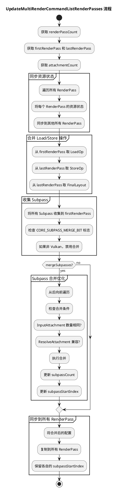

# MultiRenderPass合并优化详解

## 背景与问题引入

### RenderPass与Subpass

**RenderPass（渲染通道）** 定义一次完整渲染操作，包含 Attachments（渲染目标）、Subpasses（渲染阶段）、Load/Store Operations（生命周期管理）。

**Subpass（子通道）** 是 RenderPass 内的渲染阶段，Subpass 切换比 RenderPass 切换更高效：

| 操作 | API调用 | GPU开销 |
|------|--------|--------|
| RenderPass切换 | `vkCmdBeginRenderPass` + `vkCmdEndRenderPass` | 较高（重建状态） |
| Subpass切换 | `vkCmdNextSubpass` | 较低（状态延续） |

Subpass 的核心优势：
- 同一 RenderPass 内共享 Attachments
- 通过 Input Attachment 传递数据，无需显式拷贝
- Tile-Based GPU 可保持数据在片上内存

### 多RenderPass的性能问题与合并优化

多个独立 RenderPass 切换时产生重复 API 调用和内存带宽开销。**MultiRenderPass合并优化** 将多个独立 RenderPass 合并为单个 RenderPass 的多个 Subpass：

| | 传统流程（多RenderPass） | 优化流程（合并） |
|---|---|---|
| 几何渲染 | RenderPass 0: begin→end | Subpass 0 |
| 光照计算 | RenderPass 1: begin→end | Subpass 1 |
| 后处理 | RenderPass 2: begin→end | Subpass 2 |
| API调用 | `vkCmdBeginRenderPass` × 3 | `vkCmdBeginRenderPass` × 1 |
| 数据传递 | Attachment 间显式拷贝 | Input Attachment，无额外带宽 |

### 本文档解决的问题

本文档详细分析 `UpdateMultiRenderCommandListRenderPasses` 函数的实现：

- RenderPass合并的具体算法
- Attachment Load/Store操作的整合规则
- Subpass映射和状态同步机制

---

## 核心概念

### RenderPassDesc

**RenderPassDesc** 是 RenderPass 的描述结构：

| 字段 | 类型 | 作用 |
|------|------|------|
| `attachmentCount` | uint32 | Attachment 数量 |
| `attachments` | array | Attachment 描述数组 |
| `subpassCount` | uint32 | Subpass 数量 |
| `subpasses` | array | Subpass 描述数组 |

### AttachmentDescription

**AttachmentDescription** 定义单个 Attachment 的属性：

| 字段 | 作用 |
|------|------|
| `format` | 图像格式（如 RGBA8、DEPTH24） |
| `sampleCount` | MSAA 采样数 |
| `loadOp` | 开始时的操作（LOAD / CLEAR / DONT_CARE） |
| `storeOp` | 结束时的操作（STORE / DONT_CARE） |
| `stencilStoreOp` | 模板结束时的操作 |
| `initialLayout` | 开始时的图像布局 |
| `finalLayout` | 结束时的图像布局 |

LoadOp / StoreOp 决定 Attachment 的生命周期管理。合并优化中：**从第一个 RenderPass 取 LoadOp，从最后一个取 StoreOp**。

### SubpassDescription

**SubpassDescription** 定义 Subpass 的输入输出：

| 字段 | 作用 |
|------|------|
| `colorAttachmentIndices` | 颜色输出 Attachment 索引 |
| `depthAttachmentIndex` | 深度 Attachment 索引 |
| `resolveAttachmentIndices` | 解析目标 Attachment 索引 |
| `inputAttachmentIndices` | 输入 Attachment 索引 |
| `subpassFlags` | Subpass 标志位（含 MERGE_BIT） |

### SubpassFlagBits

**文件位置：** `api/render/device/pipeline_state_desc.h`

| 枚举值 | 作用 |
|--------|------|
| `CORE_SUBPASS_MERGE_BIT` | 标记该 Subpass 可与前一个 Subpass 合并，减少 `vkCmdNextSubpass()` 调用 |

合并条件：InputAttachment 数量相同 + ResolveAttachment 兼容 + 仅 Vulkan 后端支持。

### DeviceBackendType

**文件位置：** `api/render/device/intf_device.h:103`

| 枚举值 | 说明 |
|--------|------|
| `VULKAN` | Vulkan 后端（支持 Subpass 合并） |
| `GLES` | OpenGL ES 后端（不支持 Subpass 合并） |

### MultiRenderPassStore

**MultiRenderPassStore** 是 LumeRender 的多 RenderPass 容器，存储需要合并的多个 RenderPass 命令：

| 字段 | 类型 | 作用 |
|------|------|------|
| `renderPasses` | `vector<RenderCommandBeginRenderPass*>` | 多个 RenderPass 命令指针 |
| `firstRenderPassCommandListIndex` | uint32_t | 第一个 RenderPass 的命令列表索引（默认 `~0u`） |
| `firstRenderPassBarrierPointIndex` | uint32_t | 第一个 RenderPass 的 BarrierPoint 索引（默认 `~0u`） |
| `firstRenderPassBarrierList` | `RenderBarrierList*` | 第一个 RenderPass 的 Barrier 列表（默认 `nullptr`） |
| `supportOpen` | bool | 是否支持多 RenderPass 拼接（默认 `false`） |

---

## 一、函数作用

### 核心目的

`UpdateMultiRenderCommandListRenderPasses` 函数负责：

1. **合并多个 RenderPass** → 形成统一的 RenderPass 描述
2. **同步资源状态** → 所有 RenderPass 共享相同的附件状态视图
3. **Subpass 合并优化** → 减少 Vulkan API 调用次数
4. **整合 Load/Store 操作** → 从第一个取 Load，从最后一个取 Store

### 函数签名

```cpp
void UpdateMultiRenderCommandListRenderPasses(
    Device& device,                       // 设备对象（用于判断后端类型）
    RenderGraph::MultiRenderPassStore& store  // 多渲染通道存储结构
);
```

---

## 二、函数执行流程详解

### 2.1 初始化和验证 (276-287)

```cpp
const auto renderPassCount = (uint32_t)store.renderPasses.size();
PLUGIN_ASSERT(renderPassCount > 1);  // 必须有多个 RenderPass 才需要合并

RenderCommandBeginRenderPass* firstRenderPass = store.renderPasses[0];
PLUGIN_ASSERT(firstRenderPass);
PLUGIN_ASSERT(firstRenderPass->subpasses.size() >= renderPassCount);  // 子通道数量足够

const RenderCommandBeginRenderPass* lastRenderPass = store.renderPasses[renderPassCount - 1];
PLUGIN_ASSERT(lastRenderPass);

const uint32_t attachmentCount = firstRenderPass->renderPassDesc.attachmentCount;
```

**作用：**
- 获取第一个和最后一个 RenderPass（用于提取 Load/Store 操作）
- 验证数据结构完整性
- 获取附件数量（用于后续循环）

---

### 2.2 同步资源状态 (293-307)

```cpp
// 将每个 RenderPass 的资源状态同步到所有其他 RenderPass
for (uint32_t fromRpIdx = 0; fromRpIdx < renderPassCount; ++fromRpIdx) {
    const auto& fromRenderPass = *(store.renderPasses[fromRpIdx]);
    const uint32_t fromRpSubpassStartIndex = fromRenderPass.subpassStartIndex;
    const auto& fromRpSubpassResourceStates = fromRenderPass.subpassResourceStates[fromRpSubpassStartIndex];

    for (uint32_t toRpIdx = 0; toRpIdx < renderPassCount; ++toRpIdx) {
        if (fromRpIdx != toRpIdx) {
            auto& toRenderPass = *(store.renderPasses[toRpIdx]);
            auto& toRpSubpassResourceStates = toRenderPass.subpassResourceStates[fromRpSubpassStartIndex];

            for (uint32_t idx = 0; idx < attachmentCount; ++idx) {
                toRpSubpassResourceStates.states[idx] = fromRpSubpassResourceStates.states[idx];
                toRpSubpassResourceStates.layouts[idx] = fromRpSubpassResourceStates.layouts[idx];
            }
        }
    }
}
```

**为什么需要同步？**

```
问题：每个 RenderPass 可能独立创建，各自维护资源状态视图
├── RenderPass 0 认为附件 A 在 layout X
├── RenderPass 1 认为附件 A 在 layout Y
└── 状态不一致会导致 Vulkan 验证错误或渲染问题

解决：同步所有 RenderPass 的资源状态视图
├── 所有 RenderPass 共享相同的 resourceStates
└── 确保 Vulkan 状态跟踪正确
```

**同步示意图：**

```
同步前：
RenderPass 0: { layout[0]=COLOR_ATTACHMENT, state[0]=READ_WRITE }
RenderPass 1: { layout[0]=SHADER_READ_ONLY, state[0]=READ }
RenderPass 2: { layout[0]=TRANSFER_SRC, state[0]=READ }

同步后：
RenderPass 0: { layout[0]=COLOR_ATTACHMENT, state[0]=READ_WRITE }
RenderPass 1: { layout[0]=COLOR_ATTACHMENT, state[0]=READ_WRITE }  ← 同步
RenderPass 2: { layout[0]=COLOR_ATTACHMENT, state[0]=READ_WRITE }  ← 同步
```

---

### 2.3 合并附件 Load/Store 操作 (309-317)

```cpp
// 从第一个取 LoadOp，从最后一个取 StoreOp
for (uint32_t idx = 0; idx < firstRenderPass->renderPassDesc.attachmentCount; ++idx) {
    firstRenderPass->renderPassDesc.attachments[idx].storeOp =
        lastRenderPass->renderPassDesc.attachments[idx].storeOp;
    firstRenderPass->renderPassDesc.attachments[idx].stencilStoreOp =
        lastRenderPass->renderPassDesc.attachments[idx].stencilStoreOp;

    firstRenderPass->imageLayouts.attachmentFinalLayouts[idx] =
        lastRenderPass->imageLayouts.attachmentFinalLayouts[idx];
}
```

**为什么从第一个取 Load，从最后一个取 Store？**

```
合并后的 RenderPass 生命周期：
┌───────────────────────────────────────────────────────┐
│ 合并后的 RenderPass                                    │
│                                                       │
│ 开始 ───────────────────────────────────────────── 结束│
│  │                                                 │  │
│  │ LoadOp（来自 RenderPass 0）                      │  │
│  │ ├── 保留/清空附件初始内容                         │  │
│  │                                                 │  │
│  │ Subpass 0, 1, 2... 执行渲染                      │  │
│  │                                                 │  │
│  │ StoreOp（来自最后一个 RenderPass）                │  │
│  │ ├── 保存/丢弃附件最终内容                         │  │
│  │                                                 │  │
│  │ FinalLayout（来自最后一个 RenderPass）            │  │
│  └── 附件在 RenderPass 结束后的布局                     │
└───────────────────────────────────────────────────────┘
```

**实际例子：**

```
原始配置：
├── RenderPass 0:
│   ├── LoadOp = CLEAR（清空颜色缓冲）
│   ├── StoreOp = DONT_CARE（不需要保存）
│   └── FinalLayout = COLOR_ATTACHMENT_OPTIMAL
│
├── RenderPass 1:
│   ├── LoadOp = LOAD（保留内容）
│   ├── StoreOp = DONT_CARE
│   └── FinalLayout = COLOR_ATTACHMENT_OPTIMAL
│
├── RenderPass 2（最后一个）:
│   ├── LoadOp = LOAD
│   ├── StoreOp = STORE（需要保存最终结果）
│   └── FinalLayout = SHADER_READ_ONLY_OPTIMAL（供后续读取）

合并后配置：
├── LoadOp = CLEAR（来自 RenderPass 0）
├── StoreOp = STORE（来自 RenderPass 2）
└── FinalLayout = SHADER_READ_ONLY_OPTIMAL（来自 RenderPass 2）
```

---

### 2.4 收集子通道到第一个 RenderPass (319-337)

```cpp
bool mergeSubpasses = false;
for (uint32_t idx = 1; idx < renderPassCount; ++idx) {
    if ((idx < store.renderPasses.size()) && (idx < store.renderPasses[idx]->subpasses.size())) {
        firstRenderPass->subpasses[idx] = store.renderPasses[idx]->subpasses[idx];

        if (firstRenderPass->subpasses[idx].subpassFlags & SubpassFlagBits::CORE_SUBPASS_MERGE_BIT) {
            mergeSubpasses = true;  // 标记需要合并优化
        }
    }
}

// 注意：目前仅在 Vulkan 中使用子通道合并
if (device.GetBackendType() != DeviceBackendType::VULKAN) {
    mergeSubpasses = false;
}
```

**Subpass 收集过程：**

```
原始分布：
├── RenderPass 0: subpasses[0] = { geometry rendering }
├── RenderPass 1: subpasses[1] = { lighting calculation }
├── RenderPass 2: subpasses[2] = { post-processing }

收集到第一个：
├── firstRenderPass->subpasses[0] = { geometry }
├── firstRenderPass->subpasses[1] = { lighting }  ← 从 RenderPass 1 复制
├── firstRenderPass->subpasses[2] = { post-processing }  ← 从 RenderPass 2 复制
```

**CORE_SUBPASS_MERGE_BIT 标志：**
- 表示该 Subpass 可以与前一个 Subpass 合并
- 合并后减少 `vkCmdNextSubpass()` 调用
- 仅 Vulkan 后端支持

---

### 2.5 Subpass 合并优化 (339-406)

```cpp
uint32_t subpassCount = renderPassCount;
if (mergeSubpasses) {
    PLUGIN_ASSERT(renderPassCount > 1U);

    // 从后向前合并
    const uint32_t finalSubpass = renderPassCount - 1U;
    uint32_t mergeCount = 0U;

    for (uint32_t idx = finalSubpass; idx > 0U; --idx) {
        if (firstRenderPass->subpasses[idx].subpassFlags & SubpassFlagBits::CORE_SUBPASS_MERGE_BIT) {
            uint32_t prevSubpassIdx = idx - 1U;
            auto& currSubpass = firstRenderPass->subpasses[idx];
            auto& prevSubpass = firstRenderPass->subpasses[prevSubpassIdx];

            // 检查合并条件
            if (currSubpass.inputAttachmentCount != prevSubpass.inputAttachmentCount) {
                // 不能合并：InputAttachment 数量不同
                currSubpass.subpassFlags &= ~SubpassFlagBits::CORE_SUBPASS_MERGE_BIT;
                continue;
            }

            if (prevSubpass.resolveAttachmentCount > currSubpass.resolveAttachmentCount) {
                // 不能合并：ResolveAttachment 数量不兼容
                currSubpass.subpassFlags &= ~SubpassFlagBits::CORE_SUBPASS_MERGE_BIT;
                continue;
            }

            mergeCount++;
            // 执行合并...
        }
    }

    subpassCount = subpassCount - mergeCount;
    firstRenderPass->renderPassDesc.subpassCount = subpassCount;
}
```

**为什么从后向前合并？**

```
合并策略：从后向前
├── Subpass 2 → 检查是否可以与 Subpass 1 合并
├── Subpass 1 → 检查是否可以与 Subpass 0 合并
└── 合并后调整 subpassStartIndex

优势：
├── 避免索引混乱（合并后索引减少）
├── 保持前向兼容性
```

**合并条件检查：**

| 条件 | 说明 |
|------|------|
| InputAttachment 数量相同 | InputAttachment 用于 Subpass 间数据传递，数量不同不能合并 |
| ResolveAttachment 兼容 | Resolve 用于 MSAA 解析，需要确保兼容性 |
| CORE_SUBPASS_MERGE_BIT 标志 | 必须标记为可合并 |

**合并示意图：**

```
合并前（3个 Subpass）：
┌─────────────────────────────────────┐
│ RenderPass                          │
│ ├── Subpass 0: Geometry             │
│ ├── Subpass 1: Lighting [MERGE_BIT] │
│ ├── Subpass 2: PostProcess          │
└─────────────────────────────────────┘
执行：vkCmdNextSubpass() × 2

合并后（2个 Subpass）：
┌─────────────────────────────────────┐
│ RenderPass                          │
│ ├── Subpass 0: Geometry + Lighting  │ ← 合并
│ ├── Subpass 1: PostProcess          │
└─────────────────────────────────────┘
执行：vkCmdNextSubpass() × 1

性能提升：减少一次 vkCmdNextSubpass() 调用
```

---

### 2.6 同步到所有 RenderPass (408-429)

```cpp
for (uint32_t idx = 1; idx < renderPassCount; ++idx) {
    auto& currRenderPass = store.renderPasses[idx];
    const uint32_t subpassStartIndex = currRenderPass->subpassStartIndex;  // 保留

    currRenderPass->renderPassDesc = firstRenderPass->renderPassDesc;  // 复制描述

    if (mergeSubpasses && (currRenderPass->subpasses[idx].subpassFlags & SubpassFlagBits::CORE_SUBPASS_MERGE_BIT)) {
        // 合并情况下复制资源状态
        currRenderPass->subpassResourceStates[subpassStartIndex] =
            firstRenderPass->subpassResourceStates[subpassStartIndex];
    }

    currRenderPass->subpassStartIndex = subpassStartIndex;  // 恢复索引
    currRenderPass->subpasses = firstRenderPass->subpasses;
    currRenderPass->inputResourceStates = firstRenderPass->inputResourceStates;
    currRenderPass->imageLayouts = firstRenderPass->imageLayouts;
}
```

**为什么需要同步？**

```
目的：所有 RenderPass 使用相同的合并后配置
├── 渲染命令执行时，每个 RenderPass 需要知道完整的 RenderPass 结构
├── 但每个 RenderPass 的 subpassStartIndex 不同（指示它从哪个 Subpass 开始）
└── 其他配置（renderPassDesc, subpasses, layouts）必须一致

示例：
├── RenderPass 0: subpassStartIndex = 0, renderPassDesc = merged
├── RenderPass 1: subpassStartIndex = 1（或 0 如果合并）, renderPassDesc = merged
├── RenderPass 2: subpassStartIndex = 2（或 1 如果合并）, renderPassDesc = merged
```

---

## 三、完整流程图



---

## 四、性能优化效果

### 4.1 Vulkan API 调用减少

| 优化前 | 优化后 | 效果 |
|--------|--------|------|
| `vkCmdBeginRenderPass` × N | `vkCmdBeginRenderPass` × 1 | 减少 N-1 次 |
| `vkCmdEndRenderPass` × N | `vkCmdEndRenderPass` × 1 | 减少 N-1 次 |
| `vkCmdNextSubpass` × (N-1) | `vkCmdNextSubpass` × (合并后数量-1) | 进一步减少 |

### 4.2 内存带宽优化

```
Subpass InputAttachment 优势：
├── 同一 RenderPass 内的附件可直接作为 InputAttachment
├── 无需额外的内存带宽传输
├── GPU Tile Memory 可缓存附件数据
└── 对移动设备尤其重要
```

---

## 五、典型应用场景

### 5.1 延迟渲染

```
Subpass 0: G-Buffer 生成
├── 输出：Albedo, Normal, Depth, Material
└── 不需要输入

Subpass 1: 光照计算
├── 输入：Subpass 0 的 G-Buffer（作为 InputAttachment）
├── 输出：Lit Color
└── 可与 Subpass 0 合并（如果支持）

Subpass 2: 后处理
├── 输入：Subpass 1 的 Lit Color
└── 输出：最终结果
```

---

### 5.2 透明物体渲染

```
Subpass 0: 不透明物体
├── 输出：Opaque Color + Depth

Subpass 1: 透明物体（OIT）
├── 输入：Subpass 0 的 Depth
├── 输出：Transparent Color + A-Buffer
└── 不与 Subpass 0 合并（依赖 Depth）

Subpass 2: OIT 合成
├── 输入：Subpass 1 的 A-Buffer
└── 输出：最终透明结果
```

---

## 六、代码调用位置

**文件：** `submodules/LumeRender/src/render_graph.cpp:1058`

```cpp
void RenderGraph::RenderCommand(const uint32_t renderNodeIndex,
    const uint32_t commandListCommandIndex, RenderNodeContextData& nodeData,
    RenderCommandBeginRenderPass& rc, StateCache& stateCache)
{
    // ... 处理BeginRenderPass命令 ...

    if (hasRenderPassDependency) { // stitch render pass subpasses
        // ...
        const bool finalSubpass = (rc.subpassStartIndex == rc.renderPassDesc.subpassCount - 1);
        if (finalSubpass) {
            UpdateMultiRenderCommandListRenderPasses(device_, stateCache.multiRenderPassStore);
            // ...
        }
    }
    // ...
}
```

---

## 七、参考资料

| 文件 | 描述 |
|------|------|
| `src/render_graph.cpp` | RenderGraph 处理，调用此函数 |
| `src/nodecontext/render_command_list.h` | RenderCommandBeginRenderPass 定义 |
| `api/render/device/intf_device.h` | DeviceBackendType 定义 |
| Vulkan Spec | RenderPass 和 Subpass 规范 |
