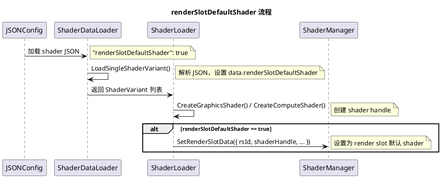
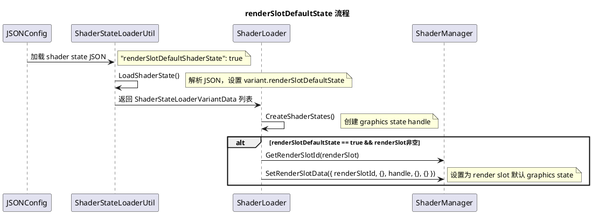

# RenderSlot默认资源配置详解

## 背景与问题引入

### RenderSlot概念

**RenderSlot（渲染槽位）** 是LumeRender的资源匹配机制核心：

- 将Shader/GraphicsState与特定渲染场景关联
- 支持同一Shader在不同渲染场景使用不同配置
- 实现渲染资源的动态选择

典型RenderSlot：
- `CORE3D_RS_DM_OPAQUE` - 不透明物体渲染
- `CORE3D_RS_DM_TRANSLUCENT` - 半透明物体渲染
- `CORE3D_RS_DM_DEPTH` - 深度/阴影渲染

### 默认资源配置问题

LumeRender需要为每个RenderSlot配置默认资源：

| 资源类型 | 作用 | 配置时机 |
|---------|------|---------|
| **Shader** | 定义渲染程序 | Shader加载完成后绑定 |
| **GraphicsState** | 定义GPU渲染状态 | State创建完成后绑定 |

问题：如何在资源加载时自动绑定到正确的RenderSlot？

### 配置标志的作用

`renderSlotDefaultShader` 和 `renderSlotDefaultState` 标志解决自动绑定问题：

- 在Shader/GraphicsState的元数据中声明默认槽位
- 资源加载完成后自动调用 `SetRenderSlotData()`
- 无需手动编写绑定代码

此机制简化渲染配置，实现声明式资源管理。

### 本文档解决的问题

本文档详细分析两个配置标志的定义、作用和触发机制：

- 标志的数据结构位置
- 自动绑定的触发条件
- 与ShaderVariant/ShaderStateVariant的关系

---

## 核心概念

### ShaderVariant

**ShaderVariant** 是Shader的变体配置：

| 字段 | 类型 | 作用 |
|------|------|------|
| `variantName` | string | 变体唯一标识 |
| `renderSlot` | string | 关联的RenderSlot名称 |
| `renderSlotDefaultShader` | bool | 是否作为默认Shader |
| `shaders` | vector | SPIR-V文件列表 |

ShaderVariant支持同一Shader的多种配置（如不同材质、不同渲染模式）。

### ShaderStateVariant

**ShaderStateVariant** 是GraphicsState的变体配置：

| 字段 | 类型 | 作用 |
|------|------|------|
| `renderSlot` | string | 关联的RenderSlot名称 |
| `variantName` | string | 变体唯一标识 |
| `renderSlotDefaultState` | bool | 是否作为默认GraphicsState |
| `stateFlags` | uint32 | 状态配置标志 |

ShaderStateVariant定义GPU状态（Blend、Depth、Raster等）的多种配置。

### SetRenderSlotData函数

**SetRenderSlotData** 是ShaderManager的核心接口：

```cpp
void SetRenderSlotData(
    const RenderHandle& shaderHandle,    // Shader句柄
    const RenderHandle& graphicsHandle,  // GraphicsState句柄
    const uint32_t renderSlotId          // RenderSlot ID
);
```

此函数将Shader/GraphicsState绑定到指定RenderSlot，供后续渲染查询使用。

### 自动绑定触发流程

```
renderSlotDefaultShader/renderSlotDefaultState 自动绑定流程:

┌──────────────────────────────────────────────────┐
│ Shader加载流程                                    │
├──────────────────────────────────────────────────┤
│ 加载Shader资源                                    │
│   └─ 解析ShaderVariant配置                        │
│   └─ 检查renderSlotDefaultShader标志              │
│   └─ if (renderSlotDefaultShader == true)        │
│       └─ 解析renderSlot名称                       │
│       └─ GetRenderSlotId(renderSlotName)         │
│         └─► 返回: renderSlotId                   │
│       └─ SetRenderSlotData(shaderHandle, {}, id) │
│         └─► 自动绑定到RenderSlot                  │
└──────────────────────────────────────────────────┘

┌────────────────────────────────────────────────────┐
│ GraphicsState创建流程                               │
├────────────────────────────────────────────────────┤
│ 创建GraphicsState                                   │
│   └─ 解析ShaderStateVariant配置                     │
│   └─ 检查renderSlotDefaultState标志                 │
│   └─ if (renderSlotDefaultState == true)           │
│       └─ 解析renderSlot名称                         │
│       └─ GetRenderSlotId(renderSlotName)           │
│         └─► 返回: renderSlotId                     │
│       └─ SetRenderSlotData({}, graphicsHandle, id) │
│         └─► 自动绑定到RenderSlot                    │
└────────────────────────────────────────────────────┘

┌──────────────────────────────────────────────────┐
│ 运行时查询                                        │
├──────────────────────────────────────────────────┤
│ GetShaderHandle(shader, renderSlotId)            │
│   └─► 查询RenderSlot绑定的Shader                  │
│   └─► 返回: 匹配的ShaderVariant                   │
│                                                  │
│ GetGraphicsStateHandle(shader, renderSlotId)     │
│   └─► 查询RenderSlot绑定的GraphicsState           │
│   └─► 返回: 匹配的GraphicsState                   │
└──────────────────────────────────────────────────┘
```

---

## 概述

`renderSlotDefaultShader` 和 `renderSlotDefaultState` 是 Lume3D Shader 系统中的两个关键配置标志，用于将 Shader 或 GraphicsState 设置为指定 Render Slot 的默认资源。

---

## 一、标志定义

### 1.1 renderSlotDefaultShader

**文件位置：** `api/render/device/intf_shader_manager.h:216`

```cpp
struct ShaderVariant {
    bool renderSlotDefaultShader { false };  // 标志：是否作为默认shader
    BASE_NS::string variantName;             // variant名称
    BASE_NS::string displayName;             // 显示名称
    BASE_NS::vector<ShaderSpvInfo> shaders;  // shader文件列表
    BASE_NS::string renderSlot;              // render slot名称
    // ... 其他字段
};
```

**作用：**
- 标识该 ShaderVariant 是否应成为指定 Render Slot 的默认 Shader
- 当为 `true` 时，Shader 加载完成后自动调用 `SetRenderSlotData()` 绑定到 Render Slot

---

### 1.2 renderSlotDefaultState

**文件位置：** `api/render/device/intf_shader_manager.h:211`

```cpp
struct ShaderStateLoaderVariantData {
    BASE_NS::string renderSlot;              // render slot名称
    BASE_NS::string variantName;             // variant名称
    BASE_NS::string baseShaderState;         // 基础shader state
    BASE_NS::string baseVariantName;         // 基础variant名称
    GraphicsStateFlags stateFlags { 0U };
    bool renderSlotDefaultState { false };   // 标志：是否作为默认state
};
```

**作用：**
- 标识该 ShaderStateVariant 是否应成为指定 Render Slot 的默认 GraphicsState
- 当为 `true` 时，GraphicsState 创建完成后自动调用 `SetRenderSlotData()` 绑定到 Render Slot

---

## 二、核心机制：SetRenderSlotData

### 2.1 函数定义

**文件位置：** `api/render/device/intf_shader_manager.h:381`

```cpp
struct RenderSlotData {
    uint32_t renderSlotId;                   // render slot ID
    RenderHandleReference shader;            // shader handle
    RenderHandleReference graphicsState;     // graphics state handle
    RenderHandleReference pipelineLayout;    // pipeline layout handle
    RenderHandleReference vertexInputDeclaration; // VID handle
};

virtual void SetRenderSlotData(const RenderSlotData& renderSlotData) = 0;
```

### 2.2 实现逻辑

**文件位置：** `src/device/shader_manager.cpp:458-503`

```cpp
void ShaderManager::SetRenderSlotData(const RenderSlotData& renderSlotData)
{
    const uint32_t rsId = renderSlotData.renderSlotId;
    if (rsId < static_cast<uint32_t>(renderSlotIds_.data.size())) {
        // 根据handle类型设置对应的默认资源
        if (IsAnyShaderFunc(renderSlotData.shader.GetHandle())) {
            renderSlotIds_.data[rsId].shader = renderSlotData.shader;
        }
        if (RenderHandleUtil::GetHandleType(renderSlotData.graphicsState.GetHandle()) ==
            RenderHandleType::GRAPHICS_STATE) {
            renderSlotIds_.data[rsId].graphicsState = renderSlotData.graphicsState;
        }
        if (RenderHandleUtil::GetHandleType(renderSlotData.pipelineLayout.GetHandle()) ==
            RenderHandleType::PIPELINE_LAYOUT) {
            renderSlotIds_.data[rsId].pipelineLayout = renderSlotData.pipelineLayout;
        }
        if (RenderHandleUtil::GetHandleType(renderSlotData.vertexInputDeclaration.GetHandle()) ==
            RenderHandleType::VERTEX_INPUT_DECLARATION) {
            renderSlotIds_.data[rsId].vertexInputDeclaration = renderSlotData.vertexInputDeclaration;
        }
    }
}
```

**核心逻辑：**
- 根据 Render Slot ID 找到对应的存储位置
- 根据传入的 handle 类型，分别设置 shader、graphicsState、pipelineLayout、vertexInputDeclaration
- 支持只设置部分字段（其他字段为空）

---

## 三、标志触发流程

### 3.1 renderSlotDefaultShader 流程



**代码位置：** `src/loader/shader_loader.cpp`

```cpp
// shader_loader.cpp:396-398 (Compute Shader)
if (svRef.renderSlotDefaultShader) {
    shaderMgr_.SetRenderSlotData({ rsId, rhr, {}, {}, {} });
}

// shader_loader.cpp:481-484 (Graphics Shader)
if (svRef.renderSlotDefaultShader) {
    shaderMgr_.SetRenderSlotData(
        { rsId, rhr, {}, {}, shaderMgr_.GetVertexInputDeclarationHandle(svRef.vertexInputDeclaration) });
}
```

---

### 3.2 renderSlotDefaultState 流程



**代码位置：** `src/loader/shader_loader.cpp:556-559`

```cpp
void ShaderLoader::CreateShaderStates(...)
{
    for (size_t stateIdx = 0; stateIdx < states.size(); ++stateIdx) {
        const auto& variant = variantData[stateIdx];
        const RenderHandleReference handle = shaderMgr_.CreateGraphicsState(createInfo, variantCreateInfo);

        if (variant.renderSlotDefaultState && (!variant.renderSlot.empty())) {
            const uint32_t renderSlotId = shaderMgr_.GetRenderSlotId(variant.renderSlot);
            shaderMgr_.SetRenderSlotData({ renderSlotId, {}, handle, {}, {} });
        }
    }
}
```

---

## 四、JSON 配置格式

### 4.1 Shader 配置示例

**文件位置：** shader JSON 文件

```json
{
    "shader": "core3d_dm_fw",
    "renderSlot": "opaque",
    "variantName": "default",
    "displayName": "Default Forward",
    "renderSlotDefaultShader": true,
    "vert": "shaders/core3d_dm_fw.vert.spv",
    "frag": "shaders/core3d_dm_fw.frag.spv"
}
```

**字段说明：**
- `renderSlotDefaultShader`: `true` 表示该 shader 是 `opaque` render slot 的默认 shader
- `renderSlot`: 指定要绑定的 render slot 名称

---

### 4.2 ShaderState 配置示例

**文件位置：** shader state JSON 文件

```json
{
    "shaderState": "core3d_dm_fw_default",
    "renderSlot": "opaque",
    "variantName": "default",
    "renderSlotDefaultShaderState": true,
    "baseShaderState": "core3d_dm_fw_base",
    "graphicsState": {
        "depthTest": true,
        "depthWrite": true,
        "blend": false
    }
}
```

**字段说明：**
- `renderSlotDefaultShaderState`: `true` 表示该 graphics state 是 `opaque` render slot 的默认 state
- 注意：JSON 中字段名是 `renderSlotDefaultShaderState`，代码中对应 `renderSlotDefaultState`

---

### 4.3 JSON 加载代码

**文件位置：** `src/loader/shader_data_loader.cpp:55-58`

```cpp
void LoadSingleShaderVariant(const json::value& jsonData, ...)
{
    SafeGetJsonValue(jsonData, "renderSlotDefaultShader", result.error, data.renderSlotDefaultShader);
    if (!data.renderSlotDefaultShader) {
        // 兼容旧字段名 "renderSlotDefault"
        SafeGetJsonValue(jsonData, "renderSlotDefault", result.error, data.renderSlotDefaultShader);
    }
}
```

**文件位置：** `src/loader/shader_state_loader_util.cpp:351-353`

```cpp
SafeGetJsonValue(state, "renderSlotDefaultShaderState", ssr.res.error, variant.renderSlotDefaultState);
if (!variant.renderSlotDefaultState) {
    // 兼容旧字段名 "renderSlotDefault"
    SafeGetJsonValue(state, "renderSlotDefault", ssr.res.error, variant.renderSlotDefaultState);
}
```

---

## 五、两个标志对比

| 特性 | renderSlotDefaultShader | renderSlotDefaultState |
|------|-------------------------|------------------------|
| **所属结构** | ShaderVariant | ShaderStateLoaderVariantData |
| **绑定资源** | Shader | GraphicsState |
| **触发时机** | Shader创建后 | GraphicsState创建后 |
| **JSON字段** | `renderSlotDefaultShader` | `renderSlotDefaultShaderState` |
| **额外条件** | 无 | 需要 `renderSlot` 非空 |
| **典型用途** | 设置默认渲染shader | 设置默认渲染状态 |

---

## 六、Render Slot 默认资源的作用

### 6.1 默认资源的使用场景

当材质没有指定自定义 Shader/GraphicsState 时，渲染系统会使用 Render Slot 的默认资源：

1. **材质未指定 Shader：** 使用 `renderSlotIds_.data[slotId].shader`
2. **材质未指定 GraphicsState：** 使用 `renderSlotIds_.data[slotId].graphicsState`
3. **材质未指定 PipelineLayout：** 使用 `renderSlotIds_.data[slotId].pipelineLayout`
4. **材质未指定 VID：** 使用 `renderSlotIds_.data[slotId].vertexInputDeclaration`

### 6.2 典型应用

| Render Slot | 默认 Shader | 默认 State | 说明 |
|-------------|-------------|------------|------|
| `opaque` | `core3d_dm_fw.shader` | `core3d_dm_fw_default.shadergs` | 普通不透明物体 |
| `depth` | `core3d_dm_depth.shader` | `core3d_dm_depth.shadergs` | 深度预渲染 |
| `transparent` | `core3d_dm_fw_trans.shader` | - | 透明物体 |
| `shadow` | `core3d_dm_shadow.shader` | - | 阴影投射 |

---

## 七、验证与调试

### 7.1 验证默认资源是否设置成功

```cpp
// 检查 render slot 的默认 shader 是否已设置
const auto& slotData = shaderMgr.GetRenderSlotData(slotId);
if (slotData.shader) {
    PLUGIN_LOG_D("Default shader set for slot %u", slotId);
}
```

### 7.2 查看默认资源覆盖警告

当重复设置同一 Render Slot 的默认资源时，会产生警告：

```cpp
// shader_manager.cpp:467-470 (VALIDATION模式)
if (renderSlotIds_.data[rsId].shader) {
    PLUGIN_LOG_W("RENDER_VALIDATION: Overwriting default shader for render slot (%s)", renderSlotName.c_str());
}
```

---

## 八、版本历史

| 版本 | 日期 | 描述 |
|------|------|------|
| 1.0 | 2025-01-XX | 初始版本 |
| 1.1 | 2025-05-19 | 重新组织文档，围绕标题，移除偏离主题内容 |

---

## 九、参考资料

### 9.1 相关代码文件

| 文件 | 描述 |
|------|------|
| `api/render/device/intf_shader_manager.h` | ShaderVariant、ShaderStateLoaderVariantData、RenderSlotData 定义 |
| `src/device/shader_manager.cpp` | SetRenderSlotData 实现 |
| `src/loader/shader_loader.cpp` | Shader/ShaderState 加载，调用 SetRenderSlotData |
| `src/loader/shader_data_loader.cpp` | Shader JSON 加载，解析 renderSlotDefaultShader |
| `src/loader/shader_state_loader_util.cpp` | ShaderState JSON 加载，解析 renderSlotDefaultState |

### 9.2 相关文档

- [FillMaterialDefaultRenderSlotData函数详解.md](FillMaterialDefaultRenderSlotData函数详解.md) - 材质默认渲染槽数据填充
- [Lume3D ECS对象关系详解.md](Lume3D ECS对象关系详解.md) - Scene/Camera/Material/Submesh 关系
