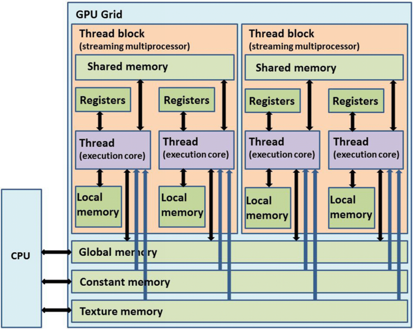
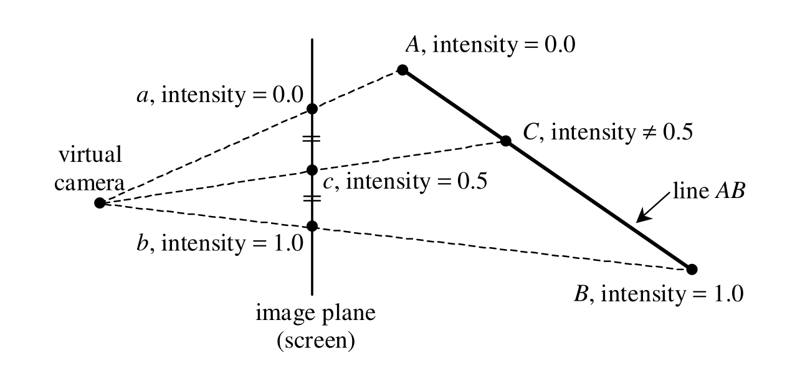
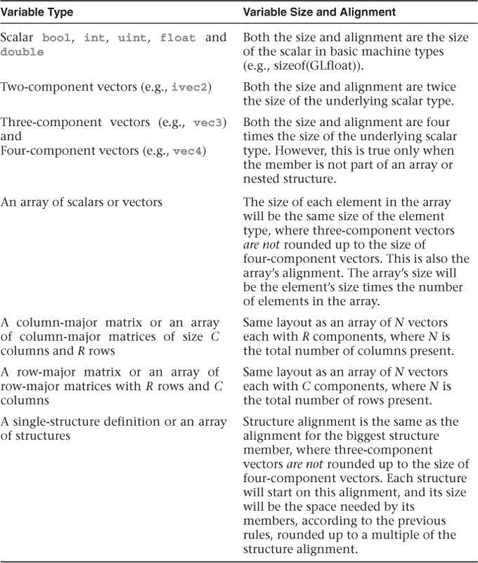

# 图形学GLSL入门小结

## 目录

- [图形学GLSL入门小结](#图形学glsl入门小结)
  - [目录](#目录)
  - [1. 编译流程](#1-编译流程)
  - [2. 程序主结构](#2-程序主结构)
    - [2.1.指定语法版本](#21指定语法版本)
    - [2.2.入口函数](#22入口函数)
    - [2.3.输入输出](#23输入输出)
    - [2.4.变量命名规则](#24变量命名规则)
  - [3. 执行单位](#3-执行单位)
  - [4. GLSL宏](#4-glsl宏)
  - [5. 数据类型](#5-数据类型)
    - [5.1 基本类型](#51-基本类型)
    - [5.2 结构体类型](#52-结构体类型)
    - [5.3 数组类型](#53-数组类型)
    - [5.4 opaque类型](#54-opaque类型)
      - [Opaque类型数组的Dynamically Uniform限制](#opaque类型数组的dynamically-uniform限制)
    - [5.5 接口块类型](#55-接口块类型)
    - [5.6 变量初始化](#56-变量初始化)
  - [6. 表达式](#6-表达式)
  - [7. 控制流](#7-控制流)
  - [8. 函数](#8-函数)
    - [8.1 返回值](#81-返回值)
    - [8.2 subroutine](#82-subroutine)
      - [基本概念](#基本概念)
      - [单个subroutine变量示例](#单个subroutine变量示例)
      - [多个subroutine变量示例](#多个subroutine变量示例)
  - [9. 限定符](#9-限定符)
    - [9.1 输入输出](#91-输入输出)
    - [9.2 精度](#92-精度)
    - [9.3 可变性](#93-可变性)
      - [invariant关键字](#invariant关键字)
      - [const关键字](#const关键字)
    - [9.4 读写](#94-读写)
      - [coherent关键字](#coherent关键字)
      - [restrict关键字](#restrict关键字)
      - [volatile关键字](#volatile关键字)
    - [9.5 插值](#95-插值)
      - [flat插值与uniform变量的区别](#flat插值与uniform变量的区别)
    - [9.6 块内存对齐](#96-块内存对齐)
    - [9.7 其他layout限定符](#97-其他layout限定符)
  - [10. 内置函数](#10-内置函数)
  - [11. 参考](#11-参考)

---

## 1. 编译流程

GLSL是GPU编程语言，可被编译成二进制运行在GPU上，分为预处理、编译、链接三个阶段：

- **预处理**：预处理是在GLSL代码被编译之前执行的一系列操作。预处理指令以井号`#`开头，可以用于定义常量和宏、条件编译等；
- **编译**：GLSL代码在编译阶段会被转换为GPU可执行的二进制格式。具体的二进制格式可能因图形API、硬件平台和驱动程序之间的差异而有所不同；
- **链接**：链接阶段是将多个着色器程序链接成一个单独的可执行程序的过程。在这个阶段，编译器和图形驱动程序会检查着色器程序之间的输入/输出接口匹配性，并为它们分配内存，以确保它们正确协同工作。

---

## 2. 程序主结构

GLSL程序代码的结构由版本指令、入口函数、输入/输出接口，三部分组成：

```glsl
#version 400

in vec3 vertCol;
out vec4 fragColor;
void main()
{
    fragColor = vec4( vertCol, 1.0 );
}
```

### 2.1.指定语法版本

通过`#version`指定编译器版本，通过`#extension`指定编译器对特定扩展语法的行为。举个例子，下列语句指定GLSL编译器版本为GLSL3.3，并要求编译器支持扩展语法`include`。

```glsl
#version 330 core
#extension GL_ARB_shading_language_include : require
```

版本号后面可以跟一个profile name，可以是`core`或者`compatibility`，如果没有指定profile name，则默认`core`。GLSL版本可参考下表：

| GLSL Version | OpenGL version | Shader Preprocessor | Release Date |
|-------------|---------------|---------------------|--------------|
| 1.10 | 2.0 | `#version 110` | 2004-09-07 |
| 1.20 | 2.1 | `#version 120` | 2006-07-02 |
| 1.30 | 3.0 | `#version 130` | 2008-08-11 |
| 1.40 | 3.1 | `#version 140` | 2009-03-24 |
| 1.50 | 3.2 | `#version 150` | 2009-08-03 |
| 3.30 | 3.3 | `#version 330` | 2010-02-12 |
| 4.00 | 4.0 | `#version 400` | 2010-03-11 |
| 4.10 | 4.1 | `#version 410` | 2010-07-26 |
| 4.20 | 4.2 | `#version 420` | 2011-08-08 |
| 4.30 | 4.3 | `#version 430` | 2012-08-06 |
| 4.40 | 4.4 | `#version 440` | 2013-07-22 |
| 4.50 | 4.5 | `#version 450` | 2014-08-11 |

指定扩展语法的方法如下：

```glsl
#extension extension_name|all : behavior
```

`#extension`后可以是扩展名，也可以是关键字`all`，`all`用于表示所有扩展。扩展名后的`behavior`值参考下表：

| 指令 | 说明 |
|-----|------|
| `require` | 扩展名是`all`，则提示编译错误，编译不通过；<br>扩展名是具体`extension_name`，当编译器不支持该扩展的时候，提示编译错误，编译不通过。 |
| `enable` | 扩展名是`all`，提示编译错误，编译不通过；<br>扩展名是具体`extension_name`，当编译器不支持该扩展的时候，发出编译警告，可编译通过。 |
| `warn` | 扩展名是`all`，发出编译警告，可编译通过；<br>扩展名是具体`extension_name`，当编译器不支持该扩展的时候，发出编译警告，可编译通过。 |
| `disable` | 关闭编译器对指定扩展语法的支持。 |

### 2.2.入口函数
和C语言类似，入口函数是`main`函数，但不同的是这个`main`函数没有返回值。

### 2.3.输入输出
C语言程序，以`main`函数参数的形式给程序传入数据，通过`main`函数返回值的形式从程序内传出数据。而GLSL的`main`函数是没有参数和返回值的，GLSL程序通过`in`，`uniform`，`buffer`类型的变量传入数据，通过`out`，`buffer`输出数据。

### 2.4.变量命名规则
GLSL的变量命名方式与C语言类似，变量的名称可以使用字母，数字以及下划线，但变量名不能以数字开头，还有变量名不能以`gl_`作为前缀，这个是GLSL保留的前缀，用于GLSL的内部变量。

---

## 3. 执行单位

- GLSL程序在GPU上执行，GPU上程序的执行单位是`invocation`
- GLSL程序并不是按照GLSL代码顺序执行，而是在不影响程序输出结果的情况下，经过编译期指令重排、运行期指令乱序发射的方式乱序执行
- 在不考虑循环的情况下，CPU端的程序执行一次，而GLSL程序执行次数与它的用途有关，如果是顶点shader，则执行顶点数次；如果是片元shader则执行片元数次
- `invocation`之间通过全局内存区进行通信，通过`barrier`实现同步。

---

## 4. GLSL宏

GLSL提供的常见预处理指令：

- 和C语言用法相同的指令：`#define`，`#undef`，`#if`，`#ifdef`，`#ifndef`，`#else`，`#elif`，`#endif`，`#pragma`，`#error`。注意GLSL没有提供`#include`指令。
- 不同于C语言的指令：`#extension`，`#version`，`#line`。

补充下`#line`用法：

```glsl
#line line
#line line source-string-number
//举例
#line 3        //3是下一行的行号
#line 3 40     //3是下一行的行号，40是当前shader文件的编号
```

常见宏常量：

| 宏 | 说明 |
|----|------|
| __LINE__ | 当前行号，行号的起始号可以通过`#line`定义。 |
| __FILE__ | __FILE__不是当前shader的文件名，而是十进制整数，是shader程序内对该文件的编号。 |
| __VERSION__ | GLSL版本，整数类型。如果版本是3.30，值就是330。 |

---

## 5. 数据类型

### 5.1 基本类型

| 标量类型 | 二维向量 | 三维向量 | 四维向量 | 矩阵类型 |
|---------|---------|---------|---------|---------|
| float | vec2 | vec3 | vec4 | mat2, mat3, mat4 |
|  |  |  |  | mat2x2, mat2x3, mat2x4 |
|  |  |  |  | mat3x2, mat3x3, mat3x4 |
|  |  |  |  | mat4x2, mat4x3, mat4x4 |
| double | dvec2 | dvec3 | dvec4 | dmat2, dmat3, dmat4 |
|  |  |  |  | dmat2x2, dmat2x3, dmat2x4 |
|  |  |  |  | dmat3x2, dmat3x3, dmat3x4 |
|  |  |  |  | dmat4x2, dmat4x3, dmat4x4 |
| int | ivec2 | ivec3 | ivec4 | --- |
| uint | uvec2 | uvec3 | uvec4 | --- |
| bool | bvec2 | bvec3 | bvec4 | --- |

向量类型支持一种特殊语法——swizzling语法，指的是可以用 x、y、z、w分别指代向量类型的第1、2、3、4个元素。

```glsl
vec2 someVec;
vec4 otherVec = someVec.xyxx;
vec3 thirdVec = otherVec.zyy;
vec4 someVec;
someVec.rgba = vec4(1.0, 2.0, 3.0, 4.0); // Reverses the order.
someVec.zx = vec2(3.0, 5.0); // Sets the 3rd component of someVec to 3.0 and the 1st component to 5.
```

此外，向量的元素还可以用下列字母组访问，可根据向量的语义，使用不同组字母。

| [1] | [2] | [3] | [4] | 说明 |
|-----|-----|-----|-----|------|
| x | y | z | w | 表示顶点坐标 |
| s | t | p | q | 表示纹理坐标 |
| r | g | b | a | 表示颜色 |

### 5.2 结构体类型

GLSL结构体的语法和C语言相同：

```glsl
struct Light{
    vec3 eyePosition;
    vec3 intensity;
    float attenuation;
} variablename;
```

### 5.3 数组类型

GLSL数组的语法和C语言相同：

```glsl
float myValues[2];
```

Opaque类型数组的版本限制和索引要求见[5.4节](#54-opaque类型)。

### 5.4 opaque类型

opaque类型代表着色器以某种方式引用的一些外部对象，主要包括纹理、图像以及原子计数器。

| 类型 | 说明 |
|-----|------|
| 纹理 | 用于读取纹理内存空间的纹理类型数据，常见纹理类型有：<br>`sampler1D`一维纹理采样器；<br>`sampler2D`二维纹理采样器；<br>`sampler3D`三维纹理采样器；<br>`samplerCube`立方体纹理采样器；<br>`sampler1DArray`一维数组纹理采样器；<br>`sampler2DArray`二维数组纹理采样器。 |
| 图像 | 用于读写全局内存空间的图像类型数据，常见图像类型有：<br>`image1D`一维图像；<br>`image2D`二维图像；<br>`image3D`三维图像；<br>`imageCube`立方体图像；<br>`image1DArray`一维数组图像；<br>`image2DArray`二维数组图像。 |
| 原子计数器 | 只有一种类型`atomic_uint`，任何`invocation`对原子计数器的修改，对其它所有`invocation`可见，且`invocation`通过原子操作互斥访问该类型变量。 |

这里注意下纹理和图片的区别:
- 纹理**只读**，且读操作过程会进行纹理过滤；
- 图像**可读写**，读写过程不进行过滤操作。

#### Opaque类型数组的Dynamically Uniform限制

Opaque类型数组（如`sampler2D[]`、`image2D[]`）的索引有特殊限制：

| GLSL版本 | 限制要求 |
|---------|---------|
| < 3.30 | 不支持opaque类型数组 |
| 3.30 | 仅支持Sampler数组，索引必须是**常量表达式**（编译期确定） |
| ≥ 4.00 | 支持所有opaque数组，索引必须是**dynamically uniform表达式** |

**Dynamically Uniform**的定义详见[第6节](#6-表达式)，此处仅给出opaque数组相关的示例：

```glsl
// ✓ 正确：常量索引（编译期确定）
uniform sampler2D textures[4];
vec4 color = texture(textures[0], uv);

// ✓ 正确：uniform变量索引（同一批次所有invocation相同）
uniform int texIndex;
vec4 color = texture(textures[texIndex], uv);

// ✗ 错误：非dynamically uniform索引（不同片元可能不同）
int dynamicIndex = int(mod(uv.x * 4.0, 4.0));
vec4 color = texture(textures[dynamicIndex], uv); // 不同片元索引不同，非法！
```

### 5.5 接口块类型

接口块（Interface Block）指的是成组的输入输出变量，其语法格式如下：

```glsl
storage_qualifier block_name
{
  <define members here>
} instance_name;
```

`storage_qualifier`可以是`in`，`out`，`uniform`，`buffer`。举个例子：

```glsl
uniform MatrixBlock
{
  mat4 projection;
  mat4 modelview;
} matrices;
```

它和结构体的区别是结构体内的成员是供shader程序内部使用的，接口块内的成员是用于shader程序输入输出的。

### 5.6 变量初始化

GLSL变量可以通过构造器、初始化列表、赋值运算符初始化。

```glsl
struct Data{
  float first;
  vec2 second;
};

//构造器
bool val = bool(true);
const float array[3] = float[3](2.5, 7.0, 1.5);
Data dataValue = Data(1.4, vec2(16.0, 22.5));

//初始化列表
bool val = {true};
const float array[3] = {2.5, 7.0, 1.5};
Data dataValue = {1.0, {-19.0, 4.5}};
```

但需要注意，用作输入输出的变量不允许初始化，比如in，out这些关键字修饰的变量。

---

## 6. 表达式

提一下两种特殊类型的表达式。常量表达式：表达式的运算发生在编译期，下面都是常量表达式。

```glsl
1.0;//literal
1.0+2.0;//operator
vec2(2.0,1.0);//constructor
const float val = {1.0};//const
//实参为常量表达式的内置函数
```

**dynamically uniform**表达式：

如果一个表达式在**同一渲染批次的所有invocation**上产生相同的输出值，那么它被称为 "**dynamically uniform**"。

| 类型 | 是否dynamically uniform | 说明 |
|-----|------------------------|------|
| 常量表达式 | ✓ | 如`const int idx = 2;`、字面值`3` |
| `uniform`变量 | ✓ | 所有`invocation`读取相同的`uniform`值 |
| `gl_WorkGroupID` | ✓（compute shader） | 同一workgroup内所有`invocation`相同 |
| `gl_VertexID` | ✗ | 不同顶点ID不同 |
| 片元坐标`gl_FragCoord` | ✗ | 不同片元坐标不同 |
| 从顶点shader传入的变量 | ✗ | 不同片元可能来自不同顶点 |

**限制场景**：
- opaque数组的索引必须是**dynamically uniform**；
- `uniform block`、`shader storage block`类型的数组索引必须是**dynamically uniform**；
- `compute shader`条件语句或者循环语句内有`barrier()`的时候，条件表达式必须是**dynamically uniform**。

---

## 7. 控制流

GLSL的控制流关键字和C语言类似。
- 条件语句：`if-else`，`switch-case`；
- 循环语句：`for`，`while`，`do-while`；
- 跳转语句：`break`，`continue`，`return`，`discard`。

注意这里多了个关键字`discard`，它仅用于片元着色器，调用`discard`和在`main`函数内使用`return`都会引起程序退出，区别是前者退出后不会输出片元值，后者会输出片元值。

---

## 8. 函数

函数定义和使用方法和C语言类似，但有两大区别：GLSL函数不支持递归；参数限定符是`in`，`out`，`inout`，`const in`。

| 限定符 | 说明 |
|-------|------|
| `in` | 缺省时的默认限定符，指明参数通过值传递。 |
| `inout` | 指明参数通过引用传递，可读写。 |
| `out` | 指明参数的值不可读，但在函数返回时可以写。 |
| `const in` | 指明参数通过值传递，且传入的值不可修改，给编译器提供更多优化空间。 |

### 8.1 返回值

在GLSL中，你可以使用参数和返回值来返回函数计算的数据，这两种方式各自有其特定的应用场景和优势。

**1. 使用 `out` 参数返回数据：**

```glsl
void computeData(out vec3 result) {
    // 计算数据
    result = someValue;
}

void main() {
    vec3 outputData;
    computeData(outputData);
    // 在outputData中包含了computeData函数计算的数据
}
```

在这个例子中，`computeData` 函数通过 `out` 参数将计算结果写入 `result` 参数。然后，调用函数时传递一个变量，函数会将计算的数据写入这个变量中。

**2. 使用函数返回值返回数据：**

```glsl
vec3 computeData() {
    // 计算数据
    return someValue;
}

void main() {
    vec3 outputData = computeData();
    // 在outputData中包含了computeData函数计算的数据
}
```

在这个例子中，`computeData` 函数直接通过 `return` 语句返回计算的数据。调用函数时，你可以将返回的值分配给一个变量，这个变量会包含函数计算的数据。

**3.区别和选择：**

- 使用 `out` 参数允许你在一个函数中同时返回多个值。
- 使用函数返回值通常更符合直观的编程风格，特别是当你的函数只需要返回一个值时。

### 8.2 subroutine

`subroutine`是GLSL提供的**动态函数选择机制**，允许在运行时（而非编译时）选择调用哪个函数实现。这在需要同一shader支持多种算法/效果时非常有用，避免了条件分支的性能开销。

#### 基本概念

| 语法元素 | 说明 |
|---------|------|
| `subroutine <return_type> <type_name>();` | 定义subroutine类型签名（函数原型） |
| `subroutine uniform <type_name> <var_name>;` | 定义subroutine变量（运行时可切换） |
| `subroutine(<type_name>) <func_name>() { ... }` | 定义具体的subroutine函数实现 |

#### 单个subroutine变量示例

```glsl
#version 400

out vec4 FragColor;

subroutine vec4 color_t();              // 定义subroutine类型

subroutine uniform color_t Color;       // 定义subroutine变量

subroutine(color_t)
vec4 ColorRed()
{
  return vec4(1, 0, 0, 1);
}

subroutine(color_t)
vec4 ColorBlue()
{
  return vec4(0, 0.4, 1, 1);
}

void main()
{
  FragColor = Color();                  // 调用当前选中的subroutine函数
}
```

C++端切换subroutine：

```cpp
GLuint color_red_index = glGetSubroutineIndex(program, GL_FRAGMENT_SHADER, "ColorRed");
glUniformSubroutinesuiv(GL_FRAGMENT_SHADER, 1, &color_red_index);
```

#### 多个subroutine变量示例

当shader需要多个可切换的函数时，可以定义多个subroutine变量：

```glsl
#version 400

in vec2 uv;
out vec4 FragColor;

// 定义两种subroutine类型
subroutine vec4 lighting_t(vec3 normal);       // 光照计算类型
subroutine vec3 texture_t(vec2 uv);            // 纹理采样类型

// 定义两个subroutine变量
subroutine uniform lighting_t LightingFunc;    // 光照函数选择器
subroutine uniform texture_t TextureFunc;      // 纹理函数选择器

// 光照函数实现
subroutine(lighting_t)
vec4 DiffuseLighting(vec3 normal)
{
  return vec4(max(0.0, dot(normal, vec3(0, 1, 0))), 1.0);
}

subroutine(lighting_t)
vec4 AmbientLighting(vec3 normal)
{
  return vec4(0.2, 0.2, 0.2, 1.0);
}

subroutine(lighting_t)
vec4 NoLighting(vec3 normal)
{
  return vec4(1.0, 1.0, 1.0, 1.0);
}

// 纹理函数实现
subroutine(texture_t)
vec3 SimpleTexture(vec2 uv)
{
  return vec3(uv.x, uv.y, 0.5);
}

subroutine(texture_t)
vec3 CheckerTexture(vec2 uv)
{
  float checker = mod(floor(uv.x * 8.0) + floor(uv.y * 8.0), 2.0);
  return vec3(checker);
}

void main()
{
  vec3 normal = vec3(0, 0, 1);
  vec3 texColor = TextureFunc(uv);        // 调用选中的纹理函数
  vec4 lightColor = LightingFunc(normal); // 调用选中的光照函数
  FragColor = vec4(texColor, 1.0) * lightColor;
}
```

C++端切换多个subroutine：

```cpp
// 获取各函数的subroutine索引
GLuint diffuse_idx = glGetSubroutineIndex(program, GL_FRAGMENT_SHADER, "DiffuseLighting");
GLuint checker_idx = glGetSubroutineIndex(program, GL_FRAGMENT_SHADER, "CheckerTexture");

// 设置两个subroutine变量（按location顺序）
GLuint indices[2] = { diffuse_idx, checker_idx };
glUniformSubroutinesuiv(GL_FRAGMENT_SHADER, 2, indices);
```

**使用layout指定location**：

```glsl
layout(location = 0) subroutine uniform lighting_t LightingFunc;  // location 0
layout(location = 1) subroutine uniform texture_t TextureFunc;    // location 1
```

这样可以明确指定每个subroutine变量在indices数组中的位置。

---

## 9. 限定符

类型限定符用在类型前面，举几个例子：

```glsl
layout(location = 0) out vec4 fragColor;
precision mediump vec3;
invariant out vec3 Color;
out flat int flatValue;
```

为方便记忆，个人把GLSL限定符分为八大类：

| 分类 | 限定符 |
|-----|-------|
| 输入输出 | `in`，`out`，`uniform`，`buffer`，`shared` |
| 精度 | `highp`，`mediump`，`lowp` |
| 可变性 | `invariant`，`const` |
| 读写 | `coherent`，`volatile`，`restrict`，`readonly`，`writeonly` |
| 插值 | `flat`，`noperspective`，`smooth` |
| layout内存对齐相关 | `packed`，`shared`，`std140`，`std430`，`row_major`，`column_major` |
| layout其它限定符 | `location`，`set`，`binding`，`offset`，`index`，`xfb_buffer`，`xfb_offset`，`local_size` ... |
| 函数参数 | `in`，`out`，`inout`，`const in` |

多个限定符语法顺序：

```glsl
invariant-qualifier interpolation-qualifier layout-qualifier other-storage-qualifier precision-qualifier
```

### 9.1 输入输出

这些关键字可指定变量的在显存中的存放位置，常用于在shader程序内指定输入输出，或者用于实现invocation之间通信。

| 限定符 | 说明 |
|-------|------|
| `in` `out` | 不可用于opaque类型、结构体类型，数据存放在本地内存，`in`用于获取渲染管线上阶段的数据，`out`用于把数据传递给渲染管线下一阶段。 |
| `uniform` | 可用于修饰基本类型、接口块类型，表示数据来自常量内存或者纹理内存，是常量值，不可修改。 |
| `buffer` | 用于修饰接口块类型，表示数据来自全局内存，可读写。 |
| `shared` | 只能用在`compute shader`，表明变量的值在work group内的所有`invocation`共享。 |



### 9.2 精度

这些关键字可用于标量类型、矢量类型、矩阵类型、图像类型、纹理类型。`highp`、`mediump` 和 `lowp` 是精度限定符，用于表示浮点数的不同精度级别。

| 限定符 | 说明 |
|-------|------|
| `highp` | 高精度，具体的位数和范围可能会因硬件而异。 |
| `mediump` | 中等精度，具体的位数和范围可能会因硬件而异。 |
| `lowp` | 低精度，具体的位数和范围可能会因硬件而异。 |

### 9.3 可变性

#### invariant关键字

`invariant`关键字用于确保**同一shader在不同编译条件下对相同输入产生完全相同的输出**。

**为什么需要invariant**：

编译器优化可能导致指令重排序，使得两个独立编译的shader（如vertex shader和fragment shader）对相同的数学计算产生略微不同的结果。这在多通道渲染中会导致问题：第一通道计算的深度值与第二通道计算的深度值可能不一致，产生z-fighting artifacts。

**使用场景**：
- 多通道渲染需要深度值精确匹配
- 阴影渲染中需要光源pass与相机pass的坐标一致
- 需要shader输出在多次编译间保持稳定

**语法**：

```glsl
// 声明时使用
invariant out vec3 Color;

// 对已声明变量添加invariant
invariant gl_Position;     // make existing gl_Position be invariant
out vec3 Color;
invariant Color;           // make existing Color be invariant
```

**示例：多通道阴影渲染**

```glsl
// vertex shader - 光源视角pass
invariant out vec4 vPositionLightSpace;  // 必须invariant！
uniform mat4 lightProjection;
uniform mat4 lightView;

void main() {
    vPositionLightSpace = lightProjection * lightView * vec4(position, 1.0);
    gl_Position = vPositionLightSpace;
}

// fragment shader - 相机视角pass（第二次渲染）
invariant in vec4 vPositionLightSpace;   // 对应输入也需invariant
uniform mat4 cameraProjection;
uniform mat4 cameraView;

void main() {
    // 需要与光源pass计算的vPositionLightSpace完全一致
    float shadowDepth = vPositionLightSpace.z;
    // ...
}
```

如果不加`invariant`，两个pass可能因编译器优化差异产生不同的深度值，导致阴影错误。

#### const关键字

`const`修饰的变量必须在声明的时候初始化，且值不可更改，用于把运行期的计算转化为编译期计算，优化运行效率。

### 9.4 读写

这类限定符只可用于图像类型（`image2D`、`image3D`等），用于控制内存访问行为。

| 限定符 | 说明 |
|-------|------|
| `readonly` | 只允许读操作，禁止写入。 |
| `writeonly` | 只允许写操作，禁止读取。 |
| `coherent` | 保证某一invocation对变量的修改对其它invocation可见（跨cache同步）。 |
| `restrict` | 告知编译器该变量是唯一指向该内存区域的指针，可进行更激进的优化。 |
| `volatile` | 禁止编译器对访问顺序进行优化，保证读写按代码顺序执行。 |

#### coherent关键字

不同invocation读写同一变量时，各自操作的是本地cache数据，可能导致数据不一致。

```glsl
layout(binding = 0) coherent image2D sharedImage;

// coherent保证：invocation A的写入对invocation B可见
imageStore(sharedImage, coord, value);
memoryBarrier();  // 需配合memoryBarrier确保顺序
```

#### restrict关键字

`restrict`告知编译器：该变量是当前shader中**唯一指向该内存区域的引用**，不会通过其它别名访问同一内存。这允许编译器进行更激进的优化：

```glsl
layout(binding = 0, restrict) writeonly image2D outputImage;
layout(binding = 1, restrict) readonly image2D inputImage;

// restrict保证：outputImage和inputImage不会指向同一内存
// 编译器可以安全地并行化读写，无需担心别名冲突
vec4 data = imageLoad(inputImage, coord);
imageStore(outputImage, coord, data);
```

**对比C语言的restrict**：
- C语言`restrict`指针：承诺指针是访问该数据的唯一方式
- GLSL`restrict`：承诺该image变量不会与其它image变量指向同一内存区域

**典型用法**：

```glsl
// 正确用法：输入输出分离，编译器可优化
layout(binding = 0, restrict) readonly image2D source;
layout(binding = 1, restrict) writeonly image2D dest;

// 错误假设：如果source和dest实际指向同一texture，restrict承诺被违反
// 可能导致未定义行为
```

#### volatile关键字

禁止编译器对内存访问进行任何优化或重排序：

```glsl
layout(binding = 0, volatile) image2D externalMemory;

// volatile保证：每次imageLoad/imageStore都真实执行
// 不会被优化掉或合并，适合外部设备可能修改的内存
```

### 9.5 插值

这些关键字只用在片元着色器前一个着色器的输出。

| 限定符 | 说明 |
|-------|------|
| `smooth` | 这是默认的插值方式，计算三角形内的片元属性，在屏幕空间进行插值，并以透视校正的方式进行插值。相当于在三维空间进行插值。 |
| `noperspective` | 计算三角形内的片元属性，在屏幕坐标空间中线性插值。 |
| `flat` | 计算三角形内的片元属性，不进行插值，换句话说就是三角形内所有片元属性值相同。 |

参考下图，`smooth`通过最右边线段的几何关系插值，`noperspective`通过中间线段的几何关系计算插值。



#### flat插值与uniform变量的区别

`flat`插值和`uniform`变量都能让所有片元获得相同的值，但机制完全不同：

| 特性 | `flat`插值 | `uniform`变量 |
|-----|-----------|--------------|
| 数据来源 | 来自上一阶段shader的输出 | 来自CPU端设置的常量值 |
| 值的确定时机 | 每个三角形渲染时确定 | 每次draw call前确定 |
| 值的来源 | 三角形的**provoking vertex**（通常是最后一个顶点） | uniform buffer或直接设置 |
| 是否可变 | 可以每个三角形不同 | 整个draw call期间不变 |
| 适用场景 | 每个三角形需要不同但内部统一的值（如材质ID、三角形颜色） | 全局常量（如灯光参数、矩阵） |

**示例对比**：

```glsl
// vertex shader
flat out int materialID;      // 每个三角形传递一个materialID
uniform mat4 projection;      // 所有三角形共享同一个projection矩阵

void main() {
    materialID = getMaterialID();  // 每个顶点可能不同，但flat只取provoking vertex的值
    gl_Position = projection * vec4(pos, 1.0);
}

// fragment shader
flat in int materialID;       // 整个三角形内所有片元获得相同的materialID
uniform vec3 lightDir;        // 所有片元共享同一个lightDir

void main() {
    // materialID可能每个三角形不同
    // lightDir对所有三角形的所有片元都相同
}
```

### 9.6 块内存对齐

这些关键字只用于块类型。

| 限定符 | 说明 |
|-------|------|
| `shared` | 块内成员按照变量的实际大小，在内存中按照声明的顺序紧凑排放； |
| `packed` | 块内active成员按照变量的实际大小，在内存中按照声明的顺序紧凑排放，active成员指的是有被使用的变量，未被使用的变量编译过后，会从块内移除，不占用内存。 |
| `std140` | OpenGL 3.1时期引入的标准（对应GLSL 1.40），它规定了变量的对齐和填充规则，以实现跨平台。 |
| `std430` | 在OpenGL 4.3时期引入的标准，它规定了变量的对齐和填充规则，对齐规则和`std140`差不多，但更紧凑一点，减少了内存浪费。 |
| `row_major` | 矩阵在内存中以行优先顺序布局。 |
| `column_major` | 矩阵在内存中以列优先顺序布局。 |

`std140`标准里引入了对齐系数的概念，它规定结构体成员相对于结构体首地址的偏移必须是其对齐系数的整数倍，且占用内存大小为内存系数大小。各种类型的对齐系数参考下表。



`std430`中，数据的首地址必须为内存系数的整数倍，但内存占用大小不必等于内存系数大小，而是可以等于数据实际大小。相比于`std140`的优势是内存占用更小，举个例子：在`std140`中`vec3`的对齐系数是4，占用空间是4，如果后面紧跟着一个`float`数据，那么`float`数据地址会在`vec3`的基础上+4；而在`std430`中，`float`数据地址则在`vec3`的基础上+3。

### 9.7 其他layout限定符

layout限定符用于指定变量的布局属性，常见的用法及解释如下：

```glsl
// ========================================
// Compute Shader：指定工作组大小
// ========================================
// local_size_x/y/z 定义一个workgroup包含的invocation数量
// 总invocation数 = local_size_x * local_size_y * local_size_z
layout(local_size_x = 64, local_size_y = 1, local_size_z = 1) in;

// ========================================
// Vertex Shader：指定输入/输出的location
// ========================================
// location指定顶点属性索引，对应VAO中的属性绑定位置
layout(location = 0) in vec3 position;    // 属性0：顶点位置
layout(location = 1) in vec3 normal;      // 属性1：顶点法线
layout(location = 2) in vec2 texCoord;    // 属性2：纹理坐标

// location也可用于数组，会自动占用连续位置
layout(location = 2) in vec3 values[4];   // 占用location 2,3,4,5

// fragment shader输出location对应color attachment
layout(location = 0) out vec4 outColor;   // 输出到GL_COLOR_ATTACHMENT0
layout(location = 1) out vec4 outNormal;  // 输出到GL_COLOR_ATTACHMENT1

// ========================================
// 绑定Sampler/Texture：指定binding point
// ========================================
// binding指定descriptor set中的binding索引
layout(binding = 3) uniform sampler2D mainTexture;
// 对应C++：glBindSampler(3, sampler); 或descriptor set binding=3

// ========================================
// 绑定UBO（Uniform Buffer Object）
// ========================================
// binding指定uniform block绑定的索引
// std140指定内存布局规则
layout(binding = 1, std140) uniform MainBlock
{
  mat4 projection;
  mat4 modelView;
};
// 对应C++：glBindBufferBase(GL_UNIFORM_BUFFER, 1, ubo);

// ========================================
// 绑定SSBO（Shader Storage Buffer Object）
// ========================================
// std430布局比std140更紧凑
// SSBO可读写，支持变长数组
layout(std430, binding = 3) buffer DataBlock
{
    int data_SSBO[];
};
// 对应C++：glBindBufferBase(GL_SHADER_STORAGE_BUFFER, 3, ssbo);

// ========================================
// Image：指定格式和binding
// ========================================
// rg32f指定image的内部格式：2通道32位float
// 用于imageStore/imageLoad时必须指定格式
layout(rg32f, binding = 0) uniform image2D outputImage;

// 常见格式：
// r32f    - 单通道32位float
// rgba8   - 4通道8位normalized
// rgba32f - 4通道32位float

// ========================================
// 原子计数器：binding + offset
// ========================================
// binding指定atomic counter buffer
// offset指定在该buffer中的字节偏移
layout(binding = 0, offset = 12) uniform atomic_uint counter;
// 对应C++：glBindBufferBase(GL_ATOMIC_COUNTER_BUFFER, 0, acBuffer);
// counter位于buffer的第12字节处

// ========================================
// Transform Feedback：捕获顶点输出
// ========================================
// xfb_buffer指定输出到哪个feedback buffer
// xfb_stride指定每个顶点数据的字节跨度
layout(xfb_buffer = 1, xfb_stride = 32) out vec4 capturedData[];
// 用于捕获shader输出到buffer，供下一pass使用

// ========================================
// 曲面细分控制着色器（Tessellation Control）
// ========================================
// vertices指定输出顶点数量（patch大小）
layout(vertices = 4) out;

// ========================================
// 曲面细分评估着色器（Tessellation Evaluation）
// ========================================
// 指定细分模式
layout(triangles, equal_spacing, cw) in;

// ========================================
// 几何着色器（Geometry Shader）
// ========================================
// primitive指定输入图元类型：points/lines/triangles等
// max_vertices指定最大输出顶点数
layout(triangles) in;
layout(triangle_strip, max_vertices = 3) out;

// ========================================
// Subroutine：指定location
// ========================================
// location指定subroutine变量的索引位置
// 用于glUniformSubroutinesuiv数组中的位置
layout(location = 0) subroutine uniform lighting_t Lighting;
layout(location = 1) subroutine uniform texture_t Texture;
```

---

## 10. 内置函数

GLSL提供了许多内置函数，用于执行各种操作。以下是一些常见的GLSL内置函数：

- 三角函数：`sin`、`cos`、`tan`、`asin`、`acos`、`atan`；
- 指数函数：`pow`、`exp`、`log`、`exp2`、`log2`；
- 平方根和立方根函数：`sqrt`、`inversesqrt`；
- 绝对值函数：`abs`；
- 取整函数：`floor`、`ceil`、`round`；
- 分段函数：`step`、`smoothstep`；
- 矢量运算函数：`length`、`distance`、`dot`、`cross`、`normalize`；
- 向量构造函数：`vec2`、`vec3`、`vec4`；
- 矩阵构造函数：`mat2`、`mat3`、`mat4`；
- 条件函数：`mix`、`clamp`；
- 几何函数：`reflect`、`refract`；

---

## 11. 参考

- [OpenGL Programming Guide 8th Edition](https://www.cs.utexas.edu/users/fussell/courses/cs354/handouts/Addison.Wesley.OpenGL.Programming.Guide.8th.Edition.Mar.2013.ISBN.0321773039.pdf)
- [OpenGL 4 Shader Subroutines Introduction](https://www.geeks3d.com/20140701/opengl-4-shader-subroutines-introduction-3d-programming-tutorial/)
- [TyphoonLabs GLSL Tutorial](https://www.opengl.org/sdk/docs/tutorials/TyphoonLabs/Chapter_2.pdf)