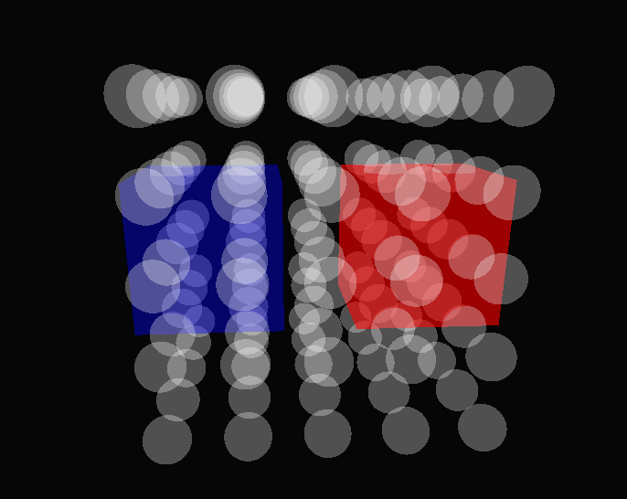
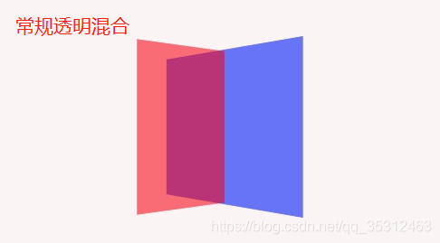
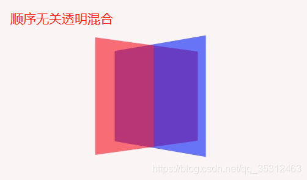
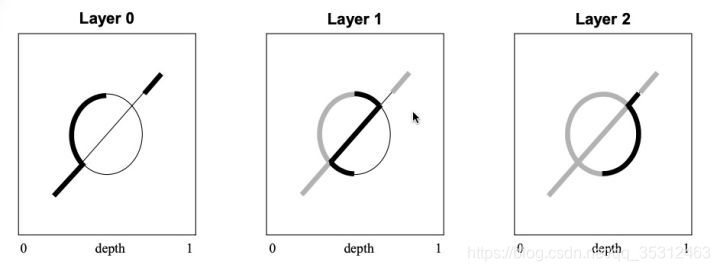
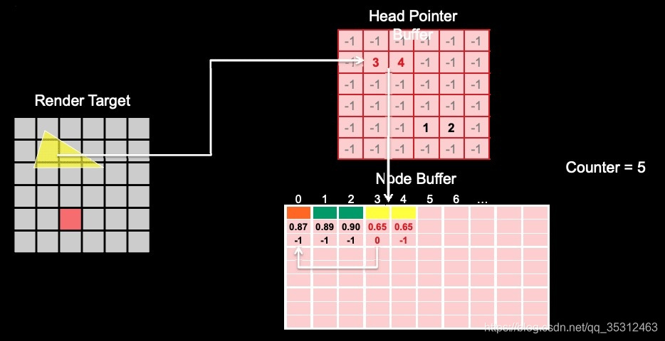
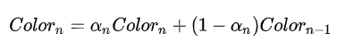
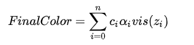
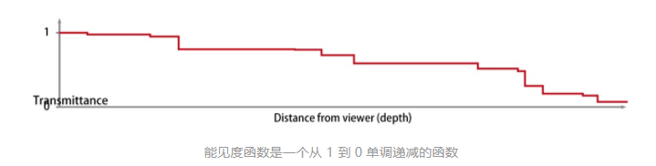
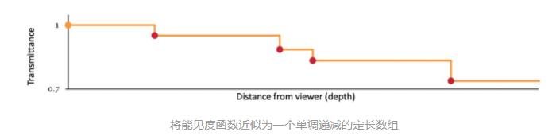

# OIT技术完整指南

## 目录

1. [引言](#引言)
2. [核心问题与挑战](#核心问题与挑战)
3. [传统渲染方法的局限性](#传统渲染方法的局限性)
4. [OIT技术概述](#oit技术概述)
5. [Depth Peeling 深度剥离](#depth-peeling-深度剥离)
6. [Dual Depth Peeling 双深度剥离](#dual-depth-peeling-双深度剥离)
7. [Per-Pixel Linked Lists 逐像素链表](#per-pixel-linked-lists-逐像素链表)
8. [Weighted Blended OIT 加权混合OIT](#weighted-blended-oit-加权混合oit)
9. [Adaptive Transparency 自适应透明度](#adaptive-transparency-自适应透明度)
10. [Stencil Routed A-Buffer 模板路由](#stencil-routed-a-buffer-模板路由)
11. [k-buffer / Multi-fragment Effects](#k-buffer--multi-fragment-effects)
12. [算法全面对比](#算法全面对比)
13. [完整代码实现示例](#完整代码实现示例)
14. [性能优化策略](#性能优化策略)
15. [常见陷阱与解决方案](#常见陷阱与解决方案)
16. [实际应用场景与算法选择](#实际应用场景与算法选择)
17. [调试与验证技巧](#调试与验证技巧)
18. [未来发展方向](#未来发展方向)
19. [参考文献](
---


在实时3D渲染领域，半透明物体的正确渲染一直是一个极具挑战性的问题。传统的透明渲染方法要求严格按照从后到前（back-to-front）的顺序渲染物体，这在复杂场景中往往难以实现，尤其是当半透明物体之间存在交叉、重叠或自纠缠时。

Order-Independent Transparency（OIT，顺序无关透明度）技术正是为解决这一难题而生。OIT技术使得渲染顺序不再影响最终的视觉结果，能够正确处理任意复杂的透明物体配置，包括相互穿透的几何体和大量重叠的透明层。



本指南将系统性地介绍各种OIT算法的原理、实现细节、优缺点以及适用场景，为开发者提供全面的参考。

---


传统透明混合公式：

```
C_final = C_src × α_src + C_dst × (1 - α_src)
```

这个公式是非可交换的（non-commutative），意味着：
- `blend(A, B)` ≠ `blend(B, A)`
- 渲染顺序直接决定最终颜色

**示例分析**：

假设两个半透明物体：
- 物体A（红色，α = 0.5）位于后方
- 物体B（蓝色，α = 0.5）位于前方

正确顺序（先A后B）：
```
C = blend(B, blend(A, background))
C = 0.5 × (0,0,1) + 0.5 × [0.5 × (1,0,0) + 0.5 × bg]
```

错误顺序（先B后A）：
```
C = blend(A, blend(B, background))  // 完全不同的结果！
```




当两个半透明物体在空间中相互交叉时，不存在一个全局的"正确排序"。对于某些像素，物体A在前；对于其他像素，物体B在前。传统排序方法在此完全失效。




复杂的几何体（如螺旋、扭转的形状）可能自身就存在多个透明层相互穿插的情况，这是最极端的挑战。


| 场景类型 | 透明层数量 | 排序可行性 | 推荐方案 |
|---------|-----------|-----------|---------|
| 独立透明物体（< 10） | 少量 | CPU排序可行 | 传统排序或简单OIT |
| 独立透明物体（10-100） | 中等 | CPU排序困难 | Weighted Blended |
| 交叉透明物体 | 变化 | 排序失效 | 必须使用OIT |
| 粒子系统（烟、火） | 极多（>1000） | 完全不可行 | Weighted Blended |
| 复杂几何体（头发、网格） | 极多 | 完全不可行 | Per-Pixel Linked Lists |

---


```
渲染流程：
┌────────────────────────────────────┐
│  CPU端几何排序                      │
│  ↓                                  │
│  计算每个物体到相机的距离           │
│  ↓                                  │
│  按距离从远到近排序                 │
│  ↓                                  │
│  依次渲染（从后到前）               │
└────────────────────────────────────┘
```

**缺点**：
- 排序需要额外CPU时间
- 每帧都需要重新排序（相机移动时）
- 对于动态物体，排序更加复杂


```
交叉情况示意：
     物体A的一部分在前
     ─────────────
          ╲
           ╲ 物体B的一部分在前
            ╲
             ╲
              物体A的另一部分在前

不存在全局排序！
```


当物体距离相近时，深度排序可能产生不稳定的结果：
- 同一物体在相邻帧可能"跳变"顺序
- 导致视觉上的闪烁和伪影


对于大量透明物体：
- 排序复杂度：O(n log n) 或 O(n²)（取决于实现）
- 每帧都需要执行
- 可能成为帧率的瓶颈

---


OIT技术的核心优势：

| 特性 | 传统方法 | OIT方法 |
|------|---------|--------|
| 渲染顺序 | 必须从后到前 | 任意顺序 |
| 交叉物体 | 无法正确处理 | 正确处理 |
| CPU负担 | 排序开销大 | 最小化或消除 |
| 结果精确性 | 取决于排序质量 | 保证正确 |
| 硬件要求 | 低 | 可能需要特定特性 |


```
OIT技术树：
                    OIT技术
                       │
       ┌───────────────┼───────────────┐
       │               │               │
   精确方法         近似方法        混合方法
       │               │               │
   ┌───┼───┐       ┌───┼───┐       ┌───┼───┐
   │   │   │       │   │   │       │   │   │
Depth  PPLL   Stencil  Weighted  Stochastic  Adaptive
Peeling        Routed   Blended  Transparency Transparency

   │
Dual Depth
Peeling
```


**定义**：保证获得与正确排序渲染完全一致的结果

- **Depth Peeling**：迭代剥离深度层
- **Per-Pixel Linked Lists (PPLL)**：存储所有片段后排序
- **Stencil Routed A-Buffer**：使用模板测试路由片段

**特点**：
- 结果精确 = ground truth
- 通常需要更多渲染pass或内存
- 算法复杂度与透明层数量相关


**定义**：使用数学技巧近似正确的透明混合，结果与ground truth有细微差异

- **Weighted Blended OIT**：可交换的加权混合公式
- **Stochastic Transparency**：随机采样透明度

**特点**：
- 单次渲染，性能最优
- 结果通常足够好，视觉上接近精确
- 可能有特定的视觉伪影


**定义**：结合精确和近似方法的优势

- **Adaptive Transparency**：基于能见度函数的自适应混合
- **Multi-layer Weighted Blended**：多层加权混合

**特点**：
- 平衡性能和质量
- 自适应调整策略
- 实现复杂度较高

---


Depth Peeling 由 NVIDIA 于 2001 年提出，是最经典的OIT算法。

**核心思想**：将场景中的透明片段按深度"分层剥离"，逐层提取并混合。

```
深度剥离示意：
相机视角 → ──────────────────────────
              │ Layer 0 (最近)  │  提取
              │ Layer 1        │  提取
              │ Layer 2        │  提取
              │ ...            │
              │ Layer N        │  提取
              │ 不透明背景     │
           ──────────────────────────

每层通过一次渲染pass提取，然后从后到前混合。
```




```glsl
// 第一遍渲染
// 目标：提取最接近相机的透明层

// 深度测试设置
glDepthFunc(GL_LESS);  // 只接受比当前深度更近的片段
glDepthMask(GL_TRUE);  // 写入深度

// 初始深度缓冲区：清空为最大值
clearDepth(1.0);

// 渲染所有透明物体
for each transparent object:
    render();
    // 最近的片段写入深度缓冲区

// 结果：Layer 0 的颜色和深度
```


```glsl
// 后续遍渲染
// 目标：提取下一层（排除已提取的层）

glDepthFunc(GL_LESS);
glDepthMask(GL_TRUE);

// 使用上一层的深度作为"剥离阈值"
bindTexture(previousDepthTexture);

// 片段着色器
void main() {
    float prevDepth = texture(previousDepthTexture, uv).r;

    // 只接受比上一层更远的片段
    if (gl_FragCoord.z <= prevDepth + epsilon) {
        discard;  // 排除已提取的层
    }

    outputColor = fragmentColor;
    outputDepth = gl_FragCoord.z;
}
```


```glsl
// 从最后一层开始，向最前层混合
vec4 finalColor = opaqueBackground;

for (int i = maxLayer - 1; i >= 0; i--) {
    vec4 layerColor = layerTextures[i];
    finalColor = blend(layerColor, finalColor);
    // finalColor = layerColor.rgb * layerColor.a + finalColor.rgb * (1 - layerColor.a)
}
```


设场景中有N个透明片段需要处理：

**每层提取条件**：
```
Layer k 包含的片段满足：
- depth > depth(Layer k-1)  （比上一层更远）
- depth < min({depth未提取片段})  （是剩余片段中最近的）
```

**混合公式**：
```
C_final = Σ_{k=0}^{N-1} [C_k × α_k × Π_{j<k}(1 - α_j)] + C_bg × Π_{k=0}^{N-1}(1 - α_k)
```


| 指标 | 数值/公式 |
|-----|----------|
| 渲染Pass数 | N+1（N为透明层数） |
| 每Pass开销 | O(M)（M为物体数） |
| 总复杂度 | O(N × M) |
| 显存需求 | (N+1) × 屏幕分辨率 × (颜色+深度) |
| 精确度 | 100%（Ground Truth） |

**相对性能**：假设传统渲染为 1x，Depth Peeling 约为 0.1x ~ 0.3x（取决于层数）


✅ **结果精确**：是所有OIT算法的ground truth参考
✅ **实现简单**：算法逻辑清晰，易于理解和实现
✅ **硬件要求低**：只需要基本的深度测试，无需原子操作
✅ **可预测内存**：内存占用可事先确定
✅ **兼容性好**：支持所有主流GPU和图形API


❌ **性能开销大**：层数越多性能越差
❌ **层数限制**：必须预先确定最大层数
❌ **显存占用高**：需要存储多层的颜色和深度
❌ **冗余渲染**：每次pass都渲染所有物体，但只使用一小部分片段


| 场景 | 推荐度 | 说明 |
|-----|-------|------|
| 透明层数 < 8 | ⭐⭐⭐⭐ | 性能可接受 |
| 透明层数 8-16 | ⭐⭐⭐ | 需要权衡性能 |
| 透明层数 > 16 | ⭐⭐ | 可能太慢 |
| 精确渲染需求 | ⭐⭐⭐⭐⭐ | 最佳选择 |
| 移动设备 | ⭐⭐ | 性能受限 |
| 无原子操作支持 | ⭐⭐⭐⭐⭐ | 最佳选择 |


```cpp
class DepthPeelingOIT {
private:
    std::vector<GLuint> depthTextures;
    std::vector<GLuint> colorTextures;
    std::vector<GLuint> framebuffers;
    int maxLayers;
    int width, height;

public:
    void init(int w, int h, int layers) {
        width = w;
        height = h;
        maxLayers = layers;

        // 创建每层的纹理和帧缓冲
        for (int i = 0; i < maxLayers; i++) {
            // 深度纹理
            glGenTextures(1, &depthTextures[i]);
            glBindTexture(GL_TEXTURE_2D, depthTextures[i]);
            glTexImage2D(GL_TEXTURE_2D, 0, GL_DEPTH_COMPONENT24,
                         width, height, 0, GL_DEPTH_COMPONENT, GL_FLOAT, nullptr);
            glTexParameteri(GL_TEXTURE_2D, GL_TEXTURE_MIN_FILTER, GL_NEAREST);
            glTexParameteri(GL_TEXTURE_2D, GL_TEXTURE_MAG_FILTER, GL_NEAREST);

            // 颜色纹理
            glGenTextures(1, &colorTextures[i]);
            glBindTexture(GL_TEXTURE_2D, colorTextures[i]);
            glTexImage2D(GL_TEXTURE_2D, 0, GL_RGBA8,
                         width, height, 0, GL_RGBA, GL_UNSIGNED_BYTE, nullptr);

            // 帧缓冲
            glGenFramebuffers(1, &framebuffers[i]);
            glBindFramebuffer(GL_FRAMEBUFFER, framebuffers[i]);
            glFramebufferTexture2D(GL_FRAMEBUFFER, GL_DEPTH_ATTACHMENT,
                                   GL_TEXTURE_2D, depthTextures[i], 0);
            glFramebufferTexture2D(GL_FRAMEBUFFER, GL_COLOR_ATTACHMENT0,
                                   GL_TEXTURE_2D, colorTextures[i], 0);
        }
    }

    void render() {
        // Pass 0: 提取最前层
        glBindFramebuffer(GL_FRAMEBUFFER, framebuffers[0]);
        glClearDepth(1.0);
        glClear(GL_DEPTH_BUFFER_BIT | GL_COLOR_BUFFER_BIT);

        glDepthFunc(GL_LESS);
        glDepthMask(GL_TRUE);
        glColorMask(GL_TRUE, GL_TRUE, GL_TRUE, GL_TRUE);

        renderTransparentObjects();

        // Pass 1 ~ maxLayers-1: 逐层剥离
        for (int layer = 1; layer < maxLayers; layer++) {
            glBindFramebuffer(GL_FRAMEBUFFER, framebuffers[layer]);
            glClearDepth(1.0);
            glClear(GL_DEPTH_BUFFER_BIT | GL_COLOR_BUFFER_BIT);

            // 绑定上一层的深度作为剥离参考
            glBindTexture(GL_TEXTURE_2D, depthTextures[layer - 1]);

            // 使用剥离着色器
            usePeelingShader();
            setUniform("prevDepthTexture", layer - 1);

            glDepthFunc(GL_LESS);
            renderTransparentObjects();
        }

        // 最终合成
        compositeLayers();
    }

    void compositeLayers() {
        glBindFramebuffer(GL_FRAMEBUFFER, 0);

        useCompositeShader();

        // 绑定所有层的颜色纹理
        for (int i = 0; i < maxLayers; i++) {
            glBindTexture(GL_TEXTURE_2D, colorTextures[i]);
            setUniform("layerColors[" + std::to_string(i) + "]", i);
        }

        // 绘制全屏四边形
        renderFullScreenQuad();
    }
};
```


```glsl

uniform sampler2D prevDepthTexture;

in vec2 uv;
out vec4 fragColor;

void main() {
    float prevDepth = texture(prevDepthTexture, uv).r;

    // 只接受比上一层稍远的片段
    if (gl_FragCoord.z <= prevDepth + 0.0001) {
        discard;
    }

    fragColor = computeFragmentColor();
}
```


```glsl

uniform sampler2D layerColors[MAX_LAYERS];
uniform sampler2D opaqueBackground;
uniform int numLayers;

in vec2 uv;
out vec4 fragColor;

void main() {
    vec4 bg = texture(opaqueBackground, uv);
    vec4 result = bg;

    // 从后到前混合
    for (int i = numLayers - 1; i >= 0; i--) {
        vec4 layerColor = texture(layerColors[i], uv);

        // Porter-Duff "over" 合成
        result.rgb = layerColor.rgb * layerColor.a + result.rgb * (1.0 - layerColor.a);
        result.a = layerColor.a + result.a * (1.0 - layerColor.a);
    }

    fragColor = result;
}
```

---


Dual Depth Peeling 是 NVIDIA 于 2008 年提出的改进算法，通过每次 Pass 同时剥离**最前层**和**最后层**，将渲染 Pass 数减少一半。

```
传统 Depth Peeling:
Pass 0: Layer 0 (最前)
Pass 1: Layer 1
Pass 2: Layer 2
...
Pass N: Layer N (最后)

Dual Depth Peeling:
Pass 0: Layer 0 (最前) + Layer N (最后)
Pass 1: Layer 1 + Layer N-1
Pass 2: Layer 2 + Layer N-2
...
Pass N/2: Layer N/2 (中间)
```


使用两个深度缓冲区：
- **Min Buffer**：存储最接近的深度
- **Max Buffer**：存储最远的深度

```glsl
// 双深度剥离着色器
uniform sampler2D prevMinDepth;
uniform sampler2D prevMaxDepth;

void main() {
    float minDepth = texture(prevMinDepth, uv).r;
    float maxDepth = texture(prevMaxDepth, uv).r;

    float fragDepth = gl_FragCoord.z;

    // 判断片段属于哪一端
    if (fragDepth < minDepth) {
        // 新的最前层
        outputToFrontBuffer();
    } else if (fragDepth > maxDepth) {
        // 新的最后层
        outputToBackBuffer();
    } else {
        // 中间层，等待后续pass处理
        discard;
    }
}
```


| 算法 | Pass数 | 性能提升 |
|-----|-------|---------|
| Depth Peeling | N+1 | 基准 |
| Dual Depth Peeling | (N+1)/2 | 约 2x 提升 |

**注意**：性能提升约为 1.5x ~ 2x，而非完美的 2x，因为每个 Pass 的逻辑更复杂。


```cpp
class DualDepthPeelingOIT {
private:
    GLuint minDepthTextures[2];  // ping-pong
    GLuint maxDepthTextures[2];  // ping-pong
    GLuint frontColorTextures[2];
    GLuint backColorTextures[2];
    GLuint framebuffers[2];

public:
    void render() {
        // 初始化：清空深度
        glBindFramebuffer(GL_FRAMEBUFFER, framebuffers[0]);
        glClearDepth(0.0);  // min depth
        glClear(GL_DEPTH_BUFFER_BIT);

        glBindFramebuffer(GL_FRAMEBUFFER, framebuffers[1]);
        glClearDepth(1.0);  // max depth
        glClear(GL_DEPTH_BUFFER_BIT);

        // 双深度剥离passes
        for (int pass = 0; pass < (maxLayers + 1) / 2; pass++) {
            int read = pass % 2;
            int write = 1 - read;

            glBindFramebuffer(GL_FRAMEBUFFER, framebuffers[write]);

            // 清空颜色缓冲
            GLfloat zero[] = {0, 0, 0, 0};
            glClearBufferfv(GL_COLOR, 0, zero);
            glClearBufferfv(GL_COLOR, 1, zero);

            // 设置双深度剥离着色器
            useDualPeelingShader();
            bindTexture("minDepth", minDepthTextures[read]);
            bindTexture("maxDepth", maxDepthTextures[read]);

            glEnable(GL_BLEND);
            glBlendFuncSeparate(GL_ONE, GL_ONE, GL_ONE, GL_ONE);

            renderTransparentObjects();

            // Ping-pong交换
        }

        // 合成：从后到前混合back层，从前到后混合front层
        composite();
    }
};
```

---


Per-Pixel Linked Lists (PPLL) 由 AMD 于 2010 年提出，是一种基于 GPU 并行链表构建的 OIT 方法。

**核心思想**：为每个像素维护一个链表，存储所有覆盖该像素的透明片段，然后在后处理阶段排序并混合。




```
┌─────────────────────────────────────────────────────┐
│ Head Pointer Buffer (头指针缓冲区)                  │
│ 大小：屏幕分辨率 (width × height)                   │
│ 类型：R32UI (每像素一个32位无符号整数)               │
│ 内容：每像素链表的起始索引                           │
│                                                     │
│ 像素(0,0) → 索引42                                  │
│ 像素(0,1) → 索引17                                  │
│ 像素(0,2) → 索引-1 (空)                             │
│ ...                                                 │
└─────────────────────────────────────────────────────┘

┌─────────────────────────────────────────────────────┐
│ Node Buffer (节点缓冲区)                            │
│ 大小：预估最大节点数 (如 10,000,000)                │
│ 结构：每个节点包含                                  │
│   - vec4 color (RGBA颜色)                           │
│   - float depth (深度值)                            │
│   - uint next (下一个节点索引)                      │
│                                                     │
│ Node[0]:  color=(1,0,0,0.5), depth=0.3, next=42    │
│ Node[1]:  color=(0,0,1,0.3), depth=0.5, next=-1    │
│ Node[2]:  color=(0,1,0,0.7), depth=0.2, next=17    │
│ ...                                                 │
└─────────────────────────────────────────────────────┘

┌─────────────────────────────────────────────────────┐
│ Atomic Counter (原子计数器)                         │
│ 类型：atomic_uint                                   │
│ 功能：分配新节点索引                                │
│                                                     │
│ 当前值：42 → 下一个分配索引为42                     │
│ atomicCounterIncrement() → 返回42，计数器变为43    │
└─────────────────────────────────────────────────────┘
```


```glsl
// 片段着色器 - 构建链表

layout(binding = 0, r32ui) uniform uimage2D headPointers;
layout(binding = 1, rgba32f) uniform imageBuffer nodeBuffer;
layout(binding = 2, offset = 0) uniform atomic_uint nodeCounter;

struct FragmentNode {
    vec4 color;
    float depth;
    uint next;
};

const uint NULL_INDEX = 0xFFFFFFFF;

void main() {
    // 分配新节点
    uint nodeIndex = atomicCounterIncrementARB(nodeCounter);

    if (nodeIndex >= MAX_NODES) {
        // 节点池溢出处理
        discard;
        return;
    }

    // 计算像素索引
    uint pixelIndex = uint(gl_FragCoord.y) * uint(imageSize(headPointers).x)
                      + uint(gl_FragCoord.x);

    // 获取当前链表头（原子交换）
    uint oldHead = imageAtomicExchange(headPointers, ivec2(gl_FragCoord.xy), nodeIndex);

    // 写入节点数据
    // 假设节点缓冲区使用RGBA32F，我们打包数据
    // 节点结构：每个节点占用2个像素的空间
    // [color.r, color.g, color.b, color.a]
    // [depth, next, unused, unused]

    vec4 colorData = vec4(fragColor.rgb, fragColor.a);
    vec4 depthNextData = vec4(gl_FragCoord.z, uintBitsToFloat(oldHead), 0.0, 0.0);

    imageStore(nodeBuffer, int(nodeIndex * 2), colorData);
    imageStore(nodeBuffer, int(nodeIndex * 2 + 1), depthNextData);
}
```


```glsl
// 全屏合成着色器

layout(binding = 0, r32ui) uniform uimage2D headPointers;
layout(binding = 1, rgba32f) uniform imageBuffer nodeBuffer;

const int MAX_FRAGMENTS = 64;  // 每像素最大处理片段数

struct Fragment {
    vec4 color;
    float depth;
};

void main() {
    // 获取链表头
    uint headIndex = imageLoad(headPointers, ivec2(gl_FragCoord.xy)).r;

    // 收集所有片段
    Fragment fragments[MAX_FRAGMENTS];
    int count = 0;

    uint currentIndex = headIndex;
    while (currentIndex != 0xFFFFFFFF && count < MAX_FRAGMENTS) {
        // 读取节点数据
        vec4 colorData = imageLoad(nodeBuffer, int(currentIndex * 2));
        vec4 depthNextData = imageLoad(nodeBuffer, int(currentIndex * 2 + 1));

        fragments[count].color = colorData;
        fragments[count].depth = depthNextData.r;

        currentIndex = floatBitsToUint(depthNextData.g);
        count++;
    }

    if (count == 0) {
        fragColor = texture(opaqueBackground, uv);
        return;
    }

    // 按深度排序（从远到近）
    sortFragments(fragments, count);

    // 从后到前混合
    vec4 result = texture(opaqueBackground, uv);
    for (int i = 0; i < count; i++) {
        vec4 c = fragments[i].color;
        result.rgb = c.rgb * c.a + result.rgb * (1.0 - c.a);
        result.a = c.a + result.a * (1.0 - c.a);
    }

    fragColor = result;
}

// 插入排序（适合小规模）
void sortFragments(Fragment arr[], int n) {
    for (int i = 1; i < n; i++) {
        Fragment key = arr[i];
        int j = i - 1;

        // 按深度从大到小排序（远到近）
        while (j >= 0 && arr[j].depth < key.depth) {
            arr[j + 1] = arr[j];
            j--;
        }
        arr[j + 1] = key;
    }
}
```


| 指标 | 数值 |
|-----|-----|
| 渲染Pass | 2（构建+合成） |
| 构建阶段 | O(M)（M为片段数） |
| 合成阶段 | O(K × log K)（K为每像素片段数） |
| 显存需求 | 头指针：width×height×4字节 + 节点池：预估大小 |
| 精确度 | 100%（Ground Truth） |

**相对性能**：约 0.3x ~ 0.7x（取决于片段密度）


✅ **结果精确**：排序后正确混合
✅ **渲染次数少**：仅需2次Pass
✅ **支持任意层数**：理论上无上限（实际受内存限制）
✅ **GPU高效**：利用GPU并行性构建链表
✅ **灵活性**：可用于其他多片段效果（AOB等）


❌ **需要原子操作**：DX11 SM5.0+，OpenGL 4.2+
❌ **内存不可预测**：节点数量难以预估
❌ **可能溢出**：节点池不足时丢弃片段
❌ **排序开销**：合成阶段需要排序
❌ **移动设备支持差**：很多移动GPU不支持原子操作


```cpp
// Vulkan PPLL实现

class PerPixelLinkedListsOIT_Vulkan {
private:
    VkBuffer headPointerBuffer;
    VkBuffer nodeBuffer;
    VkDeviceMemory headPointerMemory;
    VkDeviceMemory nodeMemory;
    VkDescriptorSetLayout descriptorSetLayout;
    VkPipeline buildPipeline;
    VkPipeline compositePipeline;

    uint32_t maxNodes;

public:
    void init(VkDevice device, VkPhysicalDevice physDevice,
              uint32_t width, uint32_t height, uint32_t maxNodeCount) {
        maxNodes = maxNodeCount;

        // 创建头指针缓冲区
        VkBufferCreateInfo headInfo = {};
        headInfo.sType = VK_STRUCTURE_TYPE_BUFFER_CREATE_INFO;
        headInfo.size = width * height * sizeof(uint32_t);
        headInfo.usage = VK_BUFFER_USAGE_STORAGE_BUFFER_BIT;
        headInfo.sharingMode = VK_SHARING_MODE_EXCLUSIVE;

        vkCreateBuffer(device, &headInfo, nullptr, &headPointerBuffer);

        // 分配内存
        VkMemoryRequirements memReq;
        vkGetBufferMemoryRequirements(device, headPointerBuffer, &memReq);

        VkMemoryAllocateInfo allocInfo = {};
        allocInfo.sType = VK_STRUCTURE_TYPE_MEMORY_ALLOCATE_INFO;
        allocInfo.allocationSize = memReq.size;
        allocInfo.memoryTypeIndex = findMemoryType(physDevice, memReq.memoryTypeBits,
                                                    VK_MEMORY_PROPERTY_DEVICE_LOCAL_BIT);

        vkAllocateMemory(device, &allocInfo, nullptr, &headPointerMemory);
        vkBindBufferMemory(device, headPointerBuffer, headPointerMemory, 0);

        // 创建节点缓冲区（结构：color + depth + next）
        // 每节点：vec4(16字节) + float(4字节) + uint(4字节) = 24字节
        VkBufferCreateInfo nodeInfo = {};
        nodeInfo.sType = VK_STRUCTURE_TYPE_BUFFER_CREATE_INFO;
        nodeInfo.size = maxNodes * 24;
        nodeInfo.usage = VK_BUFFER_USAGE_STORAGE_BUFFER_BIT;
        nodeInfo.sharingMode = VK_SHARING_MODE_EXCLUSIVE;

        vkCreateBuffer(device, &nodeInfo, nullptr, &nodeBuffer);
        // ... 分配内存 ...
    }

    void render(VkCommandBuffer cmdBuffer) {
        // Pass 1: 清空缓冲区
        clearBuffers(cmdBuffer);

        // Pass 2: 构建链表
        vkCmdBindPipeline(cmdBuffer, VK_PIPELINE_BIND_POINT_GRAPHICS, buildPipeline);
        vkCmdBindDescriptorSets(cmdBuffer, VK_PIPELINE_BIND_POINT_GRAPHICS,
                                pipelineLayout, 0, 1, &descriptorSet, 0, nullptr);
        renderTransparentObjects(cmdBuffer);

        // Pass 3: 合成
        vkCmdBindPipeline(cmdBuffer, VK_PIPELINE_BIND_POINT_GRAPHICS, compositePipeline);
        renderFullScreenQuad(cmdBuffer);
    }
};
```


```glsl

layout(binding = 0) buffer HeadPointerBuffer {
    uint heads[];
};

layout(binding = 1) buffer NodeBuffer {
    vec4 colors[];
    float depths[];
    uint nexts[];
};

layout(binding = 2) buffer AtomicCounter {
    uint counter;
};

layout(location = 0) in vec4 inColor;
layout(location = 0) out vec4 outColor;

const uint NULL_POINTER = 0xFFFFFFFF;

void main() {
    // 分配节点索引（原子操作）
    uint nodeIndex = atomicAdd(counter, 1);

    if (nodeIndex >= MAX_NODES) {
        return;  // 溢出
    }

    uint pixelIndex = uint(gl_FragCoord.y) * uint(width) + uint(gl_FragCoord.x);

    // 原子交换头指针
    uint oldHead = atomicExchange(heads[pixelIndex], nodeIndex);

    // 存储节点数据
    colors[nodeIndex] = inColor;
    depths[nodeIndex] = gl_FragCoord.z;
    nexts[nodeIndex] = oldHead;
}
```

---


Weighted Blended OIT 由 McGuire 和 Bavoil 于 2013 年提出，是一种不需要排序的近似 OIT 方法。

**核心数学思想**：将传统的不可交换混合公式转换为可交换的加权平均形式。


```
传统 Porter-Duff "over" 操作：
C_result = C_src × α_src + C_dst × (1 - α_src)

这个公式不满足交换律：
blend(A blend(B bg)) ≠ blend(B blend(A bg))

原因：每个片段的贡献取决于"已有"的累积透明度
```


使用加权平均公式，使其可交换：

```
加权累积：
C_accum = Σ (C_i × w_i × α_i)
A_accum = Σ (w_i × α_i)

最终颜色：
C_final = C_accum / A_accum

其中权重函数：
w(z, α) = α × f(z)
```

**关键洞察**：
- 权重函数 w(z, α) 只依赖于片段自身的属性
- 不依赖于其他片段
- 因此加法操作是可交换的


权重函数需要满足：
1. **单调性**：更近的片段权重更大
2. **有限性**：权重值在合理范围内
3. **平滑性**：避免突跳


```glsl
// 方案1：深度加权（McGuire原始）
float weight(float alpha, float depth) {
    // 深度范围 [0, 1]，越近越小
    // 使用 (1 - z)^n 形式
    float w = alpha * pow(1.0 - depth, exponent);
    return clamp(w, minWeight, maxWeight);
}

// 方案2：线性深度加权
float weight(float alpha, float linearDepth) {
    float w = alpha * max(1e-2, 1.0 / (linearDepth + 1e-4));
    return w;
}

// 方案3：指数加权（更强的深度区分）
float weight(float alpha, float depth) {
    float w = alpha * pow(10.0, -depth * 5.0);
    return clamp(w, 1e-5, 1e5);
}

// 方案4：视野深度加权（考虑相机距离）
float weight(float alpha, float viewZ) {
    float w = alpha * clamp(0.03 / (1e-5 + abs(viewZ) * 0.01), 1e-2, 3e3);
    return w;
}
```


| 场景类型 | 推荐权重函数 | exponent参数 |
|---------|-------------|-------------|
| 粒子系统（烟、火） | 方案1 | 3.0 |
| 玻璃、水面 | 方案2 | N/A |
| 头发、网格 | 方案3 | N/A |
| 一般透明物体 | 方案4 | N/A |


只需要两个渲染目标：

```
┌────────────────────────────────────────────┐
│ Accumulation Buffer (累积缓冲区)           │
│ 格式：RGBA16F 或 RGBA32F                   │
│ 存储：Σ(C_i × w_i × α_i) 在 RGB通道        │
│       Σ(w_i × α_i) 在 A通道                │
└────────────────────────────────────────────┘

┌────────────────────────────────────────────┐
│ Revealage Buffer (揭示缓冲区)              │
│ 格式：R8 或 R16F                           │
│ 存储：背景可见度                           │
│       Π(1 - α_i) 的近似                    │
└────────────────────────────────────────────┘
```


```glsl

uniform float weightExponent = 3.0;

layout(location = 0) out vec4 accumBuffer;
layout(location = 1) out float revealageBuffer;

in vec4 fragColor;

void main() {
    float alpha = fragColor.a;
    float depth = gl_FragCoord.z;

    // 计算权重
    float weight = alpha * pow(1.0 - depth, weightExponent);

    // 累积颜色（预乘权重）
    accumBuffer = vec4(fragColor.rgb * alpha * weight, alpha * weight);

    // 累积揭示度（背景可见度）
    revealageBuffer = alpha;
}
```


```cpp
// OpenGL 混合配置
glEnable(GL_BLEND);

// 累积缓冲：加法混合
glBlendFunci(0, GL_ONE, GL_ONE);  // RGB+A都加法
glBlendEquationi(0, GL_FUNC_ADD);

// 揭示缓冲：乘法混合
glBlendFunci(1, GL_ZERO, GL_ONE_MINUS_SRC_ALPHA);
glBlendEquationi(1, GL_FUNC_ADD);
```


```glsl

uniform sampler2D accumTexture;
uniform sampler2D revealageTexture;
uniform sampler2D opaqueBackground;

in vec2 uv;
out vec4 fragColor;

void main() {
    vec4 accum = texture(accumTexture, uv);
    float revealage = texture(revealageTexture, uv).r;

    // 归一化加权颜色
    vec3 avgColor = accum.rgb / max(accum.a, 1e-5);

    // 背景颜色
    vec3 bgColor = texture(opaqueBackground, uv).rgb;

    // 合成：透明颜色 + 背景
    vec3 finalColor = avgColor * (1.0 - revealage) + bgColor * revealage;

    fragColor = vec4(finalColor, 1.0);
}
```


设场景有 N 个透明片段，按深度从远到近排列为 z₁ < z₂ < ... < z_N

**传统正确混合**：
```
C = C_N α_N + C_{N-1} α_{N-1} (1-α_N) + ... + C_bg Π(1-α_i)
```

**加权混合近似**：
```
设权重 w_i = α_i × f(z_i)

累积：Σ w_i C_i, Σ w_i

近似结果：Σ w_i C_i / Σ w_i
```


加权混合的误差来源：
1. 忽略了片段之间的遮挡关系
2. 假设权重可以"替代"正确的顺序

**误差范围**：
- 对于均匀分布的透明物体，误差通常 < 5%
- 对于极端情况（如一个完全不透明物体在一个几乎透明的物体后面），误差可能 > 20%

**但是**：对于大多数游戏和实时应用，误差在视觉上可以接受。


| 指标 | 数值 |
|-----|-----|
| 渲染Pass | 2（累积+合成） |
| 混合操作 | 加法（高度并行） |
| 显存需求 | 2个渲染目标（极小） |
| 精确度 | 近似（通常足够好） |

**相对性能**：约 1.0x（与传统渲染相当）


✅ **性能最优**：接近传统渲染速度
✅ **内存最小**：仅需2个纹理
✅ **无排序开销**：完全避免排序
✅ **硬件要求低**：只需要基本的混合操作
✅ **兼容性极佳**：支持所有平台
✅ **平滑过渡**：无突跳伪影
✅ **移动设备友好**：最佳选择


❌ **近似结果**：非精确
❌ **权重调优**：需要针对场景调整
❌ **特定场景误差大**：极端透明度配置可能有问题
❌ **可能颜色偏离**：覆盖率可能不精确


```cpp
class WeightedBlendedOIT {
private:
    GLuint accumTexture;
    GLuint revealageTexture;
    GLuint framebuffer;
    GLuint compositeProgram;
    GLuint accumulateProgram;

    float weightExponent = 3.0f;

public:
    void init(int width, int height) {
        // 创建累积纹理（RGBA16F）
        glGenTextures(1, &accumTexture);
        glBindTexture(GL_TEXTURE_2D, accumTexture);
        glTexImage2D(GL_TEXTURE_2D, 0, GL_RGBA16F,
                     width, height, 0, GL_RGBA, GL_FLOAT, nullptr);
        glTexParameteri(GL_TEXTURE_2D, GL_TEXTURE_MIN_FILTER, GL_NEAREST);
        glTexParameteri(GL_TEXTURE_2D, GL_TEXTURE_MAG_FILTER, GL_NEAREST);

        // 创建揭示纹理（R8）
        glGenTextures(1, &revealageTexture);
        glBindTexture(GL_TEXTURE_2D, revealageTexture);
        glTexImage2D(GL_TEXTURE_2D, 0, GL_R8,
                     width, height, 0, GL_RED, GL_UNSIGNED_BYTE, nullptr);

        // 创建帧缓冲
        glGenFramebuffers(1, &framebuffer);
        glBindFramebuffer(GL_FRAMEBUFFER, framebuffer);
        glFramebufferTexture2D(GL_FRAMEBUFFER, GL_COLOR_ATTACHMENT0,
                               GL_TEXTURE_2D, accumTexture, 0);
        glFramebufferTexture2D(GL_FRAMEBUFFER, GL_COLOR_ATTACHMENT1,
                               GL_TEXTURE_2D, revealageTexture, 0);

        GLenum drawBuffers[] = {GL_COLOR_ATTACHMENT0, GL_COLOR_ATTACHMENT1};
        glDrawBuffers(2, drawBuffers);

        if (glCheckFramebufferStatus(GL_FRAMEBUFFER) != GL_FRAMEBUFFER_COMPLETE) {
            std::cerr << "Framebuffer incomplete!" << std::endl;
        }

        // 加载着色器程序
        compositeProgram = loadShader("composite.glsl");
        accumulateProgram = loadShader("accumulate.glsl");
    }

    void beginAccumulation() {
        glBindFramebuffer(GL_FRAMEBUFFER, framebuffer);

        // 清空累积缓冲（零）
        GLfloat zero[] = {0.0f, 0.0f, 0.0f, 0.0f};
        glClearBufferfv(GL_COLOR, 0, zero);

        // 清空揭示缓冲（一）
        GLfloat one[] = {1.0f};
        glClearBufferfv(GL_COLOR, 1, one);

        // 配置混合
        glEnable(GL_BLEND);
        glBlendFuncSeparatei(0, GL_ONE, GL_ONE, GL_ONE, GL_ONE);
        glBlendFuncSeparatei(1, GL_ZERO, GL_ONE_MINUS_SRC_COLOR,
                             GL_ZERO, GL_ONE_MINUS_SRC_COLOR);

        glUseProgram(accumulateProgram);
        glUniform1f(glGetUniformLocation(accumulateProgram, "weightExponent"),
                    weightExponent);

        glDepthMask(GL_FALSE);  // 透明物体不写深度
        glEnable(GL_DEPTH_TEST);
        glDepthFunc(GL_LEQUAL);
    }

    void endAccumulationAndComposite() {
        glDepthMask(GL_TRUE);
        glDisable(GL_BLEND);

        // 合成
        glBindFramebuffer(GL_FRAMEBUFFER, 0);
        glUseProgram(compositeProgram);

        // 绑定纹理
        glActiveTexture(GL_TEXTURE0);
        glBindTexture(GL_TEXTURE_2D, accumTexture);
        glUniform1i(glGetUniformLocation(compositeProgram, "accumTexture"), 0);

        glActiveTexture(GL_TEXTURE1);
        glBindTexture(GL_TEXTURE_2D, revealageTexture);
        glUniform1i(glGetUniformLocation(compositeProgram, "revealageTexture"), 1);

        glActiveTexture(GL_TEXTURE2);
        glBindTexture(GL_TEXTURE_2D, opaqueSceneTexture);
        glUniform1i(glGetUniformLocation(compositeProgram, "opaqueBackground"), 2);

        renderFullScreenQuad();
    }
};
```

---


Adaptive Transparency 由 Intel 于 2011 年提出，是对 Weighted Blended 的改进，通过引入**能见度函数（Visibility Function）**来获得更精确的结果。




**定义**：能见度函数 vis(z) 表示深度 z 处的光线透过率。

```
vis(z) ∈ [0, 1]
vis(z) = 1  → 完全可见
vis(z) = 0  → 完全被遮挡

性质：单调递减函数
```




传统混合：
```
C_final = Σ C_i × α_i × Π_{j<i} (1 - α_j)
```

自适应混合（使用能见度）：
```
C_final = Σ C_i × (vis(z_i) - vis(z_{i+1}))
```

**关键洞察**：如果能见度函数已知，可以精确计算每个片段的贡献，无需排序！


能见度函数 vis(z) 需要从所有片段的透明度推导：
```
vis(z) = Π_{片段 j 在 z 之后} (1 - α_j)
```

但片段顺序未知！


将能见度函数表示为**固定长度的单调递减数组**：

```glsl
// 能见度函数近似：存储K个关键点
struct ApproxVisibility {
    float depths[K];    // 深度值（递增）
    float visibilities[K];  // 能见度（递减）
};

// 例如 K=4
ApproxVisibility vis = {
    depths: [0.1, 0.3, 0.5, 0.9],
    visibilities: [0.8, 0.5, 0.3, 0.1]
};
```




**Pass 1**：构建Per-Pixel Linked Lists（与PPLL相同）

**Pass 2**：读取链表 → 构建能见度函数 → 混合

```glsl
// Pass 2 着色器
void main() {
    // 收集所有片段
    collectFragments();

    // 按深度排序
    sortFragments();

    // 构建能见度函数
    ApproxVisibility vis = buildVisibilityFunction();

    // 使用能见度函数混合
    vec4 finalColor = blendWithVisibility(vis);

    fragColor = finalColor;
}
```


理论上可以单Pass完成，但受限于：
1. framebuffer位宽不足
2. GPU并行片段无法原子构建单调递减函数




```glsl

const int K = 8;  // 能见度函数关键点数

struct VisibilityPoint {
    float depth;
    float vis;
};

// 构建能见度函数
VisibilityPoint[K] buildVisibilityFunction(Fragment[] fragments, int count) {
    VisibilityPoint[K] vis;

    // 按深度排序片段（从远到近）
    sortFragments(fragments, count);

    // 初始化能见度函数
    float cumulativeVis = 1.0;

    for (int i = 0; i < K && i < count; i++) {
        vis[i].depth = fragments[i].depth;
        vis[i].vis = cumulativeVis;

        // 更新累积能见度
        cumulativeVis *= (1.0 - fragments[i].color.a);
    }

    return vis;
}

// 使用能见度函数混合
vec4 blendWithVisibility(VisibilityPoint[K] vis, Fragment[] fragments, int count) {
    vec4 result = vec4(0.0);

    for (int i = 0; i < count; i++) {
        float fragDepth = fragments[i].depth;
        float fragAlpha = fragments[i].color.a;
        vec3 fragColor = fragments[i].color.rgb;

        // 在能见度函数中查找
        float visBefore = lookupVisibility(vis, fragDepth);
        float visAfter = visBefore * (1.0 - fragAlpha);

        // 片段贡献
        float contribution = visBefore - visAfter;
        result.rgb += fragColor * contribution;
    }

    // 背景贡献
    float bgVis = lookupVisibility(vis, 1.0);
    result.rgb += backgroundColor * bgVis;

    return result;
}

// 在能见度函数中查找（线性插值）
float lookupVisibility(VisibilityPoint[K] vis, float depth) {
    for (int i = 0; i < K - 1; i++) {
        if (depth >= vis[i].depth && depth <= vis[i+1].depth) {
            float t = (depth - vis[i].depth) / (vis[i+1].depth - vis[i].depth);
            return mix(vis[i].vis, vis[i+1].vis, t);
        }
    }
    return vis[K-1].vis;
}
```


| 指标 | 数值 |
|-----|-----|
| 渲染Pass | 2（与PPLL相同） |
| 内存需求 | 链表 + 能见度函数 |
| 精确度 | 高（背景覆盖率精确） |
| 排序开销 | 需要（但比PPLL轻） |

**相对性能**：约 0.5x ~ 0.7x


✅ **比Weighted Blended更精确**
✅ **背景覆盖率精确**
✅ **能见度函数可复用**


❌ **仍需链表结构**
❌ **实现复杂**
❌ **硬件要求与PPLL相同**

---


Stencil Routed A-Buffer 使用**模板缓冲区**将片段路由到不同的渲染层。

**核心思想**：利用模板测试将同一像素的不同片段分配到不同的缓冲区层。

```
模板路由示意：

像素有多个片段 → 模板测试 → 路由到不同层

Stencil Value = 0 → Layer 0
Stencil Value = 1 → Layer 1
Stencil Value = 2 → Layer 2
...
```


```cpp
void renderStencilRoutedOIT() {
    // 清空所有层缓冲区
    for (int layer = 0; layer < MAX_LAYERS; layer++) {
        clearLayerBuffer(layer);
    }

    // Pass 1: 路由片段到各层
    glEnable(GL_STENCIL_TEST);

    for (int layer = 0; layer < MAX_LAYERS; layer++) {
        // 设置模板条件
        glStencilFunc(GL_EQUAL, layer, 0xFF);
        glStencilOp(GL_INCR, GL_INCR, GL_INCR);  // 递增

        // 渲染到对应层
        glBindFramebuffer(GL_FRAMEBUFFER, layerFramebuffer[layer]);
        renderTransparentObjects();
    }

    glDisable(GL_STENCIL_TEST);

    // Pass 2: 合成各层（从后到前）
    vec4 result = opaqueBackground;
    for (int layer = MAX_LAYERS - 1; layer >= 0; layer--) {
        vec4 layerColor = readLayerBuffer(layer);
        result = blend(layerColor, result);
    }
}
```


| 指标 | 数值 |
|-----|-----|
| 渲染Pass | N（N为层数） |
| 精确度 | 100% |
| 硬件要求 | 需要模板缓冲支持 |

**相对性能**：约 0.3x ~ 0.7x

---


k-buffer 是一种固定大小的每像素缓冲区，存储每个像素的前 k 个片段。

```glsl
struct KBuffer {
    struct Fragment {
        vec4 color;
        float depth;
    } fragments[K];
};

KBuffer pixelBuffer[width × height];
```


```glsl

const int K = 8;

layout(binding = 0) buffer KBufferData {
    vec4 colors[K * width * height];
    float depths[K * width * height];
};

void main() {
    uint pixelBase = uint(gl_FragCoord.y) * width * K + uint(gl_FragCoord.x) * K;

    float newDepth = gl_FragCoord.z;
    vec4 newColor = fragColor;

    // 插入排序到k-buffer
    for (int i = 0; i < K; i++) {
        float existingDepth = depths[pixelBase + i];

        if (newDepth < existingDepth || existingDepth == 0.0) {
            // 插入位置找到，依次交换
            for (int j = K - 1; j > i; j--) {
                colors[pixelBase + j] = colors[pixelBase + j - 1];
                depths[pixelBase + j] = depths[pixelBase + j - 1];
            }

            colors[pixelBase + i] = newColor;
            depths[pixelBase + i] = newDepth;
            break;
        }
    }
}
```

---


| 算法 | 相对性能 | 内存占用 | 精确度 | 硬件要求 | 渲染Pass数 | 适用场景 |
|------|---------|---------|--------|---------|-----------|---------|
| 传统排序 | 1.0x | 最低 | 取决排序 | ⭐⭐⭐⭐⭐ | 1 | 简单场景 |
| Depth Peeling | 0.1-0.3x | 高 | 100% | ⭐⭐⭐⭐⭐ | N+1 | 精确渲染、层数少 |
| Dual Depth Peeling | 0.15-0.5x | 高 | 100% | ⭐⭐⭐⭐⭐ | (N+1)/2 | 精确渲染、改进版 |
| Per-Pixel Linked Lists | 0.3-0.7x | 高（可变） | 100% | ⭐⭐⭐ | 2 | 大量透明层 |
| Weighted Blended OIT | 1.0x | 最低 | ~90% | ⭐⭐⭐⭐⭐ | 2 | 所有场景、性能优先 |
| Adaptive Transparency | 0.5-0.7x | 中等 | ~95% | ⭐⭐⭐ | 2 | 需要更精确结果 |
| Stencil Routed | 0.3-0.7x | 中等 | 100% | ⭐⭐⭐⭐⭐ | N | 无原子操作支持 |
| k-buffer | 0.5-0.8x | 固定 | 取决K | ⭐⭐⭐⭐ | 1 | 固定层数上限 |
| Stochastic Transparency | 0.8x | 低 | 随机 | ⭐⭐⭐⭐ | 1 | 特殊效果 |


```
精确度 vs 性能权衡图：

精确度
100% │ ┌───Depth Peeling
     │ │    Dual DP
     │ │    PPLL
 95% │ │      Adaptive
     │ │
 90% │ │         Weighted Blended
     │ │
     │ │
     │ │
     │ │
     │ │
     └───────────────────────────── 性能
         0.1x    0.5x    0.8x    1.0x

最佳平衡点：Weighted Blended OIT
```


```
是否需要精确结果？
├─ 是 → 是否有原子操作支持？
│       ├─ 是 → Per-Pixel Linked Lists
│       │       或 Dual Depth Peeling（层数少时）
│       └─ 否 → Stencil Routed A-Buffer
│               或 Depth Peeling（层数少时）
│
└─ 否（近似可接受）→ Weighted Blended OIT
                    （最佳性能选择）
```

---


```cpp
#include <memory>

class OITFramework {
public:
    enum class Algorithm {
        DEPTH_PEELING,
        DUAL_DEPTH_PEELING,
        PER_PIXEL_LINKED_LISTS,
        WEIGHTED_BLENDDED,
        ADAPTIVE_TRANSPARENCY,
        STENCIL_ROUTED,
        K_BUFFER
    };

private:
    Algorithm currentAlgorithm;
    std::unique_ptr<DepthPeelingOIT> depthPeeling;
    std::unique_ptr<DualDepthPeelingOIT> dualDepthPeeling;
    std::unique_ptr<PerPixelLinkedListsOIT> ppll;
    std::unique_ptr<WeightedBlendedOIT> weightedBlended;
    std::unique_ptr<AdaptiveTransparencyOIT> adaptiveTransparency;
    std::unique_ptr<StencilRoutedOIT> stencilRouted;
    std::unique_ptr<KBufferOIT> kBuffer;

    int width, height;

public:
    void init(int w, int h, Algorithm algo) {
        width = w;
        height = h;
        currentAlgorithm = algo;

        switch (algo) {
            case Algorithm::DEPTH_PEELING:
                depthPeeling = std::make_unique<DepthPeelingOIT>();
                depthPeeling->init(w, h, 8);  // 8层
                break;

            case Algorithm::PER_PIXEL_LINKED_LISTS:
                ppll = std::make_unique<PerPixelLinkedListsOIT>();
                ppll->init(w, h, 10000000);  // 10M节点
                break;

            case Algorithm::WEIGHTED_BLENDDED:
                weightedBlended = std::make_unique<WeightedBlendedOIT>();
                weightedBlended->init(w, h);
                break;

            // ... 其他算法初始化 ...
        }
    }

    void render(std::function<void()> renderOpaqueCallback,
                std::function<void()> renderTransparentCallback) {
        // 先渲染不透明物体
        glBindFramebuffer(GL_FRAMEBUFFER, opaqueFramebuffer);
        glClear(GL_COLOR_BUFFER_BIT | GL_DEPTH_BUFFER_BIT);
        renderOpaqueCallback();

        // 根据算法渲染透明物体
        switch (currentAlgorithm) {
            case Algorithm::DEPTH_PEELING:
                depthPeeling->render(renderTransparentCallback);
                break;

            case Algorithm::WEIGHTED_BLENDDED:
                weightedBlended->beginAccumulation();
                renderTransparentCallback();
                weightedBlended->endAccumulationAndComposite();
                break;

            // ... 其他算法渲染 ...
        }
    }

    void setAlgorithm(Algorithm algo) {
        currentAlgorithm = algo;
        // 可能需要重新初始化
    }
};
```


```glsl
// accumulate.glsl - 累积阶段

uniform float weightExponent = 3.0;
uniform vec3 cameraPos;

layout(location = 0) out vec4 accumColor;
layout(location = 1) out float revealage;

in vec3 worldPos;
in vec4 fragColor;
in vec3 normal;

void main() {
    vec4 color = fragColor;
    float alpha = color.a;

    // 计算线性深度（更准确的权重）
    vec3 viewPos = (viewMatrix * vec4(worldPos, 1.0)).xyz;
    float linearDepth = abs(viewPos.z);

    // 权重函数（McGuire推荐）
    float weight = clamp(
        pow(alpha / 0.03, 4.0) +
        pow(1.0 / (1e-4 + linearDepth), 4.0),
        1e-2, 3e3
    );

    // 存储预乘alpha的颜色
    accumColor = vec4(color.rgb * alpha, alpha) * weight;

    // 揭示度（背景可见性）
    revealage = color.a;
}
```

```glsl
// composite.glsl - 合成阶段

uniform sampler2D accumTexture;
uniform sampler2D revealageTexture;
uniform sampler2D opaqueTexture;

in vec2 uv;
out vec4 fragColor;

void main() {
    vec4 accum = texture(accumTexture, uv);
    float revealage = texture(revealageTexture, uv).r;

    // 归一化颜色
    float avgAlpha = accum.a / max(accum.a, 1e-4);
    vec3 avgColor = accum.rgb / max(accum.a, 1e-4);

    // 背景颜色
    vec3 bgColor = texture(opaqueTexture, uv).rgb;

    // 最终合成
    // 透明部分 + 背景 × 揭示度
    vec3 transparentColor = avgColor * avgAlpha;
    vec3 finalColor = transparentColor + bgColor * revealage;

    fragColor = vec4(finalColor, 1.0);
}
```

---


```cpp
// 在渲染透明物体前，先渲染不透明物体填充深度缓冲
renderOpaqueObjects();

// 透明物体可以利用已有深度做early-z剔除
glEnable(GL_DEPTH_TEST);
glDepthFunc(GL_LEQUAL);  // 只渲染不比不透明物体远的片段
glDepthMask(GL_FALSE);   // 不写深度（保持不透明物体深度）
```


```cpp
// 合并相似透明物体
glBindVertexArray(combinedVAO);
glDrawArraysInstanced(GL_TRIANGLES, 0, vertexCount, instanceCount);

// 减少draw call
```


```cpp
// 只渲染在视锥内的透明物体
for (auto& obj : transparentObjects) {
    if (frustum.contains(obj.boundingBox)) {
        obj.render();
    }
}
```


```cpp
// 远处的透明物体使用简化几何
float distance = camera.distanceTo(obj.position);
if (distance > farThreshold) {
    obj.renderLOD(2);  // 低细节
} else if (distance > mediumThreshold) {
    obj.renderLOD(1);  // 中细节
} else {
    obj.renderLOD(0);  // 高细节
}
```


```cpp
// 预计算权重表（减少着色器计算）
std::vector<float> weightTable(256);

for (int i = 0; i < 256; i++) {
    float depth = i / 255.0f;
    weightTable[i] = pow(1.0f - depth, weightExponent);
}

// 着色器中使用纹理查找
uniform sampler1D weightTable;
float weight = texture(weightTable, depth).r;
```


```cpp
// 使用RGBA16F而非RGBA32F（节省带宽）
glTexImage2D(GL_TEXTURE_2D, 0, GL_RGBA16F, width, height,
             0, GL_RGBA, GL_HALF_FLOAT, nullptr);
```


```cpp
// 根据场景分析预分配合适的节点数量
int estimateNodeCount(int width, int height, Scene& scene) {
    float avgFragmentsPerPixel = scene.getAverageTransparentOverdraw();
    return width * height * avgFragmentsPerPixel * 1.2f;  // 20%余量
}
```


```glsl
// 利用共享内存加速排序（计算着色器）
layout(local_size_x = 16, local_size_y = 16) in;

shared Fragment localFragments[16 * 16 * MAX_FRAGMENTS];

void main() {
    // 先加载到共享内存
    // ...

    // 在共享内存中排序
    sortInSharedMemory();

    // 写出结果
    // ...
}
```

---


**症状**：透明区域颜色异常（过亮或过暗）

**原因**：权重函数选择不当或精度问题

**解决方案**：
```glsl
// 使用clamp限制权重范围
float weight = clamp(computedWeight, 1e-5, 1e5);

// 使用16位或32位浮点缓冲
glTexImage2D(..., GL_RGBA16F, ...);
```


**症状**：相近深度片段出现闪烁

**解决方案**：
```glsl
// 使用线性深度而非屏幕深度
float linearDepth = length(viewPos);
// 或使用对数深度
float logDepth = log(1.0 + linearDepth);
```


**症状**：PPLL渲染不完整

**解决方案**：
```cpp
// 监控节点使用量
GLuint nodeCount;
glGetBufferSubData(nodeCounterBuffer, 0, sizeof(GLuint), &nodeCount);

if (nodeCount > maxNodes * 0.9) {
    // 动态扩大节点池或简化场景
    increaseNodePool();
}
```


**症状**：透明物体后的背景完全不可见或过于可见

**解决方案**：
```glsl
// 确保揭示缓冲正确初始化和混合
glClearBufferfv(GL_COLOR, 1, one);  // 初始化为1

glBlendFunci(1, GL_ZERO, GL_ONE_MINUS_SRC_ALPHA);  // 正确的乘法混合
```

---


| 场景 | 推荐算法 | 替代方案 | 说明 |
|-----|---------|---------|-----|
| 粒子系统（烟/火） | Weighted Blended | 无 | 大量小粒子，性能关键 |
| 玻璃/水面 | Weighted Blended | Depth Peeling | 平滑效果重要 |
| 头发/毛发 | Per-Pixel Linked Lists | Adaptive | 大量细密层 |
| UI透明效果 | Weighted Blended | k-buffer | 简单场景 |
| 植物叶片 | Weighted Blended | 无 | 大量交叉 |


| 场景 | 推荐算法 | 说明 |
|-----|---------|-----|
| 医学影像（3D） | Depth Peeling | 精确层级重要 |
| 流体可视化 | Adaptive Transparency | 复杂体积 |
| 地质数据 | Per-Pixel Linked Lists | 多层交叉 |


| 平台 | 推荐算法 | 禁用算法 |
|-----|---------|---------|
| 高端PC (DX12/Vulkan) | Per-Pixel Linked Lists | 无 |
| 中端PC (DX11/GL4) | Weighted Blended / PPLL | 无 |
| 移动设备 (OpenGL ES 3) | Weighted Blended | PPLL |
| Web (WebGL 1) | Weighted Blended（简化） | PPLL/原子操作 |
| Web (WebGL 2) | Weighted Blended | PPLL |

---


```glsl
// 显示每个像素的片段数量
int fragmentCount = countFragments();
fragColor = vec4(fragmentCount / maxFragments, 0, 0, 1);
```


```glsl
// 显示权重分布
fragColor = vec4(weight / maxWeight, weight / maxWeight, 0, 1);
```


```glsl
// 绘制能见度曲线
for (int i = 0; i < K; i++) {
    plot(vis[i].depth, vis[i].visibility);
}
```


| 工具 | 用途 |
|-----|-----|
| NVIDIA Nsight | GPU时间分析、内存分析 |
| AMD Radeon GPU Profiler | AMD GPU分析 |
| Intel GPA | Intel GPU分析 |
| RenderDoc | 帧捕获、着色器调试 |
| PIX (Windows) | DirectX调试 |


```
1. 验证不透明场景正确渲染
   ↓
2. 确认透明物体单独渲染正确
   ↓
3. 启用OIT，检查中间缓冲区
   ↓
4. 对比ground truth（Depth Peeling结果）
   ↓
5. 调整权重函数或参数
   ↓
6. 性能分析和优化
```

---


1. **专用OIT硬件单元**：未来GPU可能集成专门的透明处理单元
2. **更高效的原子操作**：减少原子操作开销
3. **Mesh Shader集成**：利用mesh shader预排序


1. **机器学习权重函数**：使用ML自动优化权重
2. **混合自适应策略**：动态切换算法
3. **与延迟渲染集成**：更适合现代渲染管线


1. **VR/AR**：低延迟OIT需求
2. **云渲染**：服务器端OIT优化
3. **实时全局光照**：透明物体GI

---


1. McGuire, M., & Bavoil, L. (2013). "Weighted Blended Order-Independent Transparency". Journal of Computer Graphics Techniques.
   - Weighted Blended OIT原始论文

2. Everitt, C. (2001). "Interactive Order-Independent Transparency". NVIDIA.
   - Depth Peeling原始论文

3. Bavoil, L., & Myers, K. (2008). "Order Independent Transparency with Dual Depth Peeling". NVIDIA.
   - Dual Depth Peeling改进

4. Salvi, M., & Vidimče, K. (2011). "Adaptive Transparency". Intel.
   - Adaptive Transparency原始论文

5. Yang, J., et al. (2010). "Real-time Concurrent Linked List Construction on the GPU". AMD.
   - Per-Pixel Linked Lists技术

6. Carpenter, L. (1984). "The A-buffer, an antialiased hidden surface method". Pixar.
   - A-Buffer原始概念


- NVIDIA Developer: https://developer.nvidia.com/
- Khronos OpenGL/Vulkan: https://www.khronos.org/
- AMD GPUOpen: https://gpuopen.com/
- Intel Graphics: https://software.intel.com/


1. 理解Porter-Duff合成公式
2. 实现简单Depth Peeling
3. 研究Weighted Blended权重函数
4. 实现Per-Pixel Linked Lists
5. 对比各算法性能和质量

---

*文档版本：2.0（整合版）*
*最后更新：2026年5月*
*涵盖算法：8种主要OIT方法*
*代码示例：GLSL, OpenGL, Vulkan*
