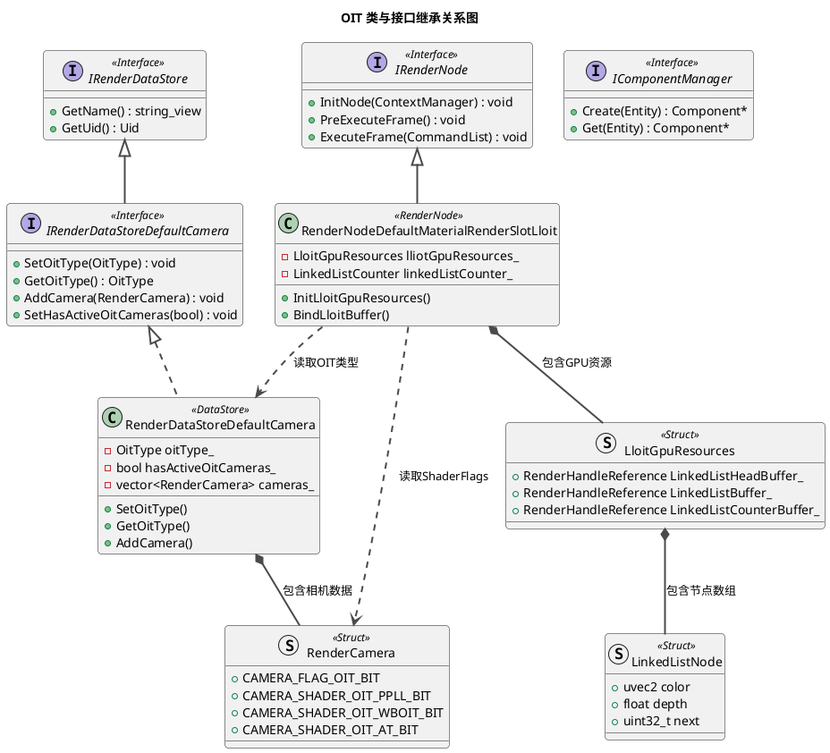
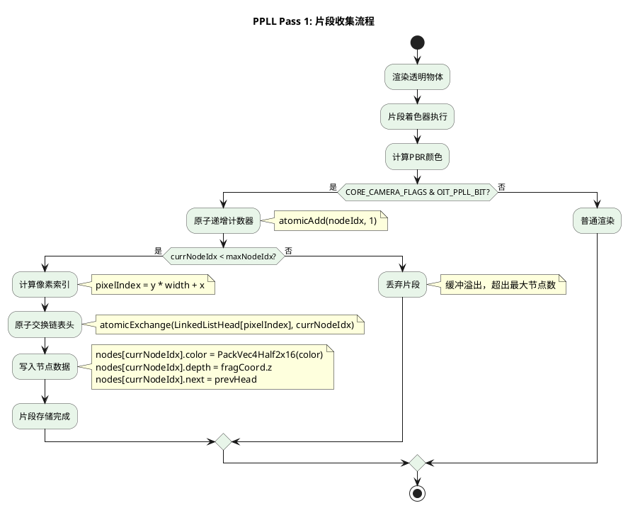

# OIT AGP 3D 引擎 OIT（顺序无关透明）详细设计文档

**文档版本**: v2.0
**创建日期**: 2026-05-14
**所属项目**: OpenHarmony AGP 3D 引擎
**模块路径**: lume/Lume_3D

---

## 目录

- [1. ECS组件设计](#1-ecs组件设计)
  - [1.1 RenderConfigurationComponent（OIT配置入口）](#11-renderconfigurationcomponentoit配置入口)
  - [1.2 CameraComponent（OIT管线标志）](#12-cameracomponentoit管线标志)
  - [1.3 MaterialComponent（OIT材质标志）](#13-materialcomponentoit材质标志)
- [2. 渲染数据存储](#2-渲染数据存储)
  - [2.1 IRenderDataStoreDefaultCamera（OIT类型管理接口）](#21-irenderdatastoredefaultcameraoit类型管理接口)
  - [2.2 RenderDataStoreDefaultCamera（实现）](#22-renderdatastoredefaultcamera实现)
  - [2.3 RenderCamera（OIT标志位与ShaderFlags）](#23-rendercameraoit标志位与shaderflags)
- [3. 渲染节点](#3-渲染节点)
  - [3.1 RenderNodeDefaultMaterialRenderSlotLloit（LLOIT节点）](#31-rendernodedefaultmaterialrenderslotlloitlloit节点)
  - [3.2 内部数据结构](#32-内部数据结构)
  - [3.3 核心方法](#33-核心方法)
  - [3.4 类与接口继承关系](#34-类与接口继承关系)
- [4. 着色器数据结构](#4-着色器数据结构)
  - [4.1 DefaultOitLinkedListNodeStruct（GPU链表节点）](#41-defaultoitlinkedlistnodestructgpu链表节点)
  - [4.2 LinkedListCounter（原子计数器）](#42-linkedlistcounter原子计数器)
  - [4.3 SSBO布局定义](#43-ssbo布局定义)
  - [4.4 LLOIT片段着色器（Pass 1）](#44-lloit片段着色器pass-1)
  - [4.5 WBOIT片段着色器（MRT输出）](#45-wboit片段着色器mrt输出)
- [5. 内存分析](#5-内存分析)
- [6. 算法详解](#6-算法详解)
  - [6.1 PPLL（Per-Pixel Linked List）](#61-ppllper-pixel-linked-list)
  - [6.2 WBOIT（Weighted Blended OIT）](#62-wboitweighted-blended-oit)
  - [6.3 AT（Adaptive Transparency）](#63-atadaptive-transparency)
- [7. 算法选择与决策](#7-算法选择与决策)
- [8. 边界情况与错误处理](#8-边界情况与错误处理)
- [9. 实现细节](#9-实现细节)
- [10. OIT执行总流程](#10-oit执行总流程)
- [11. 性能优化策略](#11-性能优化策略)
- [12. 调试工具与验证](#12-调试工具与验证)
- [13. 参考资料](#13-参考资料)

---

# 1. ECS组件设计

## 1.1 RenderConfigurationComponent（OIT配置入口）

**类定义**：

```cpp
// 路径: lume/Lume_3D/api/3d/ecs/components/render_configuration_component.h
// UUID: 7e655b3d-3cad-40b9-8179-c749be17f60b

class RenderConfigurationComponent {
public:
    enum class SceneShadowType : uint8_t {
        PCF = 0,
        VSM = 1,
        VARIABLE_PCF = 2,
    };

    enum class SceneShadowQuality : uint8_t {
        LOW = 0,
        NORMAL = 1,
        HIGH = 2,
        ULTRA = 3,
    };

    enum class SceneShadowSmoothness : uint8_t {
        HARD = 0,
        NORMAL = 1,
        SOFT = 2,
    };

    enum class SceneOitType : uint8_t {
        PPLL = 0,    // Per-Pixel Linked List
        WBOIT = 1,   // Weighted Blended OIT (默认)
        AT = 2,      // Adaptive Transparency
    };

    enum SceneRenderingFlagBits : uint8_t {
        CREATE_RNGS_BIT = (1 << 0),
    };
    using SceneRenderingFlags = uint8_t;

    // 属性定义（通过DEFINE_PROPERTY宏）
    CORE_NS::Entity environment;                             // 环境组件实体
    CORE_NS::Entity fog;                                     // 雾组件实体
    SceneShadowType shadowType;                              // 阴影类型（PCF/VSM/VARIABLE_PCF）
    float vpcfRadius;                                        // Variable PCF半径
    uint32_t vpcfSampleCount;                                // Variable PCF采样数
    SceneShadowQuality shadowQuality;                        // 阴影质量（LOW/NORMAL/HIGH/ULTRA）
    SceneShadowSmoothness shadowSmoothness;                  // 阴影平滑度（HARD/NORMAL/SOFT）
    SceneOitType oitType;                                    // OIT算法类型（默认：WBOIT）
    SceneRenderingFlags renderingFlags;                      // 渲染标志位
    BASE_NS::string customRenderNodeGraphFile;               // 自定义渲染节点图文件
    BASE_NS::string customPostSceneRenderNodeGraphFile;      // 自定义后处理渲染节点图文件
};
```

### 关键设计要点

1. **X-macro模式**：使用 `BEGIN_COMPONENT` → `DEFINE_PROPERTY` → `END_COMPONENT` 定义组件
2. **枚举内嵌**：`SceneOitType` 枚举定义在组件内部，避免全局命名污染
3. **默认值**：`oitType` 默认为 `SceneOitType::WBOIT`，性能最优
4. **UUID唯一性**：每个组件有唯一UUID用于运行时类型识别

---

## 1.2 CameraComponent（OIT管线标志）

**类定义**：

```cpp
// 路径: lume/Lume_3D/api/3d/ecs/components/camera_component.h
// UUID: 184c996b-67aa-4456-9f03-72e2d968931b

class CameraComponent {
public:
    enum SceneFlagBits : uint32_t {
        ACTIVE_RENDER_BIT = (1 << 0),
        MAIN_CAMERA_BIT = (1 << 1),
    };

    enum PipelineFlagBits : uint32_t {
        CLEAR_DEPTH_BIT = (1 << 0),
        CLEAR_COLOR_BIT = (1 << 1),
        MSAA_BIT = (1 << 2),
        ALLOW_COLOR_PRE_PASS_BIT = (1 << 3),
        FORCE_COLOR_PRE_PASS_BIT = (1 << 4),
        HISTORY_BIT = (1 << 5),
        JITTER_BIT = (1 << 6),
        VELOCITY_OUTPUT_BIT = (1 << 7),
        DEPTH_OUTPUT_BIT = (1 << 8),
        MULTI_VIEW_ONLY_BIT = (1 << 9),
        // (1 << 10) empty
        DISALLOW_REFLECTION_BIT = (1 << 11),
        CUBEMAP_BIT = (1 << 12),
        OIT_BIT = (1 << 13),           // OIT启用标志
    };

    enum class Projection : uint8_t {
        ORTHOGRAPHIC = 0,
        PERSPECTIVE = 1,
        FRUSTUM = 2,
        CUSTOM = 3,
    };

    enum class Culling : uint8_t {
        VIEW_FRUSTUM = 0,
        SCREEN_SIZE = 1,
    };

    enum class RenderingPipeline : uint8_t {
        LIGHT_FORWARD = 0,
        FORWARD = 1,
        DEFERRED = 2,
        CUSTOM = 3,
    };

    struct TargetUsage {
        uint32_t flags { 0u };
        BASE_NS::string targetName;
    };

    enum class SampleCount : uint8_t {
        SAMPLE_COUNT_1 = 1,
        SAMPLE_COUNT_2 = 2,
        SAMPLE_COUNT_4 = 4,
        SAMPLE_COUNT_8 = 8,
    };

    // 核心属性
    float screenPercentage;                                  // 下采样百分比（默认1.0）
    Projection projection;                                   // 投影类型（默认PERSPECTIVE）
    Culling culling;                                         // 剔除类型（默认VIEW_FRUSTUM）
    RenderingPipeline renderingPipeline;                     // 渲染管线（默认FORWARD）
    uint32_t sceneFlags;                                     // 场景标志位
    uint32_t pipelineFlags;                                  // 管线标志位（包含OIT_BIT）

    float aspect;                                            // 宽高比（默认-1）
    float yFov;                                              // 垂直视场角（默认60°×DEG2RAD）
    float xMag;                                              // 正交X缩放
    float yMag;                                              // 正交Y缩放
    float zNear;                                             // 近裁剪面（默认0.3）
    float zFar;                                              // 远裁剪面（默认1000）

    BASE_NS::Math::Vec4 viewport;                            // 视口[x, y, width, height]
    BASE_NS::Math::Vec4 scissor;                             // 剪裁[x, y, width, height]
    BASE_NS::Math::UVec2 renderResolution;                   // 渲染分辨率[width, height]

    BASE_NS::Math::Mat4X4 customProjectionMatrix;            // 自定义投影矩阵
    BASE_NS::Math::Vec4 clearColorValue;                     // 清屏颜色
    float clearDepthValue;                                   // 清屏深度（默认1.0）

    CORE_NS::Entity environment;                             // 环境实体
    CORE_NS::Entity fog;                                     // 雾实体
    CORE_NS::Entity postProcess;                             // 后处理实体

    uint64_t layerMask;                                      // 层掩码

    CORE_NS::Entity prePassCamera;                           // 预通道相机
    CORE_NS::EntityReference customDepthTarget;              // 自定义深度目标
    BASE_NS::vector<CORE_NS::EntityReference> customColorTargets; // 自定义颜色目标

    TargetUsage depthTargetCustomization;                    // 深度目标定制
    BASE_NS::vector<TargetUsage> colorTargetCustomization;   // 颜色目标定制

    CORE_NS::EntityReference customRenderNodeGraph;          // 自定义渲染节点图
    BASE_NS::string customRenderNodeGraphFile;               // 自定义渲染节点图文件
    BASE_NS::vector<CORE_NS::Entity> multiViewCameras;       // 多视角相机

    SampleCount msaaSampleCount;                             // MSAA采样数
};
```

### OIT关键设计

1. **OIT_BIT标志**：`PipelineFlagBits::OIT_BIT = (1 << 13)`，标记相机启用OIT
2. **管线兼容**：OIT兼容所有渲染管线（LIGHT_FORWARD、FORWARD、DEFERRED）
3. **分辨率控制**：`renderResolution` 决定OIT缓冲区大小
4. **MSAA**：WBOIT支持MSAA，PPLL/AT不支持

---

## 1.3 MaterialComponent（OIT材质标志）

**类定义**：

```cpp
// 路径: lume/Lume_3D/api/3d/ecs/components/material_component.h
// UUID: 56430c14-cb12-4320-80d3-2bef4f86a041

class MaterialComponent {
public:
    enum class Type : uint8_t {
        METALLIC_ROUGHNESS = 0,     // 金属-粗糙度工作流
        SPECULAR_GLOSSINESS = 1,    // 高光-光泽度工作流
        UNLIT = 2,                  // 无光照
        UNLIT_SHADOW_ALPHA = 3,     // 无光照阴影接收
        CUSTOM = 4,                 // 自定义材质
        CUSTOM_COMPLEX = 5,         // 复杂自定义材质
        OCCLUSION = 6,              // 遮挡材质
    };

    enum LightingFlagBits : uint32_t {
        SHADOW_RECEIVER_BIT = (1 << 0),
        SHADOW_CASTER_BIT = (1 << 1),
        PUNCTUAL_LIGHT_RECEIVER_BIT = (1 << 2),
        INDIRECT_LIGHT_RECEIVER_BIT = (1 << 3),
        INDIRECT_IRRADIANCE_LIGHT_RECEIVER_BIT = (1 << 4),
    };
    using LightingFlags = uint32_t;

    enum ExtraRenderingFlagBits : uint32_t {
        DISCARD_BIT = (1 << 0),
        DISABLE_BIT = (1 << 1),
        ALLOW_GPU_INSTANCING_BIT = (1 << 2),
        CAMERA_EFFECT = (1 << 3),
        IGNORE_SPECULAR_FACTOR_TEXTURE = (1 << 4),
        IGNORE_SPECULAR_COLOR_TEXTURE = (1 << 5),
    };

    enum TextureIndex : uint8_t {
        BASE_COLOR = 0,
        NORMAL = 1,
        MATERIAL = 2,              // 材质纹理（粗糙度/金属度）
        EMISSIVE = 3,              // 自发光纹理
        AO = 4,                    // 环境光遮蔽纹理
        CLEARCOAT = 5,
        CLEARCOAT_ROUGHNESS = 6,
        CLEARCOAT_NORMAL = 7,
        SHEEN = 8,
        TRANSMISSION = 9,          // 传输纹理（透明材质）
        SPECULAR = 10,
        TEXTURE_COUNT = 11,
    };

    struct TextureInfo {
        CORE_NS::EntityReference image;      // 图像实体
        CORE_NS::EntityReference sampler;    // 采样器实体
        BASE_NS::Math::Vec4 factor;          // 因子值
        TextureTransform transform;           // 纹理变换
    };

    struct TextureTransform {
        BASE_NS::Math::Vec2 translation;     // 平移
        float rotation;                       // 旋转
        BASE_NS::Math::Vec2 scale;           // 缩放
    };

    struct RenderSort {
        uint8_t renderSortLayer;             // 渲染层ID（0-63，默认32）
        uint8_t renderSortLayerOrder;        // 层内顺序（0-255）
    };

    struct Shader {
        CORE_NS::EntityReference shader;         // 着色器实体
        CORE_NS::EntityReference graphicsState;  // 图形状态实体
    };

    Type type;                                                // 材质类型
    float alphaCutoff;                                        // Alpha裁剪阈值（默认1.0）
    LightingFlags materialLightingFlags;                      // 光照标志位
    Shader materialShader;                                    // 材质着色器
    Shader depthShader;                                       // 深度着色器
    ExtraRenderingFlags extraRenderingFlags;                  // 额外渲染标志

    TextureInfo textures[TextureIndex::TEXTURE_COUNT];        // 纹理数组（11个纹理）

    uint32_t useTexcoordSetBit;                               // 纹理坐标集标志
    uint32_t customRenderSlotId;                              // 自定义渲染槽ID（~0u：默认）

    BASE_NS::vector<CORE_NS::EntityReference> customResources;
    CORE_NS::IPropertyHandle* customProperties;
    CORE_NS::IPropertyHandle* customBindingProperties;

    RenderSort renderSort;                                    // 渲染排序
};
```

### OIT材质设计要点

1. **透明材质**：`Type::METALLIC_ROUGHNESS` 或 `Type::SPECULAR_GLOSSINESS` 配合 alpha blend
2. **Alpha裁剪**：`alphaCutoff < 1.0` 时启用Alpha测试
3. **纹理因子**：`TextureInfo::factor` 的 alpha 通道控制透明度
4. **渲染槽**：`customRenderSlotId` 可强制透明材质渲染到特定槽

---

# 2. 渲染数据存储

## 2.1 IRenderDataStoreDefaultCamera（OIT类型管理接口）

**接口定义**：

```cpp
// 路径: lume/Lume_3D/api/3d/render/intf_render_data_store_default_camera.h
// UID: 9a13e890-2a33-4b45-beee-be39eaecce57

class IRenderDataStoreDefaultCamera : public RENDER_NS::IRenderDataStore {
public:
    enum class OitType : uint8_t {
        PPLL = 0,    // Per-Pixel Linked List
        WBOIT = 1,   // Weighted Blended OIT (默认)
        AT = 2,      // Adaptive Transparency
    };

    // OIT核心接口
    virtual void SetOitType(const OitType& oitType) = 0;
    virtual OitType GetOitType() const = 0;
    virtual void SetHasActiveOitCameras(const bool hasActiveOitCameras) = 0;
    virtual bool GetHasActiveOitCameras() const = 0;

    // 相机管理接口
    virtual void AddCamera(const RenderCamera& camera) = 0;
    virtual BASE_NS::array_view<const RenderCamera> GetCameras() const = 0;
    virtual RenderCamera GetCamera(const BASE_NS::string_view name) const = 0;
    virtual RenderCamera GetCamera(const uint64_t id) const = 0;
    virtual uint32_t GetCameraIndex(const BASE_NS::string_view name) const = 0;
    virtual uint32_t GetCameraIndex(const uint64_t id) const = 0;
    virtual uint32_t GetCameraCount() const = 0;

    // 环境管理接口
    virtual void AddEnvironment(const RenderCamera::Environment& environment) = 0;
    virtual BASE_NS::array_view<const RenderCamera::Environment> GetEnvironments() const = 0;
    virtual RenderCamera::Environment GetEnvironment(const uint64_t id) const = 0;
    virtual uint32_t GetEnvironmentCount() const = 0;
    virtual bool HasBlendEnvironments() const = 0;
    virtual uint32_t GetEnvironmentIndex(const uint64_t id) const = 0;

protected:
    IRenderDataStoreDefaultCamera() = default;
};
```

### 关键设计要点

1. **接口抽象**：继承 `IRenderDataStore` 基类，统一数据存储接口
2. **OIT类型管理**：`SetOitType()` 和 `GetOitType()` 提供运行时OIT算法切换
3. **OIT相机检测**：`hasActiveOitCameras` 标识场景中是否有激活的OIT相机
4. **相机集合**：支持多相机管理，通过名称或ID查询

---

## 2.2 RenderDataStoreDefaultCamera（实现）

**类定义**：

```cpp
// 路径: lume/Lume_3D/src/render/datastore/render_data_store_default_camera.h

class RenderDataStoreDefaultCamera final : public IRenderDataStoreDefaultCamera {
public:
    static constexpr const char* const TYPE_NAME = "RenderDataStoreDefaultCamera";

    // IRenderDataStore接口实现
    const BASE_NS::string_view GetTypeName() const override;
    BASE_NS::string_view GetName() const override;
    const BASE_NS::Uid& GetUid() const override;

    // 引用计数（线程安全）
    void Ref() override;
    void Unref() override;
    uint32_t GetRefCount() const override;

    // 生命周期
    void PreRender() override;
    void PostRender() override;
    void Clear() override;
    RENDER_NS::RenderDataFlags GetFlags() const override;

    // OIT接口实现
    void SetOitType(const OitType& oitType) override;
    OitType GetOitType() const override;
    void SetHasActiveOitCameras(const bool hasActiveOitCameras) override;
    bool GetHasActiveOitCameras() const override;

    // 相机管理实现
    void AddCamera(const RenderCamera& camera) override;
    BASE_NS::array_view<const RenderCamera> GetCameras() const override;
    // ... 其他接口实现

private:
    const BASE_NS::string name_;
    BASE_NS::vector<RenderCamera> cameras_;
    OitType oitType_ { OitType::WBOIT };
    bool hasActiveOitCameras_ { false };
    BASE_NS::vector<RenderCamera::Environment> environments_;
    bool hasBlendEnvironments_ { false };
    std::atomic_int32_t refcnt_ { 0 };
};
```

### 设计要点

1. **数据存储**：使用 `vector` 存储相机和环境数据，线性搜索查找
2. **OIT检测**：`hasActiveOitCameras_` 由外部通过 `SetHasActiveOitCameras()` 设置，`AddCamera()` 内部不包含OIT检测逻辑
3. **默认值**：`oitType_` 默认为 `WBOIT`
4. **线程安全**：`std::atomic_int32_t` 实现引用计数；接口声明 "Not internally synchronized"，调用者需保证同步

---

## 2.3 RenderCamera（OIT标志位与ShaderFlags）

**结构体定义**：

```cpp
// 路径: lume/Lume_3D/api/3d/render/render_data_defines_3d.h

struct RenderCamera {
    enum CameraFlagBits : uint32_t {
        CAMERA_FLAG_CLEAR_DEPTH_BIT = (1 << 0),
        CAMERA_FLAG_CLEAR_COLOR_BIT = (1 << 1),
        CAMERA_FLAG_SHADOW_BIT = (1 << 2),
        CAMERA_FLAG_MSAA_BIT = (1 << 3),
        CAMERA_FLAG_REFLECTION_BIT = (1 << 4),
        CAMERA_FLAG_MAIN_BIT = (1 << 5),
        CAMERA_FLAG_COLOR_PRE_PASS_BIT = (1 << 6),
        CAMERA_FLAG_OPAQUE_BIT = (1 << 7),
        CAMERA_FLAG_HISTORY_BIT = (1 << 8),
        CAMERA_FLAG_JITTER_BIT = (1 << 9),
        CAMERA_FLAG_OUTPUT_VELOCITY_NORMAL_BIT = (1 << 10),
        CAMERA_FLAG_INVERSE_WINDING_BIT = (1 << 11),
        CAMERA_FLAG_OUTPUT_DEPTH_BIT = (1 << 12),
        CAMERA_FLAG_CUSTOM_TARGETS_BIT = (1 << 13),
        CAMERA_FLAG_MULTI_VIEW_ONLY_BIT = (1 << 14),
        CAMERA_FLAG_ENVIRONMENT_PROJECTION_BIT = (1 << 15),
        CAMERA_FLAG_ALLOW_REFLECTION_BIT = (1 << 16),
        CAMERA_FLAG_CUBEMAP_BIT = (1 << 17),
        CAMERA_FLAG_POST_PROCESS_EFFECTS_BIT = (1 << 18),
        CAMERA_FLAG_OIT_BIT = (1 << 19),         // OIT启用标志
    };
    using Flags = uint32_t;

    enum ShaderFlagBits : uint32_t {
        CAMERA_SHADER_FOG_BIT = (1 << 0),
        CAMERA_SHADER_VELOCITY_OUT_BIT = (1 << 1),
        CAMERA_SHADER_OIT_PPLL_BIT = (1 << 2),   // PPLL着色器标志
        CAMERA_SHADER_OIT_WBOIT_BIT = (1 << 3),   // WBOIT着色器标志
        CAMERA_SHADER_OIT_AT_BIT = (1 << 4),       // AT着色器标志
    };
    using ShaderFlags = uint32_t;

    struct Matrices {
        BASE_NS::Math::Mat4X4 view;
        BASE_NS::Math::Mat4X4 proj;
        BASE_NS::Math::Mat4X4 viewPrevFrame;
        BASE_NS::Math::Mat4X4 projPrevFrame;
        BASE_NS::Math::Mat4X4 envProj;
    };

    // 核心数据
    uint64_t id;
    uint64_t shadowId;
    uint64_t layerMask;
    uint64_t mainCameraId;

    Matrices matrices;

    BASE_NS::Math::Vec4 viewport;
    BASE_NS::Math::Vec4 scissor;
    BASE_NS::Math::UVec2 renderResolution;

    float screenPercentage;
    float zNear;
    float zFar;

    RENDER_NS::RenderHandleReference depthTarget;
    RENDER_NS::RenderHandleReference colorTargets[8];

    Flags flags;                                // 相机标志位
    ShaderFlags shaderFlags;                    // 着色器标志位（包含OIT shader flags）

    uint32_t sceneId;
    uint32_t reflectionId;
    RenderPipelineType renderPipelineType;
    ClearDepthStencilValue clearDepthStencil;
    ClearColorValue clearColorValues;
    CameraCullType cullType;
    SampleCountFlags msaaSampleCountFlags;

    Environment environment;
    Fog fog;

    RenderHandleReference customRenderNodeGraph;
    BASE_NS::string customRenderNodeGraphFile;
    BASE_NS::string customPostProcessRenderNodeGraphFile;

    TargetUsage depthTargetCustomization;
    TargetUsage colorTargetCustomization[8];

    BASE_NS::fixed_string<...> name;
    BASE_NS::fixed_string<...> postProcessName;

    uint32_t multiViewCameraCount;
    uint64_t multiViewCameraIds[7];
    uint64_t multiViewCameraHash;
    uint64_t multiViewParentCameraId;
};
```

### OIT关键设计

1. **CAMERA_FLAG_OIT_BIT**：相机级别OIT启用标志 `(1 << 19)`
2. **ShaderFlags**：GPU着色器级别的OIT算法标志（PPLL/WBOIT/AT）
3. **renderResolution**：决定GPU缓冲区大小
4. **renderPipelineType**：兼容LIGHT_FORWARD/FORWARD/DEFERRED
5. **msaaSampleCountFlags**：WBOIT支持MSAA，PPLL/AT不支持

### ShaderFlags传递流程

```
RenderConfigurationComponent::SceneOitType
  → RenderSystem读取
  → RenderCamera::ShaderFlags
      PPLL  → CAMERA_SHADER_OIT_PPLL_BIT  = (1 << 2)
      WBOIT → CAMERA_SHADER_OIT_WBOIT_BIT = (1 << 3)
      AT    → CAMERA_SHADER_OIT_AT_BIT    = (1 << 4)
  → 着色器SpecializationConstants (constant_id = 4)
  → GPU着色器 CORE_CAMERA_FLAGS
```

---

# 3. 渲染节点

## 3.1 RenderNodeDefaultMaterialRenderSlotLloit（LLOIT节点）

**类定义**：

```cpp
// 路径: lume/Lume_3D/src/render/node/render_node_default_material_render_slot_lloit.h
// UID: 7e5b62c0-eb9f-4c39-a012-640052c7146b

class RenderNodeDefaultMaterialRenderSlotLloit final : public RENDER_NS::IRenderNode {
public:
    static constexpr BASE_NS::Uid UID { "7e5b62c0-eb9f-4c39-a012-640052c7146b" };
    static constexpr const char* const TYPE_NAME = "RenderNodeDefaultMaterialRenderSlotLloit";
    static constexpr uint32_t MAX_FRAGMENT_COUNT { 16u };
    static constexpr uint64_t INVALID_NODE_IDX { 0xFFFFFFFFu };
    static constexpr uint32_t LLOIT_SET { 3u };

    // OIT核心数据结构
    struct LinkedListNode {
        uvec2 color;        // RGBA16压缩颜色（PackVec4Half2x16）
        float depth;        // 片段深度值
        uint32_t next;      // 下一个节点索引
    };

    struct LinkedListCounter {
        uint32_t nodeIdx { 0u };      // 当前节点索引（原子递增）
        uint32_t maxNodeIdx { 0u };   // 最大节点索引（缓冲大小）
    };

    struct LloitGpuResources {
        RENDER_NS::RenderHandleReference LinkedListHeadBuffer_;
        RENDER_NS::RenderHandleReference LinkedListBuffer_;
        RENDER_NS::RenderHandleReference LinkedListCounterBuffer_;
        uint32_t imgResX { 0u };
        uint32_t imgResY { 0u };
        uint32_t maxNodeCount { 0u };
    };

    // IRenderNode接口实现
    void InitNode(RENDER_NS::IRenderNodeContextManager& renderNodeContextMgr) override;
    void PreExecuteFrame() override;
    void ExecuteFrame(RENDER_NS::IRenderCommandList& cmdList) override;

    // OIT核心方法
    void InitLloitGpuResources(const uint32_t width, const uint32_t height);
    void RecreateLloitGpuResources();
    void UpdateLloitGpuResources(RENDER_NS::IRenderCommandList& cmdList);
    void BindLloitBuffer(RENDER_NS::IRenderCommandList& cmdList);
    void UpdateAndBindLloitSet(RENDER_NS::IRenderCommandList& cmdList);

private:
    LloitGpuResources lliotGpuResources_;
    LinkedListCounter linkedListCounter_;
    RENDER_NS::IDescriptorSetBinder::Ptr oneFrameBinder_;
    bool mapBufferAfterCreate_ { true };

    struct StagingBuffers {
        RENDER_NS::RenderHandleReference srcHandle;
        RENDER_NS::RenderHandleReference dstHandle;
        uint32_t beginIndex { 0U };
        uint32_t count { 0U };
        BASE_NS::vector<uint8_t> stagingData;
        uint32_t stagingBufferByteOffset { 0U };
    };

    mutable std::mutex mutex_;
    BASE_NS::vector<RENDER_NS::BufferCopy> stagingBufferCopies_;
    BASE_NS::vector<StagingBuffers> stagingBufferToBuffer_;
    BASE_NS::vector<RENDER_NS::RenderHandleReference> stagingGpuBuffers_;

    RENDER_NS::IRenderNodeContextManager* renderNodeContextMgr_ { nullptr };

    struct CurrentScene {
        SceneRenderCameraData camData;
        RENDER_NS::RenderHandle cameraEnvRadianceHandle;
        RENDER_NS::ViewportDesc viewportDesc;
        RENDER_NS::ScissorDesc scissorDesc;
        RENDER_NS::RenderHandle prePassColorTarget;
        bool hasShadow { false };
        IRenderDataStoreDefaultLight::ShadowTypes shadowTypes {};
        IRenderDataStoreDefaultLight::LightingFlags lightingFlags { 0u };
        RenderCamera::ShaderFlags cameraShaderFlags { 0u };
        BASE_NS::vector<uint32_t> mvCameraIndices;
    };

    CurrentScene currentScene_;
    SceneRenderDataStores stores_;

    struct AllShaderData {
        BASE_NS::vector<PerShaderData> perShaderData;
        BASE_NS::unordered_map<uint64_t, uint32_t> shaderIdToData;
        bool slotHasShaders { false };
        RENDER_NS::RenderHandle defaultShaderHandle;
        RENDER_NS::RenderHandle defaultStateHandle;
        RENDER_NS::RenderHandle defaultPlHandle;
        RENDER_NS::RenderHandle defaultVidHandle;
        RENDER_NS::PipelineLayout defaultPipelineLayout;
        RENDER_NS::PipelineLayout defaultTmpPipelineLayout;
        BASE_NS::vector<RENDER_NS::ShaderSpecialization::Constant> defaultSpecializationConstants;
        bool defaultPlSet3 { false };
    };

    AllShaderData allShaderData_;
};
```

---

## 3.2 内部数据结构

### LinkedListNode（链表节点）

```cpp
// 路径: render_node_default_material_render_slot_lloit.h:97-101

struct LinkedListNode {
    uvec2 color;        // RGBA16压缩颜色（2个uint32_t）
    float depth;        // 片段深度值（1个float）
    uint32_t next;      // 下一个节点索引（1个uint32_t）
};
// sizeof(LinkedListNode) = 16 bytes
```

### LinkedListCounter（原子计数器）

```cpp
// 路径: render_node_default_material_render_slot_lloit.h:102-105

struct LinkedListCounter {
    uint32_t nodeIdx { 0u };      // 当前节点索引（原子递增）
    uint32_t maxNodeIdx { 0u };   // 最大节点索引（缓冲大小）
};
// sizeof(LinkedListCounter) = 8 bytes
```

### LloitGpuResources（GPU资源）

```cpp
// 路径: render_node_default_material_render_slot_lloit.h:243-250

struct LloitGpuResources {
    RENDER_NS::RenderHandleReference LinkedListHeadBuffer_;
    RENDER_NS::RenderHandleReference LinkedListBuffer_;
    RENDER_NS::RenderHandleReference LinkedListCounterBuffer_;
    uint32_t imgResX { 0u };
    uint32_t imgResY { 0u };
    uint32_t maxNodeCount { 0u };
};
```

---

## 3.3 核心方法

### InitLloitGpuResources()

```cpp
// 路径: render_node_default_material_render_slot_lloit.cpp:174-241

void RenderNodeDefaultMaterialRenderSlotLloit::InitLloitGpuResources(
    const uint32_t width, const uint32_t height)
{
    lliotGpuResources_.imgResX = width;
    lliotGpuResources_.imgResY = height;
    lliotGpuResources_.maxNodeCount = width * height * MAX_FRAGMENT_COUNT;

    auto& gpuResourceMgr = renderNodeContextMgr_->GetGpuResourceManager();

    // 1. 创建LinkedListHeadBuffer（每像素一个uint32_t）
    const uint32_t headBufferSize = width * height * sizeof(uint32_t);
    auto headBufferDesc = GetLinkedListBufferDesc(headBufferSize);
    if (!RenderHandleUtil::IsValid(lliotGpuResources_.LinkedListHeadBuffer_.GetHandle())) {
        lliotGpuResources_.LinkedListHeadBuffer_ =
            gpuResourceMgr.Create("linked_list_head_buffer", headBufferDesc);
    } else {
        lliotGpuResources_.LinkedListHeadBuffer_ =
            gpuResourceMgr.Create(lliotGpuResources_.LinkedListHeadBuffer_, headBufferDesc);
    }

    // 2. 创建LinkedListNodeBuffer（每个节点16字节）
    const uint32_t nodeBufferSize =
        lliotGpuResources_.maxNodeCount * sizeof(LinkedListNode);
    auto nodeBufferDesc = GetLinkedListBufferDesc(nodeBufferSize);
    if (!RenderHandleUtil::IsValid(lliotGpuResources_.LinkedListBuffer_.GetHandle())) {
        lliotGpuResources_.LinkedListBuffer_ =
            gpuResourceMgr.Create("linked_list_buffer", nodeBufferDesc);
    } else {
        lliotGpuResources_.LinkedListBuffer_ =
            gpuResourceMgr.Create(lliotGpuResources_.LinkedListBuffer_, nodeBufferDesc);
    }

    // 3. 创建LinkedListCounterBuffer（8字节）
    const uint32_t counterBufferSize = sizeof(LinkedListCounter);
    auto counterBufferDesc = GetLinkedListBufferDesc(counterBufferSize);
    if (!RenderHandleUtil::IsValid(lliotGpuResources_.LinkedListCounterBuffer_.GetHandle())) {
        lliotGpuResources_.LinkedListCounterBuffer_ =
            gpuResourceMgr.Create("linked_list_counter_buffer", counterBufferDesc);
    } else {
        lliotGpuResources_.LinkedListCounterBuffer_ =
            gpuResourceMgr.Create(lliotGpuResources_.LinkedListCounterBuffer_, counterBufferDesc);
    }

    // 4. 初始化计数器
    linkedListCounter_.nodeIdx = 0u;
    linkedListCounter_.maxNodeIdx = lliotGpuResources_.maxNodeCount;

    // 5. 初始化链表头为INVALID_NODE_IDX
    vector<uint32_t> initialHeadData(width * height, INVALID_NODE_IDX);
    const size_t dataSize = initialHeadData.size() * sizeof(uint32_t);
    array_view<const uint8_t> data((const uint8_t*)initialHeadData.data(), dataSize);
    CopyDataToBuffer(data, lliotGpuResources_.LinkedListHeadBuffer_);

    // 6. 初始化计数器缓冲
    array_view<const uint8_t> counterData(
        (const uint8_t*)&linkedListCounter_, sizeof(LinkedListCounter));
    CopyDataToBuffer(counterData, lliotGpuResources_.LinkedListCounterBuffer_);

    mapBufferAfterCreate_ = true;
}
```

### GetLinkedListBufferDesc()

```cpp
// 路径: render_node_default_material_render_slot_lloit.cpp:166-170

GpuBufferDesc GetLinkedListBufferDesc(const uint32_t bufferSize)
{
    return GpuBufferDesc {
        CORE_BUFFER_USAGE_STORAGE_BUFFER_BIT | CORE_BUFFER_USAGE_TRANSFER_DST_BIT,
        CORE_MEMORY_PROPERTY_DEVICE_LOCAL_BIT,
        CORE_ENGINE_BUFFER_CREATION_DYNAMIC_BARRIERS,
        bufferSize
    };
}
```

### BindLloitBuffer()

```cpp
// 路径: render_node_default_material_render_slot_lloit.cpp:252-270

void RenderNodeDefaultMaterialRenderSlotLloit::BindLloitBuffer(
    RENDER_NS::IRenderCommandList& cmdList)
{
    INodeContextDescriptorSetManager& descriptorSetMgr =
        renderNodeContextMgr_->GetDescriptorSetManager();

    const PipelineLayout& plRef = allShaderData_.defaultPipelineLayout;
    const RenderHandle oneFrameHandle =
        descriptorSetMgr.CreateOneFrameDescriptorSet(plRef.descriptorSetLayouts[LLOIT_SET].bindings);

    oneFrameBinder_ =
        descriptorSetMgr.CreateDescriptorSetBinder(oneFrameHandle,
            plRef.descriptorSetLayouts[LLOIT_SET].bindings);

    uint32_t bindSetCount = 0U;
    oneFrameBinder_->BindBuffer(bindSetCount++,
        lliotGpuResources_.LinkedListHeadBuffer_.GetHandle(), 0);      // Binding 0
    oneFrameBinder_->BindBuffer(bindSetCount++,
        lliotGpuResources_.LinkedListBuffer_.GetHandle(), 0);          // Binding 1
    oneFrameBinder_->BindBuffer(bindSetCount++,
        lliotGpuResources_.LinkedListCounterBuffer_.GetHandle(), 0);   // Binding 2

    if (mapBufferAfterCreate_) {
        UpdateLloitGpuResources(cmdList);
        mapBufferAfterCreate_ = false;
    }
}
```

### RecreateLloitGpuResources()

```cpp
// 路径: render_node_default_material_render_slot_lloit.cpp:243-250

void RenderNodeDefaultMaterialRenderSlotLloit::RecreateLloitGpuResources()
{
    auto camera = currentScene_.camData.camera;
    auto renderResolution = camera.renderResolution;

    if (renderResolution[0] != lliotGpuResources_.imgResX ||
        renderResolution[1] != lliotGpuResources_.imgResY) {
        InitLloitGpuResources(renderResolution[0], renderResolution[1]);
    }
}
```

### 内存布局分析

| 缓冲名称 | 大小计算 | 1080p大小 (1920×1080) | 用途 |
|---------|---------|---------------------|------|
| LinkedListHeadBuffer | width × height × sizeof(uint32_t) | 8.29 MB | 每像素链表头索引 |
| LinkedListNodeBuffer | width × height × 16 × sizeof(LinkedListNode) | 530.84 MB | 所有片段节点（16/像素） |
| LinkedListCounterBuffer | sizeof(LinkedListCounter) = 8 bytes | 8 bytes | 原子计数器 |
| **总计** | - | **~539 MB** | - |

---

## 3.4 类与接口继承关系



---

# 4. 着色器数据结构

## 4.1 DefaultOitLinkedListNodeStruct（GPU链表节点）

```glsl
// 路径: lume/Lume_3D/api/3d/shaders/common/3d_dm_structures_common.h:532-536

struct DefaultOitLinkedListNodeStruct {
    uvec2 color;    // RGBA16压缩颜色
    float depth;    // 片段深度
    uint next;      // 下一个节点索引
};
// 16字节对齐，匹配CPU端LinkedListNode
```

### 内存布局（16字节）

| 字段 | 类型 | 大小 | 偏移量 | 位布局 | 说明 |
|------|------|------|--------|--------|------|
| **color[0]** | uint32_t | 4 bytes | 0 | RG半精度浮点（16位×2） | PackHalf2x16(R, G) |
| **color[1]** | uint32_t | 4 bytes | 4 | BA半精度浮点（16位×2） | PackHalf2x16(B, A) |
| **depth** | float | 4 bytes | 8 | IEEE 754单精度浮点 | 片段深度值（0.0-1.0） |
| **next** | uint32_t | 4 bytes | 12 | 无符号整数 | 下一个节点索引或INVALID_NODE_IDX |

### 颜色压缩详解

```glsl
uvec2 PackVec4Half2x16(vec4 color) {
    uvec2 packed;
    packed.x = packHalf2x16(vec2(color.r, color.g));
    packed.y = packHalf2x16(vec2(color.b, color.a));
    return packed;
}

vec4 UnpackVec4Half2x16(uvec2 packed) {
    vec2 rg = unpackHalf2x16(packed.x);
    vec2 ba = unpackHalf2x16(packed.y);
    return vec4(rg.x, rg.y, ba.x, ba.y);
}
```

### 压缩效果

| 数据项 | 原始大小 | 压缩后大小 | 压缩方法 | 压缩率 | 精度损失 |
|--------|---------|-----------|---------|--------|---------|
| 颜色RGBA | 16 bytes | 8 bytes | PackVec4Half2x16 | 50% | <0.1% (LDR) |
| 深度值 | 4 bytes | 4 bytes | 无压缩 | 0% | 无损失 |
| 链表索引 | 4 bytes | 4 bytes | 无压缩 | 0% | 无损失 |
| **LinkedListNode** | 24 bytes | 16 bytes | 颜色压缩 | 33% | <0.1% |

---

## 4.2 LinkedListCounter（原子计数器）

```cpp
// 路径: render_node_default_material_render_slot_lloit.h:102-105

struct LinkedListCounter {
    uint32_t nodeIdx { 0u };      // 当前节点索引（原子递增）
    uint32_t maxNodeIdx { 0u };   // 最大节点索引（缓冲大小上限）
};
// sizeof(LinkedListCounter) = 8 bytes
```

### 原子操作机制

```glsl
// GPU着色器中的原子操作（InplaceLinkedListOit函数）

// 1. 原子递增计数器获取节点索引
uint currNodeIdx = atomicAdd(nodeIdx, 1);

// 2. 检查缓冲溢出
if (currNodeIdx < maxNodeIdx) {
    // 3. 原子交换更新链表头
    ivec2 ifragCoord = ivec2(fragCoord.xy);
    uint pixelIndex = ifragCoord.y * imageWidth + ifragCoord.x;
    uint prevHead = atomicExchange(LinkedListHead[pixelIndex], currNodeIdx);

    // 4. 写入节点数据
    nodes[currNodeIdx].color = PackVec4Half2x16(color);
    nodes[currNodeIdx].depth = fragCoord.z;
    nodes[currNodeIdx].next = prevHead;
}
```

### 并发安全保证

1. **atomicAdd**：原子递增计数器，每个片段获取唯一索引
2. **atomicExchange**：原子交换链表头，保证链表正确构建
3. **溢出检测**：`currNodeIdx < maxNodeIdx` 防止缓冲溢出
4. **丢弃策略**：超出最大节点数的片段被丢弃，不影响已存储片段

> **关键限制**：`nodeIdx` 最多递增到 `maxNodeIdx`，溢出片段直接 discard 不计入 counter。因此**无法仅通过 counter 判断溢出程度**。

---

## 4.3 SSBO布局定义

### Pass 1：材质着色器（set=3，仅Vulkan）

```glsl
// 路径: lume/Lume_3D/api/3d/shaders/common/3d_dm_oit_layout_common.h

#if (CORE3D_DM_LLOIT_FRAG_LAYOUT == 1)
// Set 3用于LLOIT

// Binding 0: 链表头索引缓冲
layout(set = 3, binding = 0, std430) buffer LinkedListHeadSBO {
    uint LinkedListHead[];
};

// Binding 1: 链表节点缓冲
layout(set = 3, binding = 1, std430) buffer LinkedListSBO {
    DefaultOitLinkedListNodeStruct nodes[];
};

// Binding 2: 计数器缓冲
layout(set = 3, binding = 2, std430) buffer LinkedListCounterSBO {
    uint nodeIdx;
    uint maxNodeIdx;
};

#endif
```

### Pass 2：全屏解析着色器（set=0）

```glsl
// 路径: lume/Lume_3D/assets/3d/shaders/shader/core3d_dm_fullscreen_lloit.frag:13-28
// 全屏解析着色器使用set=0，与Pass 1的set=3不同

layout(set = 0, binding = 0, std430) buffer LinkedListHeadSBO {
    uint LinkedListHead[];
};

layout(set = 0, binding = 1, std430) buffer LinkedListSBO {
    DefaultOitLinkedListNodeStruct nodes[];
};

layout(set = 0, binding = 2, std430) buffer LinkedListCounterSBO {
    uint nodeIdx;
    uint maxNodeIdx;
};

layout(set = 0, binding = 3) uniform sampler2D uDepth;
```

> **重要**：LLOIT缓冲只有3个SSBO绑定（binding 0/1/2），不存在binding=3的SSBO。全屏着色器中的binding=3是深度纹理采样器（sampler2D），不是SSBO。

### DescriptorSet绑定顺序

| 阶段 | Binding | 缓冲名称 | 类型 | 大小 | 用途 |
|------|---------|---------|------|------|------|
| Pass 1 (set=3) | 0 | LinkedListHeadSBO | SSBO | width×height×4 bytes | 链表头索引 |
| Pass 1 (set=3) | 1 | LinkedListSBO | SSBO | maxNodeCount×16 bytes | 链表节点数组 |
| Pass 1 (set=3) | 2 | LinkedListCounterSBO | SSBO | 8 bytes | 原子计数器 |
| Pass 2 (set=0) | 0 | LinkedListHeadSBO | SSBO | 同上 | 链表头索引 |
| Pass 2 (set=0) | 1 | LinkedListSBO | SSBO | 同上 | 链表节点数组 |
| Pass 2 (set=0) | 2 | LinkedListCounterSBO | SSBO | 同上 | 原子计数器 |
| Pass 2 (set=0) | 3 | uDepth | sampler2D | - | 不透明深度缓冲 |

---

## 4.4 LLOIT片段着色器（Pass 1）

```glsl
// 路径: lume/Lume_3D/assets/3d/shaders/shader/core3d_dm_fw_lloit.frag

#define CORE3D_DM_LLOIT_FRAG_LAYOUT 1
#include "core3d_dm_fw_frag.h"

void main(void) {
    vec4 color;
    if (CORE_MATERIAL_TYPE == CORE_MATERIAL_UNLIT) {
        color = unlitBasic();
    } else if (CORE_MATERIAL_TYPE == CORE_MATERIAL_UNLIT_SHADOW_ALPHA) {
        color = unlitShadowAlpha();
    } else {
        color = pbrBasic();
    }

    if (CORE_POST_PROCESS_FLAGS > 0) {
        vec2 fragUv;
        CORE_GET_FRAGCOORD_UV(fragUv, gl_FragCoord.xy, uGeneralData.viewportSizeInvViewportSize.zw);
        InplacePostProcess(fragUv, color);
    }

    const uint LLOIT_BITS = CORE_CAMERA_OIT_PPLL_BIT | CORE_CAMERA_OIT_AT_BIT;
    if ((CORE_CAMERA_FLAGS & LLOIT_BITS) != 0) {
        uint imageWidth = uint(uGeneralData.viewportSizeInvViewportSize.x);
        InplaceLinkedListOit(color, gl_FragCoord.xyz, imageWidth);
    }
}
```

---

## 4.5 WBOIT片段着色器（MRT输出）

```glsl
// 路径: lume/Lume_3D/api/3d/shaders/common/3d_dm_oit_layout_common.h:19-23

#if (CORE3D_DM_WBOIT_FRAG_LAYOUT == 1)
layout(location = 0) out vec4 accumulation;     // 累积缓冲（RGBA16F）
layout(location = 1) out float revealage;      // 透明度缓冲（R16）
layout(location = 2) out vec4 outVelocityNormal; // 速度/法线缓冲
#endif
```

### WBOIT缓冲格式

| 缓冲 | 格式 | 每像素大小 | 存储内容 | 公式 |
|------|------|-----------|---------|------|
| **accumulation** | RGBA16F | 8 bytes | 累积颜色和权重 | RGB = `color.rgb × weight`, A = `weight` |
| **revealage** | R16 | 2 bytes | 透射率累积 | 每片段写入 `color.a`，混合后为 `Π(1 - α_i)` |
| **outVelocityNormal** | RGBA8 | 4 bytes | 速度和法线 | 后处理需要（可选） |

> **注意**：WBOIT的accumulation输出为 `color * weight`（见 core3d_dm_fw_wboit.frag）。此时color已经过 `InplaceWeightedOit` 处理（color.rgb *= color.a 预乘），因此accumulation.rgb = color.rgb × color.a × weight，accumulation.a = color.a × weight。全屏解析时 `accum.rgb / accum.a` 还原为color.rgb。

---

# 5. 内存分析

## 5.1 PPLL/LLOIT内存模型

PPLL与AT共享LLOIT的链表缓冲结构，内存消耗完全相同。

| 缓冲名称 | 公式 | 1080p (1920×1080) | 4K (3840×2160) |
|---------|------|-------------------|-----------------|
| LinkedListHeadBuffer | width × height × 4 bytes | 8.29 MB | 33.18 MB |
| LinkedListNodeBuffer | width × height × 16 × 16 bytes | 530.84 MB | 2.12 GB |
| LinkedListCounterBuffer | 8 bytes | 8 bytes | 8 bytes |
| **总计** | - | **~539 MB** | **~2.15 GB** |

> `MAX_FRAGMENT_COUNT = 16`，每个片段节点 `sizeof(LinkedListNode) = 16 bytes`。

### 内存与MAX_FRAGMENT_COUNT的关系

| MAX_FRAGMENT_COUNT | 节点缓冲(1080p) | 总计(1080p) | 说明 |
|-------------------|-----------------|-------------|------|
| 4 | 132.71 MB | ~141 MB | 轻度透明场景 |
| 8 | 265.42 MB | ~274 MB | 中等透明场景 |
| **16** | **530.84 MB** | **~539 MB** | **默认值，重度透明场景** |
| 32 | 1061.69 MB | ~1.07 GB | 极端透明场景 |

## 5.2 WBOIT内存模型

| 缓冲名称 | 格式 | 每像素大小 | 1080p | 4K |
|---------|------|-----------|-------|-----|
| accumulation | RGBA16F | 8 bytes | 16.58 MB | 66.36 MB |
| revealage | R16 | 2 bytes | 4.15 MB | 16.59 MB |
| outVelocityNormal | RGBA8 | 4 bytes | 8.29 MB | 33.18 MB |
| **总计** | - | **14 bytes** | **~29 MB** | **~116 MB** |

### MSAA额外开销（WBOIT独占）

| MSAA级别 | 额外总计(1080p) |
|---------|----------------|
| MSAA 2x | +41.45 MB |
| MSAA 4x | +82.94 MB |
| MSAA 8x | +165.89 MB |

> PPLL/AT不支持MSAA，无此项开销。

## 5.3 三种算法内存对比

| 算法 | 1080p内存 | 4K内存 | MSAA支持 | 内存与片段数关系 |
|------|---------|--------|---------|----------------|
| **PPLL** | ~539 MB | ~2.15 GB | 不支持 | 线性（MAX_FRAGMENT_COUNT） |
| **WBOIT** | ~29 MB | ~116 MB | 支持 | **无关**（固定大小） |
| **AT** | ~539 MB | ~2.15 GB | 不支持 | 线性（MAX_FRAGMENT_COUNT） |

---

# 6. 算法详解

## 6.1 PPLL（Per-Pixel Linked List）

### 6.1.1 算法原理

PPLL基于Yang等人2010年提出的"A-buffer using Linked-Lists"方法，为每个像素维护一个动态链表，存储所有透明片段，最终从后向前排序混合。

**参考论文**：
- Yang J C, Hensley J, Grün H, et al. "Real-time concurrent linked list construction on the GPU", Computer Graphics Forum, 2010, 29(4): 1297-1304
- DOI: https://doi.org/10.1111/j.1467-8659.2010.01725.x

### 6.1.2 Pass 1：片段收集



**着色器代码**：

```glsl
// 路径: lume/Lume_3D/api/3d/shaders/common/3d_dm_inplace_oit_common.h:241

void InplaceLinkedListOit(in vec4 color, in vec3 fragCoord, in uint imageWidth) {
    uint currNodeIdx = atomicAdd(nodeIdx, 1);

    if (currNodeIdx < maxNodeIdx) {
        ivec2 ifragCoord = ivec2(fragCoord.xy);
        uint pixelIndex = ifragCoord.y * imageWidth + ifragCoord.x;

        uint prevHead = atomicExchange(LinkedListHead[pixelIndex], currNodeIdx);

        nodes[currNodeIdx].color = PackVec4Half2x16(color);
        nodes[currNodeIdx].depth = fragCoord.z;
        nodes[currNodeIdx].next = prevHead;
    }
}
```

### 6.1.3 Pass 2：排序与混合

```glsl
// 路径: lume/Lume_3D/assets/3d/shaders/shader/core3d_dm_fullscreen_lloit.frag

if ((CORE_CAMERA_FLAGS & CORE_CAMERA_OIT_PPLL_BIT) == CORE_CAMERA_OIT_PPLL_BIT) {
    float fDepths[OIT_MAX_FRAGMENT_COUNT];
    uvec2 fColors[OIT_MAX_FRAGMENT_COUNT];
    uint count = 0;

    // 1. 遍历链表，收集有效片段
    uint next = head;
    while (next != INVALID_NODE_IDX && count < OIT_MAX_FRAGMENT_COUNT) {
        float nodeDepth = nodes[next].depth;
        if (nodeDepth < depth) {
            fDepths[count] = nodeDepth;
            fColors[count] = nodes[next].color;
            count++;
        }
        next = nodes[next].next;
    }

    // 2. 按深度排序（从远到近，降序）
    Sort(fDepths, fColors, count);

    // 3. 从后到前混合
    for (uint i = 0; i < OIT_MAX_FRAGMENT_COUNT; i++) {
        if (i < count) {
            CORE_RELAXEDP vec4 fColor = UnpackVec4Half2x16(fColors[i]);
            CORE_RELAXEDP float a = fColor.a;
            transmittance *= (1.0 - a);
            color.rgb = color.rgb * (1.0 - a) + fColor.rgb;
        }
    }
}
```

### 6.1.4 排序算法

**InsertSort**（默认，`INSERT_SORT=1`）：

```glsl
// 路径: 3d_dm_inplace_oit_common.h:47

void InsertSort(inout float fDepths[OIT_MAX_FRAGMENT_COUNT],
                inout uvec2 fColors[OIT_MAX_FRAGMENT_COUNT],
                in uint count) {
    for (uint i = 1; i < OIT_MAX_FRAGMENT_COUNT; ++i) {
        if (i >= count) break;

        float keyDepth = fDepths[i];
        uvec2 keyColor = fColors[i];
        uint j = i;

        while (j > 0 && fDepths[j - 1] < keyDepth) {
            fDepths[j] = fDepths[j - 1];
            fColors[j] = fColors[j - 1];
            --j;
        }

        fDepths[j] = keyDepth;
        fColors[j] = keyColor;
    }
}
```

**BubbleSort**（`INSERT_SORT=0`）：

```glsl
// 路径: 3d_dm_inplace_oit_common.h:69

void BubbleSort(inout float fDepths[OIT_MAX_FRAGMENT_COUNT],
                inout uvec2 fColors[OIT_MAX_FRAGMENT_COUNT],
                in uint count) {
    for (uint i = 0; i < OIT_MAX_FRAGMENT_COUNT; ++i) {
        if (i >= count) break;

        bool swapped = false;

        for (uint j = 0; j < OIT_MAX_FRAGMENT_COUNT - 1; ++j) {
            bool shouldSwap = (j + 1 < count) && (fDepths[j] < fDepths[j + 1]);

            if (shouldSwap) {
                float tempD = fDepths[j];
                fDepths[j] = fDepths[j + 1];
                fDepths[j + 1] = tempD;

                uvec2 tempC = fColors[j];
                fColors[j] = fColors[j + 1];
                fColors[j + 1] = tempC;

                swapped = true;
            }
        }

        if (!swapped) break;
    }
}
```

### 6.1.5 PPLL输出

```glsl
outColor = vec4(color.rgb, transmittance);
```

> **注意**：PPLL输出alpha为 `transmittance`，即所有片段透射率的累积乘积 $\prod(1 - \alpha_i)$，**不是** `1.0 - transmittance`。

---

## 6.2 WBOIT（Weighted Blended OIT）

### 6.2.1 算法原理

WBOIT基于McGuire和Bavoil 2013年的方法，通过加权平均实现近似无序透明渲染，无需排序，内存消耗固定。

**核心公式**：
```
C_final = Σ(C_i × α_i × w_i) / Σ(α_i × w_i)
A_final = 1 - Π(1 - α_i)
```

**参考论文**：
- McGuire M, Bavoil L. "Weighted blended order-independent transparency", JCGT, 2013, 2(4): 122-141
- PDF: http://jcgt.org/published/0002/02/09/paper.pdf

### 6.2.2 Pass 1：加权累积

```glsl
// 路径: core3d_dm_fw_wboit.frag

if ((CORE_CAMERA_FLAGS & CORE_CAMERA_OIT_WBOIT_BIT) == CORE_CAMERA_OIT_WBOIT_BIT) {
    float weight;
    InplaceWeightedOit(color, gl_FragCoord.z, weight);

    accumulation = color * weight;    // accumulation.rgb = color.rgb * weight
                                      // accumulation.a   = color.a * weight
    revealage = color.a;              // 片段alpha，经混合后累积为Π(1-α)
}
```

### 6.2.3 权重计算（InplaceWeightedOit）

```glsl
// 路径: 3d_dm_inplace_oit_common.h:209-231

void InplaceWeightedOit(inout vec4 color, in float depth, out float weight) {
    // 1. 反预乘（PBR输出为预乘alpha格式）
    color = Unpremultiply(color);
    color.a = clamp(color.a, 0.0, 1.0);

    // 2. HDR颜色因子（防止高亮度颜色污染）
    const float INV_HDR_MAX = 1.0 / CORE3D_HDR_FLOAT_CLAMP_MAX_VALUE;  // 1.0/64512.0
    float maxColor = max(max(color.r, color.g), color.b);
    float colorFactor = clamp(maxColor * color.a * INV_HDR_MAX, color.a, 1.0);

    // 3. 深度因子（近处片段权重更大）
    float z = depth * Z_SCALE;            // 5e-3
    float z2 = z * z;
    float z4 = z2 * z2;

    // 4. 综合权重
    weight = colorFactor * clamp(Z_FACTOR_BASE / (EPSILON + z4), WEIGHT_MIN, WEIGHT_MAX);
    //             ↑颜色因子           ↑0.03         ↑1e-5   ↑1e-2  ↑3e3

    // 5. 预乘alpha（为accumulation输出准备）
    color.rgb *= color.a;
}
```

| 参数 | 值 | 作用 |
|------|-----|------|
| `Z_FACTOR_BASE` | 0.03 | 深度权重基准 |
| `Z_SCALE` | 5e-3 | 深度缩放因子 |
| `EPSILON` | 1e-5 | 防止除零 |
| `WEIGHT_MIN` | 1e-2 | 权重下限 |
| `WEIGHT_MAX` | 3e3 | 权重上限 |
| `HDR_MAX` | 64512.0 | HDR颜色上限 |

### 6.2.4 Pass 2：合成解析

```glsl
// 路径: core3d_dm_fullscreen_wboit.frag:23-45

void main(void) {
    ivec2 coord = ivec2(gl_FragCoord.xy);

    // 1. 读取revealage，早期退出优化
    float reveal = texelFetch(revealage, coord, 0).r;
    if (reveal >= 0.9999) {
        outColor = vec4(0.0);
        return;
    }

    // 2. 读取accumulation缓冲
    vec4 accum = texelFetch(accumulation, coord, 0);

    // 3. 溢出抑制（HDR场景中权重累加可能溢出）
    if (any(isinf(abs(accum)))) {
        accum.rgb = vec3(accum.a);
    }

    // 4. 反预乘还原 + 计算最终alpha
    const float EPSILON = 1e-5;
    vec3 unremultipliedColor = accum.rgb / max(accum.a, EPSILON);
    float totalAlpha = 1.0 - clamp(reveal, 0.0, 1.0);

    outColor = vec4(unremultipliedColor, totalAlpha);
}
```

**合成公式**：
```
C_final = accum.rgb / max(accum.a, ε)
A_final = 1.0 - clamp(reveal, 0.0, 1.0)

展开:
  accum.rgb = Σ(c_i.rgb × α_i × w_i)
  accum.a   = Σ(α_i × w_i)
  reveal    = Π(1 - α_i)  （每片段写入α_i，经混合模式 ZERO/ONE_MINUS_SRC_ALPHA 累积为Π(1-α_i)）

  C_final = Σ(c_i.rgb × α_i × w_i) / Σ(α_i × w_i)
  A_final = 1.0 - Π(1 - α_i)
```

---

## 6.3 AT（Adaptive Transparency）

### 6.3.1 算法原理

AT基于Salvi等人2011年的"Adaptive Transparency"方法，使用可见性函数（Visibility Function）近似透明排序，将O(n)的排序混合降为O(k)的可见性采样。

**参考论文**：
- Salvi M, Montgomery J, Laine S. "Adaptive Transparency", ACM SIGGRAPH I3D, 2011
- DOI: https://doi.org/10.1145/1944745.1944767

### 6.3.2 核心数据结构：可见性节点

```glsl
float vDepths[OIT_MAX_VISIBILITY_NODE_COUNT + 1];     // 9个深度槽位
float vTrans[OIT_MAX_VISIBILITY_NODE_COUNT + 1];      // 9个透射率槽位
uint vCount;                                           // 当前节点计数

// OIT_MAX_VISIBILITY_NODE_COUNT = 8，因此最多9个节点（0-8）
```

### 6.3.3 Pass 1：片段收集（与PPLL共享）

AT与PPLL共享相同的Pass 1着色器（`core3d_dm_fw_lloit.frag`），使用 `InplaceLinkedListOit()` 将片段写入SSBO链表。

### 6.3.4 Pass 2：可见性函数构建与混合

```glsl
// 路径: core3d_dm_fullscreen_lloit.frag:101-157

else if ((CORE_CAMERA_FLAGS & CORE_CAMERA_OIT_AT_BIT) == CORE_CAMERA_OIT_AT_BIT) {
    float vDepths[OIT_MAX_VISIBILITY_NODE_COUNT + 1];
    CORE_RELAXEDP float vTrans[OIT_MAX_VISIBILITY_NODE_COUNT + 1];
    uint vCount = 0;

    // 初始化
    for (uint i = 0; i < OIT_MAX_VISIBILITY_NODE_COUNT; ++i) {
        vDepths[i] = 1.1;
        vTrans[i] = 1.0;
    }

    // 第一次遍历：构建可见性函数
    uint count = 0;
    uint next = head;
    while (next != INVALID_NODE_IDX && count < OIT_MAX_FRAGMENT_COUNT) {
        float nodeDepth = nodes[next].depth;
        if (nodeDepth < depth) {
            CORE_RELAXEDP float nodeAlpha = unpackHalf2x16(nodes[next].color.y).y;
            InsertFragment(vDepths, vTrans, vCount, nodeDepth, 1.0 - nodeAlpha);
            count++;
        }
        next = nodes[next].next;
    }

    // 第二次遍历：采样可见性函数并混合
    count = 0;
    next = head;
    while (next != INVALID_NODE_IDX && count < OIT_MAX_FRAGMENT_COUNT) {
        float nodeDepth = nodes[next].depth;
        if (nodeDepth < depth) {
            uint vIdx = 0;
            CORE_RELAXEDP float vT = 1.0;
            FindFragment(vDepths, vTrans, vCount, nodeDepth, vIdx, vT);
            CORE_RELAXEDP float vis = (vIdx == 0) ? 1.0 : vT;
            color.rgb += UnpackVec4Half2x16(nodes[next].color).rgb * vis;
            count++;
        }
        next = nodes[next].next;
    }

    // 背景透射率
    if (vCount >= 1) {
        transmittance = vTrans[vCount - 1];
    }
}
```

### 6.3.5 InsertFragment详解

```glsl
// 路径: 3d_dm_inplace_oit_common.h:158-201

void InsertFragment(inout float vDepths[9], inout float vTrans[9],
                    inout uint vCount, in float depth, in float transmittance) {
    // 1. 查找插入位置
    uint vIdx = 0;
    float vT = 1.0;
    FindFragment(vDepths, vTrans, vCount, depth, vIdx, vT);
    float prevT = (vIdx == 0) ? 1.0 : vT;

    // 2. 后移插入位置之后的节点
    for (uint i = 8; i >= 1; --i) {
        if (i > vIdx && i <= vCount) {
            vDepths[i] = vDepths[i - 1];
            vTrans[i] = vTrans[i - 1] * transmittance;
        }
    }

    // 3. 插入新片段
    vDepths[vIdx] = depth;
    vTrans[vIdx] = prevT * transmittance;
    vCount++;

    // 4. 可见性压缩：超出9个节点时移除误差最小的节点
    if (vCount == 9) {
        uint removalIndex = FindMinError(vDepths, vTrans, vCount);
        vTrans[removalIndex - 1] = vTrans[removalIndex];
        for (uint j = 4; j < 8; ++j) {
            if (j >= removalIndex) {
                vDepths[j] = vDepths[j + 1];
                vTrans[j] = vTrans[j + 1];
            }
        }
        vCount--;
    }
}
```

### 6.3.6 FindMinError（误差度量）

```glsl
// 路径: 3d_dm_inplace_oit_common.h:137-156

uint FindMinError(in float vDepths[9], in float vTrans[9], in uint vCount) {
    uint minIndex = 4;
    float minError = 1.0;

    for (uint i = 4; i < 9; ++i) {
        if (i < vCount) {
            float error = (vDepths[i] - vDepths[i - 1]) * (vTrans[i - 1] - vTrans[i]);
            if (error < minError) {
                minError = error;
                minIndex = i;
            }
        }
    }
    return minIndex;
}
```

**误差公式**：`error_i = (d_i - d_{i-1}) × (T_{i-1} - T_i)`

- 深度跨度 × 透射率变化 = 该节点对可见性函数积分的贡献
- error越小 → 节点重要性越低 → 应被移除

### 6.3.7 AT输出

```glsl
outColor = vec4(color.rgb, transmittance);
```

> **注意**：AT输出alpha为 `transmittance`（即 `vTrans[vCount - 1]`），与PPLL相同，**不是** `1.0 - transmittance`。

### 6.3.8 AT关键特性

| 特性 | 说明 |
|------|------|
| **近似算法** | 可见性函数近似，非精确排序 |
| **固定节点数** | 9个可见性节点（OIT_MAX_VISIBILITY_NODE_COUNT + 1） |
| **两遍遍历** | 第一遍构建可见性，第二遍采样混合 |
| **自适应压缩** | 超出节点数时移除误差最小节点 |
| **内存与PPLL相同** | 共享链表缓冲，Pass 1相同 |

---

# 7. 算法选择与决策

## 7.1 算法对比总表

| 维度 | PPLL | WBOIT | AT |
|------|------|-------|-----|
| **精确度** | 精确（排序后混合） | 近似（加权平均） | 近似（可见性函数） |
| **内存(1080p)** | ~539 MB | ~29 MB | ~539 MB |
| **MSAA** | 不支持 | 支持 | 不支持 |
| **GPU开销** | 原子操作+排序 | 加权计算 | 原子操作+两遍遍历 |
| **片段数限制** | MAX_FRAGMENT_COUNT=16 | 无限制 | MAX_FRAGMENT_COUNT=16 |
| **深度正确性** | 完全正确 | 近处正确，远处偏差 | 大部分正确 |
| **HDR支持** | 支持 | 支持（含溢出检测） | 支持 |
| **溢出处理** | 丢弃超限片段 | N/A（无片段限制） | 丢弃超限片段 |

## 7.2 性能特征

### GPU性能排序（从快到慢）

```
WBOIT > AT > PPLL
```

- **WBOIT**：无原子操作、无排序、固定内存带宽
- **AT**：原子操作（Pass 1同PPLL）+ 两遍链表遍历 + 可见性采样
- **PPLL**：原子操作 + 链表遍历 + 排序 + 逐片段混合

## 7.3 选择决策树

```
场景是否需要MSAA？
├─ 是 → WBOIT（唯一支持MSAA的算法）
└─ 否
    ├─ 内存是否受限？（移动端/4K分辨率）
    │   ├─ 是 → WBOIT（~29MB vs ~539MB）
    │   └─ 否
    │       ├─ 是否需要精确排序？
    │       │   ├─ 是 → PPLL
    │       │   └─ 否
    │       │       ├─ 透明物体数量多？
    │       │       │   ├─ 是 → AT（可见性压缩更适合）
    │       │       │   └─ 否 → WBOIT（性能最优）
    │       └─ 默认 → WBOIT
```

## 7.4 默认值选择理由

系统默认 `OitType::WBOIT`，理由：

1. **最低内存消耗**：~29MB vs ~539MB（约18倍差距）
2. **最高GPU性能**：无原子操作和排序开销
3. **MSAA兼容**：唯一支持多重采样的OIT算法
4. **移动端友好**：内存和计算开销最低

---

# 8. 边界情况与错误处理

## 8.1 PPLL/AT链表溢出

```glsl
// InplaceLinkedListOit()
uint currNodeIdx = atomicAdd(nodeIdx, 1);

if (currNodeIdx < maxNodeIdx) {
    // 正常写入节点
} else {
    // 静默丢弃：超出maxNodeIdx的片段不写入任何数据
}
```

**关键限制**：`nodeIdx` 最多递增到 `maxNodeIdx`，溢出片段直接 discard 不计入 counter。因此**无法仅通过 counter 判断溢出程度**。

**可行的检测方法**：

| 方法 | 原理 | 可行性 |
|------|------|--------|
| counter 接近 max | `nodeIdx ≈ maxNodeIdx` 说明缓冲几乎用尽 | 粗略，无法区分"刚好够用"和"大量溢出" |
| 可视化片段计数 | Pass 2 着色器中输出每像素实际遍历的片段数 | 需修改着色器，开发期可用 |

## 8.2 WBOIT权重溢出

```glsl
// core3d_dm_fullscreen_wboit.frag:35-37
if (any(isinf(abs(accum)))) {
    accum.rgb = vec3(accum.a);   // 用alpha通道值替代溢出的RGB
}
```

HDR场景中，大量高亮度透明物体累加可能导致float溢出。

## 8.3 空片段处理

### PPLL/AT空链表

```glsl
// core3d_dm_fullscreen_lloit.frag:57-61
uint head = LinkedListHead[pixelIndex];
if (head == INVALID_NODE_IDX) {
    discard;   // 无透明片段
}
```

### WBOIT全透明像素

```glsl
// core3d_dm_fullscreen_wboit.frag:28-31
float reveal = texelFetch(revealage, coord, 0).r;
if (reveal >= 0.9999) {
    outColor = vec4(0.0);   // 阈值0.9999而非1.0，避免浮点精度问题
    return;
}
```

## 8.4 深度测试边界

```glsl
if (nodeDepth < depth) {  // 严格小于
    // 片段在不透明物体前方，参与混合
}
```

- `nodeDepth == depth`：不参与混合（`<` 严格小于，避免Z-fighting）

## 8.5 帧间缓冲清理

### PPLL/AT清理

```glsl
// core3d_dm_fullscreen_lloit.frag:160-161
LinkedListHead[pixelIndex] = INVALID_NODE_IDX;   // 重置链表头
nodeIdx = 0u;                                    // 重置计数器
```

- 清理在Pass 2着色器中执行，不是独立的清理Pass
- `nodeIdx = 0u` 是非原子写入，但因全屏着色器每像素执行一次且下一帧Pass 1开始前Pass 2必须完成，所以安全

### WBOIT清理

WBOIT的accumulation和revealage缓冲通过渲染Pass的 `LOAD_OP_CLEAR` 自动清理。

## 8.6 分辨率变更处理

```cpp
// render_node_default_material_render_slot_lloit.cpp:243-250
void RenderNodeDefaultMaterialRenderSlotLloit::RecreateLloitGpuResources() {
    auto camera = currentScene_.camData.camera;
    auto renderResolution = camera.renderResolution;

    if (renderResolution[0] != lliotGpuResources_.imgResX ||
        renderResolution[1] != lliotGpuResources_.imgResY) {
        InitLloitGpuResources(renderResolution[0], renderResolution[1]);
    }
}
```

---

# 9. 实现细节

## 9.1 Shader Specialization Constants

### 材质着色器（Pass 1）

```glsl
// constant_id = 4，包含ShaderFlags
layout(constant_id = 4) const uint CORE_CAMERA_FLAGS = 0;

// ShaderFlags包含OIT算法标志位
// CAMERA_SHADER_OIT_PPLL_BIT  = (1 << 2)
// CAMERA_SHADER_OIT_WBOIT_BIT = (1 << 3)
// CAMERA_SHADER_OIT_AT_BIT    = (1 << 4)
```

### 全屏解析着色器（Pass 2）

```glsl
// LLOIT全屏着色器: constant_id = 0（注意：不是4）
layout(constant_id = 0) const uint CORE_CAMERA_FLAGS = 0;

// WBOIT全屏着色器: 无specialization constants
```

> **重要区分**：材质着色器使用 `constant_id = 4`，全屏LLOIT着色器使用 `constant_id = 0`。

## 9.2 Descriptor Set布局

### LLOIT Pass 1（set = 3）

| Binding | 类型 | 名称 | 用途 |
|---------|------|------|------|
| 0 | SSBO (std430) | LinkedListHeadSBO | 链表头索引 |
| 1 | SSBO (std430) | LinkedListSBO | 链表节点数组 |
| 2 | SSBO (std430) | LinkedListCounterSBO | 原子计数器 |

### LLOIT Pass 2（set = 0）

| Binding | 类型 | 名称 | 用途 |
|---------|------|------|------|
| 0 | SSBO (std430) | LinkedListHeadSBO | 链表头索引 |
| 1 | SSBO (std430) | LinkedListSBO | 链表节点数组 |
| 2 | SSBO (std430) | LinkedListCounterSBO | 原子计数器 |
| 3 | sampler2D | uDepth | 不透明深度缓冲 |

### WBOIT Pass 1（MRT输出）

| Location | 格式 | 名称 | 用途 |
|----------|------|------|------|
| 0 | RGBA16F | accumulation | 加权累积颜色 |
| 1 | R16 | revealage | 透明度 |
| 2 | RGBA8 | outVelocityNormal | 速度/法线 |

### WBOIT Pass 2（set = 0）

| Binding | 类型 | 名称 | 用途 |
|---------|------|------|------|
| 0 | sampler2D | accumulation | 累积缓冲采样 |
| 1 | sampler2D | revealage | 透明度缓冲采样 |

## 9.3 OIT核心常量

```glsl
// 路径: lume/Lume_3D/api/3d/shaders/common/3d_dm_structures_common.h

#define OIT_MAX_FRAGMENT_COUNT 16            // 每像素最大片段数
#define OIT_MAX_VISIBILITY_NODE_COUNT 8     // AT最大可见性节点数
#define INVALID_NODE_IDX 0xFFFFFFFF         // 无效节点索引

// Camera shader flags
#define CORE_CAMERA_OIT_PPLL_BIT (1 << 2)
#define CORE_CAMERA_OIT_WBOIT_BIT (1 << 3)
#define CORE_CAMERA_OIT_AT_BIT (1 << 4)
```

```glsl
// 路径: lume/Lume_3D/api/3d/shaders/common/3d_dm_inplace_oit_common.h

#define EPSILON 1e-5
#define WEIGHT_MIN 1e-2
#define WEIGHT_MAX 3e3
#define Z_SCALE 5e-3
#define Z_FACTOR_BASE 0.03
```

```cpp
// 路径: lume/Lume_3D/api/3d/shaders/common/3d_dm_structures_common.h:30
#define CORE3D_HDR_FLOAT_CLAMP_MAX_VALUE 64512.0
```

## 9.4 ShaderFlags传递流程

```
RenderConfigurationComponent::SceneOitType
  ↓ (RenderSystem读取)
RenderDataStoreDefaultCamera::SetOitType()
  ↓
RenderCamera::ShaderFlags
  ├─ PPLL  → CAMERA_SHADER_OIT_PPLL_BIT  = (1 << 2)
  ├─ WBOIT → CAMERA_SHADER_OIT_WBOIT_BIT = (1 << 3)
  └─ AT    → CAMERA_SHADER_OIT_AT_BIT    = (1 << 4)
  ↓ (SpecializationConstants)
GPU着色器 CORE_CAMERA_FLAGS (constant_id = 4)
```

---

# 10. OIT执行总流程

## 10.1 架构层次映射

```
┌───────────────────────────────────────────────────────────────┐
│                       场景API层                                │
│  RenderConfigurationComponent.oitType (PPLL/WBOIT/AT)         │
│  CameraComponent.PipelineFlagBits::OIT_BIT                    │
└───────────────────────────────┬───────────────────────────────┘
                                ▼
┌───────────────────────────────────────────────────────────────┐
│                       场景接口层                               │
│  IRenderDataStoreDefaultCamera                                │
│    SetOitType() / GetOitType() / SetHasActiveOitCameras()     │
└───────────────────────────────┬───────────────────────────────┘
                                ▼
┌───────────────────────────────────────────────────────────────┐
│                       场景实现层                               │
│  RenderDataStoreDefaultCamera                                 │
│    oitType_ = WBOIT (默认), hasActiveOitCameras_              │
└───────────────────────────────┬───────────────────────────────┘
                                ▼
┌───────────────────────────────────────────────────────────────┐
│                       ECS层                                   │
│  CameraComponent.pipelineFlags → RenderCamera.shaderFlags     │
│  CAMERA_FLAG_OIT_BIT | CAMERA_SHADER_OIT_PPLL_BIT ...         │
└───────────────────────────────┬───────────────────────────────┘
                                ▼
┌───────────────────────────────────────────────────────────────┐
│                       渲染数据层                               │
│  RenderNodeDefaultMaterialRenderSlotLloit                     │
│    InitLloitGpuResources() → GPU缓冲创建                       │
│    BindLloitBuffer()       → Set 3绑定                        │
│    UpdateAndBindLloitSet() → 提交到GPU                        │
└───────────────────────────────┬───────────────────────────────┘
                                ▼
┌───────────────────────────────────────────────────────────────┐
│                       着色器层                                 │
│  core3d_dm_fw_lloit.frag         (Pass 1: PPLL/AT片段收集)     │
│  core3d_dm_fw_wboit.frag         (Pass 1: WBOIT加权累积)       │
│  core3d_dm_fullscreen_lloit.frag (Pass 2: PPLL排序混合/AT)     │
│  core3d_dm_fullscreen_wboit.frag (Pass 2: WBOIT合成)           │
│  3d_dm_inplace_oit_common.h      (OIT算法函数)                 │
└───────────────────────────────┬───────────────────────────────┘
                                ▼
┌───────────────────────────────────────────────────────────────┐
│                       GPU后端层                                │
│  LinkedListHeadSBO (SSBO binding 0)                           │
│  LinkedListSBO     (SSBO binding 1)                           │
│  LinkedListCounterSBO (SSBO binding 2)                        │
│  accumulation (MRT location 0) / revealage (location 1)       │
└───────────────────────────────────────────────────────────────┘
```

## 10.2 完整帧执行流程

```
┌──────────────────────────────────────────────────────────┐
│                    CPU端 (每帧)                           │
├──────────────────────────────────────────────────────────┤
│ 1. RenderSystem::Render()                                │
│    ├─ 遍历相机，检测OIT_BIT                               │
│    ├─ 根据SceneOitType设置ShaderFlags                     │
│    └─ SetHasActiveOitCameras()                           │
│                                                          │
│ 2. PreExecuteFrame()                                     │
│    ├─ 读取RenderDataStoreDefaultCamera                   │
│    ├─ RecreateLloitGpuResources() (分辨率变化时)          │
│    └─ 更新currentScene_                                  │
│                                                          │
│ 3. ExecuteFrame(cmdList)                                 │
│    ├─ BindLloitBuffer() → 创建DescriptorSet(Set 3)       │
│    ├─ 绘制透明物体 → Pass 1着色器执行                      │
│    ├─ UpdateAndBindLloitSet() → 提交绑定到GPU             │
│    └─ 解析Pass → Pass 2全屏着色器执行                      │
└──────────────────────────────────────────────────────────┘
                               │
                               ▼
┌──────────────────────────────────────────────────────────┐
│                    GPU端                                 │
├──────────────────────────────────────────────────────────┤
│ Pass 1 (材质着色器):                                      │
│   PPLL/AT → InplaceLinkedListOit() → 写入SSBO链表         │
│   WBOIT   → InplaceWeightedOit()   → 写入MRT缓冲          │
│                                                          │
│ Pass 2 (全屏着色器):                                      │
│   PPLL  → 遍历链表→排序→从后向前混合                       │
│   AT    → 遍历链表→构建可见性函数→采样混合                  │
│   WBOIT → 读取accum/reveal→反预乘还原→输出                 │
│                                                          │
│ 帧结束:                                                  │
│   PPLL/AT → 清空链表头和计数器(在Pass 2中)                 │
│   WBOIT   → LOAD_OP_CLEAR自动清理                         │
└──────────────────────────────────────────────────────────┘
```

---

# 11. 性能优化策略

## 11.1 降低MAX_FRAGMENT_COUNT

| 配置 | 1080p内存 | 适用场景 |
|------|----------|---------|
| MAX_FRAGMENT_COUNT=8 | ~274 MB | 简单场景（<4层透明） |
| MAX_FRAGMENT_COUNT=12 | ~406 MB | 中等场景（<6层透明） |
| MAX_FRAGMENT_COUNT=16 | ~539 MB | 复杂场景（>6层透明，默认） |

> 修改 `MAX_FRAGMENT_COUNT` 需同步修改 `render_node_default_material_render_slot_lloit.h` 中的 `static constexpr uint32_t MAX_FRAGMENT_COUNT` 和 `3d_dm_structures_common.h` 中的 `OIT_MAX_FRAGMENT_COUNT` 宏，并重新创建GPU缓冲。

## 11.2 降低渲染分辨率

| 分辨率 | PPLL内存 | WBOIT内存 |
|--------|---------|----------|
| 720p | ~38.9 MB | ~8.8 MB |
| 1080p | ~539 MB | ~29 MB |
| 4K | ~2.15 GB | ~116 MB |

分辨率变化时 `RecreateLloitGpuResources()` 自动检测并重建缓冲。

## 11.3 提前退出优化

```glsl
// Pass 2中，已接近不透明时提前退出
CORE_RELAXEDP float currentAlpha = 1.0 - transmittance;
if (currentAlpha > 0.99) {
    break;  // 后续片段贡献极小
}
```

## 11.4 零alpha片段过滤

完全透明片段（alpha ≈ 0）不存储到链表可节省5-10%内存和10-20%排序开销。当前引擎未在 `InplaceLinkedListOit()` 中做此过滤，但可在应用层通过材质alphaCutoff剔除。

## 11.5 算法动态切换

低复杂度场景切换到WBOIT可显著降低内存和计算开销：

| 场景状态 | 推荐算法 | GPU内存 | 渲染耗时 |
|---------|---------|---------|---------|
| 简单（<4层透明） | WBOIT | ~29 MB | ~0.7ms |
| 中等（4-8层透明） | AT | ~539 MB | ~3.3ms |
| 复杂（>8层透明） | PPLL | ~539 MB | ~4.0ms |

---

# 12. 调试工具与验证

## 12.1 DebugLloitBuffers()

```cpp
void DebugLloitBuffers() {
    LinkedListCounter counter;
    ReadBuffer(LinkedListCounterBuffer_, counter);

    PLUGIN_LOG_I("OIT Counter: nodeIdx=%u, maxNodeIdx=%u",
        counter.nodeIdx, counter.maxNodeIdx);

    float utilization = counter.nodeIdx / counter.maxNodeIdx;

    if (utilization > 0.8) {
        PLUGIN_LOG_W("OIT buffer utilization: %.2f%% (high)", utilization * 100);
    }

    vector<uint32_t> headData(width * height);
    ReadBuffer(LinkedListHeadBuffer_, headData);

    uint32_t validHeadCount = 0;
    for (uint32_t head : headData) {
        if (head != INVALID_NODE_IDX) {
            validHeadCount++;
        }
    }

    PLUGIN_LOG_I("Valid OIT pixel count: %u / %u", validHeadCount, width * height);
}
```

## 12.2 溢出检测

OIT链表溢出时片段被静默丢弃，无引擎日志输出。`counter.nodeIdx` 最多等于 `maxNodeIdx`，**无法仅通过 counter 判断溢出程度**。

**可行的检测方法**：

| 方法 | 原理 | 可行性 |
|------|------|--------|
| counter 接近 max | `nodeIdx ≈ maxNodeIdx` 说明缓冲几乎用尽，**可能有**溢出 | 粗略 |
| 可视化片段计数 | Pass 2 着色器中输出每像素实际遍历的片段数，与 `MAX_FRAGMENT_COUNT` 对比 | 需修改着色器，开发期可用 |
| 对比测试 | 同场景分别用 PPLL 和 Depth Peeling 渲染，逐像素对比 | 最准确，但实现成本高 |

**缓解措施**：

| 方案 | 做法 | 代价 |
|------|------|------|
| 增大缓冲 | 重新调用 `InitLloitGpuResources()` 并增大 `MAX_FRAGMENT_COUNT` | 内存增加 |
| 切换WBOIT | 修改 `SceneOitType` 为 WBOIT，无片段数限制 | 牺牲精确度 |
| 优化场景 | 减少透明物体重叠或降低透明层数 | 需场景调整 |

---

# 13. 参考资料

## 13.1 论文

1. **PPLL**: Yang J C, Hensley J, Grün H, et al. "Real-time concurrent linked list construction on the GPU", Computer Graphics Forum, 2010, 29(4): 1297-1304.
   - DOI: https://doi.org/10.1111/j.1467-8659.2010.01725.x

2. **WBOIT**: McGuire M, Bavoil L. "Weighted blended order-independent transparency", Journal of Computer Graphics Techniques, 2013, 2(4): 122-141.
   - PDF: http://jcgt.org/published/0002/02/09/paper.pdf

3. **AT**: Salvi M, Montgomery J, Laine S. "Adaptive Transparency", ACM SIGGRAPH I3D, 2011.
   - DOI: https://doi.org/10.1145/1944745.1944767

4. **Stochastic Transparency**: Enderton E, et al. "Stochastic Transparency", I3D 2010.
   - DOI: https://doi.org/10.1145/1890407.1890418

5. **经典综述**: Bavoil L, Myers K. "Order-Independent Transparency with Dual Depth Peeling" (2008).
   - PDF: http://developer.download.nvidia.com/SDK/10/opengl/src/dual_depth_peeling/doc/DualDepthPeeling.pdf

6. **OIT综述**: Maule M, et al. "A Survey of Transparent Rendering Techniques and Methods" (2013).
   - DOI: https://doi.org/10.1145/2501555.2501571

## 13.2 源文件索引

| 文件路径 | 用途 |
|---------|------|
| `api/3d/ecs/components/render_configuration_component.h` | SceneOitType枚举定义 |
| `api/3d/ecs/components/camera_component.h` | PipelineFlagBits::OIT_BIT |
| `api/3d/ecs/components/material_component.h` | MaterialComponent定义 |
| `api/3d/render/intf_render_data_store_default_camera.h` | OitType接口 |
| `api/3d/render/render_data_defines_3d.h` | RenderCamera、CameraFlagBits、ShaderFlagBits |
| `src/render/datastore/render_data_store_default_camera.h` | OitType实现 |
| `src/render/node/render_node_default_material_render_slot_lloit.h` | LLOIT渲染节点头文件 |
| `src/render/node/render_node_default_material_render_slot_lloit.cpp` | LLOIT渲染节点实现 |
| `api/3d/shaders/common/3d_dm_structures_common.h` | DefaultOitLinkedListNodeStruct、常量定义 |
| `api/3d/shaders/common/3d_dm_oit_layout_common.h` | SSBO布局定义（set=3） |
| `api/3d/shaders/common/3d_dm_inplace_oit_common.h` | InplaceWeightedOit、InplaceLinkedListOit、InsertFragment等 |
| `assets/3d/shaders/shader/core3d_dm_fw_wboit.frag` | WBOIT Pass 1着色器 |
| `assets/3d/shaders/shader/core3d_dm_fullscreen_wboit.frag` | WBOIT Pass 2合成着色器 |
| `assets/3d/shaders/shader/core3d_dm_fullscreen_lloit.frag` | LLOIT/AT Pass 2解析着色器 |

## 13.3 关键常量速查

| 常量 | 值 | 来源 |
|------|-----|------|
| `OIT_MAX_FRAGMENT_COUNT` | 16 | 3d_dm_structures_common.h |
| `OIT_MAX_VISIBILITY_NODE_COUNT` | 8 | 3d_dm_structures_common.h |
| `INVALID_NODE_IDX` | 0xFFFFFFFF | 3d_dm_inplace_oit_common.h |
| `MAX_FRAGMENT_COUNT` (CPU) | 16 | render_node_default_material_render_slot_lloit.h |
| `INVALID_NODE_IDX` (CPU) | 0xFFFFFFFF | render_node_default_material_render_slot_lloit.h |
| `LLOIT_SET` | 3 | render_node_default_material_render_slot_lloit.h |
| `WEIGHT_MIN` | 1e-2 | 3d_dm_inplace_oit_common.h |
| `WEIGHT_MAX` | 3e3 | 3d_dm_inplace_oit_common.h |
| `Z_SCALE` | 5e-3 | 3d_dm_inplace_oit_common.h |
| `Z_FACTOR_BASE` | 0.03 | 3d_dm_inplace_oit_common.h |
| `CORE3D_HDR_FLOAT_CLAMP_MAX_VALUE` | 64512.0 | 3d_dm_structures_common.h |
| `CAMERA_FLAG_OIT_BIT` | (1 << 19) | render_data_defines_3d.h |
| `CAMERA_SHADER_OIT_PPLL_BIT` | (1 << 2) | 3d_dm_structures_common.h |
| `CAMERA_SHADER_OIT_WBOIT_BIT` | (1 << 3) | 3d_dm_structures_common.h |
| `CAMERA_SHADER_OIT_AT_BIT` | (1 << 4) | 3d_dm_structures_common.h |
| `PipelineFlagBits::OIT_BIT` | (1 << 13) | camera_component.h |
