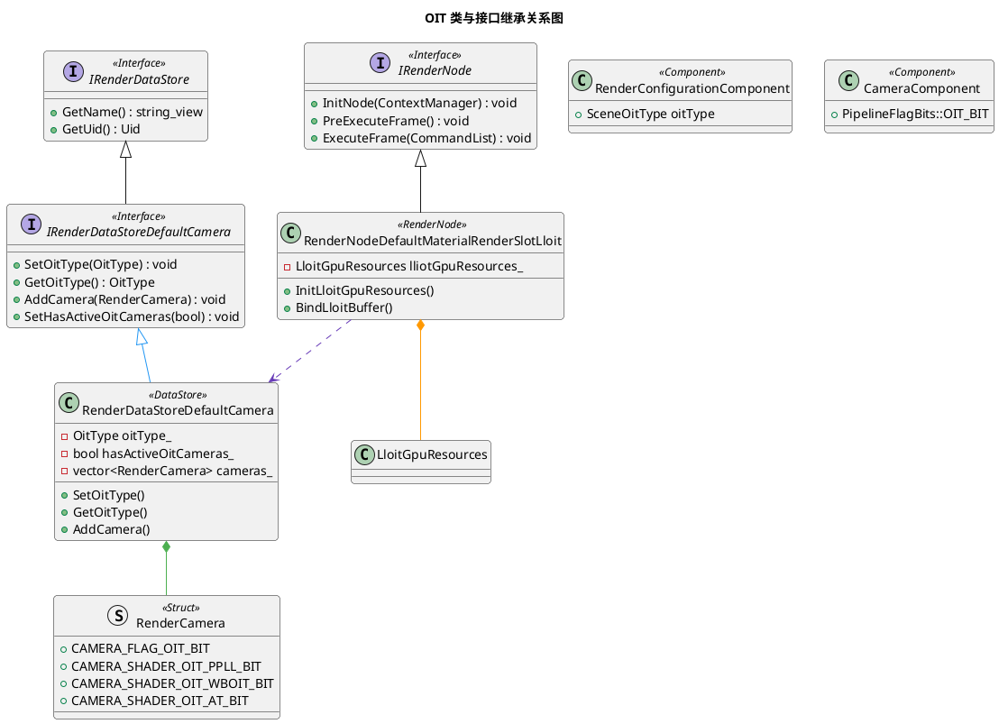

# OIT 详细设计文档

**文档版本**: v1.0
**创建日期**: 2026-05-14
**所属项目**: OpenHarmony AGP 3D 引擎
**模块路径**: lume/Lume_3D

---

## 目录

- [1. ECS组件设计](#1-ecs组件设计)
  - [1.1 RenderConfigurationComponent（OIT配置入口）](#11-renderconfigurationcomponentoit配置入口)
  - [1.2 CameraComponent（OIT管线标志）](#12-cameracomponentoit管线标志)
  - [1.3 MaterialComponent（OIT材质标志）](#13-materialcomponentoit材质标志)
- [2. 渲染数据存储](#2-渲染数据存储)
  - [2.1 IRenderDataStoreDefaultCamera（OIT类型管理接口）](#21-irenderdatastoredefaultcameraoit类型管理接口)
  - [2.2 RenderDataStoreDefaultCamera（实现）](#22-renderdatastoredefaultcamera实现)
  - [2.3 RenderCamera（OIT标志位与ShaderFlags）](#23-rendercameraoit标志位与shaderflags)
- [3. 渲染节点](#3-渲染节点)
  - [3.1 RenderNodeDefaultMaterialRenderSlotLloit（LLOIT节点）](#31-rendernodedefaultmaterialrenderslotlloitlloit节点)
  - [3.2 内部数据结构](#32-内部数据结构)
  - [3.3 核心方法](#33-核心方法)
  - [3.4 类与接口继承关系](#34-类与接口继承关系)
- [4. 着色器数据结构](#4-着色器数据结构)
  - [4.1 链表节点结构（DefaultOitLinkedListNodeStruct）](#41-链表节点结构defaultoitlinkedlistnodestruct)
  - [4.2 原子计数器（LinkedListCounter）](#42-原子计数器linkedlistcounter)
  - [4.3 SSBO布局定义（3d_dm_oit_layout_common.h）](#43-ssbo布局定义3d_dm_oit_layout_commonh)
  - [4.4 LLOIT片段着色器（Pass 1, Set 3绑定）](#44-lloit片段着色器pass-1-set-3绑定)
  - [4.5 WBOIT片段着色器（MRT输出）](#45-wboit片段着色器mrt输出)
  - [4.6 AT片段着色器输出](#46-at片段着色器输出)
- [5. 内存分析](#5-内存分析)
- [6. 算法详解](#6-算法详解)
- [7. 算法选择与决策](#7-算法选择与决策)
- [8. 边界情况与错误处理](#8-边界情况与错误处理)
- [9. 实现细节](#9-实现细节)
- [10. OIT执行总流程](#10-oit执行总流程)
- [11. 性能优化策略](#11-性能优化策略)
- [12. 调试工具与验证](#12-调试工具与验证)
- [13. 参考资料](#13-参考资料)

---

# 1. ECS组件设计

## 1.1 RenderConfigurationComponent（OIT配置入口）

```cpp
// 路径: lume/Lume_3D/api/3d/ecs/components/render_configuration_component.h
// UUID: 7e655b3d-3cad-40b9-8179-c749be17f60b

class RenderConfigurationComponent {
public:
    enum class SceneOitType : uint8_t {
        PPLL = 0,    // Per-Pixel Linked List
        WBOIT = 1,   // Weighted Blended OIT (默认)
        AT = 2,      // Adaptive Transparency
    };

    enum SceneRenderingFlagBits : uint8_t {
        CREATE_RNGS_BIT = (1 << 0),
    };

    using SceneRenderingFlags = uint8_t;

    // 属性定义（通过DEFINE_PROPERTY宏）
    CORE_NS::Entity environment;
    CORE_NS::Entity fog;
    SceneShadowType shadowType;
    float vpcfRadius;
    uint32_t vpcfSampleCount;
    SceneShadowQuality shadowQuality;
    SceneShadowSmoothness shadowSmoothness;

    // OIT核心属性
    SceneOitType oitType;                     // OIT算法类型（默认：WBOIT）

    SceneRenderingFlags renderingFlags;
    BASE_NS::string customRenderNodeGraphFile;
    BASE_NS::string customPostSceneRenderNodeGraphFile;
};
```

### 关键设计要点

1. **X-macro模式**：使用 `BEGIN_COMPONENT` → `DEFINE_PROPERTY` → `END_COMPONENT` 定义组件
2. **枚举内嵌**：`SceneOitType` 枚举定义在组件内部，避免全局命名污染
3. **默认值**：`oitType` 默认为 `SceneOitType::WBOIT`，性能最优
4. **UUID唯一性**：每个组件有唯一UUID用于运行时类型识别
5. **属性系统**：通过 `DEFINE_PROPERTY` 宏定义属性，支持反射和序列化

### 内存布局

> **注意**：以下字节偏移量为近似值，实际偏移取决于宏展开、对齐和填充。

| 属性 | 类型 | 大小 | 偏移量 | 说明 |
|------|------|------|--------|------|
| environment | Entity | 8 bytes | 0 | 环境实体引用 |
| fog | Entity | 8 bytes | 8 | 雾实体引用 |
| shadowType | uint8_t | 1 byte | 16 | 阴影类型 |
| vpcfRadius | float | 4 bytes | 20 | Variable PCF半径 |
| vpcfSampleCount | uint32_t | 4 bytes | 24 | Variable PCF采样数 |
| shadowQuality | uint8_t | 1 byte | 28 | 阴影质量 |
| shadowSmoothness | uint8_t | 1 byte | 29 | 阴影平滑度 |
| **oitType** | uint8_t | 1 byte | 30 | **OIT类型** |
| renderingFlags | uint8_t | 1 byte | 31 | 渲染标志 |

---

## 1.2 CameraComponent（OIT管线标志）

```cpp
// 路径: lume/Lume_3D/api/3d/ecs/components/camera_component.h
// UUID: 184c996b-67aa-4456-9f03-72e2d968931b

class CameraComponent {
public:
    enum SceneFlagBits : uint32_t {
        ACTIVE_RENDER_BIT = (1 << 0),
        MAIN_CAMERA_BIT = (1 << 1),
    };

    enum PipelineFlagBits : uint32_t {
        CLEAR_DEPTH_BIT = (1 << 0),
        CLEAR_COLOR_BIT = (1 << 1),
        MSAA_BIT = (1 << 2),
        ALLOW_COLOR_PRE_PASS_BIT = (1 << 3),
        FORCE_COLOR_PRE_PASS_BIT = (1 << 4),
        HISTORY_BIT = (1 << 5),
        JITTER_BIT = (1 << 6),
        VELOCITY_OUTPUT_BIT = (1 << 7),
        DEPTH_OUTPUT_BIT = (1 << 8),
        MULTI_VIEW_ONLY_BIT = (1 << 9),
        // (1 << 10) empty
        DISALLOW_REFLECTION_BIT = (1 << 11),
        CUBEMAP_BIT = (1 << 12),
        OIT_BIT = (1 << 13),           // OIT启用标志
    };

    enum class Projection : uint8_t {
        ORTHOGRAPHIC = 0,
        PERSPECTIVE = 1,
        FRUSTUM = 2,
        CUSTOM = 3,
    };

    enum class RenderingPipeline : uint8_t {
        LIGHT_FORWARD = 0,
        FORWARD = 1,
        DEFERRED = 2,
        CUSTOM = 3,
    };

    float screenPercentage;
    Projection projection;
    RenderingPipeline renderingPipeline;
    uint32_t sceneFlags;
    uint32_t pipelineFlags;                     // 包含OIT_BIT

    float aspect;
    float yFov;
    float xMag;
    float yMag;
    float zNear;                                // 默认：0.3
    float zFar;                                 // 默认：1000

    BASE_NS::Math::Vec4 viewport;
    BASE_NS::Math::Vec4 scissor;
    BASE_NS::Math::UVec2 renderResolution;

    BASE_NS::Math::Mat4X4 customProjectionMatrix;
    BASE_NS::Math::Vec4 clearColorValue;
    float clearDepthValue;                       // 默认：1.0

    CORE_NS::Entity environment;
    CORE_NS::Entity fog;
    CORE_NS::Entity postProcess;

    uint64_t layerMask;
    CORE_NS::Entity prePassCamera;
    CORE_NS::EntityReference customDepthTarget;
    BASE_NS::vector<CORE_NS::EntityReference> customColorTargets;

    CORE_NS::EntityReference customRenderNodeGraph;
    BASE_NS::string customRenderNodeGraphFile;
    BASE_NS::vector<CORE_NS::Entity> multiViewCameras;

    SampleCount msaaSampleCount;
};
```

### OIT关键设计

1. **OIT_BIT标志**：`PipelineFlagBits::OIT_BIT = (1 << 13)`，标记相机启用OIT
2. **管线兼容**：OIT兼容所有渲染管线（LIGHT_FORWARD、FORWARD、DEFERRED）
3. **分辨率控制**：`renderResolution` 决定OIT缓冲区大小
4. **层掩码**：`layerMask` 可过滤透明物体层

---

## 1.3 MaterialComponent（OIT材质标志）

```cpp
// 路径: lume/Lume_3D/api/3d/ecs/components/material_component.h
// UUID: 56430c14-cb12-4320-80d3-2bef4f86a041

class MaterialComponent {
public:
    enum class Type : uint8_t {
        METALLIC_ROUGHNESS = 0,
        SPECULAR_GLOSSINESS = 1,
        UNLIT = 2,
        UNLIT_SHADOW_ALPHA = 3,
        CUSTOM = 4,
        CUSTOM_COMPLEX = 5,
        OCCLUSION = 6,
    };

    enum LightingFlagBits : uint32_t {
        SHADOW_RECEIVER_BIT = (1 << 0),
        SHADOW_CASTER_BIT = (1 << 1),
        PUNCTUAL_LIGHT_RECEIVER_BIT = (1 << 2),
        INDIRECT_LIGHT_RECEIVER_BIT = (1 << 3),
        INDIRECT_IRRADIANCE_LIGHT_RECEIVER_BIT = (1 << 4),
    };

    enum ExtraRenderingFlagBits : uint32_t {
        DISCARD_BIT = (1 << 0),
        DISABLE_BIT = (1 << 1),
        ALLOW_GPU_INSTANCING_BIT = (1 << 2),
        CAMERA_EFFECT = (1 << 3),
        IGNORE_SPECULAR_FACTOR_TEXTURE = (1 << 4),
        IGNORE_SPECULAR_COLOR_TEXTURE = (1 << 5),
    };

    enum TextureIndex : uint8_t {
        BASE_COLOR = 0,
        NORMAL = 1,
        MATERIAL = 2,
        EMISSIVE = 3,
        AO = 4,
        CLEARCOAT = 5,
        CLEARCOAT_ROUGHNESS = 6,
        CLEARCOAT_NORMAL = 7,
        SHEEN = 8,
        TRANSMISSION = 9,
        SPECULAR = 10,
        TEXTURE_COUNT = 11,
    };

    struct TextureInfo {
        CORE_NS::EntityReference image;
        CORE_NS::EntityReference sampler;
        BASE_NS::Math::Vec4 factor;
        TextureTransform transform;
    };

    struct TextureTransform {
        BASE_NS::Math::Vec2 translation;
        float rotation;
        BASE_NS::Math::Vec2 scale;
    };

    struct RenderSort {
        uint8_t renderSortLayer;             // 0-63，默认32
        uint8_t renderSortLayerOrder;        // 0-255
    };

    struct Shader {
        CORE_NS::EntityReference shader;
        CORE_NS::EntityReference graphicsState;
    };

    Type type;
    float alphaCutoff;                          // 默认：1.0
    LightingFlags materialLightingFlags;
    Shader materialShader;
    Shader depthShader;
    ExtraRenderingFlags extraRenderingFlags;

    TextureInfo textures[TextureIndex::TEXTURE_COUNT];

    uint32_t useTexcoordSetBit;
    uint32_t customRenderSlotId;                // ~0u：默认

    BASE_NS::vector<CORE_NS::EntityReference> customResources;
    CORE_NS::IPropertyHandle* customProperties;
    CORE_NS::IPropertyHandle* customBindingProperties;

    RenderSort renderSort;
};
```

### OIT材质设计要点

1. **透明材质**：`Type::METALLIC_ROUGHNESS` 或 `Type::SPECULAR_GLOSSINESS` 配合 alpha blend
2. **Alpha裁剪**：`alphaCutoff < 1.0` 时启用Alpha测试
3. **纹理因子**：`TextureInfo::factor` 的 alpha 通道控制透明度
4. **渲染槽**：`customRenderSlotId` 可强制透明材质渲染到特定槽
5. **阴影标志**：透明材质通常 `SHADOW_CASTER_BIT = false`

### 默认值常量

```cpp
static constexpr BASE_NS::Math::Vec4 DEFAULT_BASE_COLOR { 1.0f, 1.0f, 1.0f, 1.0f };
static constexpr BASE_NS::Math::Vec4 DEFAULT_TRANSMISSION { 0.0f, 0.0f, 0.0f, 0.0f };
```

---

# 2. 渲染数据存储

## 2.1 IRenderDataStoreDefaultCamera（OIT类型管理接口）

```cpp
// 路径: lume/Lume_3D/api/3d/render/intf_render_data_store_default_camera.h
// UID: 9a13e890-2a33-4b45-beee-be39eaecce57

class IRenderDataStoreDefaultCamera : public RENDER_NS::IRenderDataStore {
public:
    enum class OitType : uint8_t {
        PPLL = 0,
        WBOIT = 1,   // 默认
        AT = 2,
    };

    virtual void SetOitType(const OitType& oitType) = 0;
    virtual OitType GetOitType() const = 0;
    virtual void SetHasActiveOitCameras(const bool hasActiveOitCameras) = 0;
    virtual bool GetHasActiveOitCameras() const = 0;

    virtual void AddCamera(const RenderCamera& camera) = 0;
    virtual BASE_NS::array_view<const RenderCamera> GetCameras() const = 0;
    virtual RenderCamera GetCamera(const BASE_NS::string_view name) const = 0;
    virtual RenderCamera GetCamera(const uint64_t id) const = 0;
    virtual uint32_t GetCameraIndex(const BASE_NS::string_view name) const = 0;
    virtual uint32_t GetCameraIndex(const uint64_t id) const = 0;
    virtual uint32_t GetCameraCount() const = 0;

    virtual void AddEnvironment(const RenderCamera::Environment& environment) = 0;
    virtual BASE_NS::array_view<const RenderCamera::Environment> GetEnvironments() const = 0;
    virtual RenderCamera::Environment GetEnvironment(const uint64_t id) const = 0;
    virtual uint32_t GetEnvironmentCount() const = 0;
    virtual bool HasBlendEnvironments() const = 0;
    virtual uint32_t GetEnvironmentIndex(const uint64_t id) const = 0;

protected:
    IRenderDataStoreDefaultCamera() = default;
};
```

### 关键设计要点

1. **接口抽象**：继承 `IRenderDataStore` 基类，统一数据存储接口
2. **OIT类型管理**：`SetOitType()` 和 `GetOitType()` 提供运行时OIT算法切换
3. **OIT相机检测**：`hasActiveOitCameras` 标识场景中是否有激活的OIT相机
4. **相机集合**：支持多相机管理，通过名称或ID查询
5. **环境集合**：支持多环境管理，用于动态环境混合

---

## 2.2 RenderDataStoreDefaultCamera（实现）

```cpp
// 路径: lume/Lume_3D/src/render/datastore/render_data_store_default_camera.h

class RenderDataStoreDefaultCamera final : public IRenderDataStoreDefaultCamera {
private:
    OitType oitType_ { OitType::WBOIT };
    bool hasActiveOitCameras_ { false };

    BASE_NS::vector<RenderCamera> cameras_;
    BASE_NS::vector<RenderCamera::Environment> environments_;

    const BASE_NS::string name_;
    bool hasBlendEnvironments_ { false };
    std::atomic_int32_t refcnt_ { 0 };           // 线程安全引用计数

public:
    static constexpr const char* const TYPE_NAME = "RenderDataStoreDefaultCamera";

    BASE_NS::string_view GetTypeName() const override { return TYPE_NAME; }
    BASE_NS::string_view GetName() const override { return name_; }
    const BASE_NS::Uid& GetUid() const override { return UID; }

    void SetOitType(const OitType& oitType) override;
    OitType GetOitType() const override;
    void SetHasActiveOitCameras(const bool hasActiveOitCameras) override;
    bool GetHasActiveOitCameras() const override;

    void AddCamera(const RenderCamera& camera) override;
    BASE_NS::array_view<const RenderCamera> GetCameras() const override;
};
```

### 设计要点

1. **数据存储**：使用 `vector` 存储相机和环境数据
2. **相机查找**：使用 `cameras_` 向量线性搜索，无独立索引映射
3. **OIT检测**：`hasActiveOitCameras_` 由外部通过 `SetHasActiveOitCameras()` 设置，`AddCamera()` 内部不包含OIT检测逻辑
4. **默认值**：`oitType_` 默认为 `WBOIT`，最优性能
5. **引用计数**：使用 `std::atomic_int32_t` 实现线程安全引用计数
6. **接口方法**：`GetTypeName()` 返回 `TYPE_NAME`，`GetName()` 返回实例名 `name_`

---

## 2.3 RenderCamera（OIT标志位与ShaderFlags）

```cpp
// 路径: lume/Lume_3D/api/3d/render/render_data_defines_3d.h

struct RenderCamera {
    enum CameraFlagBits : uint32_t {
        CAMERA_FLAG_CLEAR_DEPTH_BIT = (1 << 0),
        CAMERA_FLAG_CLEAR_COLOR_BIT = (1 << 1),
        CAMERA_FLAG_SHADOW_BIT = (1 << 2),
        CAMERA_FLAG_MSAA_BIT = (1 << 3),
        CAMERA_FLAG_REFLECTION_BIT = (1 << 4),
        CAMERA_FLAG_MAIN_BIT = (1 << 5),
        CAMERA_FLAG_COLOR_PRE_PASS_BIT = (1 << 6),
        CAMERA_FLAG_OPAQUE_BIT = (1 << 7),
        CAMERA_FLAG_HISTORY_BIT = (1 << 8),
        CAMERA_FLAG_JITTER_BIT = (1 << 9),
        CAMERA_FLAG_OUTPUT_VELOCITY_NORMAL_BIT = (1 << 10),
        CAMERA_FLAG_INVERSE_WINDING_BIT = (1 << 11),
        CAMERA_FLAG_OUTPUT_DEPTH_BIT = (1 << 12),
        CAMERA_FLAG_CUSTOM_TARGETS_BIT = (1 << 13),
        CAMERA_FLAG_MULTI_VIEW_ONLY_BIT = (1 << 14),
        CAMERA_FLAG_ENVIRONMENT_PROJECTION_BIT = (1 << 15),
        CAMERA_FLAG_ALLOW_REFLECTION_BIT = (1 << 16),
        CAMERA_FLAG_CUBEMAP_BIT = (1 << 17),
        CAMERA_FLAG_POST_PROCESS_EFFECTS_BIT = (1 << 18),
        CAMERA_FLAG_OIT_BIT = (1 << 19),
    };
    using Flags = uint32_t;

    enum ShaderFlagBits : uint32_t {
        CAMERA_SHADER_FOG_BIT = (1 << 0),
        CAMERA_SHADER_VELOCITY_OUT_BIT = (1 << 1),
        CAMERA_SHADER_OIT_PPLL_BIT = (1 << 2),
        CAMERA_SHADER_OIT_WBOIT_BIT = (1 << 3),
        CAMERA_SHADER_OIT_AT_BIT = (1 << 4),
    };
    using ShaderFlags = uint32_t;

    struct Matrices {
        BASE_NS::Math::Mat4X4 view;
        BASE_NS::Math::Mat4X4 proj;
        BASE_NS::Math::Mat4X4 viewPrevFrame;
        BASE_NS::Math::Mat4X4 projPrevFrame;
        BASE_NS::Math::Mat4X4 envProj;
    };

    uint64_t id;
    uint64_t shadowId;
    uint64_t layerMask;
    uint64_t mainCameraId;

    Matrices matrices;

    BASE_NS::Math::Vec4 viewport;
    BASE_NS::Math::Vec4 scissor;
    BASE_NS::Math::UVec2 renderResolution;

    float screenPercentage;
    float zNear;
    float zFar;

    RENDER_NS::RenderHandleReference depthTarget;
    RENDER_NS::RenderHandleReference colorTargets[8];

    Flags flags;
    ShaderFlags shaderFlags;

    uint32_t sceneId;
    RenderPipelineType renderPipelineType;
    CameraCullType cullType;
    SampleCountFlags msaaSampleCountFlags;

    BASE_NS::fixed_string<RENDER_NS::RenderDataConstants::MAX_DEFAULT_NAME_LENGTH> name;

    RENDER_NS::RenderHandleReference customRenderNodeGraph;
    BASE_NS::string customRenderNodeGraphFile;

    TargetUsage colorTargetCustomization[8];
    TargetUsage depthTargetCustomization;
};
```

### OIT关键设计

1. **CAMERA_FLAG_OIT_BIT**：相机级别OIT启用标志 `(1 << 19)`
2. **ShaderFlags**：GPU着色器级别的OIT算法标志（PPLL/WBOIT/AT）
3. **renderResolution**：决定GPU缓冲区大小（width × height × 16）
4. **renderPipelineType**：兼容LIGHT_FORWARD/FORWARD/DEFERRED
5. **msaaSampleCountFlags**：WBOIT支持MSAA，PPLL/AT不支持

### ShaderFlags传递流程

```
RenderSystem (render_system.cpp) 内联OIT相机检测逻辑
    → 根据RenderConfigurationComponent::SceneOitType
    → 设置RenderCamera::ShaderFlags
        PPLL → CAMERA_SHADER_OIT_PPLL_BIT
        WBOIT → CAMERA_SHADER_OIT_WBOIT_BIT
        AT → CAMERA_SHADER_OIT_AT_BIT
    → 着色器SpecializationConstants包含ShaderFlags（constant_id = 4）
    → GPU着色器根据ShaderFlags执行对应OIT算法分支
```

---

# 3. 渲染节点

## 3.1 RenderNodeDefaultMaterialRenderSlotLloit（LLOIT节点）

```cpp
// 路径: lume/Lume_3D/src/render/node/render_node_default_material_render_slot_lloit.h
// UID: 7e5b62c0-eb9f-4c39-a012-640052c7146b

class RenderNodeDefaultMaterialRenderSlotLloit final : public RENDER_NS::IRenderNode {
public:
    static constexpr uint32_t MAX_FRAGMENT_COUNT { 16u };
    static constexpr uint64_t INVALID_NODE_IDX { 0xFFFFFFFFu };
    static constexpr uint32_t LLOIT_SET { 3u };

    void InitNode(RENDER_NS::IRenderNodeContextManager& renderNodeContextMgr) override;
    void PreExecuteFrame() override;
    void ExecuteFrame(RENDER_NS::IRenderCommandList& cmdList) override;

    void InitLloitGpuResources(const uint32_t width, const uint32_t height);
    void RecreateLloitGpuResources();
    void UpdateLloitGpuResources(RENDER_NS::IRenderCommandList& cmdList);
    void BindLloitBuffer(RENDER_NS::IRenderCommandList& cmdList);
    void UpdateAndBindLloitSet(RENDER_NS::IRenderCommandList& cmdList);

private:
    LloitGpuResources lliotGpuResources_;
    LinkedListCounter linkedListCounter_;

    RENDER_NS::IDescriptorSetBinder::Ptr oneFrameBinder_;
    bool mapBufferAfterCreate_ { true };

    struct StagingBuffers {
        RENDER_NS::RenderHandleReference srcHandle;
        RENDER_NS::RenderHandleReference dstHandle;
        uint32_t beginIndex { 0U };
        uint32_t count { 0U };
        BASE_NS::vector<uint8_t> stagingData;
        uint32_t stagingBufferByteOffset { 0U };
    };

    mutable std::mutex mutex_;
    BASE_NS::vector<RENDER_NS::BufferCopy> stagingBufferCopies_;
    BASE_NS::vector<StagingBuffers> stagingBufferToBuffer_;
    BASE_NS::vector<RENDER_NS::RenderHandleReference> stagingGpuBuffers_;

    RENDER_NS::IRenderNodeContextManager* renderNodeContextMgr_ { nullptr };

    struct CurrentScene {
        SceneRenderCameraData camData;
        RENDER_NS::RenderHandle cameraEnvRadianceHandle;
        RENDER_NS::ViewportDesc viewportDesc;
        RENDER_NS::ScissorDesc scissorDesc;

        RENDER_NS::RenderHandle prePassColorTarget;

        bool hasShadow { false };
        IRenderDataStoreDefaultLight::ShadowTypes shadowTypes {};
        IRenderDataStoreDefaultLight::LightingFlags lightingFlags { 0u };
        RenderCamera::ShaderFlags cameraShaderFlags { 0u };
        BASE_NS::vector<uint32_t> mvCameraIndices;
    };

    CurrentScene currentScene_;
    SceneRenderDataStores stores_;

    struct AllShaderData {
        BASE_NS::vector<PerShaderData> perShaderData;
        BASE_NS::unordered_map<uint64_t, uint32_t> shaderIdToData;

        bool slotHasShaders { false };
        RENDER_NS::RenderHandle defaultShaderHandle;
        RENDER_NS::RenderHandle defaultStateHandle;
        RENDER_NS::RenderHandle defaultPlHandle;
        RENDER_NS::RenderHandle defaultVidHandle;
        RENDER_NS::PipelineLayout defaultPipelineLayout;
        RENDER_NS::PipelineLayout defaultTmpPipelineLayout;
        BASE_NS::vector<RENDER_NS::ShaderSpecialization::Constant> defaultSpecializationConstants;
        bool defaultPlSet3 { false };
    };

    AllShaderData allShaderData_;
};
```

---

## 3.2 内部数据结构

### LinkedListNode（链表节点）

```cpp
// 路径: render_node_default_material_render_slot_lloit.h:97-101

struct LinkedListNode {
    uvec2 color;        // RGBA16压缩颜色（2个uint32_t）
    float depth;        // 片段深度值（1个float）
    uint32_t next;      // 下一个节点索引（1个uint32_t）
};
// sizeof(LinkedListNode) = 16 bytes
```

### LinkedListCounter（原子计数器）

```cpp
// 路径: render_node_default_material_render_slot_lloit.h:102-105

struct LinkedListCounter {
    uint32_t nodeIdx { 0u };
    uint32_t maxNodeIdx { 0u };
};
// sizeof(LinkedListCounter) = 8 bytes
```

### LloitGpuResources（GPU资源）

```cpp
// 路径: render_node_default_material_render_slot_lloit.h:243-250

struct LloitGpuResources {
    RENDER_NS::RenderHandleReference LinkedListHeadBuffer_;
    RENDER_NS::RenderHandleReference LinkedListBuffer_;
    RENDER_NS::RenderHandleReference LinkedListCounterBuffer_;
    uint32_t imgResX { 0u };
    uint32_t imgResY { 0u };
    uint32_t maxNodeCount { 0u };
};
```

---

## 3.3 核心方法

### InitLloitGpuResources()

```cpp
// 路径: render_node_default_material_render_slot_lloit.cpp:174-241

void RenderNodeDefaultMaterialRenderSlotLloit::InitLloitGpuResources(
    const uint32_t width, const uint32_t height)
{
    lliotGpuResources_.imgResX = width;
    lliotGpuResources_.imgResY = height;
    lliotGpuResources_.maxNodeCount = width * height * MAX_FRAGMENT_COUNT;

    auto& gpuResourceMgr = renderNodeContextMgr_->GetGpuResourceManager();

    // 1. 创建LinkedListHeadBuffer
    uint32_t linkedListHeadBufferSize = width * height * sizeof(uint32_t);
    auto linkedListHeadBufferDesc = GetLinkedListBufferDesc(linkedListHeadBufferSize);
    string_view linkedListHeadBufferName =
        isReflectionPlane_ ? "linked_list_head_buffer_refl" : "linked_list_head_buffer";
    if (!RenderHandleUtil::IsValid(lliotGpuResources_.LinkedListHeadBuffer_.GetHandle())) {
        lliotGpuResources_.LinkedListHeadBuffer_ =
            gpuResourceMgr.Create(linkedListHeadBufferName, linkedListHeadBufferDesc);
    } else {
        lliotGpuResources_.LinkedListHeadBuffer_ =
            gpuResourceMgr.Create(lliotGpuResources_.LinkedListHeadBuffer_, linkedListHeadBufferDesc);
    }

    // 2. 创建LinkedListNodeBuffer
    uint32_t linkedListBufferSize = lliotGpuResources_.maxNodeCount * sizeof(LinkedListNode);
    auto linkedListBufferDesc = GetLinkedListBufferDesc(linkedListBufferSize);
    string_view linkedListBufferName =
        isReflectionPlane_ ? "linked_list_buffer_refl" : "linked_list_buffer";
    if (!RenderHandleUtil::IsValid(lliotGpuResources_.LinkedListBuffer_.GetHandle())) {
        lliotGpuResources_.LinkedListBuffer_ = gpuResourceMgr.Create(linkedListBufferName, linkedListBufferDesc);
    } else {
        lliotGpuResources_.LinkedListBuffer_ =
            gpuResourceMgr.Create(lliotGpuResources_.LinkedListBuffer_, linkedListBufferDesc);
    }

    // 3. 创建LinkedListCounterBuffer
    uint32_t linkedListCounterBufferSize = sizeof(LinkedListCounter);
    auto linkedListCounterBufferDesc = GetLinkedListBufferDesc(linkedListCounterBufferSize);
    string_view linkedListCounterBufferName =
        isReflectionPlane_ ? "linked_list_counter_buffer_refl" : "linked_list_counter_buffer";
    if (!RenderHandleUtil::IsValid(lliotGpuResources_.LinkedListCounterBuffer_.GetHandle())) {
        lliotGpuResources_.LinkedListCounterBuffer_ =
            gpuResourceMgr.Create(linkedListCounterBufferName, linkedListCounterBufferDesc);
    } else {
        lliotGpuResources_.LinkedListCounterBuffer_ =
            gpuResourceMgr.Create(lliotGpuResources_.LinkedListCounterBuffer_, linkedListCounterBufferDesc);
    }

    // 4. 初始化缓冲数据
    linkedListCounter_.nodeIdx = 0u;
    linkedListCounter_.maxNodeIdx = lliotGpuResources_.maxNodeCount;

    vector<uint32_t> initialHeadData(width * height, INVALID_NODE_IDX);
    const size_t dataSize = initialHeadData.size() * sizeof(uint32_t);
    array_view<const uint8_t> data((const uint8_t*)initialHeadData.data(), dataSize);
    CopyDataToBuffer(data, lliotGpuResources_.LinkedListHeadBuffer_);

    if (lliotGpuResources_.LinkedListCounterBuffer_) {
        array_view<const uint8_t> counterData((const uint8_t*)&linkedListCounter_, sizeof(LinkedListCounter));
        CopyDataToBuffer(counterData, lliotGpuResources_.LinkedListCounterBuffer_);
    }

    mapBufferAfterCreate_ = true;
}
```

### BindLloitBuffer()

```cpp
// 路径: render_node_default_material_render_slot_lloit.cpp:252-270

void RenderNodeDefaultMaterialRenderSlotLloit::BindLloitBuffer(
    IRenderCommandList& cmdList)
{
    INodeContextDescriptorSetManager& descriptorSetMgr =
        renderNodeContextMgr_->GetDescriptorSetManager();

    // 创建DescriptorSet（Set 3，用于Pass 1材质着色器）
    const PipelineLayout& plRef = allShaderData_.defaultPipelineLayout;
    const RenderHandle oneFrameHandle =
        descriptorSetMgr.CreateOneFrameDescriptorSet(plRef.descriptorSetLayouts[LLOIT_SET].bindings);

    oneFrameBinder_ =
        descriptorSetMgr.CreateDescriptorSetBinder(oneFrameHandle,
            plRef.descriptorSetLayouts[LLOIT_SET].bindings);

    uint32_t bindSetCount = 0U;
    oneFrameBinder_->BindBuffer(bindSetCount++,
        lliotGpuResources_.LinkedListHeadBuffer_.GetHandle(), 0);      // Binding 0
    oneFrameBinder_->BindBuffer(bindSetCount++,
        lliotGpuResources_.LinkedListBuffer_.GetHandle(), 0);          // Binding 1
    oneFrameBinder_->BindBuffer(bindSetCount++,
        lliotGpuResources_.LinkedListCounterBuffer_.GetHandle(), 0);   // Binding 2

    if (mapBufferAfterCreate_) {
        UpdateLloitGpuResources(cmdList);
        mapBufferAfterCreate_ = false;
    }
}
```

### RecreateLloitGpuResources()

```cpp
// 路径: render_node_default_material_render_slot_lloit.cpp:243-250

void RenderNodeDefaultMaterialRenderSlotLloit::RecreateLloitGpuResources()
{
    auto camera = currentScene_.camData.camera;
    auto renderResolution = camera.renderResolution;

    if (renderResolution[0] != lliotGpuResources_.imgResX ||
        renderResolution[1] != lliotGpuResources_.imgResY) {
        InitLloitGpuResources(renderResolution[0], renderResolution[1]);
    }
}
```

### 内存布局分析

| 缓冲名称 | 大小计算 | 1080p大小 | 用途 |
|---------|---------|----------|------|
| LinkedListHeadBuffer | width × height × sizeof(uint32_t) | 8.29 MB | 每像素链表头索引 |
| LinkedListNodeBuffer | width × height × MAX_FRAGMENT_COUNT × sizeof(LinkedListNode) | ~531 MB | 所有片段节点（16/像素） |
| LinkedListCounterBuffer | sizeof(LinkedListCounter) = 8 bytes | 8 bytes | 原子计数器 |
| **总计** | - | **~539 MB** | - |

---

## 3.4 类与接口继承关系



### 继承关系说明

| 继承类型 | 关系 | 说明 |
|---------|------|------|
| **接口继承** | IRenderDataStore → IRenderDataStoreDefaultCamera | 扩展OIT相关接口 |
| **接口继承** | IRenderNode → RenderNodeDefaultMaterialRenderSlotLloit | 实现渲染节点生命周期 |
| **接口实现** | IRenderDataStoreDefaultCamera → RenderDataStoreDefaultCamera | 实现数据存储逻辑 |
| **数据组合** | RenderDataStoreDefaultCamera × RenderCamera | 数据存储包含多个相机 |
| **资源组合** | RenderNodeLloit × LloitGpuResources | 渲染节点包含GPU资源 |
| **使用关系** | RenderNodeLloit → RenderDataStore | 读取OIT配置和相机数据 |

---

# 4. 着色器数据结构

## 4.1 链表节点结构（DefaultOitLinkedListNodeStruct）

```glsl
// 路径: lume/Lume_3D/api/3d/shaders/common/3d_dm_structures_common.h:532-536

struct DefaultOitLinkedListNodeStruct {
    uvec2 color;    // RGBA16压缩颜色
    float depth;    // 片段深度
    uint next;      // 下一个节点索引
};
// 16字节对齐，匹配CPU端LinkedListNode
```

### 内存布局（16字节）

| 字段 | 类型 | 大小 | 偏移量 | 位布局 | 说明 |
|------|------|------|--------|--------|------|
| **color[0]** | uint32_t | 4 bytes | 0 | RG半精度浮点（16位×2） | PackHalf2x16(R, G) |
| **color[1]** | uint32_t | 4 bytes | 4 | BA半精度浮点（16位×2） | PackHalf2x16(B, A) |
| **depth** | float | 4 bytes | 8 | IEEE 754单精度浮点 | 片段深度值（0.0-1.0） |
| **next** | uint32_t | 4 bytes | 12 | 无符号整数 | 下一个节点索引或INVALID_NODE_IDX |

### 颜色压缩详解

```glsl
uvec2 PackVec4Half2x16(vec4 color) {
    uvec2 packed;
    packed.x = packHalf2x16(vec2(color.r, color.g));
    packed.y = packHalf2x16(vec2(color.b, color.a));
    return packed;
}

vec4 UnpackVec4Half2x16(uvec2 packed) {
    vec2 rg = unpackHalf2x16(packed.x);
    vec2 ba = unpackHalf2x16(packed.y);
    return vec4(rg.x, rg.y, ba.x, ba.y);
}
```

### 压缩优势

| 项目 | 未压缩 | 压缩后 | 压缩率 |
|------|-------|--------|--------|
| RGBA颜色 | 4 × float = 16 bytes | 2 × uint32_t = 8 bytes | **50%** |
| LinkedListNode总大小 | 24 bytes | 16 bytes | **33%** |
| 1080p总内存（16片段/像素） | 318 MB | 141 MB | **56%节省** |

### 半精度浮点（FP16）原理

FP16使用16位存储：
- 符号位：1 bit
- 指数位：5 bits（偏移15）
- 尾数位：10 bits

**精度范围**：
- 最大值：65504.0
- 最小正值：2⁻¹⁴ ≈ 0.000061
- 精度：约3.3个十进制位（适合颜色存储）

**精度损失分析**：

| 原始格式 | 压缩格式 | 精度损失 | 适用场景 |
|---------|---------|---------|---------|
| FP32 (32位) | FP16 (16位) | ~0.001% | LDR颜色（RGB < 1.0） |
| FP32 (HDR) | FP16 | ~0.1-1% | HDR颜色需归一化（/maxColor） |

### 压缩策略总结

| 数据项 | 原始大小 | 压缩后大小 | 压缩方法 | 压缩率 | 精度损失 |
|--------|---------|-----------|---------|--------|---------|
| **颜色RGBA** | 16 bytes | 8 bytes | PackVec4Half2x16 | 50% | <0.1% (LDR) |
| **深度值** | 4 bytes | 4 bytes | 无压缩 | 0% | 无损失 |
| **链表索引** | 4 bytes | 4 bytes | 无压缩 | 0% | 无损失 |
| **LinkedListNode** | 24 bytes | 16 bytes | 颜色压缩 | 33% | <0.1% |
| **1080p总内存** | 318 MB | 141 MB | 颜色压缩 | 56% | <0.1% |

---

## 4.2 原子计数器（LinkedListCounter）

```glsl
// 路径: lume/Lume_3D/api/3d/shaders/common/3d_dm_oit_layout_common.h:41-45

uint nodeIdx;     // 当前节点索引（原子递增）
uint maxNodeIdx;  // 最大节点索引（缓冲大小上限）
```

### 原子操作机制

```glsl
// 1. 原子递增计数器获取节点索引
uint currNodeIdx = atomicAdd(nodeIdx, 1);

// 2. 检查缓冲溢出
if (currNodeIdx < maxNodeIdx) {
    // 3. 原子交换更新链表头
    ivec2 ifragCoord = ivec2(fragCoord.xy);
    uint pixelIndex = ifragCoord.y * imageWidth + ifragCoord.x;
    uint prevHead = atomicExchange(LinkedListHead[pixelIndex], currNodeIdx);

    // 4. 写入节点数据
    nodes[currNodeIdx].color = PackVec4Half2x16(color);
    nodes[currNodeIdx].depth = fragCoord.z;
    nodes[currNodeIdx].next = prevHead;
}
```

### 并发安全保证

1. **atomicAdd**：原子递增计数器，每个片段获取唯一索引
2. **atomicExchange**：原子交换链表头，保证链表正确构建
3. **溢出检测**：`currNodeIdx < maxNodeIdx` 防止缓冲溢出
4. **丢弃策略**：超出最大节点数的片段被丢弃，不影响已存储片段

---

## 4.3 SSBO布局定义（3d_dm_oit_layout_common.h）

### Pass 1：材质着色器（set=3，仅Vulkan）

```glsl
// 路径: lume/Lume_3D/api/3d/shaders/common/3d_dm_oit_layout_common.h:27-47
// 此布局仅用于Pass 1材质着色器（core3d_dm_fw_lloit.frag）

#if (CORE3D_DM_LLOIT_FRAG_LAYOUT == 1)

// Binding 0: 链表头索引缓冲
layout(set = 3, binding = 0, std430) buffer LinkedListHeadSBO {
    uint LinkedListHead[];
};

// Binding 1: 链表节点缓冲
layout(set = 3, binding = 1, std430) buffer LinkedListSBO {
    DefaultOitLinkedListNodeStruct nodes[];
};

// Binding 2: 计数器缓冲
layout(set = 3, binding = 2, std430) buffer LinkedListCounterSBO {
    uint nodeIdx;
    uint maxNodeIdx;
};

#endif
```

### Pass 2：全屏解析着色器（set=0）

```glsl
// 路径: lume/Lume_3D/assets/3d/shaders/shader/core3d_dm_fullscreen_lloit.frag:13-28
// 注意：全屏解析着色器使用set=0，与Pass 1的set=3不同

layout(set = 0, binding = 0, std430) buffer LinkedListHeadSBO {
    uint LinkedListHead[];
};

layout(set = 0, binding = 1, std430) buffer LinkedListSBO {
    DefaultOitLinkedListNodeStruct nodes[];
};

layout(set = 0, binding = 2, std430) buffer LinkedListCounterSBO {
    uint nodeIdx;
    uint maxNodeIdx;
};

layout(set = 0, binding = 3) uniform sampler2D uDepth;
```

> **重要**：LLOIT缓冲只有3个SSBO绑定（binding 0/1/2），不存在binding=3的SSBO。全屏着色器中的binding=3是深度纹理采样器（sampler2D），不是SSBO。

### DescriptorSet绑定顺序（Pass 1, Set 3）

| Binding | 缓冲名称 | 类型 | 大小 | 用途 |
|---------|---------|------|------|------|
| **0** | LinkedListHeadSBO | SSBO | width×height×4 bytes | 链表头索引（每像素） |
| **1** | LinkedListSBO | SSBO | maxNodeCount×16 bytes | 链表节点数组 |
| **2** | LinkedListCounterSBO | SSBO | 8 bytes | 原子计数器 |

---

## 4.4 LLOIT片段着色器（Pass 1, Set 3绑定）

```glsl
#if (CORE3D_DM_LLOIT_FRAG_LAYOUT == 1)
// 无传统颜色输出，使用SSBO存储
// 注意：以下为简化伪代码，实际实现见 core3d_dm_fw_lloit.frag

void main() {
    vec4 color;
    if (CORE_MATERIAL_TYPE == CORE_MATERIAL_UNLIT) {
        color = unlitBasic();
    } else if (CORE_MATERIAL_TYPE == CORE_MATERIAL_UNLIT_SHADOW_ALPHA) {
        color = unlitShadowAlpha();
    } else {
        color = pbrBasic();
    }

    if (CORE_POST_PROCESS_FLAGS > 0) {
        vec2 fragUv;
        CORE_GET_FRAGCOORD_UV(fragUv, gl_FragCoord.xy, uGeneralData.viewportSizeInvViewportSize.zw);
        InplacePostProcess(fragUv, color);
    }

    const uint LLOIT_BITS = CORE_CAMERA_OIT_PPLL_BIT | CORE_CAMERA_OIT_AT_BIT;
    if ((CORE_CAMERA_FLAGS & LLOIT_BITS) != 0) {
        uint imageWidth = uint(uGeneralData.viewportSizeInvViewportSize.x);
        InplaceLinkedListOit(color, gl_FragCoord.xyz, imageWidth);
    }
}
#endif
```

---

## 4.5 WBOIT片段着色器（MRT输出）

```glsl
// 路径: lume/Lume_3D/api/3d/shaders/common/3d_dm_oit_layout_common.h:19-23

#if (CORE3D_DM_WBOIT_FRAG_LAYOUT == 1)
layout(location = 0) out vec4 accumulation;     // 累积缓冲（RGBA16F）
layout(location = 1) out float revealage;      // 透明度缓冲（R16）
layout(location = 2) out vec4 outVelocityNormal; // 速度/法线缓冲
#endif
```

### WBOIT缓冲格式

| 缓冲 | 格式 | 大小 | 存储内容 | 公式 |
|------|------|------|---------|------|
| **accumulation** | RGBA16F | 8 bytes | 累积颜色和权重 | RGB = `color.rgb * color.a * weight`, A = `color.a * weight` |
| **revealage** | R16 | 2 bytes | 透射率累积 | 每片段写入 `color.a`，混合后为 `Π(1 - α_i)` |
| **outVelocityNormal** | RGBA8 | 4 bytes | 速度和法线 | 后处理需要（可选） |

> **注意**：WBOIT的accumulation输出为 `color * weight`（见 core3d_dm_fw_wboit.frag:33）。此时color已经过InplaceWeightedOit处理（color.rgb *= color.a 预乘），因此accumulation.rgb = color.rgb × color.a × weight，accumulation.a = color.a × weight。全屏解析时 `accum.rgb / accum.a` 还原为color.rgb。

---

## 4.6 AT片段着色器输出

AT与PPLL共享相同的Pass 1片段着色器（core3d_dm_fw_lloit.frag），使用LLOIT的链表结构写入SSBO，无传统颜色输出。详见[6.3.3节](#633-pass-1片段收集与ppll共享)。

---


# 5. 内存分析

## 5.1 PPLL/LLOIT内存模型

PPLL与AT共享LLOIT的链表缓冲结构，内存消耗完全相同。

### 缓冲区大小计算

| 缓冲名称 | 公式 | 1080p (1920×1080) | 4K (3840×2160) |
|---------|------|-------------------|-----------------|
| LinkedListHeadBuffer | width × height × 4 bytes | 8.29 MB | 33.18 MB |
| LinkedListNodeBuffer | width × height × 16 × 16 bytes | 530.84 MB | 2.12 GB |
| LinkedListCounterBuffer | 8 bytes | 8 bytes | 8 bytes |
| **总计** | - | **~539 MB** | **~2.15 GB** |

> `MAX_FRAGMENT_COUNT = 16`，每个片段节点 `sizeof(LinkedListNode) = 16 bytes`。

### 内存分布可视化

```
LinkedListHeadBuffer: [uint32][uint32]...[uint32]   ← 每像素一个链表头索引
                         ↓       ↓          ↓
LinkedListNodeBuffer:  [Node0]→[Node3]→[Node7]→∅    ← 像素(0,0)的链表
                       [Node1]→[Node5]→∅            ← 像素(1,0)的链表
                       [Node2]→[Node4]→[Node6]→∅    ← 像素(2,0)的链表
                       ...

LinkedListCounterBuffer: [nodeIdx=7][maxNodeIdx=33177600]
                         ↑ 已分配节点数    ↑ 缓冲容量上限
```

### 内存与MAX_FRAGMENT_COUNT的关系

| MAX_FRAGMENT_COUNT | 节点缓冲(1080p) | 总计(1080p) | 说明 |
|-------------------|-----------------|-------------|------|
| 4 | 132.71 MB | ~141 MB | 轻度透明场景 |
| 8 | 265.42 MB | ~274 MB | 中等透明场景 |
| **16** | **530.84 MB** | **~539 MB** | **默认值，重度透明场景** |
| 32 | 1061.69 MB | ~1.07 GB | 极端透明场景 |

---

## 5.2 WBOIT内存模型

WBOIT使用固定大小的MRT缓冲，内存消耗远小于PPLL/AT，且与片段数量无关。

### 缓冲区大小计算

| 缓冲名称 | 格式 | 每像素大小 | 1080p | 4K |
|---------|------|-----------|-------|-----|
| accumulation | RGBA16F | 8 bytes | 16.58 MB | 66.36 MB |
| revealage | R16 | 2 bytes | 4.15 MB | 16.59 MB |
| outVelocityNormal | RGBA8 | 4 bytes | 8.29 MB | 33.18 MB |
| **总计** | - | **14 bytes** | **~29 MB** | **~116 MB** |

### MSAA额外开销（WBOIT独占）

| MSAA级别 | accumulation | revealage | 额外总计(1080p) |
|---------|-------------|-----------|----------------|
| MSAA 2x | ×2 = 33.16 MB | ×2 = 8.29 MB | +41.45 MB |
| MSAA 4x | ×4 = 66.36 MB | ×4 = 16.59 MB | +82.94 MB |
| MSAA 8x | ×8 = 132.71 MB | ×8 = 33.18 MB | +165.89 MB |

> PPLL/AT不支持MSAA，无此项开销。

---

## 5.3 三种算法内存对比

| 算法 | 1080p内存 | 4K内存 | MSAA支持 | 内存与片段数关系 |
|------|---------|--------|---------|----------------|
| **PPLL** | ~539 MB | ~2.15 GB | 不支持 | 线性（MAX_FRAGMENT_COUNT） |
| **WBOIT** | ~29 MB | ~116 MB | 支持 | **无关**（固定大小） |
| **AT** | ~539 MB | ~2.15 GB | 不支持 | 线性（MAX_FRAGMENT_COUNT） |

### 内存选择建议

- **移动端**：推荐WBOIT，内存占用最低
- **桌面端（少量透明）**：PPLL/AT可接受，质量更高
- **桌面端（大量透明）**：WBOIT或降低MAX_FRAGMENT_COUNT
- **4K分辨率**：PPLL/AT内存开销极大（>2GB），强烈建议WBOIT

---

# 6. 算法详解

## 6.1 PPLL（Per-Pixel Linked List）

### 6.1.1 算法原理

PPLL基于Yang等人2010年提出的"A-buffer using Linked-Lists"方法，为每个像素维护一个动态链表，存储所有透明片段，最终从后向前排序混合。

### 6.1.2 Pass 1：片段收集

```glsl
// 路径: 3d_dm_inplace_oit_common.h - InplaceLinkedListOit()

void InplaceLinkedListOit(in vec4 color, in vec3 fragCoord, in uint imageWidth) {
    // 1. 原子递增计数器，获取唯一节点索引
    uint currNodeIdx = atomicAdd(nodeIdx, 1);

    // 2. 溢出检测：超出最大节点数则丢弃
    if (currNodeIdx < maxNodeIdx) {
        // 3. 计算像素索引
        ivec2 ifragCoord = ivec2(fragCoord.xy);
        uint pixelIndex = ifragCoord.y * imageWidth + ifragCoord.x;

        // 4. 原子交换更新链表头（新片段成为链表头）
        uint prevHead = atomicExchange(LinkedListHead[pixelIndex], currNodeIdx);

        // 5. 写入节点数据
        nodes[currNodeIdx].color = PackVec4Half2x16(color);  // RGBA半精度压缩
        nodes[currNodeIdx].depth = fragCoord.z;              // 深度值
        nodes[currNodeIdx].next = prevHead;                  // 指向前一个头节点
    }
}
```

**关键特性**：
- **无序插入**：片段按渲染顺序插入，不保证深度排序
- **原子操作保证并发安全**：`atomicAdd` + `atomicExchange`
- **溢出丢弃策略**：超出 `maxNodeIdx` 的片段被静默丢弃
- **LIFO结构**：链表头插入，遍历时顺序与插入顺序相反

### 6.1.2.1 Pass 1 流程图

```
┌───────────────────────────────────────┐
│              渲染透明物体              │
└───────────────────┬───────────────────┘
                    ▼
┌───────────────────────────────────────┐
│             片段着色器执行             │
└───────────────────┬───────────────────┘
                    ▼
┌───────────────────────────────────────┐
│              计算PBR颜色               │
└───────────────────┬───────────────────┘
                    ▼
     ┌───────────────────────────────┐
     │         OIT_PPLL_BIT?         │
     └──────┬─────────────────┬──────┘
          是│                 │否
            ▼                 ▼
┌──────────────────────┐ ┌─────────┐
│ atomicAdd(nodeIdx,1) │ │ 普通渲染 │
└───────────┬──────────┘ └─────────┘
            ▼                              
┌───────────────────────┐
│currNodeIdx<maxNodeIdx?│          
└─────┬───────────┬─────┘
    是│           │否
      ▼           ▼
┌───────────┐┌────────────────┐
│像素索引计算││丢弃片段(缓冲溢出)
└─────┬─────┘└────────────────┘
      ▼
┌────────────────┐
│atomicExchange  │
│链表头更新       │
└───────┬────────┘
        ▼
┌────────────────────────────┐
│ 写入节点:                   │
│ .color = PackVec4Half2x16  │
│ .depth = fragCoord.z       │
│ .next  = prevHead          │
└────────────────────────────┘
```

### 6.1.3 Pass 2：排序与混合

```glsl
// 路径: core3d_dm_fullscreen_lloit.frag:66-100

if ((CORE_CAMERA_FLAGS & CORE_CAMERA_OIT_PPLL_BIT) == CORE_CAMERA_OIT_PPLL_BIT) {
    // 1. 遍历链表，收集有效片段（通过深度测试）
    float fDepths[OIT_MAX_FRAGMENT_COUNT];   // 最多16个
    uvec2 fColors[OIT_MAX_FRAGMENT_COUNT];
    uint count = 0;

    uint next = head;
    while (next != INVALID_NODE_IDX && count < OIT_MAX_FRAGMENT_COUNT) {
        float nodeDepth = nodes[next].depth;
        if (nodeDepth < depth) {       // 深度测试（与不透明物体比较）
            fDepths[count] = nodeDepth;
            fColors[count] = nodes[next].color;
            count++;
        }
        next = nodes[next].next;
    }

    // 2. 按深度排序（从远到近，降序）
    Sort(fDepths, fColors, count);

    // 3. 从后向前混合（alpha blending）
    for (uint i = 0; i < OIT_MAX_FRAGMENT_COUNT; i++) {
        if (i < count) {
            vec4 fColor = UnpackVec4Half2x16(fColors[i]);
            float a = fColor.a;
            transmittance *= (1.0 - a);                     // 累积透射率
            color.rgb = color.rgb * (1.0 - a) + fColor.rgb; // premultiplied blend
        }
    }
}
```

**排序算法选择**：
- `INSERT_SORT == 1`：插入排序，适合少量片段（默认）
- `BubbleSort`：冒泡排序，完全展开（unroll），GPU友好

### 6.1.3.1 Pass 2 流程图

```
┌─────────────────────────────┐
│        全屏着色器执行        │
└──────────────┬──────────────┘
               ▼
┌─────────────────────────────┐
│        读取链表头索引        │
└──────────────┬──────────────┘
               ▼
       ┌────────────────┐
       │ head!=INVALID? │
       └──┬─────────┬───┘
        是│         │否
          ▼         ▼
┌───────────────┐ ┌─────────┐
│ 遍历链表       │ │ discard │
│ 深度测试收集   │ └─────────┘
└───────┬───────┘
        ▼
┌──────────────────────┐
│ Sort(fDepths,fColors)│
│ InsertSort/BubbleSort│
└──────────┬───────────┘
           ▼
┌────────────────────────────────────┐
│ 从后向前混合:                       │
│ transmittance *= (1-a)             │
│ color.rgb = rgb*(1-a) + fColor.rgb │
└──────────┬─────────────────────────┘
           ▼
┌─────────────────────────────────────┐
│ outColor = vec4(rgb, transmittance) │
└─────────────────────────────────────┘
```

### 6.1.3.2 InsertSort实现

```glsl
void InsertSort(inout float fDepths[OIT_MAX_FRAGMENT_COUNT],
                inout uvec2 fColors[OIT_MAX_FRAGMENT_COUNT],
                in uint count) {
    [[loop]]
    for (uint i = 1; i < OIT_MAX_FRAGMENT_COUNT; ++i) {
        if (i >= count) {
            break;
        }

        float keyDepth = fDepths[i];
        uvec2 keyColor = fColors[i];
        uint j = i;

        [[loop]]
        while (j > 0 && fDepths[j - 1] < keyDepth) {
            fDepths[j] = fDepths[j - 1];
            fColors[j] = fColors[j - 1];
            --j;
        }

        fDepths[j] = keyDepth;
        fColors[j] = keyColor;
    }
}
```

### 6.1.3.3 BubbleSort实现

```glsl
void BubbleSort(inout float fDepths[OIT_MAX_FRAGMENT_COUNT],
                inout uvec2 fColors[OIT_MAX_FRAGMENT_COUNT],
                in uint count) {
    [[unroll]]
    for (uint i = 0; i < OIT_MAX_FRAGMENT_COUNT; ++i) {
        if (i >= count) {
            break;
        }

        bool swapped = false;

        [[unroll]]
        for (uint j = 0; j < OIT_MAX_FRAGMENT_COUNT - 1; ++j) {
            bool shouldSwap = (j + 1 < count) && (fDepths[j] < fDepths[j + 1]);

            if (shouldSwap) {
                float tempD = fDepths[j];
                fDepths[j] = fDepths[j + 1];
                fDepths[j + 1] = tempD;

                uvec2 tempC = fColors[j];
                fColors[j] = fColors[j + 1];
                fColors[j + 1] = tempC;

                swapped = true;
            }
        }

        if (!swapped) {
            break;
        }
    }
}
```

### 6.1.3.4 排序算法性能分析

| 排序算法 | 编译宏 | 时间复杂度 | GPU指令数 | 适用场景 |
|---------|-------|-----------|----------|---------|
| **InsertSort** | `INSERT_SORT=1` | O(n²) | ~200条 | 少量片段（count < 8） |
| **BubbleSort** | `INSERT_SORT=0` | O(n²) | ~150条 | 中等片段（count < 12） |
| **实际性能** | - | - | ~1ms/1080p | GPU并行执行，影响小 |

### 6.1.3.5 PPLL性能测试数据（1080p）

| 场景复杂度 | 片段数/像素 | Pass 1耗时 | Pass 2耗时 | 总耗时 | 帧率影响 |
|-----------|-----------|----------|----------|--------|---------|
| **低复杂度** | 2-4 | 0.5ms | 0.3ms | 0.8ms | -5fps |
| **中等复杂度** | 8-12 | 1.2ms | 0.8ms | 2.0ms | -12fps |
| **高复杂度** | 16 | 2.5ms | 1.5ms | 4.0ms | -25fps |

### 6.1.4 输出

```glsl
outColor = vec4(color.rgb, transmittance);
```

> **注意**：PPLL输出alpha为 `transmittance`，即所有片段透射率的累积乘积  $\prod(1 - a_i)$，而非 `1.0 - transmittance`。

---

## 6.2 WBOIT（Weighted Blended Order-Independent Transparency）

### 6.2.1 算法原理

WBOIT基于McGuire和Bavoil 2013年的方法，通过加权平均实现近似无序透明渲染，无需排序，内存消耗固定。

### 6.2.2 Pass 1：加权累积

```glsl
// 路径: core3d_dm_fw_wboit.frag:29-35

if ((CORE_CAMERA_FLAGS & CORE_CAMERA_OIT_WBOIT_BIT) == CORE_CAMERA_OIT_WBOIT_BIT) {
    float weight;
    InplaceWeightedOit(color, gl_FragCoord.z, weight);

    accumulation = color * weight;    // accumulation.rgb = color.rgb * weight
                                      // accumulation.a   = color.a * weight
    revealage = color.a;              // 片段alpha，经混合后累积为Π(1-α)
}
```

### 6.2.2.1 Pass 1 流程图

```
┌─────────────────────────────┐
│    渲染透明物体              │
└──────────────┬──────────────┘
               ▼
┌─────────────────────────────┐
│    片段着色器执行            │
└──────────────┬──────────────┘
               ▼
┌─────────────────────────────┐
│    计算PBR颜色               │
└──────────────┬──────────────┘
               ▼
       ┌────────────────┐
       │OIT_WBOIT_BIT?  │
       └──┬──────────┬──┘
        是│          │否
          ▼          ▼
┌──────────────┐  ┌──────────────┐
│Unpremultiply │  │  普通渲染     │
│ clamp alpha  │  └──────────────┘
└──────┬───────┘
       ▼
┌─────────────────────────────────────────────────────────────┐
│ HDR colorFactor = clamp(maxColor × α × INV_HDR_MAX, α, 1.0) │
└────────┬────────────────────────────────────────────────────┘
         ▼
┌──────────────────────────────────────────────────────┐
│ 深度权重:                                             │
│ z = depth × Z_SCALE                                  │
│ weight = colorFactor × clamp(0.03/(ε+z⁴), 1e-2, 3e3) │
└────────┬─────────────────────────────────────────────┘
         ▼
┌────────────────────────┐
│ 预乘alpha:             │
│ color.rgb *= color.a   │
└────────┬───────────────┘
         ▼
┌─────────────────────────────┐
│ MRT输出:                    │
│ accumulation = color*weight │
│ revealage    = color.a      │
└─────────────────────────────┘
```

### 6.2.3 权重计算（InplaceWeightedOit）

```glsl
// 路径: 3d_dm_inplace_oit_common.h:209-231

void InplaceWeightedOit(inout vec4 color, in float depth, out float weight) {
    // 1. 反预乘（PBR输出为预乘alpha格式）
    color = Unpremultiply(color);
    color.a = clamp(color.a, 0.0, 1.0);

    // 2. HDR颜色因子（防止高亮度颜色污染）
    const float INV_HDR_MAX = 1.0 / 64512.0;  // CORE3D_HDR_FLOAT_CLAMP_MAX_VALUE
    float maxColor = max(max(color.r, color.g), color.b);
    float colorFactor = clamp(maxColor * color.a * INV_HDR_MAX, color.a, 1.0);

    // 3. 深度因子（近处片段权重更大）
    float z = depth * 5e-3;            // Z_SCALE
    float z2 = z * z;
    float z4 = z2 * z2;

    // 4. 综合权重
    weight = colorFactor * clamp(0.03 /          (1e-5 + z4), 1e-2,        3e3);
    //            ↑颜色因子        ↑Z_FACTOR_BASE   ↑EPSILON    ↑WEIGHT_MIN  ↑WEIGHT_MAX

    // 5. 预乘alpha（为accumulation输出准备）
    color.rgb *= color.a;
}
```

**权重公式拆解**：

```
weight = colorFactor × clamp(Z_FACTOR_BASE / (EPSILON + z⁴), WEIGHT_MIN, WEIGHT_MAX)

其中:
  colorFactor = clamp(maxColor × alpha / HDR_MAX, alpha, 1.0)
  z = depth × Z_SCALE
  z⁴ = (depth × Z_SCALE)⁴
```

| 参数 | 值 | 作用 |
|------|-----|------|
| `Z_FACTOR_BASE` | 0.03 | 深度权重基准，控制深度影响程度 |
| `Z_SCALE` | 5e-3 | 深度缩放因子，将[0,1]映射到更小范围 |
| `EPSILON` | 1e-5 | 防止除零 |
| `WEIGHT_MIN` | 1e-2 | 权重下限，保证远处片段仍有一定贡献 |
| `WEIGHT_MAX` | 3e3 | 权重上限，防止近处片段过度主导 |
| `HDR_MAX` | 64512.0 | HDR颜色上限，防止亮色污染 |

### 6.2.4 Pass 2：合成解析

```glsl
// 路径: core3d_dm_fullscreen_wboit.frag:23-45

void main(void) {
    ivec2 coord = ivec2(gl_FragCoord.xy);

    // 1. 读取revealage，早期退出优化
    float reveal = texelFetch(revealage, coord, 0).r;
    if (reveal >= 0.9999) {
        outColor = vec4(0.0);       // 无透明物体，直接输出0
        return;
    }

    // 2. 读取accumulation缓冲
    vec4 accum = texelFetch(accumulation, coord, 0);

    // 3. 溢出抑制（HDR场景中权重累加可能溢出）
    if (any(isinf(abs(accum)))) {
        accum.rgb = vec3(accum.a);  // 用alpha通道替代溢出值
    }

    // 4. 反预乘还原 + 计算最终alpha
    const float EPSILON = 1e-5;
    float alphaDenom = max(accum.a, EPSILON);
    vec3 unremultipliedColor = accum.rgb / alphaDenom;
    float totalAlpha = 1.0 - clamp(reveal, 0.0, 1.0);

    outColor = vec4(unremultipliedColor, totalAlpha);
}
```

**合成公式**：

```
C_final = accum.rgb / max(accum.a, ε)
A_final = 1.0 - clamp(reveal, 0.0, 1.0)

展开:
  accum.rgb = Σ(ci.rgb × ci.a × wi)
  accum.a   = Σ(ci.a × wi)
  reveal    = Π(1 - ci.a)  （每片段写入ci.a，经混合模式 ZERO/ONE_MINUS_SRC_ALPHA 累积为Π(1-ci.a)）

  C_final = Σ(ci.rgb × ci.a × wi) / Σ(ci.a × wi)
  A_final = 1.0 - Π(1 - ci.a)
```

### 6.2.4.1 Pass 2 流程图

```
     ┌─────────────────────────────┐
     │    全屏着色器执行            │
     └──────────────┬──────────────┘
                    ▼
     ┌─────────────────────────────┐
     │ 读取revealage缓冲            │
     └──────────────┬──────────────┘
                    ▼
    ┌─────────────────────────────────┐
    │         reveal≥0.9999?          │
    └──────┬───────────────────┬──────┘
         是│                   │否
           ▼                   ▼
┌────────────────────┐ ┌────────────────┐
│outColor = vec4(0.0)│ │读取accumulation│
└────────────────────┘ └───────┬────────┘
                               ▼
                    ┌──────────────────────┐
                    │  溢出检测:            │
                    │  isinf(abs(accum))?  │
                    └──┬────────────────┬──┘
                     是│                │否
                       ▼                ▼
             ┌───────────────────┐ ┌─────────┐
             │ accum.rgb=vec3(a) │ │ 正常处理 │
             └─────────┬─────────┘ └────┬────┘
                       └───────┬────────┘
                               ▼
           ┌───────────────────────────────────────┐
           │ C_final = accum.rgb / max(accum.a, ε) │
           │ A_final = 1.0 - clamp(reveal, 0, 1)   │
           └───────────────────┬───────────────────┘
                               ▼
                   ┌───────────────────────┐
                   │ outColor = vec4(C, A) │
                   └───────────────────────┘
```

### 6.2.5 WBOIT关键特性

| 特性 | 说明 |
|------|------|
| **近似算法** | 加权平均，非精确排序混合，近处片段更准确 |
| **固定内存** | 不依赖片段数量，内存恒定 |
| **MSAA兼容** | 天然支持多重采样抗锯齿 |
| **深度权重** | z⁴衰减，近处片段权重远大于远处 |
| **HDR安全** | colorFactor + isinf溢出检测 |

---

## 6.3 AT（Adaptive Transparency）

### 6.3.1 算法原理

AT基于Enderton等人2010年的"Adaptive Transparency"方法，使用可见性函数（Visibility Function）近似透明排序，将O(n)的排序混合降为O(k)的可见性采样，其中k是可见性节点数。

### 6.3.2 核心数据结构：可见性节点

```glsl
// AT使用固定大小的可见性节点数组替代排序
float vDepths[OIT_MAX_VISIBILITY_NODE_COUNT + 1];     // 9个深度槽位
float vTrans[OIT_MAX_VISIBILITY_NODE_COUNT + 1];      // 9个透射率槽位
uint vCount;                                          // 当前节点计数

// OIT_MAX_VISIBILITY_NODE_COUNT = 8，因此最多9个节点（0-8）
// 节点按深度降序排列（远→近）
```

### 6.3.3 Pass 1：片段收集（与PPLL共享）

AT与PPLL共享相同的Pass 1着色器（`core3d_dm_fw_lloit.frag`），使用 `InplaceLinkedListOit()` 将片段写入SSBO链表，无传统颜色输出。

```glsl
// 路径: core3d_dm_fw_lloit.frag
// AT和PPLL使用相同的Pass 1
// 注意：以下为简化伪代码，实际包含材质类型分支和后处理

void main() {
    vec4 color;
    if (CORE_MATERIAL_TYPE == CORE_MATERIAL_UNLIT) {
        color = unlitBasic();
    } else if (CORE_MATERIAL_TYPE == CORE_MATERIAL_UNLIT_SHADOW_ALPHA) {
        color = unlitShadowAlpha();
    } else {
        color = pbrBasic();
    }

    const uint LLOIT_BITS = CORE_CAMERA_OIT_PPLL_BIT | CORE_CAMERA_OIT_AT_BIT;
    if ((CORE_CAMERA_FLAGS & LLOIT_BITS) != 0) {
        uint imageWidth = uint(uGeneralData.viewportSizeInvViewportSize.x);
        InplaceLinkedListOit(color, gl_FragCoord.xyz, imageWidth);
    }
}
```

### 6.3.4 Pass 2：可见性函数构建与混合

```glsl
// 路径: core3d_dm_fullscreen_lloit.frag:101-157

else if ((CORE_CAMERA_FLAGS & CORE_CAMERA_OIT_AT_BIT) == CORE_CAMERA_OIT_AT_BIT) {
    float vDepths[OIT_MAX_VISIBILITY_NODE_COUNT + 1];
    float vTrans[OIT_MAX_VISIBILITY_NODE_COUNT + 1];
    uint vCount = 0;

    // 初始化：深度1.1（>1.0，超出有效范围），透射率1.0（完全透明）
    for (uint i = 0; i < OIT_MAX_VISIBILITY_NODE_COUNT; ++i) {
        vDepths[i] = 1.1;
        vTrans[i] = 1.0;
    }

    // 第一次遍历：构建可见性函数
    uint count = 0;
    uint next = head;
    while (next != INVALID_NODE_IDX && count < OIT_MAX_FRAGMENT_COUNT) {
        float nodeDepth = nodes[next].depth;
        if (nodeDepth < depth) {
            float nodeAlpha = unpackHalf2x16(nodes[next].color.y).y;  // 提取alpha
            InsertFragment(vDepths, vTrans, vCount, nodeDepth, 1.0 - nodeAlpha);
            count++;
        }
        next = nodes[next].next;
    }

    // 第二次遍历：采样可见性函数并混合
    count = 0;
    next = head;
    while (next != INVALID_NODE_IDX && count < OIT_MAX_FRAGMENT_COUNT) {
        float nodeDepth = nodes[next].depth;
        vec4 nodeColor = UnpackVec4Half2x16(nodes[next].color);
        if (nodeDepth < depth) {
            uint vIdx = 0;
            float vT = 1.0;
            FindFragment(vDepths, vTrans, vCount, nodeDepth, vIdx, vT);
            float vis = (vIdx == 0) ? 1.0 : vT;
            color.rgb += nodeColor.rgb * vis;
            count++;
        }
        next = nodes[next].next;
    }

    // 背景透射率
    if (vCount >= 1) {
        transmittance = vTrans[vCount - 1];
    }
}
```

### 6.3.4.1 Pass 2 流程图

```
               ┌─────────────────────────────┐
               │        全屏着色器执行        │
               └──────────────┬──────────────┘
                              ▼
               ┌─────────────────────────────┐
               │          读取链表头          │
               └──────────────┬──────────────┘
                              ▼
                 ┌──────────────────────────┐
                 │      head!=INVALID?      │
                 └───┬──────────────────┬───┘
                   是│                  │否
                     ▼                  ▼
          ┌─────────────────────┐  ┌─────────┐
          │ 初始化可见性节点(9个) │  │ discard │
          │ vDepths=1.1         │  └─────────┘
          │ vTrans=1.0          │
          └──────────┬──────────┘
                     ▼
  ┌─────────────────────────────────────┐
  │     ╔═════════════════════════╗     │
  │     ║ 第1次遍历:构建可见性函数  ║     │
  │     ╚═════════════════════════╝     │
  │  遍历链表→深度测试→InsertFragment()  │    
  │  vCount>9?                          │
  │  ├─是:FindMinError() + 压缩可见性函数 │     
  │  └─否:继续                           │     
  └──────────────────┬──────────────────┘
                     ▼
┌─────────────────────────────────────────┐
│       ╔═════════════════════════╗       │
│       ║    第2次遍历:采样混合    ║       │
│       ╚═════════════════════════╝       │
│  遍历链表→深度测试→FindFragment()→获取vis │
│  color.rgb += nodeColor.rgb × vis       │
└────────────────────┬────────────────────┘
                     ▼
    ┌────────────────────────────────┐
    │ transmittance = vTrans[vCnt-1] │
    │ outColor = vec4(rgb, trans)    │
    │ 清空链表: Head=INVALID, idx=0   │
    └────────────────────────────────┘
```

### 6.3.5 InsertFragment详解（可见性压缩核心）

```glsl
// 路径: 3d_dm_inplace_oit_common.h:158-201

void InsertFragment(inout float vDepths[9], inout float vTrans[9],
                    inout uint vCount, in float depth, in float transmittance) {
    // 1. 查找插入位置
    uint vIdx = 0;
    float vT = 1.0;
    FindFragment(vDepths, vTrans, vCount, depth, vIdx, vT);
    float prevT = (vIdx == 0) ? 1.0 : vT;

    // 2. 后移插入位置之后的节点，并累积透射率影响
    for (uint i = 8; i >= 1; --i) {
        if (i > vIdx && i <= vCount) {
            vDepths[i] = vDepths[i - 1];
            vTrans[i] = vTrans[i - 1] * transmittance;
        }
    }

    // 3. 插入新片段
    vDepths[vIdx] = depth;
    vTrans[vIdx] = prevT * transmittance;
    vCount++;

    // 4. 可见性压缩：超出9个节点时移除误差最小的节点
    if (vCount == 9) {
        uint removalIndex = FindMinError(vDepths, vTrans, vCount);
        vTrans[removalIndex - 1] = vTrans[removalIndex];  // 传递透射率
        for (uint j = 4; j < 8; ++j) {
            if (j >= removalIndex) {
                vDepths[j] = vDepths[j + 1];
                vTrans[j] = vTrans[j + 1];
            }
        }
        vCount--;
    }
}
```

### 6.3.6 FindMinError（误差度量）

```glsl
// 误差 = (depth[i] - depth[i-1]) × (trans[i-1] - trans[i])
// 即：深度区间 × 透射率变化 = 该节点对可见性积分的贡献
// 移除贡献最小的节点，保留对视觉效果影响最大的节点

uint FindMinError(in float vDepths[9], in float vTrans[9], in uint vCount) {
    uint minIndex = 4;      // 从中间位置开始搜索（不重要的节点通常在后半部分）
    float minError = 1.0;   // 最大可见性积分

    for (uint i = 4; i < 9; ++i) {
        if (i < vCount) {
            float error = (vDepths[i] - vDepths[i - 1]) * (vTrans[i - 1] - vTrans[i]);
            if (error < minError) {
                minError = error;
                minIndex = i;
            }
        }
    }
    return minIndex;
}
```

### 6.3.7 AT输出

```glsl
outColor = vec4(color.rgb, transmittance);
```

> **注意**：AT输出alpha为 `transmittance`（即 `vTrans[vCount - 1]`），与PPLL相同，不是 `1.0 - transmittance`。

### 6.3.8 AT关键特性

| 特性 | 说明 |
|------|------|
| **近似算法** | 可见性函数近似，非精确排序 |
| **固定节点数** | 9个可见性节点（OIT_MAX_VISIBILITY_NODE_COUNT + 1） |
| **两遍遍历** | 第一遍构建可见性，第二遍采样混合 |
| **自适应压缩** | 超出节点数时移除误差最小节点 |
| **内存与PPLL相同** | 共享链表缓冲，Pass 1相同 |

---

# 7. 算法选择与决策

## 7.1 算法对比总表

| 维度 | PPLL | WBOIT | AT |
|------|------|-------|-----|
| **精确度** | 精确（排序后混合） | 近似（加权平均） | 近似（可见性函数） |
| **内存(1080p)** | ~539 MB | ~29 MB | ~539 MB |
| **MSAA** | 不支持 | 支持 | 不支持 |
| **GPU开销** | 原子操作+排序 | 加权计算 | 原子操作+两遍遍历 |
| **片段数限制** | MAX_FRAGMENT_COUNT=16 | 无限制 | MAX_FRAGMENT_COUNT=16 |
| **深度正确性** | 完全正确 | 近处正确，远处偏差 | 大部分正确 |
| **HDR支持** | 支持 | 支持（含溢出检测） | 支持 |
| **溢出处理** | 丢弃超限片段 | N/A（无片段限制） | 丢弃超限片段 |

## 7.2 性能特征

### GPU性能排序（从快到慢）

```
WBOIT > AT > PPLL
```

- **WBOIT**：无原子操作、无排序、固定内存带宽
- **AT**：原子操作（Pass 1同PPLL）+ 两遍链表遍历 + 可见性采样
- **PPLL**：原子操作 + 链表遍历 + 排序（InsertSort/BubbleSort）+ 逐片段混合

### 内存带宽排序（从小到大）

```
WBOIT << AT ≈ PPLL
```

- WBOIT：2个纹理读写（accumulation + revealage）
- AT/PPLL：3个SSBO读写（Head + Nodes + Counter）

## 7.3 选择决策树

```
场景是否需要MSAA？
├─ 是 → WBOIT（唯一支持MSAA的算法）
└─ 否
    ├─ 内存是否受限？（移动端/4K分辨率）
    │   ├─ 是 → WBOIT（~29MB vs ~539MB）
    │   └─ 否
    │       ├─ 是否需要精确排序？
    │       │   ├─ 是 → PPLL
    │       │   └─ 否
    │       │       ├─ 透明物体数量多？
    │       │       │   ├─ 是 → AT（可见性压缩更适合）
    │       │       │   └─ 否 → WBOIT（性能最优）
    │       │       └─ 需要深度正确性？
    │       │           ├─ 高要求 → PPLL
    │       │           └─ 中等要求 → AT
    │       └─ 默认 → WBOIT
```

## 7.4 默认值选择理由

系统默认 `OitType::WBOIT`，理由：

1. **最低内存消耗**：~29MB vs ~539MB（约18倍差距）
2. **最高GPU性能**：无原子操作和排序开销
3. **MSAA兼容**：唯一支持多重采样的OIT算法
4. **移动端友好**：内存和计算开销最低
5. **近似质量可接受**：近处片段权重高，视觉效果接近精确排序

---

# 8. 边界情况与错误处理

## 8.1 缓冲溢出处理

### PPLL/AT链表溢出

```glsl
// InplaceLinkedListOit() 中的溢出检测
uint currNodeIdx = atomicAdd(nodeIdx, 1);
if (currNodeIdx < maxNodeIdx) {
    // 正常写入节点
} else {
    // 静默丢弃：超出maxNodeIdx的片段不写入任何数据
    // 不会导致崩溃或数据损坏，但丢失该片段的颜色
}
```

**影响**：
- `maxNodeIdx = width × height × MAX_FRAGMENT_COUNT`（默认16片段/像素）
- 极端场景下（如大量重叠半透明物体），某些像素可能超过16个片段
- 被丢弃的片段不参与最终混合，导致轻微视觉伪影

**缓解措施**：
- 增大 `MAX_FRAGMENT_COUNT`（增加内存开销）
- 优化场景减少透明物体重叠

### WBOIT权重溢出

```glsl
// core3d_dm_fullscreen_wboit.frag:35-37
if (any(isinf(abs(accum)))) {
    accum.rgb = vec3(accum.a);   // 用alpha通道值替代溢出的RGB
}
```

**影响**：
- HDR场景中，大量高亮度透明物体累加可能导致float溢出
- 溢出时使用alpha通道近似替代，颜色精度损失

## 8.2 空片段处理

### PPLL/AT空链表

```glsl
// core3d_dm_fullscreen_lloit.frag:57-61
uint head = LinkedListHead[pixelIndex];
if (head == INVALID_NODE_IDX) {
    discard;   // 无透明片段，丢弃该像素
}
```

### WBOIT全透明像素

```glsl
// core3d_dm_fullscreen_wboit.frag:28-31
float reveal = texelFetch(revealage, coord, 0).r;
if (reveal >= 0.9999) {
    outColor = vec4(0.0);   // 几乎不透明，输出零
    return;
}
```

**注意**：WBOIT使用 `0.9999` 而非 `1.0` 作为阈值，避免浮点精度问题。

## 8.3 深度测试边界

### PPLL/AT深度测试

```glsl
// Pass 2中使用不透明物体的深度缓冲进行深度测试
float depth = texture(uDepth, inUv).r;
if (nodeDepth < depth) {
    // 片段在不透明物体前方，参与混合
}
```

**边界情况**：
- `nodeDepth == depth`：片段与不透明物体深度相同，不参与混合（`<` 严格小于）
- `depth == 0.0`：近裁剪面处的不透明物体，所有透明片段均通过测试

## 8.4 帧间缓冲清理

### PPLL/AT清理

```glsl
// core3d_dm_fullscreen_lloit.frag:160-161
// 在Pass 2全屏着色器末尾清理
LinkedListHead[pixelIndex] = INVALID_NODE_IDX;   // 重置链表头
nodeIdx = 0u;                                    // 重置计数器
```

**注意**：
- 清理在Pass 2着色器中执行，不是独立的清理Pass
- `nodeIdx = 0u` 是非原子写入，可能存在竞态条件（多像素同时写）
- 实践中因为全屏着色器每像素执行一次，且下一帧Pass 1开始前Pass 2必须完成，所以安全

### WBOIT清理

WBOIT的accumulation和revealage缓冲通过渲染Pass的 `LOAD_OP_CLEAR` 自动清理，无需手动操作。

## 8.5 分辨率变更处理

```cpp
// render_node_default_material_render_slot_lloit.cpp:243-250
void RenderNodeDefaultMaterialRenderSlotLloit::RecreateLloitGpuResources() {
    auto camera = currentScene_.camData.camera;
    auto renderResolution = camera.renderResolution;

    if (renderResolution[0] != lliotGpuResources_.imgResX ||
        renderResolution[1] != lliotGpuResources_.imgResY) {
        InitLloitGpuResources(renderResolution[0], renderResolution[1]);
    }
}
```

**处理流程**：
1. `PreExecuteFrame()` 中调用 `RecreateLloitGpuResources()`
2. 检测分辨率变化
3. 重新创建所有GPU缓冲（头缓冲、节点缓冲、计数器缓冲）
4. 重新初始化链表头为 `INVALID_NODE_IDX`

---

# 9. 实现细节

## 9.1 Shader Specialization Constants

### 材质着色器（Pass 1）

```glsl
// constant_id = 4，包含ShaderFlags
layout(constant_id = 4) const uint CORE_CAMERA_FLAGS = 0;

// ShaderFlags包含OIT算法标志位
// CAMERA_SHADER_OIT_PPLL_BIT  = (1 << 2)
// CAMERA_SHADER_OIT_WBOIT_BIT = (1 << 3)
// CAMERA_SHADER_OIT_AT_BIT    = (1 << 4)
```

### 全屏解析着色器（Pass 2）

```glsl
// LLOIT全屏着色器: constant_id = 0（注意：不是4）
layout(constant_id = 0) const uint CORE_CAMERA_FLAGS = 0;

// WBOIT全屏着色器: 无specialization constants
// WBOIT不需要算法分支，只有一种合成方式
```

> **重要区分**：材质着色器使用 `constant_id = 4`，全屏LLOIT着色器使用 `constant_id = 0`。两者都通过 `CORE_CAMERA_FLAGS` 选择OIT算法分支。

## 9.2 Descriptor Set布局

### LLOIT Pass 1（set = 3）

| Binding | 类型 | 名称 | 用途 |
|---------|------|------|------|
| 0 | SSBO (std430) | LinkedListHeadSBO | 链表头索引 |
| 1 | SSBO (std430) | LinkedListSBO | 链表节点数组 |
| 2 | SSBO (std430) | LinkedListCounterSBO | 原子计数器 |

### LLOIT Pass 2（set = 0）

| Binding | 类型 | 名称 | 用途 |
|---------|------|------|------|
| 0 | SSBO (std430) | LinkedListHeadSBO | 链表头索引 |
| 1 | SSBO (std430) | LinkedListSBO | 链表节点数组 |
| 2 | SSBO (std430) | LinkedListCounterSBO | 原子计数器 |
| 3 | sampler2D | uDepth | 不透明深度缓冲 |

### WBOIT Pass 1（MRT输出）

| Location | 格式 | 名称 | 用途 |
|----------|------|------|------|
| 0 | RGBA16F | accumulation | 加权累积颜色 |
| 1 | R16 | revealage | 透明度 |
| 2 | RGBA8 | outVelocityNormal | 速度/法线 |

### WBOIT Pass 2（set = 0）

| Binding | 类型 | 名称 | 用途 |
|---------|------|------|------|
| 0 | sampler2D | accumulation | 累积缓冲采样 |
| 1 | sampler2D | revealage | 透明度缓冲采样 |

## 9.3 渲染节点生命周期

### LLOIT节点执行流程

```
InitNode()
  └─ 初始化renderNodeContextMgr_
  └─ 加载默认PipelineLayout

PreExecuteFrame()
  ├─ 读取RenderDataStoreDefaultCamera
  │   ├─ 获取OitType
  │   ├─ 获取当前相机数据
  │   └─ 读取ShaderFlags
  ├─ RecreateLloitGpuResources()  ← 检测分辨率变化
  └─ 更新currentScene_

ExecuteFrame(cmdList)
  ├─ UpdateAndBindLloitSet(cmdList)  ← 更新GPU资源并绑定
  │   ├─ BindLloitBuffer(cmdList)
  │   │   ├─ 创建OneFrameDescriptorSet (Set 3)
  │   │   ├─ 绑定3个SSBO缓冲
  │   │   └─ UpdateLloitGpuResources()（首次创建时）
  │   └─ 绑定PipelineLayout
  └─ 执行绘制命令
```

## 9.4 ShaderFlags传递流程

```
RenderConfigurationComponent::SceneOitType
  ↓ (RenderSystem读取)
RenderDataStoreDefaultCamera::SetOitType()
  ↓
RenderCamera::ShaderFlags
  ├─ PPLL  → CAMERA_SHADER_OIT_PPLL_BIT  = (1 << 2)
  ├─ WBOIT → CAMERA_SHADER_OIT_WBOIT_BIT = (1 << 3)
  └─ AT    → CAMERA_SHADER_OIT_AT_BIT    = (1 << 4)
  ↓ (SpecializationConstants)
GPU着色器 CORE_CAMERA_FLAGS (constant_id = 4)
  ↓
#if (CORE_CAMERA_FLAGS & CORE_CAMERA_OIT_PPLL_BIT)   → PPLL分支
#if (CORE_CAMERA_FLAGS & CORE_CAMERA_OIT_WBOIT_BIT)  → WBOIT分支
#if (CORE_CAMERA_FLAGS & CORE_CAMERA_OIT_AT_BIT)     → AT分支
```

## 9.5 OIT相机检测

```
RenderSystem::Render() 内部逻辑：
  1. 遍历所有active相机
  2. 检查 CameraComponent::PipelineFlagBits::OIT_BIT
  3. 如果OIT_BIT启用：
     a. 设置 RenderCamera::CAMERA_FLAG_OIT_BIT
     b. 根据 SceneOitType 设置 ShaderFlags
     c. 设置 hasActiveOitCameras = true
  4. 如果OIT_BIT未启用：跳过OIT处理
```

---

# 10. OIT执行总流程

## 10.1 架构层次映射

```
┌───────────────────────────────────────────────────────────────┐
│                       场景API层                                │
│  RenderConfigurationComponent.oitType (PPLL/WBOIT/AT)         │
│  CameraComponent.PipelineFlagBits::OIT_BIT                    │
└───────────────────────────────┬───────────────────────────────┘
                                ▼
┌───────────────────────────────────────────────────────────────┐
│                       场景接口层                               │
│  IRenderDataStoreDefaultCamera                                │
│    SetOitType() / GetOitType()                                │
│    SetHasActiveOitCameras()                                   │
└───────────────────────────────┬───────────────────────────────┘
                                ▼
┌───────────────────────────────────────────────────────────────┐
│                       场景实现层                               │
│  RenderDataStoreDefaultCamera                                 │
│    oitType_ = WBOIT (默认)                                    │
│    hasActiveOitCameras_                                       │
└───────────────────────────────┬───────────────────────────────┘
                                ▼
┌───────────────────────────────────────────────────────────────┐
│                       ECS层                                   │
│  CameraComponent.pipelineFlags → RenderCamera.shaderFlags     │
│  CAMERA_FLAG_OIT_BIT | CAMERA_SHADER_OIT_PPLL_BIT ...         │
└───────────────────────────────┬───────────────────────────────┘
                                ▼
┌───────────────────────────────────────────────────────────────┐
│                       渲染数据层                               │
│  RenderNodeDefaultMaterialRenderSlotLloit                     │
│    InitLloitGpuResources() → GPU缓冲创建                       │
│    BindLloitBuffer()       → Set 3绑定                        │
│    UpdateAndBindLloitSet() → 提交到GPU                        │
└───────────────────────────────┬───────────────────────────────┘
                                ▼
┌───────────────────────────────────────────────────────────────┐
│                       着色器层                                 │
│  core3d_dm_fw_lloit.frag         (Pass 1: PPLL/AT片段收集)     │
│  core3d_dm_fw_wboit.frag         (Pass 1: WBOIT加权累积)       │
│  core3d_dm_fullscreen_lloit.frag (Pass 2: PPLL排序混合/AT)     │
│  core3d_dm_fullscreen_wboit.frag (Pass 2: WBOIT合成)           │
│  3d_dm_inplace_oit_common.h      (OIT算法函数)                 │
└───────────────────────────────┬───────────────────────────────┘
                                ▼
┌───────────────────────────────────────────────────────────────┐
│                       GPU后端层                                │
│  LinkedListHeadSBO (SSBO binding 0)                           │
│  LinkedListSBO     (SSBO binding 1)                           │
│  LinkedListCounterSBO (SSBO binding 2)                        │
│  accumulation (MRT location 0) / revealage (location 1)       │
└───────────────────────────────────────────────────────────────┘
```

## 10.2 完整帧执行流程

```
┌──────────────────────────────────────────────────────────┐
│                    CPU端 (每帧)                           │
├──────────────────────────────────────────────────────────┤
│ 1. RenderSystem::Render()                                │
│    ├─ 遍历相机，检测OIT_BIT                               │
│    ├─ 根据SceneOitType设置ShaderFlags                     │
│    └─ SetHasActiveOitCameras()                           │
│                                                          │
│ 2. PreExecuteFrame()                                     │
│    ├─ 读取RenderDataStoreDefaultCamera                   │
│    ├─ RecreateLloitGpuResources() (分辨率变化时)          │
│    └─ 更新currentScene_                                  │
│                                                          │
│ 3. ExecuteFrame(cmdList)                                 │
│    ├─ BindLloitBuffer() → 创建DescriptorSet(Set 3)       │
│    ├─ 绘制透明物体 → Pass 1着色器执行                      │ 
│    ├─ UpdateAndBindLloitSet() → 提交绑定到GPU             │
│    └─ 解析Pass → Pass 2全屏着色器执行                      │
└──────────────────────────────────────────────────────────┘
                              │
                              ▼
┌──────────────────────────────────────────────────────────┐
│                    GPU端                                 │
├──────────────────────────────────────────────────────────┤
│ Pass 1 (材质着色器):                                      │
│   PPLL/AT → InplaceLinkedListOit() → 写入SSBO链表         │
│   WBOIT   → InplaceWeightedOit()   → 写入MRT缓冲          │
│                                                          │
│ Pass 2 (全屏着色器):                                      │
│   PPLL  → 遍历链表→排序→从后向前混合                       │
│   AT    → 遍历链表→构建可见性函数→采样混合                  │
│   WBOIT → 读取accum/reveal→反预乘还原→输出                 │
│                                                          │
│ 帧结束:                                                  │
│   PPLL/AT → 清空链表头和计数器(在Pass 2中)                 │
│   WBOIT   → LOAD_OP_CLEAR自动清理                         │
└──────────────────────────────────────────────────────────┘
```

---

# 11. 性能优化策略

## 11.1 降低MAX_FRAGMENT_COUNT

```cpp
constexpr uint32_t OIT_MAX_FRAGMENT_COUNT { 16U };

void ConfigureMaxFragmentCount(SceneComplexity complexity) {
    if (complexity == LOW) {
        MAX_FRAGMENT_COUNT = 8;
    } else if (complexity == MEDIUM) {
        MAX_FRAGMENT_COUNT = 12;
    } else {
        MAX_FRAGMENT_COUNT = 16;
    }
}
```

**内存节省效果**：

| 配置 | 1080p内存 | 适用场景 | 性能影响 |
|------|----------|---------|---------|
| **MAX_FRAGMENT_COUNT=8** | ~274 MB | 简单场景（<4层透明） | 节省50%，轻微片段丢弃 |
| **MAX_FRAGMENT_COUNT=12** | ~406 MB | 中等场景（<6层透明） | 节省25%，极少片段丢弃 |
| **MAX_FRAGMENT_COUNT=16** | ~539 MB | 复杂场景（>6层透明） | 默认配置 |

## 11.2 自适应分辨率

```cpp
void AdaptiveResolution() {
    float memoryUsage = GetGpuMemoryUsage();

    if (memoryUsage > 0.8) {
        uint32_t newWidth = originalWidth * 0.75;
        uint32_t newHeight = originalHeight * 0.75;

        InitLloitGpuResources(newWidth, newHeight);
    }
}
```

| 分辨率 | PPLL内存 | WBOIT内存 | 节省比例 |
|--------|---------|----------|---------|
| **720p** | ~38.9 MB | ~8.8 MB | 基准 |
| **1080p** | ~539 MB | ~29 MB | +720%/+230% |
| **4K** | ~2.15 GB | ~116 MB | +2900%/+1200% |

## 11.3 提前退出优化

```glsl
while (next != INVALID_NODE_IDX && count < OIT_MAX_FRAGMENT_COUNT) {
    CORE_RELAXEDP float currentAlpha = 1.0 - transmittance;

    if (currentAlpha > 0.99) {
        break;
    }

    next = nodes[next].next;
}
```

| 场景片段数 | 无优化遍历次数 | 优化后遍历次数 | 性能提升 |
|-----------|--------------|--------------|---------|
| **16片段** | 16次 | 8-12次 | 25-50% |
| **12片段** | 12次 | 6-9次 | 25-50% |
| **8片段** | 8次 | 4-6次 | 25-50% |

## 11.4 深度测试优化

```glsl
void InplaceLinkedListOit(in vec4 color, in vec3 fragCoord, in uint imageWidth) {
    if (color.a < EPSILON) {
        discard;
    }

    if (color.a < 0.01) {
        color.a *= 0.5;
    }
}
```

| 处理方式 | GPU内存影响 | Pass 2开销 | 视觉效果 |
|---------|-----------|----------|---------|
| **存储零alpha片段** | 浪费节点空间 | 排序开销 | 无贡献 |
| **discard零alpha** | 节省节点空间 | 减少排序 | 正确 |
| **性能提升** | 节省5-10%内存 | 减少10-20%排序 | 无副作用 |

## 11.5 排序算法优化

```glsl
void Sort(inout float fDepths[OIT_MAX_FRAGMENT_COUNT],
          inout uvec2 fColors[OIT_MAX_FRAGMENT_COUNT],
          in uint count) {
    if (count <= 4) {
        InsertSort(fDepths, fColors, count);
    } else if (count <= 8) {
        BubbleSort(fDepths, fColors, count);
    } else {
        InsertSort(fDepths, fColors, count);
    }
}
```

## 11.6 颜色压缩策略

使用PackVec4Half2x16压缩颜色，带宽节省50%（详见4.1节）。

| 存储方式 | 内存占用 | 精度 | HDR支持 | 带宽影响 |
|---------|---------|------|---------|---------|
| **vec4（float32）** | 16字节 | 32位 | 完整 | 高带宽 |
| **uvec2（float16）** | 8字节 | 16位 | 最大65504 | 节省50%带宽 |

## 11.7 片段剔除

```cpp
void CullLowTransparencyObjects() {
    for (auto& material : transparentMaterials_) {
        if (material.alpha < 0.05) {
            material.renderPriority = PRIORITY_SKIP;
        }
    }
}
```

## 11.8 预分配与延迟初始化

```cpp
void PreAllocateOitBuffers() {
    uint32_t maxWidth = deviceMaxResolution.width;
    uint32_t maxHeight = deviceMaxResolution.height;
    InitLloitGpuResources(maxWidth, maxHeight);
}

void LazyInitialization() {
    bool hasTransparentObjects = DetectTransparentObjects();

    if (!hasTransparentObjects) {
        lliotGpuResources_.initialized = false;
        return;
    }

    if (!lliotGpuResources_.initialized) {
        InitLloitGpuResources(width, height);
        lliotGpuResources_.initialized = true;
    }
}
```

| 场景状态 | GPU缓冲创建 | Pass 1执行 | Pass 2执行 | 总开销 |
|---------|-----------|----------|----------|--------|
| **有透明物体** | ~539 MB | 2.5ms | 1.5ms | 4.0ms |
| **无透明物体** | 0 MB | 0ms | 0ms | 0ms |

## 11.9 性能对比基准

### 场景复杂度基准（1080p，Adreno 650）

| 场景 | 透明层数 | 片段数/像素 | 分辨率 |
|------|---------|-----------|--------|
| **简单场景** | 2-3层 | 平均4 | 1080p |
| **中等场景** | 5-7层 | 平均10 | 1080p |
| **复杂场景** | 10-15层 | 平均15 | 1080p |

### 三种算法性能对比

| 算法 | 简单场景 | 中等场景 | 复杂场景 | 内存占用 |
|------|---------|---------|---------|---------|
| **WBOIT** | 1.2ms | 1.8ms | 2.5ms | ~29 MB |
| **PPLL** | 2.0ms | 3.5ms | 6.0ms | ~539 MB |
| **AT** | 1.5ms | 2.8ms | 4.5ms | ~539 MB |

### Pass瓶颈分析

| 算法 | Pass 1瓶颈 | Pass 2瓶颈 | 主要优化方向 |
|------|-----------|-----------|-------------|
| **WBOIT** | 权重计算 | 无排序 | 权重函数优化 |
| **PPLL** | 链表插入 | GPU排序 | 降低片段数 |
| **AT** | 链表插入 | 可见性压缩 | 提前退出 |

---

# 12. 调试工具与验证

## 12.1 DebugLloitBuffers()

```cpp
void DebugLloitBuffers() {
    LinkedListCounter counter;
    ReadBuffer(LinkedListCounterBuffer_, counter);

    PLUGIN_LOG_I("OIT Counter: nodeIdx=%u, maxNodeIdx=%u",
        counter.nodeIdx, counter.maxNodeIdx);

    float utilization = counter.nodeIdx / counter.maxNodeIdx;

    if (utilization > 0.8) {
        PLUGIN_LOG_W("OIT buffer utilization: %.2f%% (high)", utilization * 100);
    }

    vector<uint32_t> headData(width * height);
    ReadBuffer(LinkedListHeadBuffer_, headData);

    uint32_t validHeadCount = 0;
    for (uint32_t head : headData) {
        if (head != INVALID_NODE_IDX) {
            validHeadCount++;
        }
    }

    PLUGIN_LOG_I("Valid OIT pixel count: %u / %u", validHeadCount, width * height);
}
```

## 12.2 溢出检测

OIT链表溢出时片段被静默丢弃，无引擎日志输出。

**关键限制**：`InplaceLinkedListOit()` 中 `atomicAdd(nodeIdx, 1)` 返回的索引如果 >= `maxNodeIdx`，片段直接 discard，**不会写入任何数据**。这意味着 `nodeIdx` 的最终值最多等于 `maxNodeIdx`——它记录的是"分配了多少节点"，而非"实际需要多少节点"。因此**无法仅通过 counter 判断溢出程度**。

**可行的检测方法**：

| 方法 | 原理 | 可行性 |
|------|------|--------|
| counter 接近 max | `nodeIdx ≈ maxNodeIdx` 说明缓冲几乎用尽，**可能有**溢出 | 粗略，无法区分"刚好够用"和"大量溢出" |
| 可视化片段计数 | 在 Pass 2 着色器中输出每像素实际遍历的片段数，与 `MAX_FRAGMENT_COUNT` 对比 | 需修改着色器，开发期可用 |
| 对比测试 | 同场景分别用 PPLL(16片段上限) 和 Depth Peeling(无上限) 渲染，逐像素对比 | 最准确，但 Depth Peeling 实现成本高 |

**缓解措施**（需应用层实现，非引擎内置）：

| 方案 | 做法 | 代价 |
|------|------|------|
| 增大缓冲 | 重新调用 `InitLloitGpuResources()` 并增大 `MAX_FRAGMENT_COUNT` | 内存增加 |
| 切换WBOIT | 修改 `SceneOitType` 为 WBOIT，无片段数限制 | 牺牲精确度 |
| 优化场景 | 减少透明物体重叠或降低透明层数 | 需场景调整 |

| 溢出片段数 | 影响 | 视觉效果 |
|-----------|------|---------|
| **少量溢出（<10）** | 每像素丢失1-2片段 | 边缘轻微瑕疵，不易察觉 |
| **中等溢出（10-50）** | 每像素丢失3-5片段 | 明显透明度错误 |
| **大量溢出（>50）** | 每像素丢失>5片段 | 大面积透明度缺失 |

---

# 13. 参考资料

## 13.1 论文

1. **PPLL/LLOIT**: Yang J C, Hensley J, Grün H, et al. *Real-time concurrent linked list construction on the GPU*[C] //Computer Graphics Forum. Oxford, UK: Blackwell Publishing Ltd, 2010, 29(4): 1297-1304.
   - DOI: https://doi.org/10.1111/j.1467-8659.2010.01725.x
   - PDF: https://onlinelibrary.wiley.com/doi/pdf/10.1111/j.1467-8659.2010.01725.x

2. **WBOIT**: McGuire M, Bavoil L. *Weighted blended order-independent transparency*[J]. Journal of Computer Graphics Techniques, 2013, 2(4).
   - PDF: http://jcgt.org/published/0002/02/09/paper.pdf
   - McGuire博客: https://casual-effects.blogspot.com/2014/03/weighted-blended-order-independent.html

3. **AT**: Enderton E, Sintorn E, Shirley P, et al. *Stochastic transparency*[C] //Proceedings of the 2010 ACM SIGGRAPH symposium on Interactive 3D Graphics and Games. 2010: 157-164.
   - DOI: https://doi.org/10.1145/1890407.1890418

4. **Adaptive Transparency**: Salvi M, Montgomery J, Laine S. *Adaptive Transparency*[C] //ACM SIGGRAPH Symposium on Interactive 3D Graphics and Games (I3D), 2011.
   - DOI: https://doi.org/10.1145/1944745.1944767
   - PDF: https://research.nvidia.com/sites/default/files/publications/I3D2011-AdaptiveTransparency.pdf

5. **经典综述**: Bavoil L, Myers K. *Order-Independent Transparency with Dual Depth Peeling* (2008)
   - PDF: http://developer.download.nvidia.com/SDK/10/opengl/src/dual_depth_peeling/doc/DualDepthPeeling.pdf

6. **OIT综述**: Maule M, et al. *A Survey of Transparent Rendering Techniques and Methods* (2013)
   - DOI: https://doi.org/10.1145/2501555.2501571

## 13.2 Khronos规范文档

- **OpenGL ES 3.2 SSBO规范**: https://www.khronos.org/opengl/wiki/Shader_Storage_Buffer_Object
- **Vulkan Storage Buffer规范**: https://www.khronos.org/registry/vulkan/specs/1.3/html/chap14.html
- **GLSL原子操作规范**: https://www.khronos.org/opengl/wiki/Atomic_Counter
- **Khronos Wiki - Transparency**: https://www.khronos.org/opengl/wiki/Transparency

## 13.3 GPU架构与优化参考

- **NVIDIA GPU架构白皮书**: https://www.nvidia.com/content/dam/en-zz/Solutions/Data-Center/nvidia-ampere-architecture-whitepaper.pdf
- **AMD GPU架构指南**: https://developer.amd.com/wp-content/resources/AMD_GCN3_Shader_Architecture_guide.pdf
- **ARM Mali GPU架构**: https://developer.arm.com/architectures/media-architecture/mali-gpu
- **Qualcomm Adreno架构**: https://developer.qualcomm.com/software/adreno-gpu-sdk/gpu-architecture
- **GPU架构影响论文**: Seiler L, et al. "Larrabee: A Many-Core x86 Architecture for Visual Computing" (2009)

## 13.4 着色器优化技巧

- **GPU着色器性能优化**: https://developer.nvidia.com/content/gpu-shader-performance-tips
- **GLSL优化指南**: https://www.khronos.org/opengl/wiki/GLSL_Optimizations
- **Vulkan着色器最佳实践**: https://github.com/KhronosGroup/Vulkan-Guide/blob/master/chapters/shader_best_practices.adoc
- **移动端GPU优化**: https://developer.arm.com/documentation/101897/0100/

## 13.5 数学与算法基础

- **混合公式详解**: https://en.wikipedia.org/wiki/Alpha_compositing
- **深度缓冲原理**: https://en.wikipedia.org/wiki/Z-buffering
- **透明度物理模型**: https://developer.nvidia.com/content/transparency-rendering-techniques

## 13.6 开源工具与调试

- **RenderDoc**: https://renderdoc.org/ - GPU渲染调试
- **NVIDIA Nsight Graphics**: https://developer.nvidia.com/nsight-graphics - GPU性能分析
- **Intel GPA**: https://www.intel.com/content/www/us/en/developer/tools/graphics-performance-analyzer/overview.html
- **ARM Streamline**: https://developer.arm.com/tools-and-software/performance-tools/streamline-performance-analyzer

## 13.7 开源引擎实现参考

- **NVIDIA OIT示例**: https://github.com/nvpro-samples/gl_order_independent_transparency
- **NVIDIA AT示例**: https://github.com/nvpro-samples/gl_adaptive_transparency
- **McGuire WBOIT GLSL**: https://github.com/Morgan3D/realtimecg/blob/master/common/glsl/wboit.glsl
- **OpenGL Samples Pack**: https://github.com/g-truc/ogl-samples
- **GPU Gems 3 Chapter 21**: https://developer.nvidia.com/gpugems/GPUGems3/gpugems3_ch21.html

## 13.8 源文件索引

| 文件路径 | 用途 |
|---------|------|
| `api/3d/ecs/components/render_configuration_component.h` | SceneOitType枚举定义 |
| `api/3d/ecs/components/camera_component.h` | PipelineFlagBits::OIT_BIT |
| `api/3d/ecs/components/material_component.h` | MaterialComponent定义 |
| `api/3d/render/intf_render_data_store_default_camera.h` | OitType接口 |
| `api/3d/render/render_data_defines_3d.h` | RenderCamera、CameraFlagBits、ShaderFlagBits |
| `src/render/datastore/render_data_store_default_camera.h` | OitType实现、refcnt_ |
| `src/render/node/render_node_default_material_render_slot_lloit.h` | LLOIT渲染节点头文件 |
| `src/render/node/render_node_default_material_render_slot_lloit.cpp` | LLOIT渲染节点实现 |
| `api/3d/shaders/common/3d_dm_structures_common.h` | DefaultOitLinkedListNodeStruct、常量定义 |
| `api/3d/shaders/common/3d_dm_oit_layout_common.h` | SSBO布局定义（set=3） |
| `api/3d/shaders/common/3d_dm_inplace_oit_common.h` | InplaceWeightedOit、InplaceLinkedListOit、InsertFragment等 |
| `assets/3d/shaders/shader/core3d_dm_fw_wboit.frag` | WBOIT Pass 1着色器 |
| `assets/3d/shaders/shader/core3d_dm_fullscreen_wboit.frag` | WBOIT Pass 2合成着色器 |
| `assets/3d/shaders/shader/core3d_dm_fullscreen_lloit.frag` | LLOIT/AT Pass 2解析着色器 |

## 13.9 关键常量速查

| 常量 | 值 | 来源 |
|------|-----|------|
| `OIT_MAX_FRAGMENT_COUNT` | 16 | 3d_dm_structures_common.h:209 |
| `OIT_MAX_VISIBILITY_NODE_COUNT` | 8 | 3d_dm_structures_common.h:210 |
| `INVALID_NODE_IDX` | 0xFFFFFFFF | 3d_dm_inplace_oit_common.h:35 |
| `MAX_FRAGMENT_COUNT` (CPU) | 16 | render_node_default_material_render_slot_lloit.h |
| `INVALID_NODE_IDX` (CPU) | 0xFFFFFFFF | render_node_default_material_render_slot_lloit.h |
| `LLOIT_SET` | 3 | render_node_default_material_render_slot_lloit.h |
| `WEIGHT_MIN` | 1e-2 | 3d_dm_inplace_oit_common.h:30 |
| `WEIGHT_MAX` | 3e3 | 3d_dm_inplace_oit_common.h:31 |
| `Z_SCALE` | 5e-3 | 3d_dm_inplace_oit_common.h:32 |
| `Z_FACTOR_BASE` | 0.03 | 3d_dm_inplace_oit_common.h:33 |
| `CORE3D_HDR_FLOAT_CLAMP_MAX_VALUE` | 64512.0 | 3d_dm_structures_common.h:30 |
| `CAMERA_FLAG_OIT_BIT` | (1 << 19) | render_data_defines_3d.h |
| `CAMERA_SHADER_OIT_PPLL_BIT` | (1 << 2) | 3d_dm_structures_common.h:149 |
| `CAMERA_SHADER_OIT_WBOIT_BIT` | (1 << 3) | 3d_dm_structures_common.h:150 |
| `CAMERA_SHADER_OIT_AT_BIT` | (1 << 4) | 3d_dm_structures_common.h:151 |
| `PipelineFlagBits::OIT_BIT` | (1 << 13) | camera_component.h |
