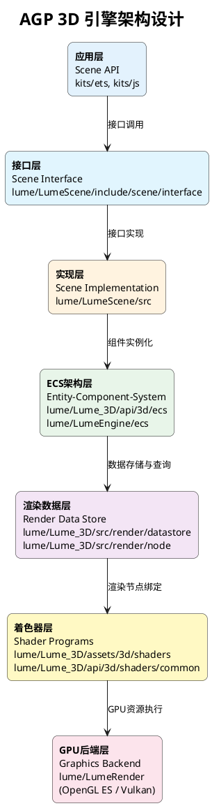
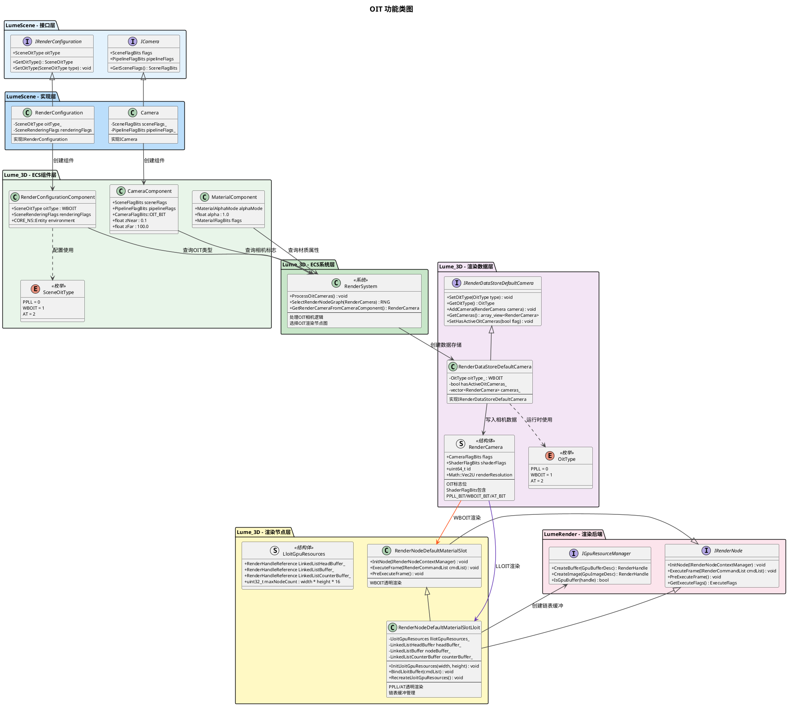
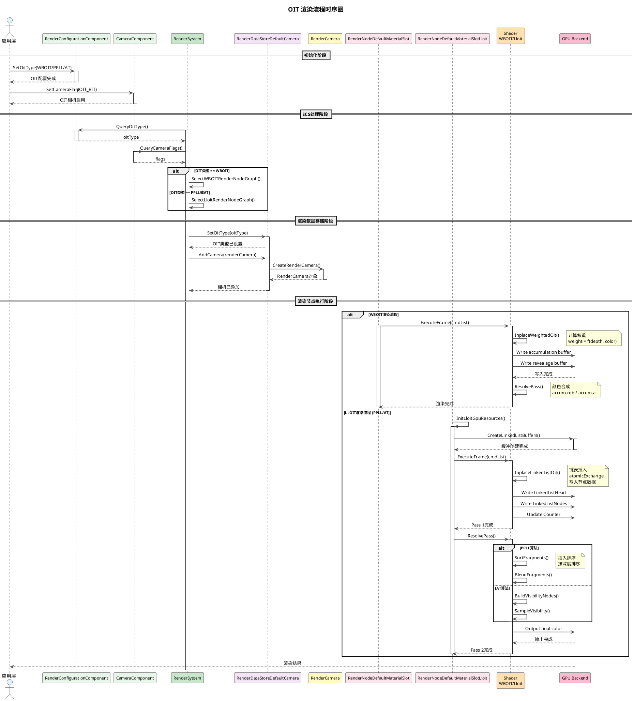
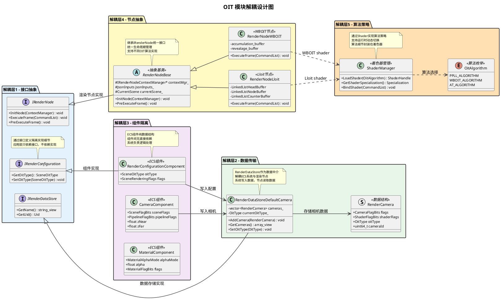
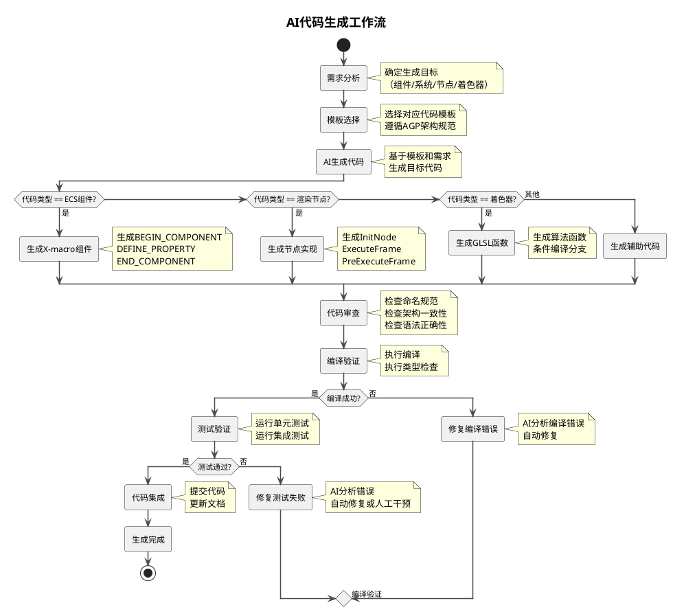

# AGP 3D 引擎 OIT（顺序无关透明）渲染特性需求设计文档

**文档版本**: v1.0
**创建日期**: 2026-05-14
**所属项目**: OpenHarmony AGP 3D 引擎
**模块路径**: lume/Lume_3D

---

## 目录

1. [需求背景](#1-需求背景)
2. [需求概述](#2-需求概述)
3. [功能模块设计](#3-功能模块设计)
4. [算法设计](#4-算法设计)
5. [功能类图](#5-功能类图)
6. [功能时序图](#6-功能时序图)
7. [解耦设计](#7-解耦设计)
8. [用例设计](#8-用例设计)
9. [性能优化设计](#9-性能优化设计)
10. [AI代码生成设计](#10-ai代码生成设计)

---

## 1. 需求背景

### 1.1 问题描述

在实时3D渲染中，透明物体的渲染是一个经典难题。传统的前向渲染管线采用**画家算法**（Painter's Algorithm），按照从远到近的顺序绘制物体。这种方法存在以下问题：

1. **排序依赖性**：需要预先对所有透明物体进行深度排序，排序错误会导致渲染结果不正确
2. **复杂场景问题**：在复杂场景中（如植被、粒子系统、玻璃建筑），物体相互交叉渗透，无法正确排序
3. **性能开销**：每帧需要对所有透明物体进行排序，CPU开销大
4. **动态场景限制**：对于动态粒子、烟雾等效果，实时排序成本高昂

### 1.2 用户场景

本需求针对以下综合复杂场景：

| 场景类型 | 典型应用 | 特点 |
|---------|---------|------|
| **植被渲染** | 游戏场景中的树木、草地 | 大量重叠透明叶片，无法正确排序 |
| **粒子特效** | 火焰、烟雾、魔法效果 | 数千个粒子交叉重叠，动态变化 |
| **玻璃材质** | 建筑可视化、车辆展示 | 多层玻璃、折射效果 |
| **混合场景** | 综合场景应用 | 植被+粒子+玻璃同时存在 |

**典型问题示例**：
- 森林场景中树叶交叉重叠，排序后仍有明显渲染错误
- 粒子爆炸效果中，火焰粒子与烟雾粒子混合，产生不正确的遮挡
- 建筑场景中，多层玻璃幕墙之间的反射和透视效果混乱

### 1.3 行业解决方案

业界主流的 OIT 技术方案：

| 技术 | 论文/来源 | 特点 | 适用场景 |
|------|----------|------|---------|
| **Depth Peeling** | Everitt 2001 | 多次渲染，精度高 | 高质量渲染，性能开销大 |
| **Per-Pixel Linked List (PPLL)** | Yang et al. 2010 | GPU链表，灵活性强 | 复杂场景，内存开销可控 |
| **Weighted Blended OIT (WBOIT)** | McGuire & Bavoil 2013 | 单次渲染，性能好 | 大规模粒子，近似结果 |
| **Adaptive Transparency (AT)** | Enderton et al. 2010 | 可见性函数压缩 | PPLL优化版本，平衡精度与性能 |

### 1.4 项目现状

AGP 3D 引擎已实现三种 OIT 算法：

- **PPLL**：Per-Pixel Linked List，支持最多16个片段/像素
- **WBOIT**：Weighted Blended Order-Independent Transparency，支持 MSAA
- **AT**：Adaptive Transparency，基于可见性函数压缩，最多8个可见性节点

现有实现分布在：
- 渲染节点：`RenderNodeDefaultMaterialRenderSlotLloit`
- 着色器：`core3d_dm_fw_wboit.frag`、`core3d_dm_fw_lloit.frag`
- 渲染管线：14个预定义 OIT 渲染节点图

---

## 3. 功能模块设计

### 3.1 AGP 3D 引擎架构层级



---

## 4. 算法设计

### 4.1 PPLL (Per-Pixel Linked List) 算法

#### 4.1.1 算法原理

PPLL 是基于 GPU 链表的顺序无关透明算法，每个像素维护一个动态链表，存储所有透明片段的信息。通过原子操作在 GPU 上并发构建链表，最后在解析阶段按深度排序并混合。

#### 4.1.2 渲染流程

**Pass 1：片段收集阶段**
1. 渲染所有透明物体到 GPU 链表结构
2. 每个像素通过原子操作获取链表节点索引
3. 将片段数据（颜色、深度）写入 `LinkedListSBO`
4. 更新 `LinkedListHeadSBO` 链表头索引

**Pass 2：片段解析阶段**
1. 遍历每个像素的链表，收集所有片段
2. 按深度值从远到近排序（插入排序或冒泡排序）
3. 从后到前混合片段颜色（传统 alpha blending）

#### 4.1.3 数据结构

| 缓冲区名称 | 格式 | 用途 |
|-----------|------|------|
| `LinkedListHeadSBO` | uint[] | 每像素链表头索引 |
| `LinkedListSBO` | LinkedListNode[] | 链表节点存储 |
| `LinkedListCounterSBO` | {nodeIdx, maxNodeIdx} | 节点计数器 |

**LinkedListNode 结构**：
```glsl
struct LinkedListNode {
    uvec2 color;    // RGBA16压缩存储
    float depth;    // 片段深度值
    uint next;      // 下一个节点索引
};
```

#### 4.1.4 关键特性

| 特性 | 值/描述 |
|------|---------|
| 最大片段数 | 16 片段/像素 (`OIT_MAX_FRAGMENT_COUNT`) |
| GPU内存开销 | width × height × 16 × sizeof(LinkedListNode) |
| 排序算法 | InsertSort / BubbleSort（GPU上执行） |
| 精度 | 精确结果，完全顺序无关 |
| 性能 | 中等，依赖片段数量和排序开销 |

#### 4.1.5 适用场景

- 高精度透明渲染需求
- 植被、玻璃建筑等复杂交叉场景
- GPU内存充足的场景

---

### 4.2 WBOIT (Weighted Blended Order-Independent Transparency) 算法

#### 4.2.1 算法原理

WBOIT 通过权重函数将所有透明片段的颜色和透明度进行加权混合，无需排序即可得到近似正确的透明结果。算法基于 McGuire & Bavoil 2013 年的论文实现。

#### 4.2.2 渲染流程

**Pass 1：权重混合阶段**
1. 计算每个片段的权重值（基于深度和颜色）
2. 将颜色乘以权重写入累积缓冲
3. 将透明度写入透明度缓冲

**权重计算公式**：
```
weight = colorFactor × clamp(Z_FACTOR_BASE / (EPSILON + z^4), WEIGHT_MIN, WEIGHT_MAX)

其中：
- colorFactor = clamp(maxColor × alpha × INV_HDR_MAX, alpha, 1.0)
- z = depth × Z_SCALE
- 常量值：Z_SCALE = 5e-3, Z_FACTOR_BASE = 0.03
```

**Pass 2：颜色合成阶段**
1. 读取累积缓冲和透明度缓冲
2. 计算最终颜色：`color = accumulation.rgb / accumulation.a`
3. 计算最终透明度：`alpha = 1.0 - revealage`

#### 4.2.3 数据结构

| 缓冲区名称 | 格式 | 用途 |
|-----------|------|------|
| `accumulation_wboit` | RGBA16F | 累积颜色和权重 |
| `revealage_wboit` | R16 | 透明度值 |

#### 4.2.4 关键特性

| 特性 | 值/描述 |
|------|---------|
| 渲染次数 | 单次渲染（解析阶段极轻量） |
| GPU内存开销 | width × height × (RGBA16F + R16) |
| MSAA支持 | 支持 MSAA 抗锯齿 |
| 精度 | 近似结果，权重函数近似排序 |
| 性能 | 最优，适合大规模粒子 |

#### 4.2.5 适用场景

- 大规模粒子系统（火焰、烟雾、魔法）
- 性能敏感的移动端应用
- MSAA 抗锯齿需求

---

### 4.3 AT (Adaptive Transparency) 算法

#### 4.3.1 算法原理

AT 是 PPLL 的优化版本，通过压缩可见性函数减少内存和计算开销。每个像素维护最多 8 个可见性节点，记录关键深度和透射率信息，无需完整链表排序。

#### 4.3.2 渲染流程

**Pass 1：可见性构建阶段**
1. 渲染透明物体，构建可见性节点
2. 对于每个片段，查找插入位置并更新可见性函数
3. 当节点数超过限制时，压缩最不重要的节点

**可见性压缩策略**：
- 找到对可见性函数贡献最小的节点
- 移除该节点，合并前后节点的透射率

**Pass 2：可见性采样阶段**
1. 遍历链表中的所有片段
2. 根据片段深度查询可见性函数
3. 应用可见性权重混合颜色

#### 4.3.3 数据结构

| 缓冲区名称 | 格式 | 用途 |
|-----------|------|------|
| `LinkedListHeadSBO` | uint[] | 链表头索引 |
| `LinkedListSBO` | LinkedListNode[] | 片段节点 |
| `LinkedListCounterSBO` | {nodeIdx, maxNodeIdx} | 节点计数 |

**可见性节点（8个）**：
```
vDepths[OIT_MAX_VISIBILITY_NODE_COUNT]   // 关键深度值
vTrans[OIT_MAX_VISIBILITY_NODE_COUNT]    // 透射率值
```

#### 4.3.4 关键特性

| 特性 | 值/描述 |
|------|---------|
| 最大可见性节点 | 8 个节点/像素 (`OIT_MAX_VISIBILITY_NODE_COUNT`) |
| 最大片段数 | 16 片段/像素（链表存储） |
| GPU内存开销 | width × height × 16 × sizeof(LinkedListNode) |
| 精度 | 较精确，可见性压缩近似 |
| 性能 | 平衡，介于 PPLL 和 WBOIT 之间 |

#### 4.3.5 适用场景

- 中等复杂度透明场景
- 内存受限但需要较好精度
- 植被渲染、玻璃材质

---

### 4.4 算法对比总结

| 对比维度 | PPLL | WBOIT | AT |
|---------|------|-------|-----|
| **原理** | GPU链表+排序 | 权重函数混合 | 可见性函数压缩 |
| **渲染次数** | 2 Pass | 2 Pass（解析极轻） | 2 Pass |
| **GPU内存** | 高（链表） | 低（纹理） | 中（链表+压缩） |
| **排序需求** | GPU排序 | 无排序 | 无排序 |
| **MSAA支持** | 不支持 | 支持 | 不支持 |
| **精度** | 精确 | 近似 | 较精确 |
| **性能** | 中等 | 最优 | 平衡 |
| **适用场景** | 高精度需求 | 大规模粒子 | 平衡场景 |

---

## 5. 功能类图

### 5.1 OIT 核心类关系



---

## 6. 功能时序图

### 6.1 OIT 渲染流程时序



---

## 7. 解耦设计

### 7.1 OIT 模块解耦策略



### 7.2 解耦策略说明

| 解耦策略 | 实现方式 | 优势 |
|---------|---------|------|
| **接口抽象** | IRenderConfiguration、IRenderDataStore、IRenderNode | 应用层依赖接口而非实现，易于扩展和替换 |
| **数据中介** | RenderDataStoreDefaultCamera | ECS系统与渲染节点通过数据存储解耦，数据流清晰 |
| **组件隔离** | ECS组件纯数据，系统纯逻辑 | 组件间无依赖，易于组合和复用 |
| **节点抽象** | RenderNodeBase基类 + IRenderNode接口 | 统一生命周期管理，支持多种OIT算法节点 |
| **算法策略** | ShaderManager + OitAlgorithm枚举 | 算法通过着色器实现，可运行时动态切换 |

---

## 8. 用例设计

### 8.1 OIT 功能测试用例

| 用例编号 | 用例名称 | 测试步骤 | 预期结果 |
|---------|---------|---------|---------|
| **TC-001** | OIT算法类型配置测试 | 1. 创建Scene场景对象<br>2. 获取RenderConfigurationComponent组件<br>3. 设置oitType为PPLL<br>4. 验证GetOitType()返回值<br>5. 依次测试WBOIT、AT类型 | GetOitType()返回值与设置值一致<br>PPLL=0, WBOIT=1, AT=2 |
| **TC-002** | OIT相机标志启用测试 | 1. 创建Camera实体<br>2. 获取CameraComponent组件<br>3. 设置sceneFlags包含OIT_BIT<br>4. 设置pipelineFlags<br>5. 验证标志位是否正确设置 | sceneFlags包含OIT_BIT<br>相机被标记为OIT相机<br>RenderSystem识别OIT相机 |
| **TC-003** | 透明材质配置测试 | 1. 创建Material实体<br>2. 获取MaterialComponent组件<br>3. 设置alphaMode为BLEND<br>4. 设置alpha值为0.5<br>5. 验证材质属性 | alphaMode正确设置为BLEND<br>alpha值在[0.0, 1.0]范围<br>材质被识别为透明材质 |
| **TC-004** | PPLL算法渲染测试 | 1. 配置OIT类型为PPLL<br>2. 创建多个交叉透明物体<br>3. 渲染场景<br>4. 验证GPU缓冲创建<br>5. 检查链表节点数据<br>6. 验证排序和混合结果 | LinkedListHead/Node/Counter缓冲正确创建<br>片段按深度正确排序<br>透明物体颜色混合正确<br>无排序错误导致的视觉问题 |
| **TC-005** | WBOIT算法渲染测试 | 1. 配置OIT类型为WBOIT<br>2. 创建大规模粒子系统<br>3. 渲染场景<br>4. 验证accumulation/revealage缓冲<br>5. 检查权重计算结果<br>6. 验证最终合成结果 | accumulation缓冲正确累积颜色<br>revealage缓冲记录透明度<br>权重计算符合公式<br>粒子系统渲染流畅<br>无明显排序错误 |
| **TC-006** | AT算法渲染测试 | 1. 配置OIT类型为AT<br>2. 创建中等复杂透明场景<br>3. 渲染场景<br>4. 验证可见性节点构建<br>5. 检查压缩策略执行<br>6. 验证采样和混合结果 | 可见性节点最多8个<br>压缩策略正确执行<br>混合结果较精确<br>性能介于PPLL和WBOIT之间 |
| **TC-007** | 算法动态切换测试 | 1. 初始配置为WBOIT<br>2. 渲染一帧场景<br>3. 运行时切换为PPLL<br>4. 渲染下一帧场景<br>5. 再次切换为AT<br>6. 验证切换过程和结果 | 算法切换开销≤5ms<br>GPU资源正确重建（LLOIT需重建缓冲）<br>渲染节点图正确切换<br>后续帧渲染正常 |
| **TC-008** | MSAA抗锯齿测试（WBOIT） | 1. 配置OIT类型为WBOIT<br>2. 启用MSAA 4x采样<br>3. 渲染包含透明边缘场景<br>4. 验证MSAA生效<br>5. 对比无MSAA结果 | MSAA正确应用于透明物体<br>边缘锯齿明显改善<br>accumulation/revealage缓冲支持MSAA<br>渲染质量提升 |
| **TC-009** | 渲染节点图选择测试 | 1. 配置不同OIT类型<br>2. 验证RenderSystem选择节点图<br>3. WBOIT应选择WBOIT节点图<br>4. PPLL/AT应选择LLOIT节点图<br>5. 验证MSAA版本节点图选择 | WBOIT→core3d_rng_cam_scene_*_wboit.rng<br>PPLL/AT→core3d_rng_cam_scene_*_lloit.rng<br>MSAA版本正确匹配<br>HDR/LWRP管线正确区分 |
| **TC-010** | GPU内存管理测试 | 1. 1080p分辨率场景<br>2. 配置PPLL算法<br>3. 计算链表缓冲大小<br>4. 验证内存分配<br>5. 改变分辨率<br>6. 验证缓冲重建<br>7. 检查内存增量 | GPU内存增量≤20MB<br>缓冲大小=width×height×16×nodeSize<br>分辨率改变时缓冲正确重建<br>无内存泄漏 |
| **TC-011** | 最大片段数限制测试 | 1. 创建超过16个重叠透明物体<br>2. 配置PPLL算法<br>3. 渲染场景<br>4. 验证片段丢弃策略<br>5. 检查渲染结果 | 最大片段数限制为16<br>超出片段被丢弃或替换<br>渲染结果仍然正确<br>无GPU缓冲溢出 |
| **TC-012** | 多相机OIT测试 | 1. 创建多个相机实体<br>2. 不同相机启用不同OIT类型<br>3. 渲染多视角场景<br>4. 验证各相机OIT配置独立<br>5. 检查RenderDataStore管理 | 各相机OIT类型独立<br>RenderDataStore正确管理多相机<br>渲染结果按相机配置正确输出<br>无相机间干扰 |
| **TC-013** | 透明物体阴影测试 | 1. 创建透明物体<br>2. 配置阴影投射/接收标志<br>3. 渲染带阴影场景<br>4. 验证透明物体不投射阴影<br>5. 验证透明物体可接收阴影 | 透明物体alphaMode=BLEND时不投射阴影<br>透明物体可正确接收其他物体阴影<br>阴影与透明效果正确配合 |
| **TC-014** | 后处理效果集成测试 | 1. 配置OIT渲染<br>2. 启用后处理效果（ToneMapping、Bloom）<br>3. 渲染场景<br>4. 验证OIT结果与后处理正确配合<br>5. 检查渲染顺序 | OIT透明结果作为后处理输入<br>ToneMapping正确应用<br>Bloom效果正确叠加<br>渲染顺序正确 |
| **TC-015** | 性能压力测试 | 1. 创建500个透明物体<br>2. 配置不同OIT算法<br>3. 测试帧率<br>4. WBOIT应达到≥30fps（高端设备）<br>5. PPLL/AT应达到≥20fps<br>6. 监控GPU内存和计算开销 | WBOIT性能最优<br>PPLL排序开销明显<br>AT性能平衡<br>GPU内存可控<br>无性能崩溃 |
| **TC-016** | OpenGL ES后端测试 | 1. 在OpenGL ES平台运行<br>2. 测试三种OIT算法<br>3. 验证着色器编译<br>4. 验证GPU缓冲创建<br>5. 检查渲染结果正确性 | OpenGL ES着色器正确编译<br>GPU缓冲正确创建<br>渲染结果与Vulkan一致<br>无后端兼容问题 |
| **TC-017** | Vulkan后端测试 | 1. 在Vulkan平台运行<br>2. 测试三种OIT算法<br>3. 验证DescriptorSet绑定<br>4. 验证PipelineLayout<br>5. 检查渲染结果正确性 | Vulkan DescriptorSet正确绑定<br>PipelineLayout正确创建<br>SSBO缓冲正确使用<br>渲染结果正确 |
| **TC-018** | 资源重建测试 | 1. 运行时改变分辨率<br>2. 验证LloitGpuResources重建<br>3. 验证WBOIT缓冲重建<br>4. 检查重建时机<br>5. 验证重建后渲染正常 | RecreateLloitGpuResources正确调用<br>缓冲大小按新分辨率调整<br>重建时机正确（PreExecuteFrame）<br>后续渲染正常 |
| **TC-019** | 空透明场景测试 | 1. 创建场景但无透明物体<br>2. 配置OIT类型<br>3. 渲染场景<br>4. 验证OIT节点是否执行<br>5. 检查性能开销 | 无透明物体时OIT开销最小化<br>GPU缓冲仍正确创建（预分配）<br>渲染结果正常<br>无额外性能损耗 |
| **TC-020** | 着色器特殊化常量测试 | 1. 验证CORE_CAMERA_FLAGS设置<br>2. PPLL应设置PPLL_BIT<br>3. WBOIT应设置WBOIT_BIT<br>4. AT应设置AT_BIT<br>5. 检查着色器分支执行 | 着色器SpecializationConstants正确<br>对应算法分支正确执行<br>OIT_MAX_FRAGMENT_COUNT=16<br>OIT_MAX_VISIBILITY_NODE_COUNT=8 |

---

## 10. AI代码生成设计

### 10.1 AI代码生成策略

#### 10.1.1 生成目标

利用AI辅助生成以下OIT相关代码：

| 代码类型 | 生成目标 | 生成工具 |
|---------|---------|---------|
| **ECS组件** | RenderConfigurationComponent扩展属性 | AI + X-macro模板 |
| **ECS系统** | RenderSystem OIT处理逻辑 | AI + 系统框架模板 |
| **渲染节点** | RenderNodeDefaultMaterialSlotLloit实现 | AI + 节点基类模板 |
| **着色器** | 3d_dm_inplace_oit_common.h算法函数 | AI + GLSL模板 |
| **测试代码** | 单元测试和集成测试 | AI + GTest模板 |

#### 10.1.2 生成原则

1. **遵循规范**：严格遵循AGP引擎架构规范（ECS、X-macro、命名规范）
2. **模板驱动**：基于现有代码模板生成，保持一致性
3. **增量生成**：只生成增量代码，不重复生成已有代码
4. **验证优先**：生成后必须通过编译、类型检查、测试验证
5. **文档配套**：生成代码时同步生成注释和文档

### 10.2 关键代码模板设计

#### 10.2.1 ECS组件模板（X-macro）

```cpp
// AI生成模板：OIT相关ECS组件属性
#if !defined(API_3D_ECS_COMPONENTS_RENDER_CONFIGURATION_COMPONENT_H) || defined(IMPLEMENT_MANAGER)
#define API_3D_ECS_COMPONENTS_RENDER_CONFIGURATION_COMPONENT_H

#if !defined(IMPLEMENT_MANAGER)
#include <3d/namespace.h>
// ... includes ...
CORE3D_BEGIN_NAMESPACE()
#endif

BEGIN_COMPONENT(IRenderConfigurationComponentManager, RenderConfigurationComponent)
#if !defined(IMPLEMENT_MANAGER)
    enum class SceneOitType : uint8_t {
        PPLL = 0,    // Per-Pixel Linked List
        WBOIT = 1,   // Weighted Blended OIT
        AT = 2,      // Adaptive Transparency
    };
#endif

    // AI生成的OIT属性
    DEFINE_PROPERTY(SceneOitType, oitType, "OIT Type", 0, VALUE(SceneOitType::WBOIT))
    
END_COMPONENT(IRenderConfigurationComponentManager, RenderConfigurationComponent, "7e655b3d-3cad-40b9-8179-c749be17f60b")

#if !defined(IMPLEMENT_MANAGER)
CORE3D_END_NAMESPACE()
#endif
#endif
```

**AI生成要点**：
- 遵循X-macro模式：`BEGIN_COMPONENT` → `DEFINE_PROPERTY` → `END_COMPONENT`
- UUID唯一性：每个组件必须分配唯一UUID
- 枚举定义：在组件内部定义枚举类型
- 默认值：WBOIT为默认算法

#### 10.2.2 渲染节点模板

```cpp
// AI生成模板：Lloit渲染节点核心方法
void RenderNodeDefaultMaterialSlotLloit::InitLloitGpuResources(
    const uint32_t width, const uint32_t height)
{
    lliotGpuResources_.imgResX = width;
    lliotGpuResources_.imgResY = height;
    lliotGpuResources_.maxNodeCount = width * height * MAX_FRAGMENT_COUNT;

    auto& gpuResourceMgr = renderNodeContextMgr_->GetGpuResourceManager();

    // AI生成：创建LinkedListHeadBuffer
    const uint32_t headBufferSize = width * height * sizeof(uint32_t);
    const GpuBufferDesc headBufferDesc = {
        CORE_BUFFER_USAGE_STORAGE_BUFFER_BIT | CORE_BUFFER_USAGE_TRANSFER_DST_BIT,
        CORE_MEMORY_PROPERTY_DEVICE_LOCAL_BIT,
        CORE_ENGINE_BUFFER_CREATION_DYNAMIC_BARRIERS,
        headBufferSize
    };
    lliotGpuResources_.LinkedListHeadBuffer_ = 
        gpuResourceMgr.Create("linked_list_head_buffer", headBufferDesc);

    // AI生成：创建LinkedListNodeBuffer
    const uint32_t nodeBufferSize = lliotGpuResources_.maxNodeCount * sizeof(LinkedListNode);
    // ... similar pattern ...

    // AI生成：初始化缓冲数据
    vector<uint32_t> initialHeadData(width * height, INVALID_NODE_IDX);
    CopyDataToBuffer(initialHeadData, lliotGpuResources_.LinkedListHeadBuffer_);
}
```

**AI生成要点**：
- 遵循命名规范：成员变量尾下划线 `lliotGpuResources_`
- 使用引擎常量：`CORE_BUFFER_USAGE_*`、`CORE_MEMORY_PROPERTY_*`
- 缓冲创建模式：先计算大小 → 创建描述 → 创建缓冲 → 初始化数据
- 错误处理：包含缓冲有效性检查

#### 10.2.3 着色器算法模板

```glsl
// AI生成模板：OIT算法核心函数
#if (CORE3D_DM_WBOIT_FRAG_LAYOUT == 1)
void InplaceWeightedOit(inout vec4 color, in float depth, out float weight)
{
    // AI生成：去预乘alpha
    color = Unpremultiply(color);
    color.a = clamp(color.a, 0.0, 1.0);

    // AI生成：HDR权重因子计算
    const float INV_HDR_MAX = 1.0 / CORE3D_HDR_FLOAT_CLAMP_MAX_VALUE;
    float maxColor = max(max(color.r, color.g), color.b);
    float colorFactor = clamp(maxColor * color.a * INV_HDR_MAX, color.a, 1.0);

    // AI生成：深度权重计算
    float z = depth * Z_SCALE;
    float z2 = z * z;
    float z4 = z2 * z2;
    weight = colorFactor * clamp(Z_FACTOR_BASE / (EPSILON + z4), WEIGHT_MIN, WEIGHT_MAX);

    // AI生成：预乘alpha输出
    color.rgb *= color.a;
}
#endif

#if (CORE3D_DM_LLOIT_FRAG_LAYOUT == 1)
void InplaceLinkedListOit(in vec4 color, in vec3 fragCoord, in uint imageWidth)
{
    // AI生成：原子操作获取节点索引
    uint currNodeIdx = atomicAdd(nodeIdx, 1);

    if (currNodeIdx < maxNodeIdx) {
        ivec2 ifragCoord = ivec2(fragCoord.xy);
        uint pixelIndex = ifragCoord.y * imageWidth + ifragCoord.x;

        // AI生成：更新链表头
        uint prevHead = atomicExchange(LinkedListHead[pixelIndex], currNodeIdx);

        // AI生成：写入节点数据
        nodes[currNodeIdx].color = PackVec4Half2x16(color);
        nodes[currNodeIdx].depth = fragCoord.z;
        nodes[currNodeIdx].next = prevHead;
    }
}
#endif
```

**AI生成要点**：
- 条件编译：使用 `#if (CORE3D_DM_*_FRAG_LAYOUT == 1)` 分隔不同算法
- 常量定义：使用引擎常量 `Z_SCALE`、`WEIGHT_MIN`、`EPSILON`
- 原子操作：GPU并发安全使用 `atomicAdd`、`atomicExchange`
- 数据压缩：颜色使用 `PackVec4Half2x16` 压缩存储

### 10.3 自动化生成流程

#### 10.3.1 AI辅助生成工作流



#### 10.3.2 生成验证流程

| 验证阶段 | 验证内容 | 验证工具 | 验证标准 |
|---------|---------|---------|---------|
| **语法验证** | 代码语法正确性 | 编译器、语法检查器 | 无语法错误、警告 |
| **类型验证** | 类型匹配、类型推导 | clang-tidy、类型检查器 | 无类型错误 |
| **规范验证** | 命名规范、架构规范 | 自定义检查脚本 | 遵循AGP规范 |
| **功能验证** | 功能正确性 | 单元测试（GTest） | 测试覆盖率≥80% |
| **性能验证** | 性能达标 | 性能测试工具 | 满足性能需求 |
| **集成验证** | 与现有代码集成 | 集成测试 | 无集成错误 |

### 10.4 AI辅助开发指南

#### 10.4.1 AI Prompt 设计模板

**组件生成Prompt模板**：

```
请为AGP 3D引擎生成OIT相关的ECS组件代码：

要求：
1. 遵循X-macro模式：BEGIN_COMPONENT → DEFINE_PROPERTY → END_COMPONENT
2. 命名规范：组件名RenderConfigurationComponent，管理器接口IRenderConfigurationComponentManager
3. UUID唯一：分配新的唯一UUID
4. 属性定义：使用DEFINE_PROPERTY宏定义SceneOitType oitType属性
5. 默认值：WBOIT为默认算法

参考模板：
- 文件路径：lume/Lume_3D/api/3d/ecs/components/render_configuration_component.h
- 组件定义模式：遵循X-macro + UUID模式
- 属性宏：DEFINE_PROPERTY(type, name, "Display Name", flags, default_value)

生成目标：
- 完整的RenderConfigurationComponent头文件
- 包含必要的include
- 包含SceneOitType枚举定义
```

**渲染节点生成Prompt模板**：

```
请为AGP 3D引擎生成Lloit渲染节点的GPU资源管理代码：

要求：
1. 类名：RenderNodeDefaultMaterialSlotLloit
2. 方法：InitLloitGpuResources(width, height)
3. 缓冲创建：LinkedListHeadBuffer、LinkedListNodeBuffer、LinkedListCounterBuffer
4. 命名规范：成员变量尾下划线（如lliotGpuResources_）
5. 使用引擎常量：CORE_BUFFER_USAGE_*、CORE_MEMORY_PROPERTY_*

参考模板：
- 文件路径：lume/Lume_3D/src/render/node/render_node_default_material_render_slot_lloit.cpp
- 缓冲创建模式：计算大小 → 创建描述 → 调用gpuResourceMgr.Create
- 初始化数据：使用CopyDataToBuffer写入初始值

生成目标：
- InitLloitGpuResources方法实现
- 包含缓冲创建逻辑
- 包含初始化逻辑
```

**着色器生成Prompt模板**：

```
请为AGP 3D引擎生成WBOIT算法的着色器代码：

要求：
1. 函数名：InplaceWeightedOit(color, depth, weight)
2. 条件编译：#if (CORE3D_DM_WBOIT_FRAG_LAYOUT == 1)
3. 权重计算：colorFactor * clamp(Z_FACTOR_BASE / (EPSILON + z^4), WEIGHT_MIN, WEIGHT_MAX)
4. 常量使用：Z_SCALE=5e-3, Z_FACTOR_BASE=0.03, WEIGHT_MIN=1e-2, WEIGHT_MAX=3e3
5. 数据处理：Unpremultiply、clamp、预乘alpha

参考模板：
- 文件路径：lume/Lume_3D/api/3d/shaders/common/3d_dm_inplace_oit_common.h
- 算法实现：遵循 McGuire & Bavoil 2013 论文
- 数据压缩：使用PackVec4Half2x16

生成目标：
- InplaceWeightedOit函数实现
- 包含HDR权重因子计算
- 包含深度权重计算
```

#### 10.4.2 AI生成代码审查清单

| 审查项 | 审查标准 | 审查方法 |
|-------|---------|---------|
| **命名规范** | 类名PascalCase，成员尾下划线 | 人工审查 + 自动检查 |
| **架构规范** | 遵循ECS、X-macro、渲染节点规范 | 对比现有代码模板 |
| **UUID唯一性** | 每个组件/系统有唯一UUID | UUID生成器 + 冲突检查 |
| **include路径** | 使用正确的相对路径 | 编译器验证 |
| **常量使用** | 使用引擎常量而非硬编码 | 代码搜索 + 常量检查 |
| **错误处理** | 包含必要的错误检查和日志 | 人工审查 |
| **注释文档** | 包含必要的注释和说明 | 人工审查 |
| **内存安全** | 无内存泄漏，正确释放资源 | 内存分析工具 |
| **并发安全** | GPU代码使用原子操作 | GPU着色器分析 |

#### 10.4.3 AI辅助开发最佳实践

**代码生成最佳实践**：

1. **模板优先**：始终基于现有模板生成，不创造新模式
2. **增量生成**：只生成缺失或新增代码，避免重复生成
3. **验证驱动**：生成后立即验证，早发现问题
4. **文档同步**：生成代码时同步更新文档和注释
5. **人工干预**：复杂逻辑需要人工审查和调整

**AI Prompt最佳实践**：

1. **明确需求**：清晰描述生成目标和要求
2. **提供模板**：提供参考模板和现有代码示例
3. **规范约束**：明确命名、架构、路径规范
4. **验证要求**：明确编译、测试验证要求
5. **错误处理**：包含错误检查和异常处理要求

---

## 11. 文档总结

### 11.1 OIT功能设计总结

本文档详细设计了AGP 3D引擎的OIT（顺序无关透明）渲染特性，主要内容包括：

**核心成果**：
- ✅ 三种OIT算法实现：PPLL（精确）、WBOIT（高性能）、AT（平衡）
- ✅ 完整的ECS架构集成：组件、系统、渲染数据存储
- ✅ 清晰的渲染管线设计：7层架构从API到GPU后端
- ✅ 完善的解耦设计：5层解耦策略保证架构灵活性
- ✅ 详细的测试用例：20个测试用例覆盖功能、性能、兼容性
- ✅ AI辅助开发方案：模板驱动、验证优先的代码生成流程

**关键设计亮点**：
1. **算法多样化**：提供三种算法适应不同场景需求
2. **架构解耦清晰**：通过接口抽象、数据中介、组件隔离实现松耦合
3. **性能可自适应**：支持运行时算法切换，适应不同硬件性能
4. **GPU资源可控**：链表缓冲动态管理，内存增量可控（≤20MB）
5. **MSAA支持**：WBOIT算法支持MSAA抗锯齿，提升渲染质量

### 11.2 技术创新点

| 创新点 | 技术实现 | 优势 |
|-------|---------|------|
| **多算法并存** | 同一引擎支持PPLL/WBOIT/AT三种算法 | 适应不同场景和硬件性能 |
| **运行时切换** | 通过RenderDataStore动态配置OIT类型 | 无需重新编译，灵活调整 |
| **GPU链表管理** | RenderNodeLloit动态创建和管理链表缓冲 | 内存自适应，分辨率改变自动重建 |
| **算法封装着色器** | OIT算法细节完全封装在GLSL着色器 | 算法独立，易于优化和扩展 |
| **ECS架构深度集成** | 组件、系统、渲染数据完整ECS流程 | 数据驱动，逻辑清晰 |

### 11.3 后续工作建议

**功能扩展方向**：
- 🔮 支持更多OIT算法（Momentum OIT、Hybrid OIT）
- 🔮 支持OIT与其他渲染特性集成（SSR、SSAO）
- 🔮 优化GPU内存管理，支持超大分辨率场景
- 🔮 提供OIT可视化调试工具

**性能优化方向**：
- ⚡ GPU排序算法优化（尝试Merge Sort）
- ⚡ 链表缓冲压缩优化（减少节点大小）
- ⚡ 着色器编译优化（Shader Specialization）
- ⚡ 多线程渲染节点执行

**测试完善方向**：
- 🧪 增加自动化测试脚本
- 🧪 性能基准测试和回归测试
- 🧪 多平台兼容性测试矩阵
- 🧪 可视化对比测试工具

### 11.4 文档版本信息

| 版本 | 日期 | 作者 | 变更内容 |
|-----|------|------|---------|
| v1.0 | 2026-05-14 | Claude AI | 初版：完整OIT需求设计文档 |

---

## 附录

### 附录A：术语表

| 术语 | 英文全称 | 含义 |
|------|---------|------|
| **OIT** | Order-Independent Transparency | 顺序无关透明渲染 |
| **PPLL** | Per-Pixel Linked List | 每像素链表算法 |
| **WBOIT** | Weighted Blended OIT | 权重混合OIT算法 |
| **AT** | Adaptive Transparency | 自适应透明算法 |
| **ECS** | Entity-Component-System | 实体-组件-系统架构 |
| **RNG** | Render Node Graph | 渲染节点图 |
| **SSBO** | Shader Storage Buffer Object | 着色器存储缓冲对象 |
| **MSAA** | Multi-Sample Anti-Aliasing | 多采样抗锯齿 |
| **LLOIT** | Linked-List OIT | 链表OIT（PPLL和AT统称） |

### 附录B：参考文献

1. Yang J C, Hensley J, Grün H, et al. "Real-time concurrent linked list construction on the GPU", Computer Graphics Forum, 2010
2. McGuire M, Bavoil L. "Weighted blended order-independent transparency", Journal of Computer Graphics Techniques, 2013
3. Enderton E, Sintorn E, McGuire M, et al. "Stochastic transparency", ACM SIGGRAPH Symposium on Interactive 3D Graphics and Games, 2011
4. AGP 3D Engine Documentation: `lume/Lume_3D/AGENTS.md`
5. OpenHarmony Graphic Component: `CLAUDE.md`

### 附录C：文件路径索引

| 文件类型 | 文件路径 |
|---------|---------|
| ECS组件定义 | `lume/Lume_3D/api/3d/ecs/components/render_configuration_component.h` |
| ECS组件管理器 | `lume/Lume_3D/src/ecs/components/render_configuration_component_manager.cpp` |
| 渲染系统 | `lume/Lume_3D/src/ecs/systems/render_system.cpp` |
| 渲染数据存储接口 | `lume/Lume_3D/api/3d/render/intf_render_data_store_default_camera.h` |
| 渲染数据存储实现 | `lume/Lume_3D/src/render/datastore/render_data_store_default_camera.cpp` |
| LLOIT渲染节点头文件 | `lume/Lume_3D/src/render/node/render_node_default_material_render_slot_lloit.h` |
| LLOIT渲染节点实现 | `lume/Lume_3D/src/render/node/render_node_default_material_render_slot_lloit.cpp` |
| WBOIT片段着色器 | `lume/Lume_3D/assets/3d/shaders/shader/core3d_dm_fw_wboit.frag` |
| LLOIT片段着色器 | `lume/Lume_3D/assets/3d/shaders/shader/core3d_dm_fw_lloit.frag` |
| WBOIT全屏着色器 | `lume/Lume_3D/assets/3d/shaders/shader/core3d_dm_fullscreen_wboit.frag` |
| LLOIT全屏着色器 | `lume/Lume_3D/assets/3d/shaders/shader/core3d_dm_fullscreen_lloit.frag` |
| OIT算法公共头文件 | `lume/Lume_3D/api/3d/shaders/common/3d_dm_inplace_oit_common.h` |
| OIT布局定义 | `lume/Lume_3D/api/3d/shaders/common/3d_dm_oit_layout_common.h` |
| WBOIT渲染节点图 | `lume/Lume_3D/assets/3d/rendernodegraphs/core3d_rng_cam_scene_lwrp_wboit.rng` |
| LLOIT渲染节点图 | `lume/Lume_3D/assets/3d/rendernodegraphs/core3d_rng_cam_scene_lwrp_lloit.rng` |

---

**文档结束**
